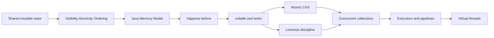
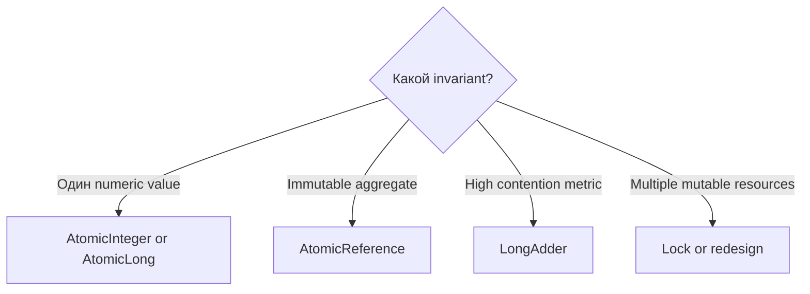

# Java Concurrency Learning Path

> [!summary] Цель маршрута
> Научиться не перечислять классы, а объяснять проблему, гарантию, границу применимости и production failure mode каждого concurrency mechanism.

## Общая карта



## Педагогический цикл каждой темы

1. Интуиция.
2. Формальная гарантия.
3. Ошибочный code shape.
4. Минимальное исправление.
5. Граница применимости.
6. Interview recall.
7. Runnable experiment.

## Уровень 1. Memory model

1. [[Visibility Atomicity Ordering]]
2. [[Race Condition]]
3. [[Java Memory Model]]
4. [[Happens-Before]]

## Уровень 2. Blocking coordination

1. [[volatile]]
2. [[synchronized]]
3. [[ReentrantLock]]
4. [[10_CONCEPTS/Java/Concurrency/Deadlock Livelock and Lock Ordering|Deadlock, Livelock and Lock Ordering]]

## Уровень 3. Non-blocking updates

1. [[10_CONCEPTS/Java/Concurrency/Atomic CAS and Counters|Atomic CAS and Counters]]
2. AtomicInteger and AtomicReference
3. AtomicLong vs LongAdder
4. ABA problem



## Уровень 4. Concurrent collections

1. [[10_CONCEPTS/Java/Concurrency/Concurrent Collections and Backpressure|Concurrent Collections and Backpressure]]
2. ConcurrentHashMap compound methods
3. CopyOnWrite snapshot semantics
4. BlockingQueue and overload control

> [!important]
> Thread-safe methods не делают произвольную комбинацию calls атомарной. Ищи compound operation в API: `compute`, `merge`, `putIfAbsent`, `put/take`.

## Уровень 5. Task execution

1. [[ExecutorService]]
2. Future and lifecycle
3. [[CompletableFuture]]
4. [[Virtual Threads]]
5. [[ThreadLocal]] cleanup

## Visual maps

- [[01_MAPS/Java Concurrency Map.canvas]]
- [[01_MAPS/Java Advanced Concurrency Map.canvas]]

## Active recall

- [[20_QUESTIONS/Interview/Java/Concurrency/Advanced Concurrency Recall]]
- [[20_QUESTIONS/Interview/Java/Concurrency/Why volatile does not make increment atomic]]
- [[20_QUESTIONS/Interview/Java/Concurrency/What does happens-before actually guarantee]]
- [[20_QUESTIONS/Interview/Java/Concurrency/execute vs submit]]
- [[20_QUESTIONS/Interview/Java/Concurrency/thenApply vs thenCompose]]
- [[20_QUESTIONS/Interview/Java/Concurrency/Are virtual threads faster]]

## Labs

```bash
javac --release 8 AdvancedConcurrencyLab.java
java AdvancedConcurrencyLab all
```

- [[50_LABS/Java/Concurrency/java8/AdvancedConcurrencyLab.java]]
- [[50_LABS/Java/Concurrency/README|Java Concurrency Labs]]

## Senior checkpoint

Для каждого mechanism объясни:

1. Какой invariant он защищает?
2. Какую JMM guarantee использует?
3. Что произойдёт под contention?
4. Как выглядит failure в thread dump или metrics?
5. Какой simpler alternative существует?

## Sources

- [[98_SOURCES/Java Concurrency Sources|Primary Java Concurrency Sources]]
