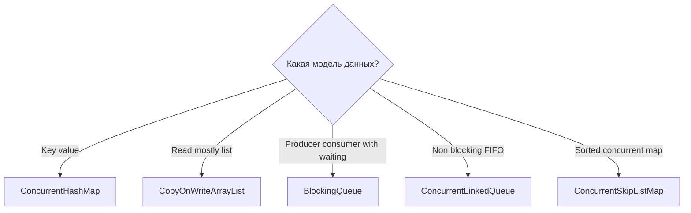
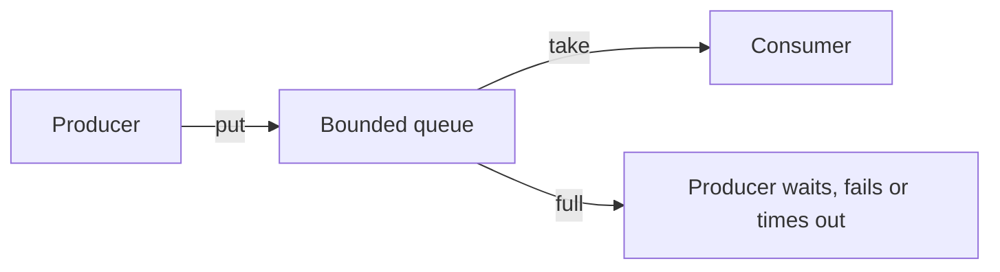

# Concurrent Collections and Backpressure

> [!summary] За 30 секунд
> Concurrent collection выбирают не по слову «thread-safe», а по требуемой семантике: atomic key update, read-mostly snapshot, non-blocking FIFO или bounded producer-consumer handoff.

## 1. Карта выбора



## 2. Главный принцип композиции

> [!danger]
> Thread-safe отдельные методы не делают произвольную последовательность методов атомарной.

Проблемный код:

```java
if (!cache.containsKey(key)) {
    cache.put(key, load(key));
}
```

Два потока могут одновременно увидеть отсутствие key и дважды вызвать `load`.

Правильнее:

```java
Value value = cache.computeIfAbsent(key, this::load);
```

Ищи compound operation в самом API:

- `putIfAbsent`;
- `computeIfAbsent`;
- `computeIfPresent`;
- `compute`;
- `merge`;
- conditional `replace`;
- conditional `remove`.

## 3. ConcurrentHashMap

`ConcurrentHashMap` поддерживает concurrent reads и updates без единого global lock всей map. Контракт API важнее запоминания деталей реализации конкретного JDK.

### Frequency map

```java
ConcurrentHashMap<String, LongAdder> frequencies =
        new ConcurrentHashMap<>();

void record(String key) {
    frequencies
            .computeIfAbsent(key, ignored -> new LongAdder())
            .increment();
}
```

### Mapping function discipline

Функция `compute...` должна быть:

- короткой;
- без recursive update того же key;
- без долгого remote I/O;
- без необратимых side effects;
- готовой к exception semantics.

### Null policy

`ConcurrentHashMap` не разрешает `null` keys и values. В concurrent algorithms `null` остаётся однозначным сигналом отсутствия mapping.

### Iteration

Iterator weakly consistent:

- обычно не бросает `ConcurrentModificationException` из-за concurrent update;
- может увидеть часть изменений;
- не является point-in-time snapshot всей map.

## 4. CopyOnWriteArrayList

Каждое structural update создаёт новую копию внутреннего массива.

```text
add/remove -> allocate array -> copy elements -> publish new array
```

### Хорошие workloads

- listeners;
- routing rules;
- небольшая configuration list;
- очень много reads и очень мало writes.

### Snapshot iterator

```java
CopyOnWriteArrayList<String> listeners =
        new CopyOnWriteArrayList<>();

Iterator<String> snapshot = listeners.iterator();
listeners.add("new-listener");
```

Старый iterator не обязан увидеть новый элемент, зато остаётся стабильным и безопасным.

### Плохие workloads

- большой список;
- частые writes;
- queue;
- write-heavy cache;
- bulk mutations.

> [!tip] Memory Hook
> **Reads are cheap because writes pay for a new photograph.**

## 5. BlockingQueue

`BlockingQueue` соединяет producers и consumers. Consumer может ждать элемент, producer — свободное место.



### Семейства методов

| Поведение | Insert | Remove | Examine |
|---|---|---|---|
| Exception | `add` | `remove` | `element` |
| Special value | `offer` | `poll` | `peek` |
| Block | `put` | `take` | — |
| Timed | `offer(timeout)` | `poll(timeout)` | — |

### Bounded queue как backpressure

Если producers быстрее consumers, unbounded buffer превращает latency problem в memory problem.

Bounded queue делает overload явным:

- `put` блокирует producer;
- `offer` возвращает `false`;
- timed `offer` позволяет fallback;
- queue depth становится наблюдаемой метрикой.

> [!important]
> Backpressure не увеличивает capacity. Он заставляет систему принять решение при overload вместо бесконтрольного накопления.

## 6. Queue shutdown

Queue не знает, когда приложение должно завершиться. Нужен lifecycle protocol:

- interruption;
- poison pill;
- timed `poll` + shared lifecycle;
- executor shutdown.

При нескольких consumers poison pills должно быть достаточно или shutdown должен управляться централизованно.

## 7. ArrayBlockingQueue vs LinkedBlockingQueue

- `ArrayBlockingQueue` — fixed capacity, array-backed, предсказуемая bounded memory.
- `LinkedBlockingQueue` — optionally bounded; отсутствие явного bound требует осознанного решения.

## 8. ConcurrentLinkedQueue

Подходит для non-blocking FIFO, когда не требуется ждать элемент или свободное место. В отличие от BlockingQueue она сама не обеспечивает producer throttling.

## 9. Выбор по workload

| Требование | Выбор |
|---|---|
| Atomic update by key | ConcurrentHashMap compute/merge |
| High-read low-write list | CopyOnWriteArrayList |
| Bounded handoff | ArrayBlockingQueue |
| Non-blocking FIFO | ConcurrentLinkedQueue |
| Sorted keys | ConcurrentSkipListMap |

## Interview Answer

> Concurrent collections дают разные consistency и progress guarantees. ConcurrentHashMap предоставляет atomic compound methods, но `get` затем `put` остаётся race. CopyOnWriteArrayList подходит для read-mostly snapshots. Bounded BlockingQueue создаёт управляемый backpressure между producers и consumers.

## Проверка понимания

> [!question] Почему `Collections.synchronizedMap` не делает check-then-act автоматически атомарным?

> [!answer]- Ответ
> Каждый method call синхронизирован отдельно. Для нескольких вызовов нужен общий внешний lock или atomic compound API.

> [!question] Почему unbounded queue опасна даже без memory leak в коде?

> [!answer]- Ответ
> Если arrival rate устойчиво выше processing rate, backlog растёт без верхней границы и исчерпывает память.

## Sources

- [[98_SOURCES/Java Concurrency Sources]]
