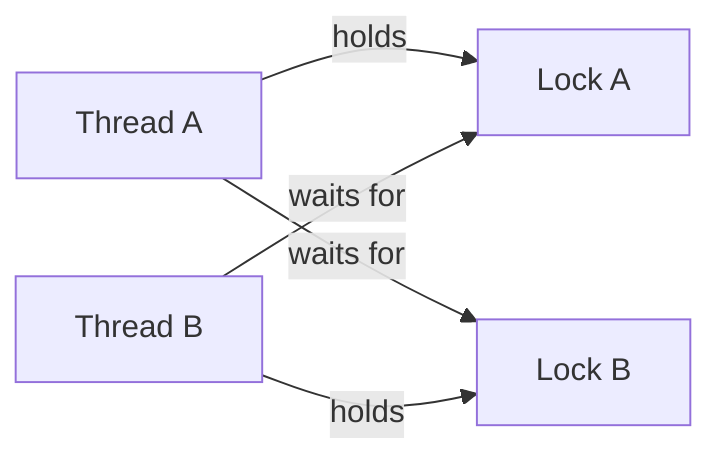
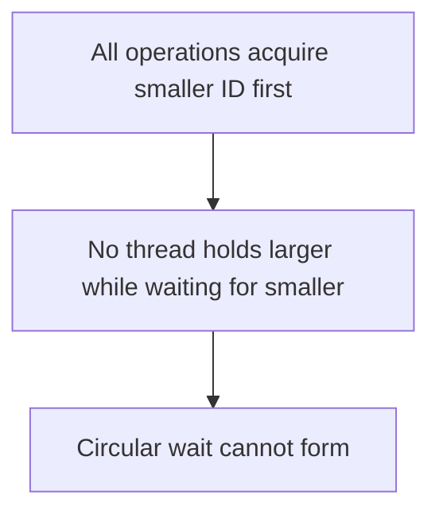

# Deadlock, Livelock and Lock Ordering

> [!summary] За 30 секунд
> Deadlock — цикл ожидания ресурсов. Livelock — активные действия без полезного прогресса. Starvation — система работает, но отдельный поток неопределённо долго не получает ресурс.

## 1. Классический deadlock



```java
void transfer(Account from, Account to, int amount) {
    synchronized (from) {
        synchronized (to) {
            from.withdraw(amount);
            to.deposit(amount);
        }
    }
}
```

Параллельные переводы `A → B` и `B → A` могут захватить monitors в противоположном порядке.

## 2. Четыре условия Coffman

Deadlock возможен, когда одновременно существуют:

1. **Mutual exclusion** — ресурс нельзя использовать совместно.
2. **Hold and wait** — поток держит один ресурс и ждёт другой.
3. **No preemption** — ресурс нельзя принудительно отобрать.
4. **Circular wait** — сформирован цикл ожидания.

Для предотвращения достаточно системно разрушить хотя бы одно условие.

## 3. Lock ordering

Все code paths должны захватывать несколько ресурсов в одном глобальном порядке.

```java
void transfer(Account from, Account to, int amount) {
    Account first = from.id() < to.id() ? from : to;
    Account second = from.id() < to.id() ? to : from;

    synchronized (first) {
        synchronized (second) {
            from.withdraw(amount);
            to.deposit(amount);
        }
    }
}
```

И `A → B`, и `B → A` сначала захватывают account с меньшим immutable ID.



### Требования к order key

- стабилен во время операции;
- одинаково вычисляется во всех code paths;
- детерминированно упорядочивает ресурсы;
- не зависит от mutable business state.

## 4. Timeout и tryLock

`ReentrantLock.tryLock(timeout)` может разрушить бесконечное ожидание:

```java
if (first.tryLock(100, TimeUnit.MILLISECONDS)) {
    try {
        if (second.tryLock(100, TimeUnit.MILLISECONDS)) {
            try {
                transferState();
            } finally {
                second.unlock();
            }
        }
    } finally {
        first.unlock();
    }
}
```

Но timeout не отменяет необходимость protocol:

- что делать после failure;
- нужен ли rollback;
- сколько раз retry;
- как избежать livelock.

## 5. Deadlock против contention

- **Contention:** потоки ждут, но владелец lock продвигается и освободит его.
- **Deadlock:** wait-for graph содержит цикл, который сам не разрешится.

## 6. Livelock

Два участника постоянно реагируют друг на друга, но не завершают работу.

Бытовая модель: два человека одновременно уступают проход — оба шагают влево, затем вправо, снова влево.

Типичный shape:

```java
while (!tryAcquireBoth()) {
    releaseWhatIHave();
    retryImmediately();
}
```

Mitigation:

- randomized backoff;
- bounded retries;
- асимметричная стратегия;
- coordinator.

## 7. Starvation

Система в целом работает, но конкретный поток постоянно проигрывает доступ к ресурсу.

Причины:

- unfair lock/scheduling;
- высокоприоритетные tasks постоянно вытесняют другие;
- CAS loop под extreme contention;
- reader-preference policy блокирует writers.

Fairness может уменьшать starvation risk, но часто снижает throughput.

## 8. Production diagnosis

Симптомы deadlock:

- latency растёт до timeout;
- CPU может оставаться низким;
- worker pool заполнен `BLOCKED` threads;
- restart временно помогает.

Диагностика:

1. Снять thread dump через `jcmd`, `jstack` или JFR tooling.
2. Найти `BLOCKED` threads.
3. Сопоставить `waiting to lock` и `locked`.
4. Построить wait-for graph.
5. Проверить lock ordering во всех путях.

## 9. Database analogy

Транзакции могут блокировать rows в разном порядке. Сортировка identifiers перед `SELECT ... FOR UPDATE` или последовательными updates снижает риск circular waits.

## Сравнение

| Состояние | Есть движение? | Есть полезный прогресс? |
|---|---:|---:|
| Deadlock | нет | нет |
| Livelock | да | нет |
| Starvation | у других да | не у конкретного участника |

## Interview Answer

> Deadlock — цикл ожидания ресурсов, требующий mutual exclusion, hold-and-wait, no preemption и circular wait. На практике его предотвращают global lock ordering, сокращением nested locks или timeout/rollback protocol. Livelock отличается активностью без прогресса, starvation — отсутствием прогресса только у отдельного участника.

## Memory Hook

> **Dead: no motion. Live: motion without progress. Starved: others progress without you.**

## Sources

- [[98_SOURCES/Java Concurrency Sources]]
