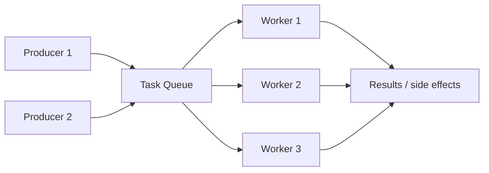
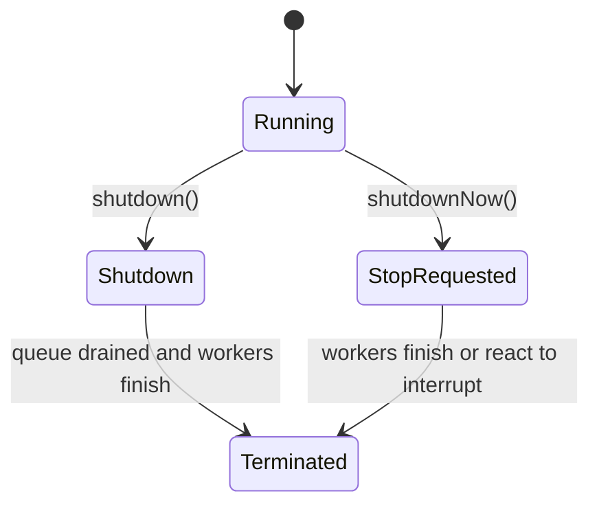

# ExecutorService

> [!summary] За 30 секунд
> `ExecutorService` отделяет **задачу** от **потока**, который её выполнит. Он управляет scheduling, worker lifecycle, очередью, результатами и shutdown, но ответственность за sizing, backpressure и обработку отказов остаётся у приложения.

## Переход мышления

До executor:

```java
new Thread(task).start();
```

После executor:

```java
executor.submit(task);
```

Мы больше не говорим «создай поток». Мы говорим «выполни задачу согласно policy executor».

## Архитектура



Ключевые параметры production executor:

- количество workers;
- тип и ёмкость queue;
- thread factory;
- rejection policy;
- task duration;
- shutdown policy;
- observability.

## `execute` vs `submit`

### execute

```java
executor.execute(() -> doWork());
```

- принимает `Runnable`;
- не возвращает result handle;
- unchecked exception обрабатывается worker/thread infrastructure.

### submit

```java
Future<Integer> future = executor.submit(() -> calculate());
```

- принимает `Runnable` или `Callable`;
- возвращает `Future`;
- exception сохраняется в Future и проявляется через `get()` как `ExecutionException`.

> [!warning] Production trap
> Если вызвать `submit()` и проигнорировать `Future`, exception задачи может остаться незамеченным.

## Lifecycle



Корректное завершение:

```java
executor.shutdown();
try {
    if (!executor.awaitTermination(30, TimeUnit.SECONDS)) {
        executor.shutdownNow();
        if (!executor.awaitTermination(30, TimeUnit.SECONDS)) {
            log.error("Executor did not terminate");
        }
    }
} catch (InterruptedException e) {
    executor.shutdownNow();
    Thread.currentThread().interrupt();
}
```

## Почему factory methods недостаточно для production reasoning

`Executors.newFixedThreadPool(n)` использует unbounded queue. Если producers создают задачи быстрее consumers, memory usage может расти без контроля.

Для критичной нагрузки часто нужен явный `ThreadPoolExecutor`:

```java
ExecutorService executor = new ThreadPoolExecutor(
        8,
        16,
        30,
        TimeUnit.SECONDS,
        new ArrayBlockingQueue<>(500),
        new ThreadPoolExecutor.CallerRunsPolicy()
);
```

Здесь queue bounded, а `CallerRunsPolicy` замедляет producer и создаёт простую форму backpressure.

## CPU-bound vs I/O-bound

### CPU-bound

Количество workers обычно ограничивают близко к числу доступных processor cores. Больше потоков не создаёт больше CPU.

### I/O-bound

Platform-thread pool может быть больше, потому что workers значительную часть времени ждут. Но размер должен учитывать:

- latency;
- downstream limits;
- database connection pool;
- memory;
- acceptable concurrency.

В Java 21 blocking I/O workloads могут использовать [[Virtual Threads]], но ограничивать всё равно нужно дефицитный внешний ресурс.

## ThreadLocal и pool reuse

Worker thread обслуживает много задач. Поэтому ThreadLocal context обязан очищаться в `finally`.

```java
executor.submit(() -> {
    try {
        CONTEXT.set(context);
        process();
    } finally {
        CONTEXT.remove();
    }
});
```

## Interview Answer

> ExecutorService отделяет task submission от thread management. Для production важно не только выбрать pool size, но и определить queue capacity, rejection policy, exception visibility, ThreadLocal cleanup и graceful shutdown. `submit` возвращает Future и захватывает exception, тогда как `execute` не возвращает result handle.

## Memory Hook

> **Executor = workers + queue + policy + lifecycle.** Не своди его к «пулу потоков».

## Sources

- [[98_SOURCES/Java Concurrency Sources|Primary Java Concurrency Sources]]
