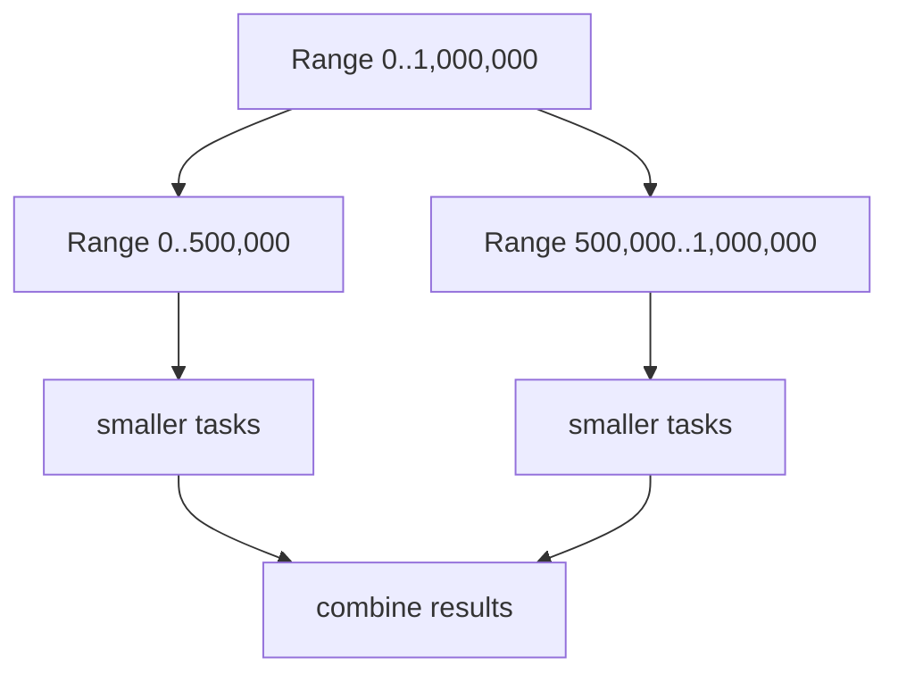
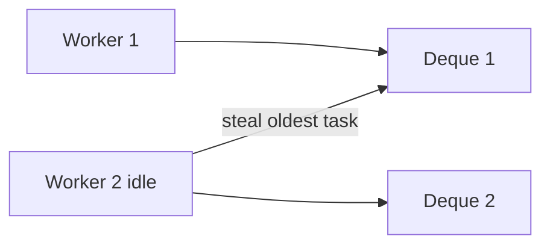

# ForkJoinPool

> [!summary] За 30 секунд
> `ForkJoinPool` — executor для большого числа мелких CPU-oriented tasks, которые рекурсивно делятся и объединяются. Он использует work stealing: idle worker забирает задачи из queue другого worker. Это повышает загрузку CPU, но плохо сочетается с долгим unmanaged blocking и бесконтрольным использованием common pool.

## 1. Модель fork/join

```text
Большая задача
    ↓ split
Подзадачи
    ↓ execute in parallel
Частичные результаты
    ↓ join
Итог
```



## 2. Work stealing

У каждого worker есть собственная deque задач. Worker обычно берёт собственные задачи с одного конца, а idle worker крадёт задачи с другого.



Цель — уменьшить contention на одной общей queue и сбалансировать рекурсивно возникающую работу.

## 3. RecursiveTask и RecursiveAction

`RecursiveTask<V>` возвращает result:

```java
class SumTask extends RecursiveTask<Long> {
    private static final int THRESHOLD = 10_000;
    private final long[] values;
    private final int from;
    private final int to;

    @Override
    protected Long compute() {
        if (to - from <= THRESHOLD) {
            long sum = 0;
            for (int i = from; i < to; i++) {
                sum += values[i];
            }
            return sum;
        }

        int middle = (from + to) >>> 1;
        SumTask left = new SumTask(values, from, middle);
        SumTask right = new SumTask(values, middle, to);

        left.fork();
        long rightResult = right.compute();
        return left.join() + rightResult;
    }
}
```

`RecursiveAction` используется для tasks без result.

## 4. Почему сначала `fork`, затем direct `compute`

Распространённый pattern:

```java
left.fork();
Result rightResult = right.compute();
Result leftResult = left.join();
```

Текущий worker не простаивает: одну половину выполняет сам, вторую делает доступной для stealing.

Плохой вариант:

```java
left.fork();
right.fork();
return left.join() + right.join();
```

Он создаёт лишний scheduling overhead и не использует текущий worker для direct computation.

## 5. Threshold — ключ к эффективности

Слишком крупный threshold:

- мало parallelism;
- часть cores простаивает.

Слишком мелкий threshold:

- много task objects;
- scheduling и joining дороже полезной работы;
- memory pressure.

Threshold выбирается измерениями на реальном workload.

## 6. Common pool

Common pool используется некоторыми high-level APIs:

- parallel streams;
- `CompletableFuture.runAsync()` без explicit executor;
- `CompletableFuture.supplyAsync()` без explicit executor.

```java
CompletableFuture.supplyAsync(this::load);
```

Скрытое sharing создаёт coupling:

```text
parallel stream
CompletableFuture pipeline
third-party library
        ↓
ForkJoinPool.commonPool()
```

Один blocking workload может увеличить latency других независимых операций.

## 7. Blocking problem

ForkJoinPool рассчитан на tasks, которые быстро используют CPU и завершаются. Долгое blocking I/O удерживает worker:

```java
protected Result compute() {
    return remoteClient.call(); // potentially long blocking I/O
}
```

Для известного blocking можно использовать `ForkJoinPool.ManagedBlocker`, но чаще правильнее:

- отдельный bounded executor;
- asynchronous client;
- virtual threads для blocking I/O;
- explicit downstream concurrency limit.

## 8. Parallel streams

```java
long total = orders.parallelStream()
        .mapToLong(this::calculate)
        .sum();
```

Подходит только после проверки:

- работа достаточно CPU-heavy;
- data set достаточно большой;
- operations stateless;
- нет blocking I/O;
- common pool не является shared bottleneck;
- ordering и reduction корректны;
- benchmark показывает benefit.

Parallel stream не является универсальным ускорителем.

## 9. Exceptions и cancellation

Exception task проявляется при `join()`/`invoke()`. Cancellation остаётся cooperative: уже выполняющаяся computation должна поддерживать разумную остановку.

Recursive splitting без deadline или cancellation checks может продолжать расходовать CPU после того, как caller больше не ждёт result.

## 10. Production diagnostics

Полезны:

```text
pool parallelism
active thread count
queued task count
queued submission count
steal count
task duration
CPU utilization
common-pool consumers
```

Высокий queued count при низком CPU может указывать на blocking tasks. Высокий CPU и низкий throughput — на слишком мелкий threshold или дорогой merge.

## 11. ForkJoinPool против ThreadPoolExecutor

| ForkJoinPool | ThreadPoolExecutor |
|---|---|
| work stealing | обычно shared work queue |
| recursive fine-grained tasks | independent submitted tasks |
| CPU divide-and-conquer | general bounded worker pool |
| join-aware execution | explicit queue/rejection policy |

Выбор определяется workload, а не названием API.

## 12. Interview answer

> ForkJoinPool использует per-worker deques и work stealing для рекурсивных CPU-bound задач. Task делится через fork, одна ветка часто вычисляется прямо текущим worker, затем results объединяются через join. Главные риски — слишком мелкие tasks, blocking I/O и скрытое sharing common pool с parallel streams и CompletableFuture.

## Memory Hook

> **Split work, steal imbalance, join results.**

## Sources

- [[98_SOURCES/Java Concurrency Sources|Primary Java Concurrency Sources]]
