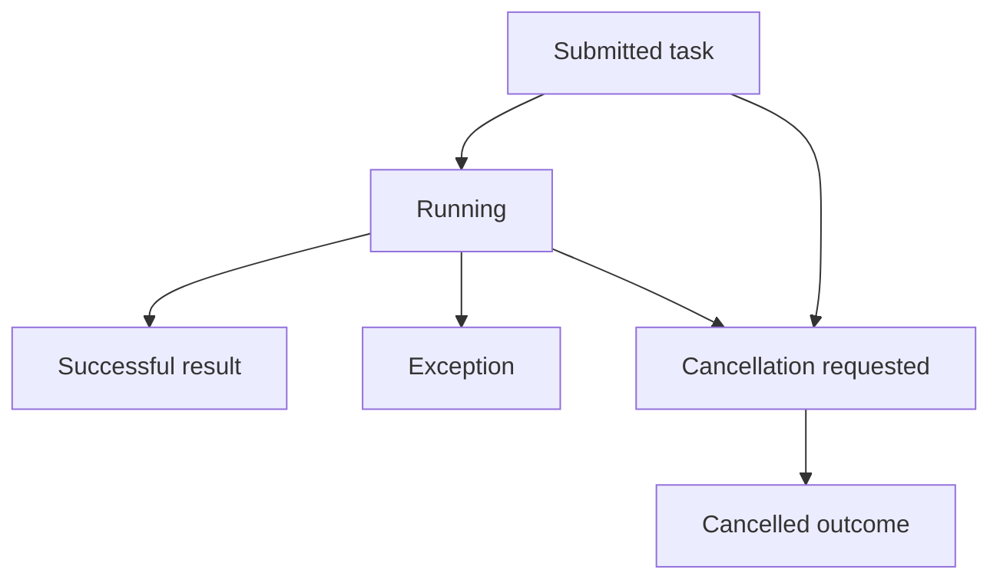

# Future

> [!summary] За 30 секунд
> `Future<V>` — handle результата задачи, отправленной на выполнение. Он позволяет дождаться completion, получить result, увидеть exception или запросить cancellation. Обычный Future не предоставляет удобной composition model и сам по себе не гарантирует, что cancellation физически остановит работу.

## 1. Откуда появляется Future

```java
ExecutorService executor = Executors.newFixedThreadPool(4);
Future<Integer> future = executor.submit(() -> calculate());
```

Здесь существуют три разные сущности:

```text
Callable<Integer> → описание task
executor          → policy выполнения
Future<Integer>   → handle outcome
```

## 2. Outcome model

Задача может завершиться:

- успешно;
- exception;
- cancellation;
- никогда не завершиться из-за deadlock, starvation или зависшего I/O.



## 3. `get()`

```java
Integer result = future.get();
```

`get()` блокирует caller до completion.

Возможные exceptions:

- `InterruptedException` — caller был interrupted во время ожидания;
- `ExecutionException` — task завершилась exception;
- `CancellationException` — task была cancelled.

Причина business failure находится внутри `ExecutionException#getCause()`:

```java
try {
    return future.get();
} catch (ExecutionException e) {
    throw new ProcessingException(e.getCause());
}
```

## 4. Timeout обязателен на критичной границе

```java
future.get(2, TimeUnit.SECONDS);
```

Timeout ограничивает ожидание caller, но не обязательно останавливает task. После `TimeoutException` нужно определить policy:

- запросить cancellation;
- оставить задачу завершаться;
- закрыть ресурс;
- пометить operation uncertain;
- выполнить compensating action.

## 5. Cancellation

```java
boolean accepted = future.cancel(true);
```

Параметр `true` означает: если task уже выполняется, implementation может interrupt worker.

Это не hard kill:

```text
cancel(true)
    ↓
interrupt request
    ↓
task должна корректно реагировать
```

Task, которая игнорирует interrupt или находится в non-interruptible operation, может продолжить работу.

## 6. `isDone()` и `isCancelled()`

```java
future.isDone();
future.isCancelled();
```

`isDone()` возвращает true для любого terminal outcome, включая exception и cancellation. Он не означает successful result.

```text
isDone = true
    ├── success
    ├── exception
    └── cancelled
```

## 7. Exception visibility trap

```java
executor.submit(() -> {
    throw new IllegalStateException("failed");
});
```

Если returned Future проигнорирован, exception может остаться незамеченным application logic.

Для fire-and-forget задачи нужно явно определить:

- error handler;
- logging;
- metrics;
- retry policy;
- dead-letter/storage policy.

## 8. Memory consistency guarantee

Actions в task happen-before actions после успешного `Future#get()` в caller. Это позволяет безопасно наблюдать published result после completion handle.

Однако Future не делает произвольный shared mutable state автоматически безопасным до `get()` или вне этого handoff.

## 9. Future против CompletableFuture

| Future | CompletableFuture |
|---|---|
| blocking `get()` | declarative stages |
| limited composition | `thenApply`, `thenCompose`, combine |
| no built-in callbacks | callbacks and pipelines |
| cancellation handle | completion model plus cancellation API |

`CompletableFuture` удобнее для composition, но требует понимания executor selection, exception paths и blocking boundaries.

## 10. Production example

```java
List<Future<Price>> futures = suppliers.stream()
        .map(supplier -> executor.submit(() -> supplier.loadPrice()))
        .collect(Collectors.toList());

for (Future<Price> future : futures) {
    try {
        prices.add(future.get(500, TimeUnit.MILLISECONDS));
    } catch (TimeoutException e) {
        future.cancel(true);
        metrics.increment("supplier.timeout");
    }
}
```

Недостающие design decisions:

- общий deadline или timeout per supplier;
- partial result policy;
- executor saturation;
- downstream concurrency limit;
- cancellation semantics конкретного client.

## 11. Interview answer

> Future представляет outcome asynchronous task. `get()` блокирует и раскрывает task exception через `ExecutionException`; timeout ограничивает ожидание, но не гарантирует остановку task; `cancel(true)` обычно запрашивает interruption. `isDone()` означает terminal state, а не success. Если Future от `submit()` игнорировать, exception может стать невидимым.

## Memory Hook

> **Future — не результат, а право позже спросить outcome.**

## Sources

- [[98_SOURCES/Java Concurrency Sources|Primary Java Concurrency Sources]]
