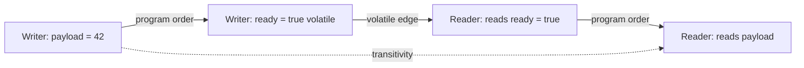

# Happens-Before

> [!summary] За 30 секунд
> Happens-before — это правило доказательства: если A happens-before B, то B обязано наблюдать эффекты A в согласованном порядке.

## Самая важная мысль

> [!danger] Happens-before не означает просто «A случилось раньше по часам».
> Два действия могут физически выполняться одно после другого, но без synchronization edge между ними межпоточная видимость всё равно не доказана.

## Аналогия: акт приёма-передачи

Один инженер закончил работу над сервером. Другой начинает эксплуатацию.

Сам факт, что первый ушёл раньше, недостаточен. Нужен **формальный акт передачи**, после которого второй вправе считать состояние опубликованным.

Happens-before edge играет роль такого акта.

## Основные правила

### 1. Program order

Внутри одного потока более раннее действие happens-before более позднего согласно порядку программы.

### 2. Monitor rule

Unlock monitor happens-before последующему lock того же monitor.

```java
synchronized (lock) {
    shared = 42;
} // unlock

synchronized (lock) { // later lock
    System.out.println(shared);
}
```

### 3. Volatile rule

Write в volatile variable happens-before последующему read этой же variable, который наблюдает соответствующее состояние в synchronization order.

```java
payload = 42;
ready = true; // volatile write

if (ready) {  // volatile read
    use(payload);
}
```

### 4. Thread start

Действия до `thread.start()` happens-before действиям запущенного потока.

### 5. Thread termination / join

Все действия потока happens-before успешному возврату другого потока из `join()`.

### 6. Transitivity

Если A happens-before B и B happens-before C, то A happens-before C.

## Как строится доказательство



Именно transitivity позволяет reader увидеть обычную запись `payload`, сделанную до volatile write.

## Практический алгоритм

Когда видишь shared state, нарисуй два потока и ответь:

1. Где находится write?
2. Где находится read?
3. Какой synchronization edge соединяет их?
4. Это тот же monitor или та же volatile variable?
5. Есть ли transitive chain?

Если edge нельзя показать, корректность обычно держится на удаче.

## Пример с `start()`

```java
int value = 42;
Thread thread = new Thread(() -> System.out.println(value));
thread.start();
```

Запись `value = 42` выполнена до `start()`, поэтому запущенный поток видит подготовленное состояние.

## Пример с `join()`

```java
int[] result = {0};
Thread worker = new Thread(() -> result[0] = 42);
worker.start();
worker.join();
System.out.println(result[0]);
```

После успешного `join()` действия worker опубликованы joining thread.

## Что happens-before не даёт автоматически

- atomicity составной операции;
- отсутствие deadlock;
- fairness;
- правильный business invariant;
- высокую производительность.

## Типичные ловушки

- синхронизировать writer и reader на разных lock objects;
- записывать один volatile flag, а читать другой;
- считать `sleep()` synchronization mechanism;
- считать логирование доказательством корректности;
- полагаться на «на моей машине всегда работает».

## Memory Hook

> **HB = proof edge.** Не спрашивай «кто был раньше?». Спрашивай: «какое правило заставляет reader увидеть write?»

## Sources

- [[98_SOURCES/Java Concurrency Sources|Primary Java Concurrency Sources]]
