# Java Concurrency Visual Deep Dive

> [!summary] За 30 секунд
> Concurrency failure почти всегда относится к одной из четырёх границ: кто выполняет task, кто владеет mutable state, какое synchronization действие создаёт happens-before и что происходит при saturation/cancellation/failure. Диаграммы ниже связывают Java Memory Model, locks, atomics, executors, futures, ThreadLocal и virtual threads в одну диагностическую модель.

# 1. Concurrency mental model

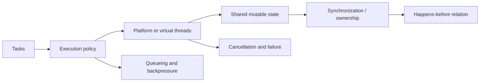

# 2. Thread lifecycle

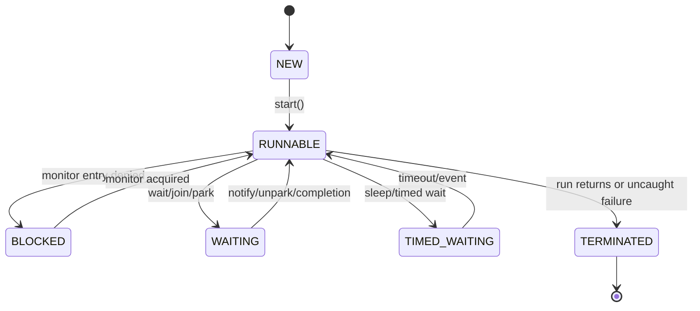

`RUNNABLE` в Java объединяет готовность к CPU и фактическое выполнение; это не означает, что thread прямо сейчас находится на processor core.

# 3. Program order and visibility

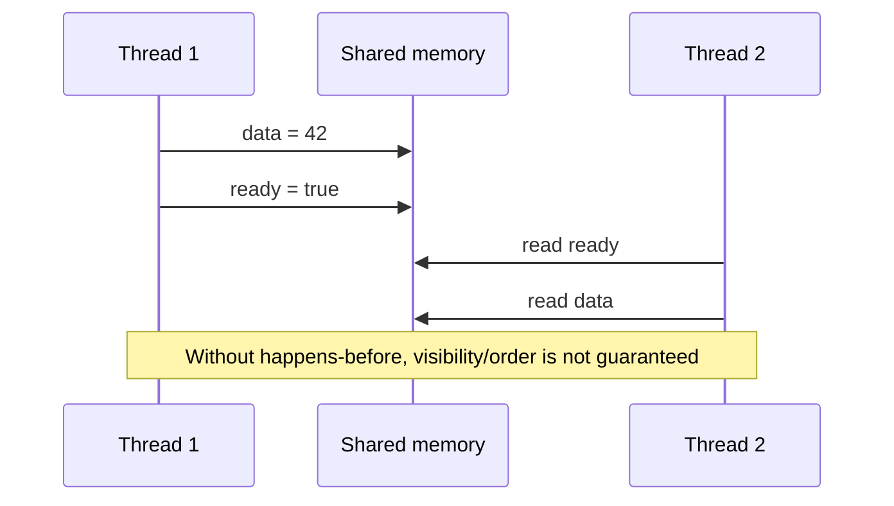

Single-thread program order не создаёт cross-thread visibility автоматически.

# 4. Happens-before graph

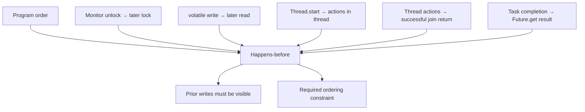

Happens-before не означает «операции выполняются одновременно» или «весь program становится sequential».

# 5. volatile publication

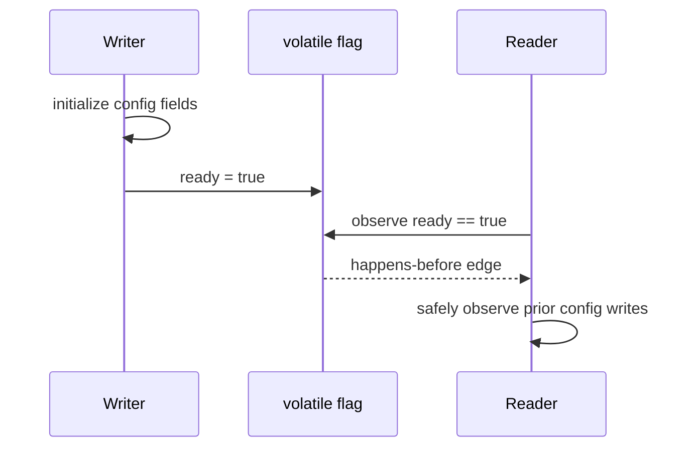

`volatile` подходит для publication и independent state flag. Он не превращает compound read-modify-write в atomic operation.

# 6. Why volatile increment is broken

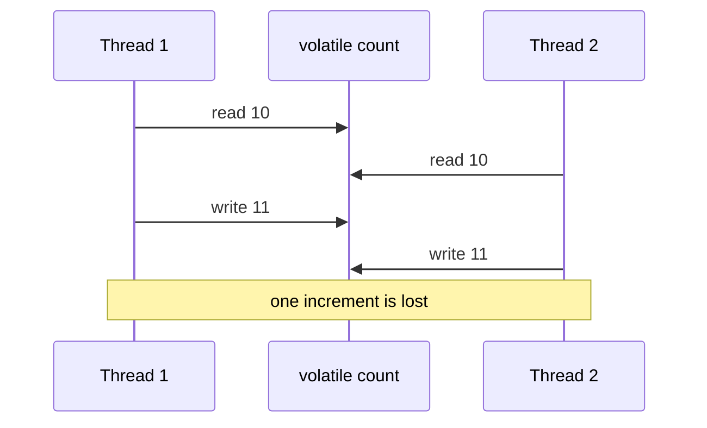

`count++` состоит из read, arithmetic и write.

# 7. synchronized monitor path

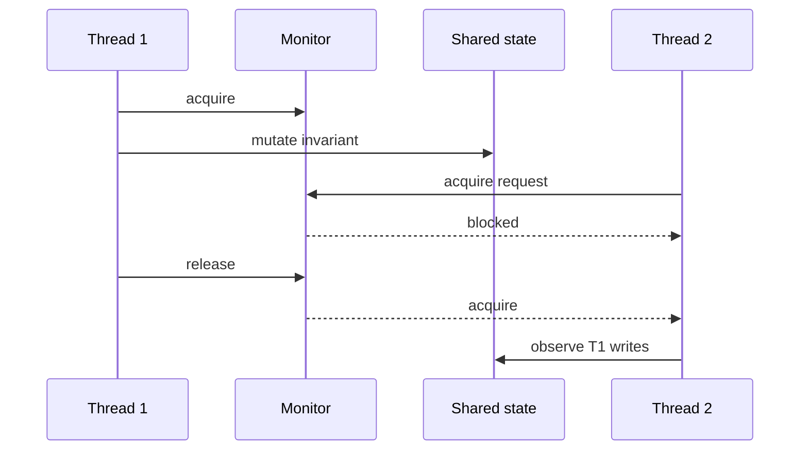

Monitor обеспечивает mutual exclusion и unlock→lock happens-before.

# 8. Intrinsic condition queue

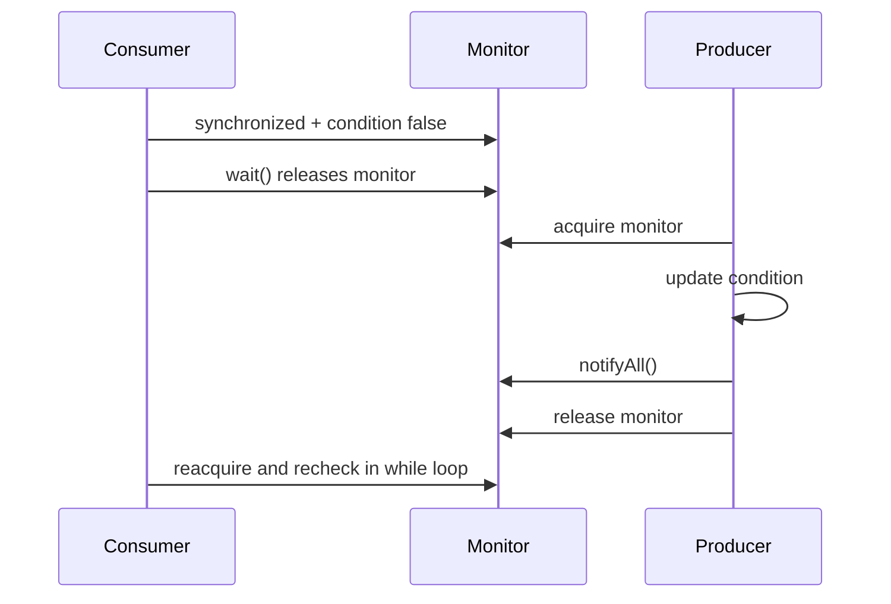

`wait()` должен использоваться в loop, потому что wakeup не гарантирует, что condition всё ещё true.

# 9. ReentrantLock model

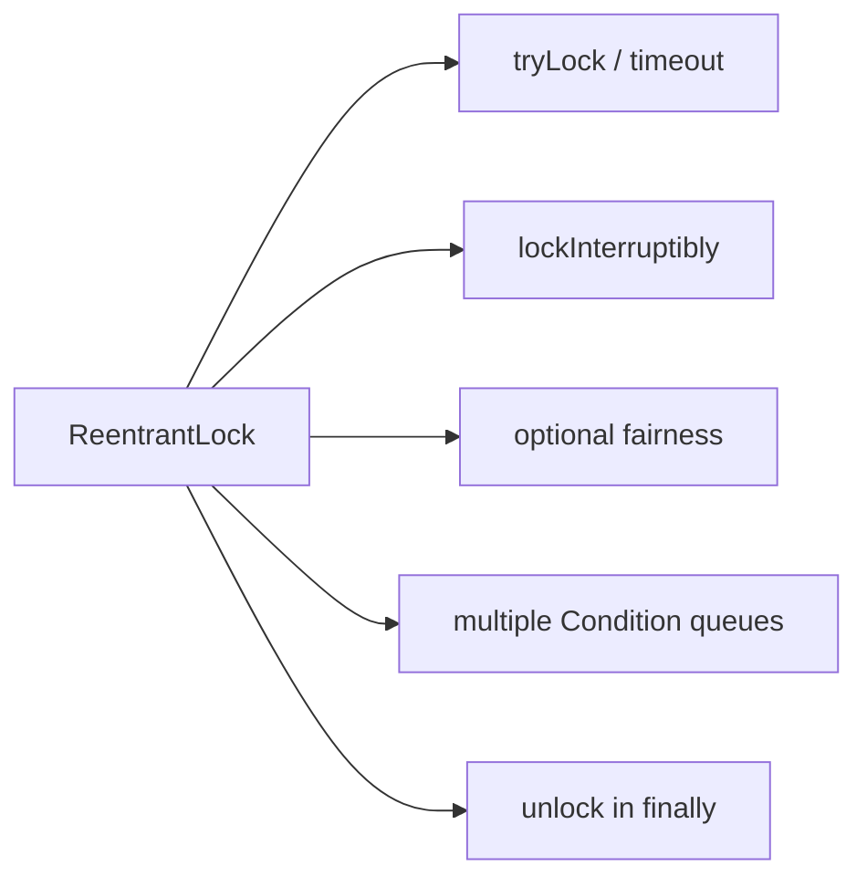

Lock API оправдан, когда нужны capabilities сверх простого structured mutual exclusion.

# 10. CAS retry loop

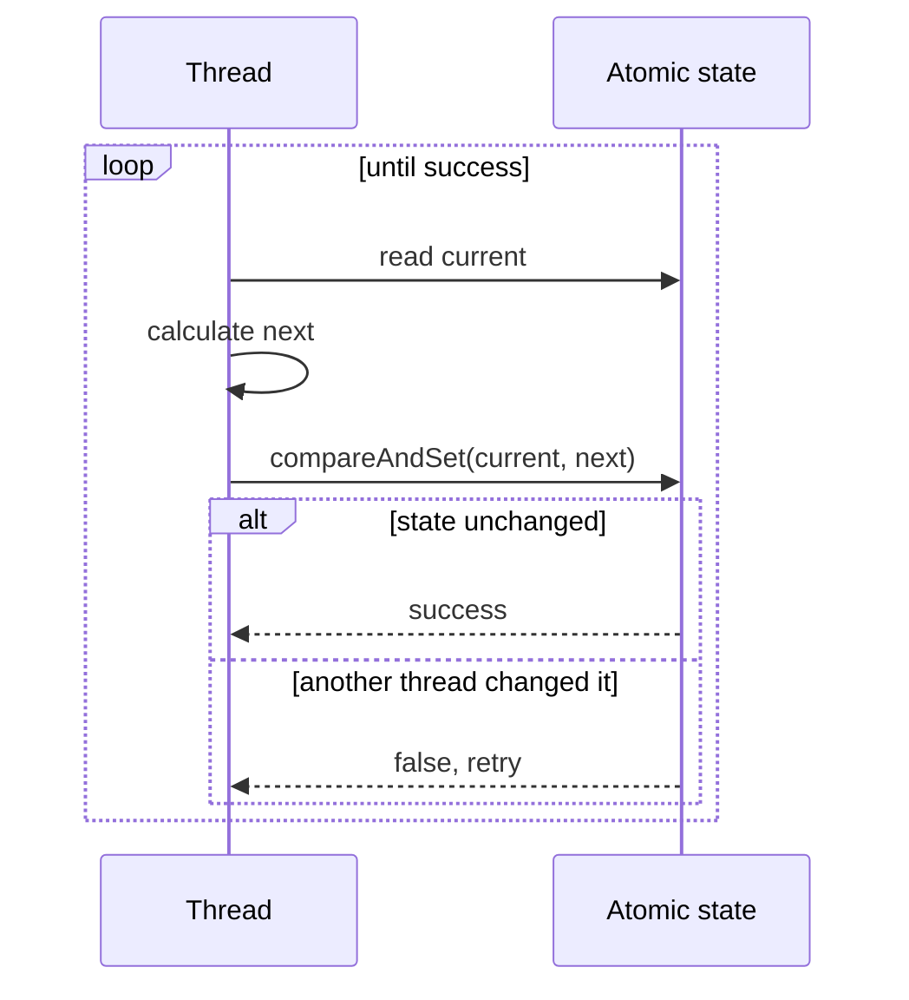

CAS избегает blocking, но contention может приводить к множественным retries.

# 11. AtomicReference state machine

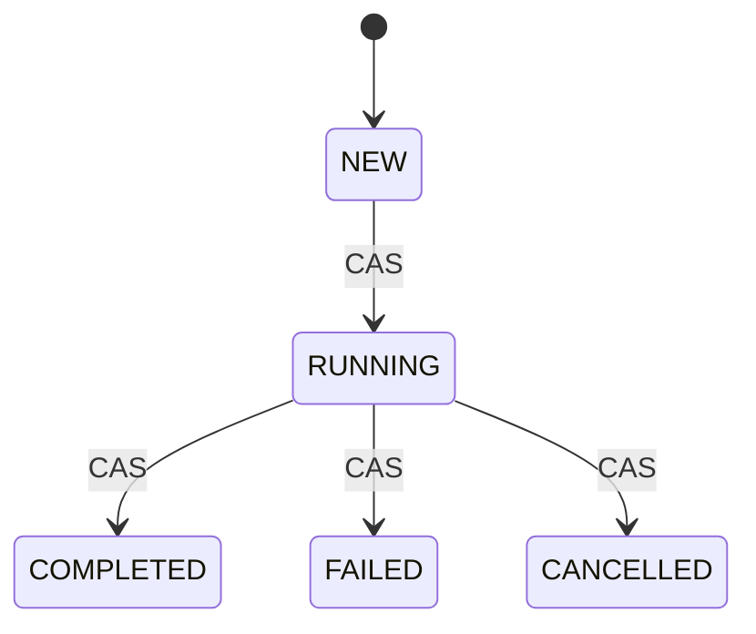

Atomic state transition полезен, когда допустимые переходы должны быть проверены одним compare-and-set.

# 12. LongAdder striping

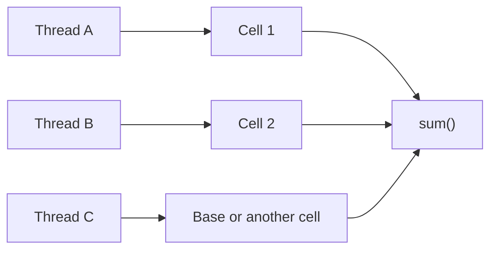

Cells уменьшают contention; thread не владеет одной cell навсегда. `sum()` не является atomic snapshot относительно concurrent updates.

# 13. ExecutorService architecture

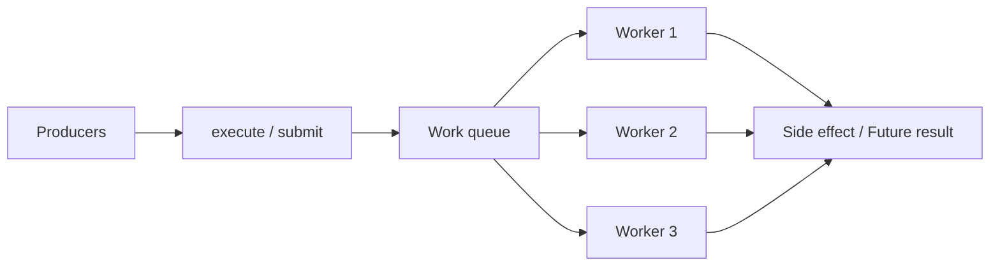

Executor отделяет submission от execution policy: thread count, queue, rejection и lifecycle.

# 14. execute versus submit failure path

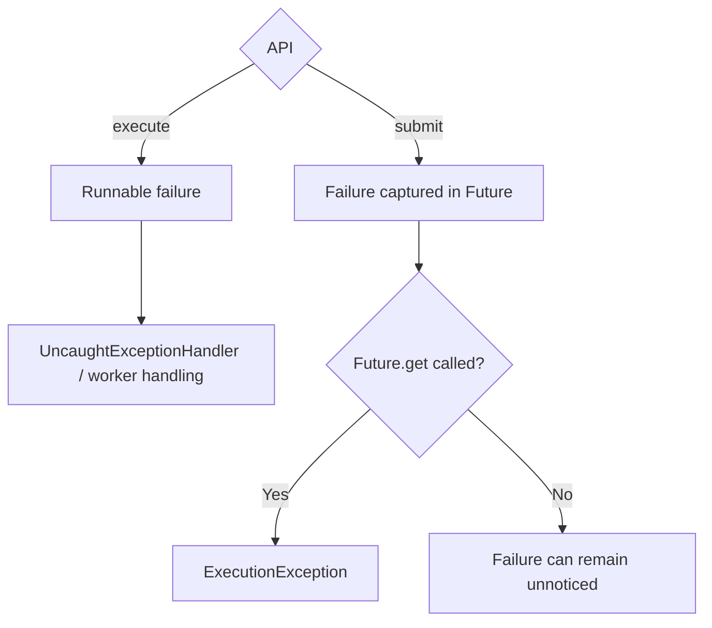

# 15. Bounded pool saturation

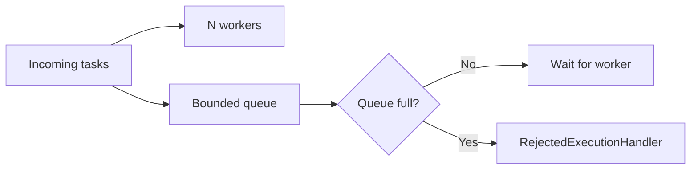

Unbounded queue скрывает overload до роста latency и memory. Bounded queue делает saturation policy явной.

# 16. CallerRuns backpressure

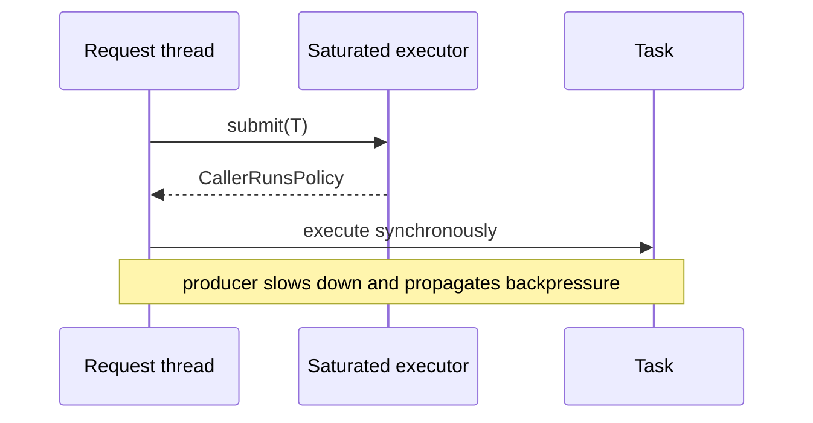

Это полезно не всегда: request thread latency может резко вырасти, поэтому behavior должен быть измерен.

# 17. Executor shutdown

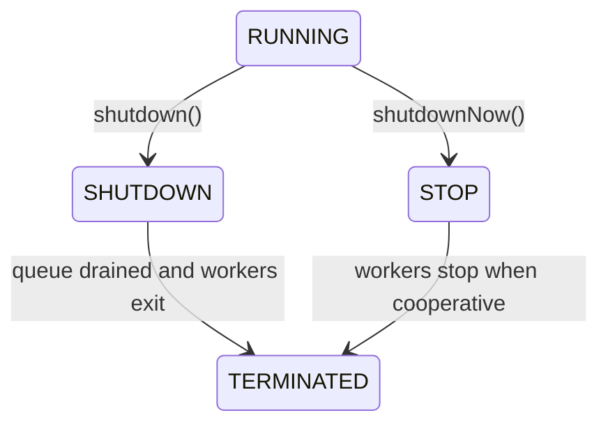

Interruption cooperative: task должен корректно реагировать на interrupt.

# 18. Future outcomes

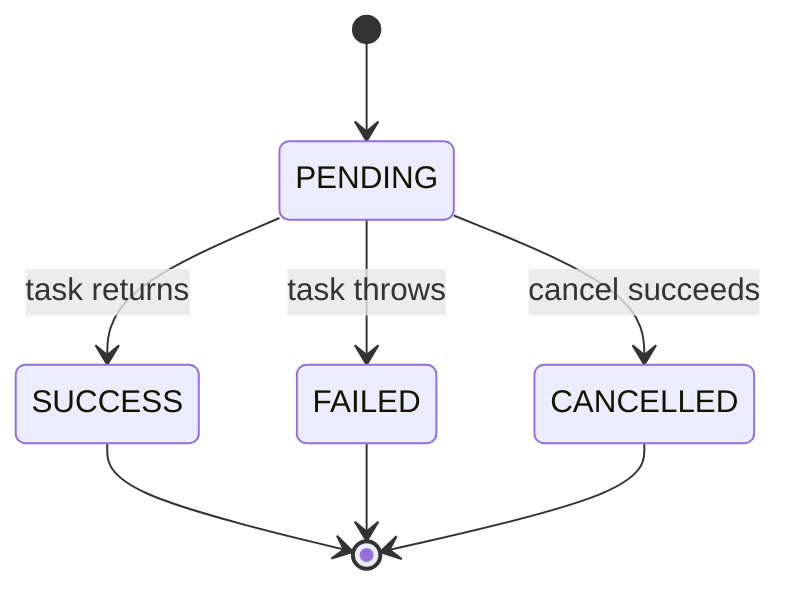

`get()` блокирует до terminal outcome и раскрывает failure через `ExecutionException`.

# 19. CompletableFuture pipeline

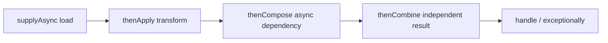

`thenApply` преобразует value. `thenCompose` flatten-ит dependent future и предотвращает `CompletableFuture<CompletableFuture<T>>`.

# 20. Async execution selection

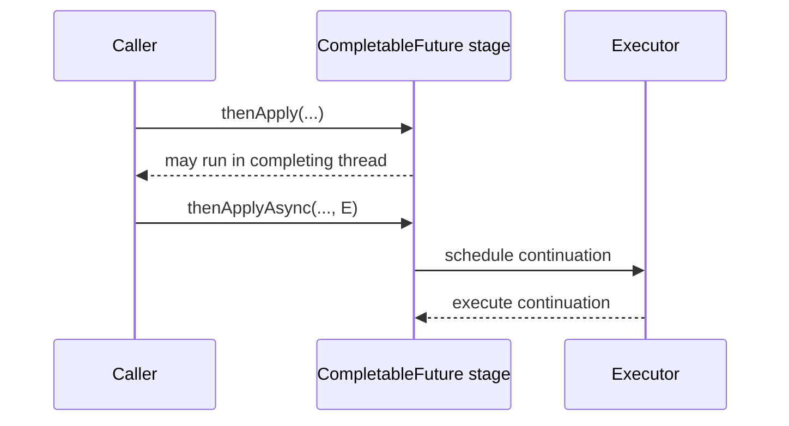

Без explicit executor async variants часто используют common pool, что может создать скрытое resource coupling.

# 21. ForkJoin work stealing

```mermaid
flowchart LR
    W1["Worker 1 deque"] -->|"own tasks LIFO"| W1
    W2["Worker 2 idle"] -->|"steal oldest task"| W1
    W3["Worker 3 deque"] --> W3
```

ForkJoin эффективен для recursively divisible CPU work. Blocking I/O в common pool может уменьшить parallelism.

# 22. ThreadLocal in thread pool

```mermaid
sequenceDiagram
    participant R1 as Request A
    participant T as Reused worker thread
    participant TL as ThreadLocal
    participant R2 as Request B

    R1->>T: execute
    T->>TL: set(user=A)
    R1-->>T: completes without remove()
    R2->>T: execute on same thread
    T->>TL: get() returns user A
```

Cleanup pattern:

```java
try {
    context.set(value);
    chain.doFilter(request, response);
} finally {
    context.remove();
}
```

# 23. ThreadLocal reference leak model

```mermaid
flowchart LR
    THREAD["Long-lived thread"] --> MAP["ThreadLocalMap"]
    MAP --> KEY["Weak key may be cleared"]
    MAP --> VALUE["Strong value remains until cleanup"]
    VALUE --> GRAPH["Large object graph"]
```

Leak risk определяется lifetime thread-а и cleanup, а не только weak key.

# 24. Virtual threads execution model

```mermaid
flowchart LR
    V1["Virtual thread 1"] --> SCHED["JDK scheduler"]
    V2["Virtual thread 2"] --> SCHED
    V3["Virtual thread 3"] --> SCHED
    SCHED --> C1["Carrier platform thread"]
    SCHED --> C2["Carrier platform thread"]
```

Virtual thread дешёв по сравнению с platform thread, но database connections, sockets и downstream quotas остаются ограниченными resources.

# 25. Virtual-thread blocking and unmounting

```mermaid
sequenceDiagram
    participant V as Virtual thread
    participant C as Carrier
    participant IO as Blocking I/O

    V->>C: run
    V->>IO: blocking operation
    V-->>C: unmount when supported
    C->>C: run another virtual thread
    IO-->>V: ready
    V->>C: remount and continue
```

Некоторые operations могут pin carrier; это version-sensitive area, которую нужно проверять JFR и актуальной JDK documentation.

# 26. Concurrency limiter with virtual threads

```mermaid
flowchart LR
    MANY["Many virtual threads"] --> SEM["Semaphore / rate limiter"]
    SEM --> DB["20 DB connections"]
    SEM --> API["50 downstream requests"]
```

Virtual threads упрощают thread-per-task coding model, но не заменяют backpressure.

# 27. ConcurrentHashMap compound action trap

```mermaid
sequenceDiagram
    participant T1 as Thread 1
    participant M as ConcurrentHashMap
    participant T2 as Thread 2

    T1->>M: containsKey(k) == false
    T2->>M: containsKey(k) == false
    T1->>M: put(k, v1)
    T2->>M: put(k, v2)
```

Используй atomic map methods: `putIfAbsent`, `computeIfAbsent`, `compute`, `merge` — с учётом их callback constraints.

# 28. BlockingQueue producer-consumer

```mermaid
sequenceDiagram
    participant P as Producer
    participant Q as Bounded BlockingQueue
    participant C as Consumer

    P->>Q: put(item)
    alt queue full
        Q-->>P: block or timeout
    end
    C->>Q: take()
    Q-->>C: item
```

Bounded queue связывает throughput producer и consumer и ограничивает memory growth.

# 29. Deadlock wait-for graph

```mermaid
flowchart LR
    T1["Thread 1 holds Lock A"] -->|"waits for"| B["Lock B"]
    T2["Thread 2 holds Lock B"] -->|"waits for"| A["Lock A"]
    A --> T1
    B --> T2
```

Стабильный lock ordering разрывает cycle.

# 30. Livelock and starvation distinction

```mermaid
flowchart TD
    ISSUE{"Symptom"}
    ISSUE -->|"Threads blocked in cycle"| DEAD["Deadlock"]
    ISSUE -->|"Threads active but no progress"| LIVE["Livelock"]
    ISSUE -->|"One task rarely obtains resource"| STARVE["Starvation"]
```

# 31. Race-condition diagnostic tree

```mermaid
flowchart TD
    START["Intermittent wrong result"] --> SHARE{"Shared mutable state?"}
    SHARE -->|"No"| OTHER["Inspect ordering, external system, time"]
    SHARE -->|"Yes"| OWNER{"Single owner?"}
    OWNER -->|"Yes"| CONFINE["Verify confinement"]
    OWNER -->|"No"| HB{"Documented happens-before?"}
    HB -->|"No"| ADD["Add lock, volatile publication, atomic state or message passing"]
    HB -->|"Yes"| COMPOUND{"Compound invariant protected atomically?"}
    COMPOUND -->|"No"| FIX["Protect whole invariant"]
    COMPOUND -->|"Yes"| TRACE["Thread dump, JFR, counters, stress test"]
```

# 32. Saturation diagnostic tree

```mermaid
flowchart TD
    LAT["Latency rises under load"] --> POOL{"Executor active == max?"}
    POOL -->|"No"| DOWN["Inspect downstream latency and locks"]
    POOL -->|"Yes"| Q{"Queue growing?"}
    Q -->|"Yes"| OVER["Arrival rate exceeds service rate"]
    Q -->|"No, rejections"| POLICY["Inspect rejection/backpressure policy"]
    OVER --> ACTION["Reduce work, increase capacity, bound concurrency, shed load"]
```

# 33. Worked example — parallel profile aggregation

Requirement: загрузить profile, limits и offers параллельно, но ограничить downstream concurrency и корректно обработать timeout.

```mermaid
sequenceDiagram
    participant R as Request
    participant E as Dedicated executor
    participant P as Profile API
    participant L as Limits API
    participant O as Offers API

    R->>E: start three futures
    par profile
        E->>P: load
    and limits
        E->>L: load
    and offers
        E->>O: load
    end
    E-->>R: combine or timeout
```

```java
CompletableFuture<Profile> profile = supplyAsync(profileClient::load, ioExecutor);
CompletableFuture<Limits> limits = supplyAsync(limitsClient::load, ioExecutor);
CompletableFuture<List<Offer>> offers = supplyAsync(offerClient::load, ioExecutor);

return profile.thenCombine(limits, ProfileView::new)
        .thenCombine(offers, ProfileView::withOffers)
        .orTimeout(800, TimeUnit.MILLISECONDS)
        .join();
```

Production evidence:

```text
executor active count
queue size and rejection count
per-downstream latency
completion outcome counts
JFR blocked/pinned thread events
request timeout and cancellation propagation
```

# 34. Interview explanation

> Я начинаю с ownership shared state и execution policy. Затем называю synchronization action, которое создаёт happens-before. После этого проверяю compound invariant, saturation policy, cancellation и failure observation. `volatile` решает visibility/publication, lock — mutual exclusion и invariant, atomics — отдельные lock-free transitions, executor — scheduling/backpressure, virtual threads — стоимость thread-per-task, но не capacity downstream systems.

# 35. Exercises

1. Нарисовать happens-before path для `Future.get()`.
2. Исправить volatile counter через `AtomicLong`, затем сравнить с `LongAdder`.
3. Настроить bounded executor и доказать rejection policy.
4. Воспроизвести ThreadLocal leak на single-thread pool.
5. Снять thread dump deadlock-а и построить wait-for graph.
6. Ограничить 1000 virtual threads semaphore на 20 DB calls.

## Related materials

- [[Concurrency Learning Path]]
- [[Java Memory Model]]
- [[Happens-Before]]
- [[Visibility Atomicity Ordering]]
- [[volatile]]
- [[synchronized]]
- [[ReentrantLock]]
- [[Atomic CAS and Counters]]
- [[ExecutorService]]
- [[CompletableFuture]]
- [[ForkJoinPool]]
- [[ThreadLocal]]
- [[Virtual Threads]]
- [[Concurrent Collections and Backpressure]]
- [[Deadlock Livelock and Lock Ordering]]
- [[01_MAPS/Java Concurrency Visual Atlas.canvas]]
