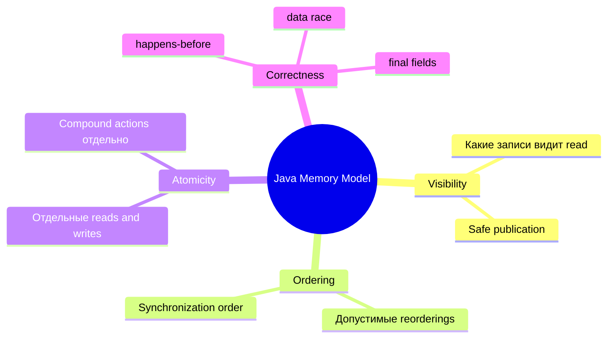

# Java Memory Model

> [!summary] За 30 секунд
> Java Memory Model определяет, **какие значения могут наблюдать потоки и какие правила делают обмен данными между ними корректным**. Это модель допустимого поведения программы, а не схема расположения объектов в heap.

## Интуиция: рабочие черновики и официальный журнал

Представь офис:

- у каждого сотрудника есть локальные черновики;
- существует общий официальный журнал;
- сотрудники могут делать записи и читать данные не в один физический момент;
- специальные процедуры публикации определяют, когда изменения одного сотрудника обязаны стать видимыми другим.

В Java такими процедурами являются synchronization actions: monitor lock/unlock, volatile read/write, thread start/join и другие правила happens-before.

> [!warning] Аналогия ограничена
> JMM не обещает конкретный CPU cache или конкретное копирование между «локальной» и «главной» памятью. Она описывает наблюдаемое поведение, а JVM свободна выбирать реализацию.

## Что регулирует JMM



## Главная проблема

Код одного потока читается сверху вниз, но другой поток не получает автоматической гарантии увидеть все промежуточные записи в том же порядке.

```java
class Holder {
    int value;
    boolean ready;
}
```

Writer:

```java
holder.value = 42;
holder.ready = true;
```

Reader:

```java
if (holder.ready) {
    System.out.println(holder.value);
}
```

Без happens-before между потоками reasoning «ready уже true, значит value точно 42» не является доказанным.

## Формальная опора: happens-before

Если действие A happens-before B, то:

1. эффекты A должны быть видимы B;
2. A упорядочено перед B с точки зрения допустимого наблюдения.

Это не обязательно означает, что A физически завершилось на много миллисекунд раньше. Это отношение корректности и видимости.

Подробно: [[Happens-Before]].

## Data race

Упрощённо data race существует, если:

- два потока обращаются к одной переменной;
- хотя бы одно обращение — запись;
- обращения не упорядочены happens-before.

Data-race-free программа получает гораздо более сильную, интуитивную модель поведения.

## Safe publication

Объект нужно не только правильно построить, но и корректно опубликовать другому потоку.

Рабочие способы публикации включают:

- запись ссылки в `volatile` поле;
- публикацию под monitor lock;
- передачу через потокобезопасную коллекцию;
- создание объекта до запуска потока, который его использует;
- корректное использование final fields и отсутствие утечки `this` из конструктора.

## Пример корректной публикации snapshot

```java
final class Configuration {
    private final String endpoint;
    private final int timeoutMs;

    Configuration(String endpoint, int timeoutMs) {
        this.endpoint = endpoint;
        this.timeoutMs = timeoutMs;
    }
}

class ConfigurationStore {
    private volatile Configuration current;

    void replace(Configuration next) {
        current = next;
    }

    Configuration current() {
        return current;
    }
}
```

Здесь объект immutable, а volatile reference безопасно публикует готовый snapshot.

## JMM не является

- картой heap и stack;
- обещанием немедленной записи в RAM;
- запретом оптимизаций;
- автоматической защитой от race conditions;
- утверждением, что «каждый поток всегда имеет отдельную копию каждой переменной».

## Как отвечать на интервью

> Java Memory Model задаёт правила наблюдаемости, упорядочивания и синхронизации действий между потоками. Центральный инструмент reasoning — happens-before. Без него чтение разделяемого изменяемого состояния может видеть старые или недоказуемо опубликованные значения, даже если исходный код одного потока выглядит последовательно.

## Проверка понимания

> [!question] Почему обычного порядка строк в writer недостаточно для reader?

> [!answer]- Ответ
> Program order гарантирует порядок внутри самого writer, но для межпоточной видимости требуется synchronization relationship. Без него reader не получает happens-before доказательство.

> [!question] JMM описывает CPU cache?

> [!answer]- Ответ
> Нет. CPU caches и compiler optimizations объясняют, почему модель нужна, но JMM определяет допустимое наблюдаемое поведение Java-программы независимо от конкретной архитектуры.

## Memory Hook

> **JMM — это договор наблюдения:** кто, какое значение и после какого synchronization event обязан увидеть.

## Sources

- [[98_SOURCES/Java Concurrency Sources|Primary Java Concurrency Sources]]
