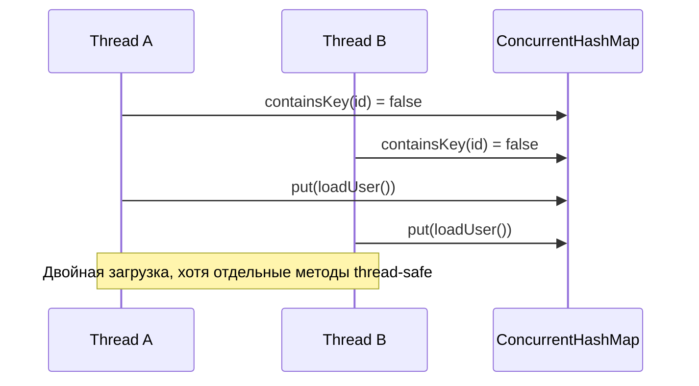

# Race Condition

> [!summary] За 30 секунд
> Race condition возникает, когда корректность результата зависит от непредсказуемого взаимного порядка действий нескольких потоков.

## Не путать с data race

- **Race condition** — более широкая логическая проблема: результат зависит от timing.
- **Data race** в терминах Java Memory Model — конфликтующие обращения к одной переменной без happens-before, где хотя бы одно обращение является записью.

Можно иметь логическую race condition даже при использовании потокобезопасных отдельных операций.

## Пример: check-then-act

```java
if (!users.containsKey(id)) {
    users.put(id, loadUser(id));
}
```

Даже если `users` — `ConcurrentHashMap`, составная логика не атомарна:



Правильный вариант:

```java
User user = users.computeIfAbsent(id, this::loadUser);
```

## Другие формы race condition

- read-modify-write: `counter++`;
- check-then-act: проверил, затем выполнил;
- lazy initialization без safe publication;
- два перевода средств с одновременной проверкой баланса;
- запуск cleanup одновременно с использованием ресурса.

## Как распознать

Спроси:

1. Какие данные разделяются?
2. Какие действия должны восприниматься как единая операция?
3. Может ли другой поток вмешаться между проверкой и действием?
4. На каком объекте или механизме строится coordination?
5. Есть ли единый инвариант, который должен сохраняться?

## Исправление начинается с инварианта

Плохая стратегия:

> «Добавим `synchronized` в случайный метод».

Хорошая стратегия:

> «Баланс не может стать отрицательным; проверка и списание должны быть одной критической секцией».

## Memory Hook

> Race condition — это не «два потока работают одновременно». Это **неправильная зависимость корректности от того, кому повезло выполнить шаг первым**.

## Sources

- [[98_SOURCES/Java Concurrency Sources|Primary Java Concurrency Sources]]
