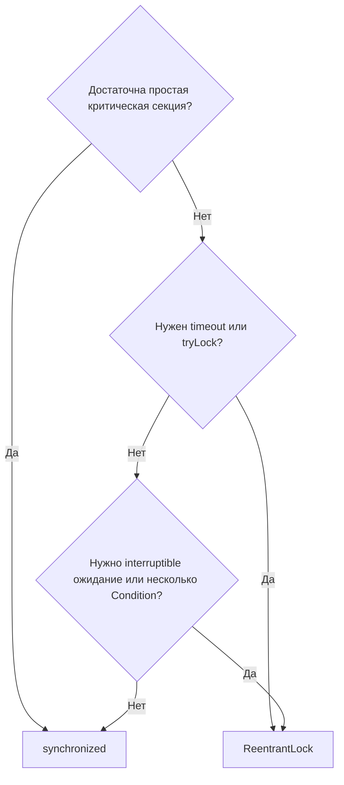

# ReentrantLock

> [!summary] За 30 секунд
> `ReentrantLock` предоставляет те же базовые идеи mutual exclusion и visibility, что `synchronized`, но добавляет explicit lifecycle, `tryLock`, timeout, interruptible acquisition, fairness option и несколько `Condition`.

## Главная развилка

Не выбирай `ReentrantLock` потому, что он «быстрее». Выбирай его, когда нужен API, которого нет у monitor syntax.



## Безопасный шаблон

```java
private final Lock lock = new ReentrantLock();

void update() {
    lock.lock();
    try {
        changeSharedState();
    } finally {
        lock.unlock();
    }
}
```

> [!danger] Главная ошибка
> `unlock()` обязан находиться в `finally`. Иначе exception может навсегда оставить lock захваченным.

## `tryLock()`

```java
if (lock.tryLock()) {
    try {
        changeSharedState();
    } finally {
        lock.unlock();
    }
} else {
    useFallback();
}
```

Полезно, когда система предпочитает fallback бесконечному ожиданию.

## Timeout

```java
if (lock.tryLock(200, TimeUnit.MILLISECONDS)) {
    try {
        changeSharedState();
    } finally {
        lock.unlock();
    }
} else {
    throw new BusyResourceException();
}
```

Теперь waiting policy является частью business behavior.

## Interruptible acquisition

```java
lock.lockInterruptibly();
try {
    changeSharedState();
} finally {
    lock.unlock();
}
```

Поток может отменить ожидание lock через interruption.

## Fairness

```java
new ReentrantLock(true)
```

Fair lock старается обслуживать ожидающие потоки ближе к очереди, но fairness обычно снижает throughput. Это policy, а не бесплатное улучшение.

## Conditions

Один lock может иметь несколько condition queues:

```java
private final Lock lock = new ReentrantLock();
private final Condition notEmpty = lock.newCondition();
private final Condition notFull = lock.newCondition();
```

Это выразительнее одного monitor wait-set, но требует строгого protocol:

- condition check inside loop;
- `await()` только при удержании lock;
- state change before `signal()`/`signalAll()`;
- unlock in finally.

## Когда synchronized лучше

- простая короткая critical section;
- не нужны timeout/interruptible acquisition;
- важна минимальная сложность;
- хочется снизить риск забыть unlock.

## Interview Answer

> `ReentrantLock` — explicit lock с reentrancy и monitor-like visibility guarantees. Его выбирают ради дополнительных coordination policies: tryLock, timeout, interruptible acquisition, fairness и multiple Conditions. Базовый pattern всегда `lock(); try { ... } finally { unlock(); }`.

## Memory Hook

> **Lock gives control; control creates responsibility.**

## Sources

- [[98_SOURCES/Java Concurrency Sources|Primary Java Concurrency Sources]]
