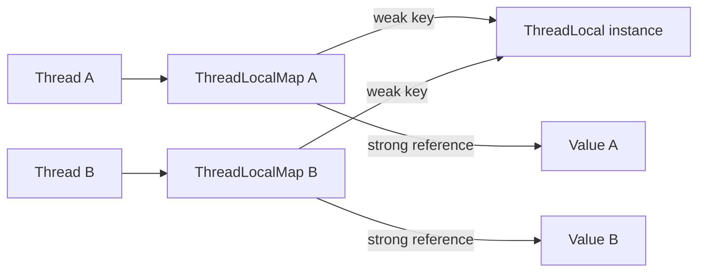
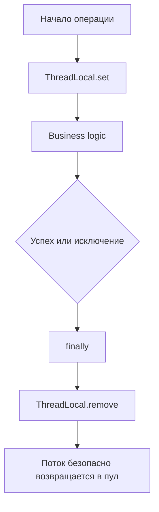

# ThreadLocal

> [!summary] За 30 секунд
> `ThreadLocal<T>` даёт каждому потоку собственное значение, связанное с одним объектом `ThreadLocal`. Он изолирует контекст между потоками, но не делает разделяемый объект потокобезопасным.

## Какую проблему решает

`ThreadLocal` позволяет передавать контекст внутри одного потока без добавления параметра во все методы. Типичные примеры: correlation ID, security context, locale и временное состояние операции.

## Ментальная модель

Не объект `ThreadLocal` хранит значения потоков. Каждый `Thread` содержит собственную внутреннюю таблицу, где экземпляр `ThreadLocal` используется как ключ.



## Как работает внутри

- У потока может существовать `ThreadLocalMap`.
- Ключ связан с экземпляром `ThreadLocal` через слабую ссылку.
- Значение удерживается обычной сильной ссылкой.
- Очистка устаревших записей выполняется не мгновенно, а во время некоторых операций с таблицей.
- Долгоживущий поток пула может удерживать значение намного дольше бизнес-операции.

## Жизненный цикл безопасного использования



## Основной API

```java
private static final ThreadLocal<String> REQUEST_ID = new ThreadLocal<>();

public void process(String requestId) {
    try {
        REQUEST_ID.set(requestId);
        execute();
    } finally {
        REQUEST_ID.remove();
    }
}
```

## Production-пример

В серверном приложении поток из пула обрабатывает запрос A, сохраняет `userId` в `ThreadLocal`, но не очищает его. Тот же поток затем обрабатывает запрос B и может увидеть контекст предыдущего пользователя.

## Ограничения и trade-offs

- скрывает зависимость от контекста;
- усложняет тестирование;
- опасен при переиспользовании потоков;
- данные не передаются автоматически между потоками;
- массовое использование с virtual threads может создавать большой объём thread-local state.

## Типичные ошибки

> [!danger] Главная ошибка
> Вызывать `set()` без гарантированного `remove()` в `finally`.

Другие ошибки:

- считать `ThreadLocal` заменой синхронизации;
- хранить тяжёлые объекты;
- ожидать автоматической передачи значения в другой executor;
- использовать как глобальный контейнер зависимостей.

## Отличия версий

Базовая модель `ThreadLocal` доступна во всех рассматриваемых версиях Java. В Java 21 особенно важно переоценить его использование рядом с virtual threads и новыми моделями передачи контекста.

## Вопросы собеседования

- [[20_QUESTIONS/Interview/Java/Why can ThreadLocal leak in a thread pool]]
- Где хранится `ThreadLocalMap`?
- Почему слабой ссылки на ключ недостаточно для немедленной очистки значения?
- Почему `ThreadLocal` не делает объект thread-safe?
- Что происходит при использовании `ThreadLocal` с executor?

## Связанные темы

- [[ExecutorService]]
- [[Virtual Threads]]
- [[Java Memory Model]]
- [[Memory Leaks]]
