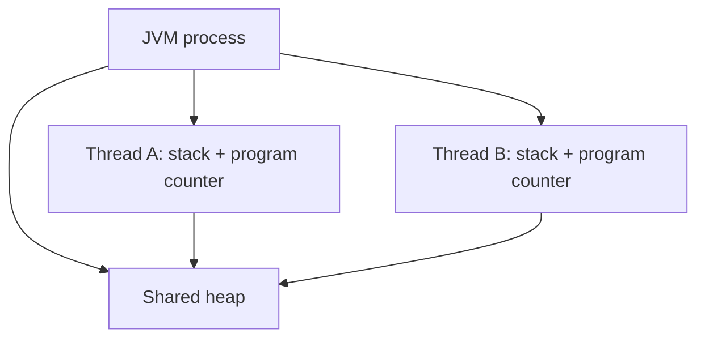
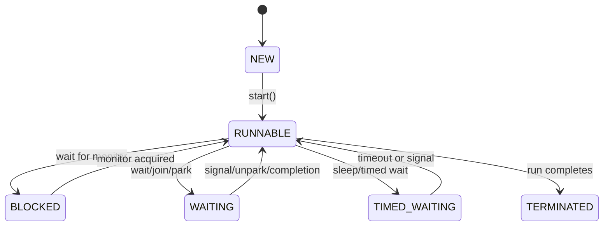

# Threads

> [!summary] За 30 секунд
> Java thread — это последовательность выполнения внутри процесса JVM. Несколько threads разделяют heap, но имеют собственные stacks и program counters. Создание thread не делает код параллельным автоматически: поведение определяется доступными CPU cores, scheduling, blocking и synchronization.

## 1. Process, thread и task — разные понятия

```text
Process → изолированное адресное пространство и ресурсы OS
Thread  → поток выполнения внутри process
Task    → работа, которую требуется выполнить
```

В Java production-код обычно передаёт **task** в executor, а не создаёт platform thread вручную:

```java
executor.submit(() -> processOrder(orderId));
```

`ExecutorService` решает, какой worker выполнит task и когда.

## 2. Что threads разделяют

Threads одной JVM обычно разделяют:

- heap objects;
- static fields;
- open resources;
- caches и application state.

У каждого thread собственные:

- Java stack;
- local variables текущих methods;
- call frames;
- program counter;
- interrupt status;
- `ThreadLocal` map.



Именно shared heap создаёт необходимость в visibility, atomicity и ordering rules.

## 3. Lifecycle

У `Thread.State` шесть состояний:

```text
NEW
RUNNABLE
BLOCKED
WAITING
TIMED_WAITING
TERMINATED
```

Важно: `RUNNABLE` в Java объединяет thread, который реально выполняется на CPU, и thread, готовый к выполнению и ожидающий scheduling.



## 4. `start()` против `run()`

```java
Thread thread = new Thread(this::work);
thread.start();
```

`start()` просит JVM создать новый execution path, который затем вызовет `run()`.

```java
thread.run();
```

Прямой вызов `run()` — обычный method call в текущем thread. Новый thread не появляется.

## 5. Interruption — cooperative cancellation

`interrupt()` не «убивает» thread. Он:

- устанавливает interrupt flag;
- может заставить blocking operation бросить `InterruptedException`;
- сообщает коду, что следует прекратить работу.

Правильное восстановление flag:

```java
try {
    queue.take();
} catch (InterruptedException e) {
    Thread.currentThread().interrupt();
    return;
}
```

Проглатывание `InterruptedException` ломает cancellation и graceful shutdown.

## 6. Daemon и non-daemon threads

JVM может завершиться, когда остались только daemon threads. Поэтому daemon подходит для вспомогательной best-effort работы, но не является надёжным владельцем критичных данных или обязательной доставки.

```java
thread.setDaemon(true);
```

Daemon flag нужно установить до `start()`.

## 7. Thread safety не является свойством thread

Thread safety — свойство компонента и его concurrency protocol. Для shared mutable state нужны:

- immutability;
- confinement;
- synchronization;
- locks;
- atomic variables;
- concurrent collections;
- message passing.

```java
private int balance;

void debit(int amount) {
    balance -= amount; // data race без coordination
}
```

## 8. Platform threads и virtual threads

Platform thread обычно связан с OS thread и сравнительно дорог при большом числе blocking operations.

Virtual thread — lightweight Java thread, рассчитанный на большое количество mostly-blocking tasks. Он не отменяет:

- limits database connections;
- downstream quotas;
- synchronization;
- memory consumption;
- backpressure.

См. [[Virtual Threads]].

## 9. Production diagnostics

Полезно проверять:

```text
thread count
thread states
blocked/waited time
executor queue depth
rejected tasks
CPU saturation
lock contention
thread dumps
```

Thread dump показывает stacks и lock ownership в конкретный момент, но требует интерпретации вместе с metrics и workload.

## 10. Interview answer

> Thread — execution path внутри JVM process. Threads разделяют heap, но имеют собственные stacks. `start()` создаёт новый execution path, `run()` сам по себе — обычный вызов. Cancellation строится на interruption и cooperative handling. В production задачи обычно передают в executor, а thread safety достигается explicit synchronization, immutability или confinement.

## Memory Hook

> **Task — что сделать. Thread — где выполняется. Executor — кто управляет выполнением.**

## Sources

- [[98_SOURCES/Java Concurrency Sources|Primary Java Concurrency Sources]]
