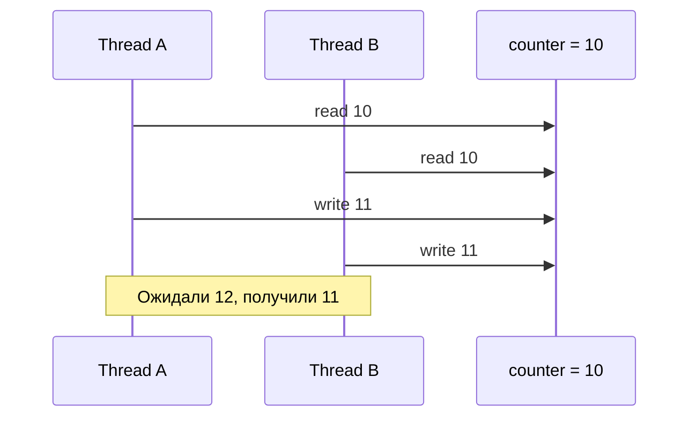
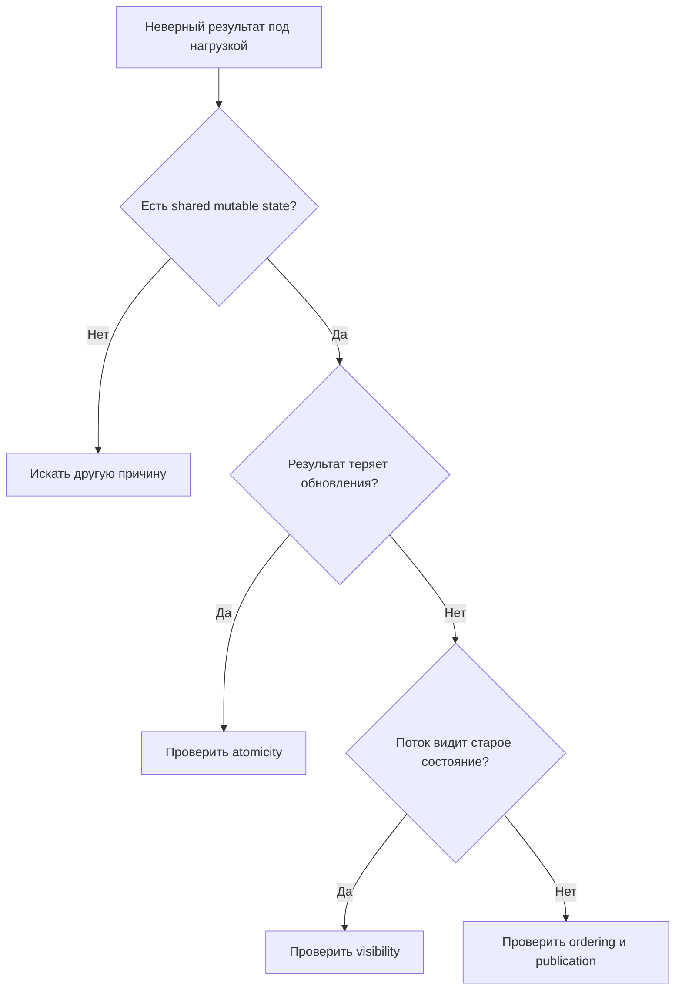

# Visibility, Atomicity and Ordering

> [!summary] За 30 секунд
> Большинство ошибок многопоточности можно разложить на три независимых вопроса: **увидел ли поток изменение**, **выполнилось ли действие неделимо**, **можно ли полагаться на порядок действий**.

## Интуиция: три разные поломки

Представь два банковских операциониста, которые работают с одной учётной записью.

- **Visibility:** один обновил баланс, но второй продолжает смотреть на старую распечатку.
- **Atomicity:** операция «прочитать баланс → прибавить → записать» была прервана другой такой же операцией.
- **Ordering:** система переставила внутренние шаги, потому что для одного сотрудника результат не менялся, но для второго порядок оказался критичным.

> [!danger] Частая ошибка мышления
> Исправив visibility через `volatile`, разработчик ошибочно считает, что автоматически исправил atomicity. Это разные свойства.

## Сравнение

| Свойство | Вопрос | Типичная ошибка | Подходящие инструменты |
|---|---|---|---|
| Visibility | Увидит ли поток новое значение? | бесконечный цикл на старом флаге | `volatile`, monitor unlock/lock, atomics |
| Atomicity | Может ли операция быть разорвана? | lost update при `counter++` | `synchronized`, `Lock`, atomic classes |
| Ordering | Сохраняется ли необходимый порядок? | публикация частично построенного состояния | happens-before, `volatile`, locks, final-field semantics |

## 1. Visibility

```java
class Worker {
    private boolean running = true;

    void stop() {
        running = false;
    }

    void runLoop() {
        while (running) {
            // работа
        }
    }
}
```

Без корректной связи между потоками Java не обязана обеспечивать своевременное наблюдение `false` другим потоком.

Исправление для независимого флага:

```java
private volatile boolean running = true;
```

## 2. Atomicity

```java
counter++;
```

Концептуально это три шага:

```text
read counter
add 1
write counter
```

Два потока могут прочитать одно значение и оба записать одинаковый результат.



`volatile int counter` делает чтение актуальным, но не превращает read-modify-write в одну неделимую операцию.

## 3. Ordering

Компилятор и процессор могут менять внутренний порядок независимых действий, если это не меняет результат в одном потоке.

```java
int data;
boolean ready;

// Writer
data = 42;
ready = true;

// Reader
if (ready) {
    System.out.println(data);
}
```

Без synchronization relationship чтение `ready == true` не является достаточным доказательством, что reader обязан увидеть `data == 42`.

Исправление:

```java
int data;
volatile boolean ready;
```

Запись в `data` перед volatile write становится видимой после соответствующего volatile read.

## Один инструмент может давать несколько гарантий

`synchronized` одновременно:

- обеспечивает mutual exclusion;
- создаёт visibility boundary;
- формирует happens-before между unlock и последующим lock того же monitor.

`volatile`:

- обеспечивает visibility;
- формирует ordering boundary;
- не даёт mutual exclusion для составных операций.

## Быстрый алгоритм диагностики



## Проверка понимания

> [!question] Почему `volatile int counter` не исправляет `counter++`?

> [!answer]- Ответ
> Потому что `volatile` регулирует отдельные чтения и записи, но `counter++` состоит из чтения, вычисления и записи. Между этими шагами может вмешаться другой поток.

> [!question] Может ли `synchronized` решать visibility без конкурентного одновременного входа?

> [!answer]- Ответ
> Да. Unlock monitor публикует предшествующие записи, а последующий lock того же monitor обязан их увидеть. Mutual exclusion и visibility — разные гарантии одного механизма.

## Memory Hook

> **V-A-O:** `Visible` не означает `Atomic`, а `Atomic` код без правильного `Order` всё ещё может публиковать неверное состояние.

## Sources

- [[98_SOURCES/Java Concurrency Sources|Primary Java Concurrency Sources]]
