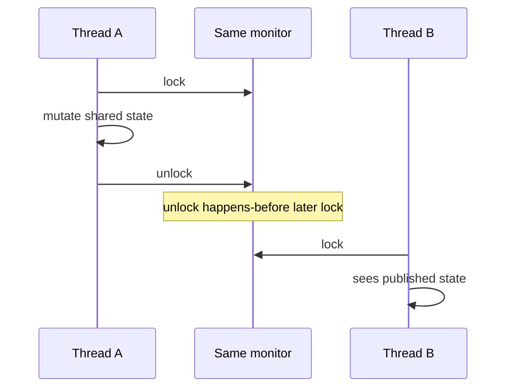

# synchronized

> [!summary] За 30 секунд
> `synchronized` защищает критическую секцию monitor lock: одновременно её выполняет один поток, а unlock/последующий lock того же monitor создают happens-before и обеспечивают visibility.

## Интуиция: переговорная с одним ключом

Есть переговорная и один ключ:

- войти может только сотрудник, который получил ключ;
- пока он внутри, остальные ждут;
- выходя, сотрудник оставляет на столе актуальные документы;
- следующий владелец ключа обязан увидеть опубликованное состояние.

Аналогия объясняет две независимые гарантии:

1. **Mutual exclusion** — один поток в критической секции.
2. **Visibility** — изменения предыдущего владельца monitor видны следующему.

## Monitor принадлежит объекту

```java
synchronized (lock) {
    // critical section
}
```

Ключевым является не слово `synchronized`, а **какой именно объект используется как monitor**.

Плохо:

```java
void writer() {
    synchronized (new Object()) {
        shared++;
    }
}
```

Каждый вызов создаёт новый monitor, поэтому координации между потоками нет.

## Instance method

```java
public synchronized void increment() {
    counter++;
}
```

Эквивалентный monitor — `this`.

## Static method

```java
public static synchronized void reset() {
    counter = 0;
}
```

Monitor — `ClassName.class`, а не экземпляр.

## Synchronized block

```java
private final Object lock = new Object();

public void increment() {
    synchronized (lock) {
        counter++;
    }
}
```

Block позволяет явно выбрать lock и сократить critical section.

## Почему visibility работает



Если writer и reader используют разные monitors, этого edge нет.

## Reentrancy

`synchronized` reentrant: поток, уже владеющий monitor, может повторно войти в synchronized section того же monitor.

```java
synchronized void outer() {
    inner();
}

synchronized void inner() {
    // тот же this monitor
}
```

Без reentrancy вызов `outer()` → `inner()` заблокировал бы сам себя.

## Правильная защита инварианта

```java
class Account {
    private int balance;

    Account(int balance) {
        this.balance = balance;
    }

    synchronized boolean withdraw(int amount) {
        if (amount <= 0 || balance < amount) {
            return false;
        }
        balance -= amount;
        return true;
    }

    synchronized int balance() {
        return balance;
    }
}
```

Проверка и изменение баланса находятся под одним monitor и образуют одну logical transaction.

## Частая ошибка: часть методов защищена, часть нет

```java
synchronized void increment() {
    counter++;
}

int current() {
    return counter; // нет того же synchronization protocol
}
```

Исправление: все accesses к invariant должны соблюдать единый protocol, либо поле публикуется другим корректным способом.

## Lock scope

Слишком широкая секция:

```java
synchronized (lock) {
    callRemoteService();
    updateState();
}
```

Remote call может удерживать monitor сотни миллисекунд. Лучше сначала выполнить независимую I/O работу, затем кратко захватить lock для изменения общего состояния — если business invariant это допускает.

## synchronized vs volatile

| Требование | volatile | synchronized |
|---|---:|---:|
| Visibility | да | да |
| Ordering boundary | да | да |
| Mutual exclusion | нет | да |
| Compound operation | нет | да |
| Может блокировать | нет | да |
| Несколько полей под одним invariant | неудобно | да |

## Ограничения

- нет timeout на ожидание monitor;
- нет `tryLock()`;
- нельзя interrupt waiting for monitor acquisition обычным способом;
- один monitor может стать contention hotspot;
- неправильный lock ordering может создать deadlock.

Когда нужны дополнительные возможности — [[ReentrantLock]].

## Interview Answer

> `synchronized` использует monitor объекта. Он даёт mutual exclusion и memory visibility: unlock одного потока happens-before последующему lock того же monitor. Корректность зависит от того, что все обращения к защищаемому invariant используют один synchronization protocol.

## Memory Hook

> **Same state — same lock — same protocol.**

## Sources

- [[98_SOURCES/Java Concurrency Sources|Primary Java Concurrency Sources]]
