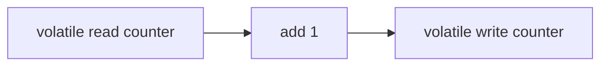

# volatile

> [!summary] За 30 секунд
> `volatile` подходит, когда потоки должны видеть актуальное значение переменной и это значение обновляется независимой записью. Он создаёт happens-before edge, но не превращает составные операции в атомарные.

## Интуиция: общая сигнальная лампа

Обычная переменная похожа на заметку в личной тетради сотрудника. `volatile` похож на общую сигнальную лампу на стене:

- когда один сотрудник переключил лампу, другие обязаны учитывать новое состояние;
- лампа хорошо передаёт простой сигнал;
- лампа не выполняет за сотрудников многошаговую банковскую операцию.

Отсюда главное правило:

> `volatile` хорош для **state signal**, но не для **compound state transition**.

## Что гарантирует

Для volatile variable:

- write публикуется другим потокам;
- subsequent read получает значение согласно synchronization order;
- действия до volatile write могут стать видимыми после соответствующего volatile read благодаря happens-before transitivity;
- компилятор и CPU не могут свободно переставлять операции через volatile boundary так, чтобы нарушить JMM.

## Что не гарантирует

- mutual exclusion;
- atomicity `x++`, `check-then-act`, `read-modify-write`;
- согласованность нескольких независимых variables как одной транзакции;
- fairness;
- отсутствие race condition в бизнес-логике.

## Хороший пример: cancellation flag

```java
class Worker implements Runnable {
    private volatile boolean cancelled;

    void cancel() {
        cancelled = true;
    }

    @Override
    public void run() {
        while (!cancelled) {
            doOneUnitOfWork();
        }
    }

    private void doOneUnitOfWork() {
        // короткая операция
    }
}
```

Здесь есть один independent state flag. Запись не зависит от предыдущего значения.

## Плохой пример: volatile counter

```java
private volatile int counter;

void increment() {
    counter++;
}
```

Концептуальное разложение:



Между A и C другой поток может выполнить тот же sequence.

Исправления:

```java
private final AtomicInteger counter = new AtomicInteger();

void increment() {
    counter.incrementAndGet();
}
```

или:

```java
private int counter;

synchronized void increment() {
    counter++;
}
```

## Pattern: immutable snapshot + volatile reference

```java
final class Limits {
    private final int maxRequests;
    private final int timeoutMs;

    Limits(int maxRequests, int timeoutMs) {
        this.maxRequests = maxRequests;
        this.timeoutMs = timeoutMs;
    }

    int maxRequests() {
        return maxRequests;
    }

    int timeoutMs() {
        return timeoutMs;
    }
}

class LimitsRegistry {
    private volatile Limits current = new Limits(100, 1_000);

    Limits current() {
        return current;
    }

    void replace(Limits next) {
        current = next;
    }
}
```

Это сильный pattern:

- snapshot immutable;
- читатели не блокируются;
- writer заменяет ссылку одной операцией;
- читатель видит либо старый целый snapshot, либо новый целый snapshot.

## Одно поле против нескольких

Проблемно:

```java
volatile String host;
volatile int port;
```

Reader может наблюдать `host` из новой конфигурации и `port` из старой.

Предпочтительно:

```java
volatile Endpoint endpoint;
```

где `Endpoint` — immutable aggregate.

## Double-checked locking

Корректный современный вариант требует volatile reference:

```java
class Singleton {
    private static volatile Singleton instance;

    static Singleton getInstance() {
        Singleton local = instance;
        if (local == null) {
            synchronized (Singleton.class) {
                local = instance;
                if (local == null) {
                    local = new Singleton();
                    instance = local;
                }
            }
        }
        return local;
    }
}
```

Однако на практике часто проще использовать enum singleton, static holder или dependency injection container.

## Когда выбирать volatile

Выбирай, если одновременно верны условия:

1. Есть одна переменная состояния или immutable snapshot reference.
2. Новое значение не зависит от текущего через составную операцию.
3. Между несколькими полями не нужно поддерживать invariant.
4. Не требуется mutual exclusion.

## Когда не выбирать

- баланс счёта;
- количество мест с условием `if (available > 0) available--`;
- обновление нескольких связанных полей;
- очередь задач;
- сложная state machine с несколькими writers без дополнительного protocol.

## Interview Answer

> `volatile` обеспечивает visibility и ordering через happens-before между write и subsequent read той же variable. Он не даёт mutual exclusion, поэтому подходит для флагов и публикации immutable snapshots, но не делает `counter++` или check-then-act атомарными.

## Exam Trap

> [!question] Является ли чтение и запись volatile variable атомарной?

> [!answer]- Ответ
> Отдельные чтение и запись выполняются как atomic variable access в смысле JMM, но последовательность из нескольких таких accesses не становится одной атомарной операцией.

## Memory Hook

> **Volatile = visible signal, not protected transaction.**

## Sources

- [[98_SOURCES/Java Concurrency Sources|Primary Java Concurrency Sources]]
