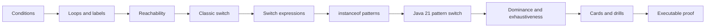

# Java Control Flow and Pattern Switch

> [!summary]
> Canonical hub for `JAVA-B02`. Control flow is split into eight atomic notes so conditions, loops, reachability and each switch model can be learned and reviewed independently. Java 21-only pattern-switch semantics are isolated from the shared Java 17 baseline.

## Start here

| Step | Atomic concept | Main outcome |
|---:|---|---|
| 1 | [[10_CONCEPTS/Java/Core/Java Conditions and Definite Assignment]] | validate boolean conditions and local assignment paths |
| 2 | [[10_CONCEPTS/Java/Core/Java Loops Transfers and Labels]] | trace loop execution points and transfer targets |
| 3 | [[10_CONCEPTS/Java/Core/Java Reachability Rules]] | identify structurally unreachable statements |
| 4 | [[10_CONCEPTS/Java/Core/Java Classic Switch]] | solve selector, labels, fall-through and arrow rules |
| 5 | [[10_CONCEPTS/Java/Core/Java Switch Expressions]] | reason about `yield`, typing and exhaustiveness |
| 6 | [[10_CONCEPTS/Java/Core/Java Pattern Matching for instanceof]] | apply Java 17 type patterns and flow scoping |
| 7 | [[10_CONCEPTS/Java/Core/Java 21 Pattern Switch]] | use final Java 21 patterns, guards and null labels |
| 8 | [[10_CONCEPTS/Java/Core/Java Switch Dominance and Exhaustiveness]] | prove label order, match-all and sealed coverage |

## Learning path



## Version boundary

```text
Java 17
  conditions, loops and transfers
  classic switch
  final switch expressions
  final instanceof type patterns
  pattern switch excluded from normal exam assumptions

Java 21
  all shared Java 17 rules
  final pattern switch
  case null
  when guards
  broader reference selectors
  dominance and enhanced-statement exhaustiveness
  qualified enum constants
```

## Choose a study mode

### Learn the route

1. Complete the eight atomic notes in sequence.
2. Run active recall at the end of each note.
3. Use the matching card batch after each group.
4. Complete shared drills before Java 21-only drills.
5. Predict which negative source should fail before running the lab.

### Review a weak concept

| Confusion | Open |
|---|---|
| Boolean, dangling else or locals | [[10_CONCEPTS/Java/Core/Java Conditions and Definite Assignment]] |
| loop order, `break` or `continue` | [[10_CONCEPTS/Java/Core/Java Loops Transfers and Labels]] |
| unreachable statements | [[10_CONCEPTS/Java/Core/Java Reachability Rules]] |
| selector types or fall-through | [[10_CONCEPTS/Java/Core/Java Classic Switch]] |
| `yield` or expression exhaustiveness | [[10_CONCEPTS/Java/Core/Java Switch Expressions]] |
| pattern-variable scope | [[10_CONCEPTS/Java/Core/Java Pattern Matching for instanceof]] |
| `when`, `case null` or Java 21 boundary | [[10_CONCEPTS/Java/Core/Java 21 Pattern Switch]] |
| dominated labels or sealed coverage | [[10_CONCEPTS/Java/Core/Java Switch Dominance and Exhaustiveness]] |

### Exam drill mode

- [[30_CERTIFICATIONS/Java/JAVA-B02/JAVA-B02A Control Flow Cards|20 control-flow cards]]
- [[30_CERTIFICATIONS/Java/JAVA-B02/JAVA-B02B Switch Cards|20 switch cards]]
- [[30_CERTIFICATIONS/Java/JAVA-B02/JAVA-B02C Pattern Switch Cards|20 pattern-switch cards]]
- [[30_CERTIFICATIONS/Java/JAVA-B02/JAVA-B02 Drills|20 compile/output drills]]

### Evidence mode

- [[50_LABS/Java/JAVA-B02/README|JDK 17/21 proof and negative bank]]
- shared source compiles and runs in both lanes;
- Java 21 source proves final pattern switch;
- 11 controlled negative sources must fail in their target lanes.

## Reliable exam algorithm

1. Fix the Java version.
2. Validate grammar and condition or selector compatibility.
3. Check definite assignment and reachability.
4. Classify switch as classic statement, expression or enhanced statement.
5. Check duplicate labels and dominance.
6. Prove exhaustiveness.
7. Resolve null independently.
8. Trace transfers and selected rules.
9. Compute exact output last.

## Route artifacts

| Role | Artifact |
|---|---|
| Roadmap | [[30_CERTIFICATIONS/Java/JAVA-B02/JAVA-B02 Roadmap]] |
| Control-flow cards | [[30_CERTIFICATIONS/Java/JAVA-B02/JAVA-B02A Control Flow Cards]] |
| Switch cards | [[30_CERTIFICATIONS/Java/JAVA-B02/JAVA-B02B Switch Cards]] |
| Pattern-switch cards | [[30_CERTIFICATIONS/Java/JAVA-B02/JAVA-B02C Pattern Switch Cards]] |
| Drills | [[30_CERTIFICATIONS/Java/JAVA-B02/JAVA-B02 Drills]] |
| Lab | [[50_LABS/Java/JAVA-B02/README]] |
| Java 17 sources | [[98_SOURCES/Java SE 17 1Z0-829 Sources]] |
| Java 21 sources | [[98_SOURCES/Java SE 21 1Z0-830 Sources]] |
| Java dashboard | [[00_HOME/Java Learning Dashboard]] |
| Visual map | [[01_MAPS/Java Certification Routes.canvas]] |

## Previous and next

- **Prerequisite route:** [[30_CERTIFICATIONS/Java/JAVA-B01/JAVA-B01 Roadmap]]
- **Next planned route:** `JAVA-B03 — Object Model, Records and Record Patterns`
