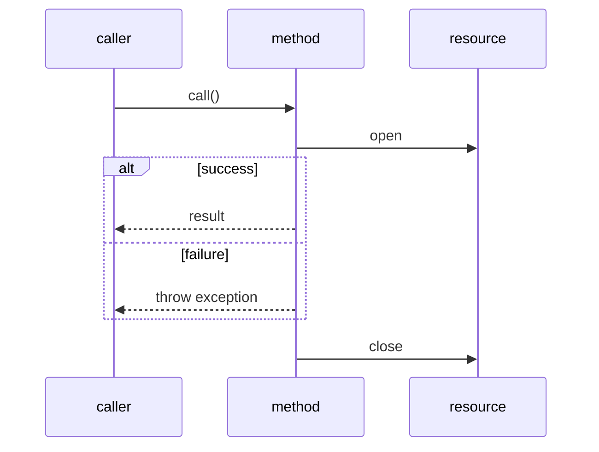

# Java Exceptions and Resource Safety

> [!summary]
> Exception — объект, который сообщает: текущий метод не может завершить обычный путь. Java прекращает текущий участок выполнения, ищет подходящий handler и по пути освобождает ресурсы согласно правилам `finally` и try-with-resources.

## Один рисунок всего маршрута



## Простое объяснение

Представь выполнение метода как поезд по обычному маршруту. Exception не является запасным обычным результатом. Это сигнал, что поезд не может продолжить выбранный путь.

Граница аналогии: Java не «телепортируется». Runtime последовательно завершает активные method frames, пока не найдёт подходящий `catch`.

## Шесть вопросов для любого exception-кода

1. Где exception создаётся или возникает?
2. Каков его runtime type?
3. Какой `catch` является первым совместимым?
4. Какие method frames будут завершены?
5. Какие `finally` и `close()` выполнятся?
6. Какой exception останется primary, а какие станут suppressed?

## Карта понятий

| Тема | Главная идея |
|---|---|
| [[10_CONCEPTS/Java/Exceptions/Java Why Programs Fail and Exception Flow]] | normal path и exceptional path |
| [[10_CONCEPTS/Java/Exceptions/Java Checked Unchecked Exceptions and Errors]] | compiler contract и hierarchy |
| [[10_CONCEPTS/Java/Exceptions/Java Try Catch Finally]] | handler selection и cleanup |
| [[10_CONCEPTS/Java/Exceptions/Java Throw Throws and Custom Exceptions]] | создание и объявление failure contract |
| [[10_CONCEPTS/Java/Exceptions/Java Multi-catch and Precise Rethrow]] | несколько типов и точный rethrow |
| [[10_CONCEPTS/Java/Exceptions/Java Try-with-resources and Suppressed Exceptions]] | deterministic cleanup и competing failures |

## Exception hierarchy — минимальная версия

```text
Throwable
├── Error
└── Exception
    ├── RuntimeException
    └── checked exception families
```

Не делай вывод «checked = серьёзная». Checked означает, что compiler требует catch или declaration. RuntimeException обычно сообщает о programming/precondition failure, но проектирование зависит от API boundary.

## Главный design principle

Exception должен сохранять информацию:

```java
throw new OrderImportException("Cannot import " + file, cause);
```

Плохо:

```java
throw new RuntimeException("failed");
```

Полезный exception отвечает:

- какая операция не выполнена;
- какой business/infrastructure context важен;
- какая исходная причина сохранена;
- может ли caller восстановиться или повторить действие.

## Когда exception не нужен

Не используй exceptions для ожидаемого частого выбора:

```java
if (age < 18) {
    return ValidationResult.rejected("adult required");
}
```

Exception уместнее, когда обычный contract не может быть выполнен или нарушен обязательный invariant.

## Практика

1. [[30_CERTIFICATIONS/Java/JAVA-B04/JAVA-B04 Cards]]
2. [[30_CERTIFICATIONS/Java/JAVA-B04/JAVA-B04 Drills]]
3. [[40_PRODUCTION_CASES/Java/Java Exceptions Production Cases]]
4. [[50_LABS/Java/JAVA-B04/README]]

## Navigation

- [[30_CERTIFICATIONS/Java/JAVA-B04/JAVA-B04 Roadmap]]
- [[00_HOME/Java Beginner Learning Path]]
- [[00_HOME/Java Learning Dashboard]]
- [[98_SOURCES/Java SE 17 1Z0-829 Sources]]
- [[98_SOURCES/Java SE 21 1Z0-830 Sources]]
