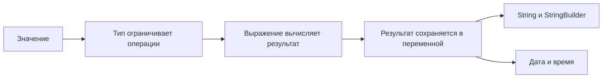

# Java B01 Beginner Bridge

> [!summary]
> B01 отвечает на вопрос: **какие значения умеет хранить Java и как она вычисляет новые значения**.

## Простая карта



## 1. Тип — это набор разрешённых действий

```java
int count = 5;
String name = "Amina";
```

С `int` можно выполнять арифметику. У `String` можно получить длину и части текста.

Неправильная модель:

> Тип — это только подпись рядом с переменной.

Правильнее:

> Тип определяет допустимые значения, операции и результат выражений.

## 2. Java сначала вычисляет выражение

```java
byte a = 10;
byte b = 20;
int sum = a + b;
```

Хотя оба операнда `byte`, арифметическое выражение вычисляется как `int`.

Порядок мышления:

```text
типы операндов
→ promotion
→ тип результата
→ присваивание
```

## 3. String — значение текста, StringBuilder — изменяемый объект

```java
String text = "A";
text.concat("B");
System.out.println(text); // A
```

`String` не изменился. Метод вернул новый String, но программа его не сохранила.

```java
StringBuilder builder = new StringBuilder("A");
builder.append("B");
System.out.println(builder); // AB
```

`StringBuilder` изменил своё состояние.

## 4. `==` и `equals`

```java
String a = new String("java");
String b = new String("java");
```

- `a == b` спрашивает: это одна и та же ссылка?
- `a.equals(b)` спрашивает: одинаковое ли текстовое значение?

## 5. Дата, локальное время и момент — разные сущности

```text
LocalDate       календарная дата
LocalTime       время без даты
LocalDateTime   дата и время без зоны
Instant         точка на временной шкале UTC
ZonedDateTime   локальное время + правила зоны
```

Пример: `2026-03-29 02:30` может не существовать в конкретной зоне из-за перехода на летнее время.

## Практика перед основным маршрутом

### Задача 1

```java
int x = 2;
System.out.println(x + 3 + "4");
```

> [!answer]- Ответ
> `54`: сначала `2 + 3`, затем конкатенация с String.

### Задача 2

```java
String value = "A";
value.replace("A", "B");
System.out.println(value);
```

> [!answer]- Ответ
> `A`: String immutable, возвращённый результат не сохранён.

### Задача 3

Что точнее описывает «24 реально прошедших часа» — `Period.ofDays(1)` или `Duration.ofHours(24)`?

> [!answer]- Ответ
> `Duration.ofHours(24)`. Period выражает календарное количество.

## Дальше

1. [[10_CONCEPTS/Java/Core/Java Primitive Values and Literals]]
2. [[10_CONCEPTS/Java/Core/Java Numeric Promotion and Casting]]
3. [[10_CONCEPTS/Java/Core/Java String Identity and Operations]]
4. [[10_CONCEPTS/Java/Core/Java Local Date-Time Types]]
5. [[30_CERTIFICATIONS/Java/JAVA-B01/JAVA-B01 Roadmap]]

## Navigation

- [[00_HOME/Java Beginner Learning Path]]
- [[10_CONCEPTS/Java/Foundations/Java Mental Model for Beginners]]
- [[10_CONCEPTS/Java/Foundations/Java B02 Beginner Bridge]]
