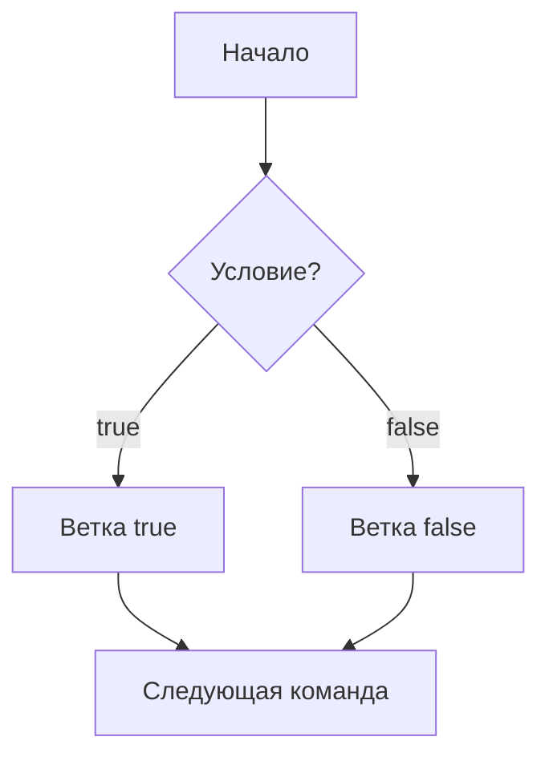

# Java B02 Beginner Bridge

> [!summary]
> B02 отвечает на вопрос: **какую команду программа выполнит следующей**.

## Поток как маршрут



Программа не выполняет все ветки одновременно. Она выбирает путь.

## 1. `if`

```java
int score = 75;

if (score >= 50) {
    System.out.println("passed");
} else {
    System.out.println("try again");
}
```

Трассировка:

| Шаг | Проверка | Результат |
|---:|---|---|
| 1 | `75 >= 50` | `true` |
| 2 | выполняется первая ветка | `passed` |
| 3 | `else` пропускается | — |

## 2. Цикл — повторение с условием остановки

```java
for (int i = 1; i <= 3; i++) {
    System.out.println(i);
}
```

| Итерация | i до тела | Печать | i после update |
|---:|---:|---:|---:|
| 1 | 1 | 1 | 2 |
| 2 | 2 | 2 | 3 |
| 3 | 3 | 3 | 4 |

При `i == 4` условие ложно, цикл заканчивается.

## 3. `break`, `continue`, `return`

```text
break     выйти из цикла или switch
continue  перейти к следующей итерации
return    завершить текущий метод
```

Они меняют поток выполнения по-разному.

## 4. `switch`

`switch` выбирает ветку по значению.

```java
int day = 2;
String name = switch (day) {
    case 1 -> "Monday";
    case 2 -> "Tuesday";
    default -> "Unknown";
};
```

Switch expression обязан получить результат для всех допустимых путей либо завершиться exception.

## 5. Pattern matching

```java
Object value = "java";

if (value instanceof String text) {
    System.out.println(text.length());
}
```

Java одновременно:

1. проверяет тип;
2. создаёт переменную `text` только там, где проверка доказана.

## 6. Почему compiler запрещает некоторые ветки

```java
if (true) {
    return;
}
System.out.println("unreachable");
```

Compiler анализирует, может ли выполнение дойти до statement. Недостижимый код часто означает логическую ошибку.

## Типичная ошибка начинающего

> Цикл `while` проверит условие после первого выполнения.

Это неверно для `while`: он проверяет условие **до** тела. `do-while` выполняет тело минимум один раз.

## Практика

### Задача 1

```java
int x = 0;
while (x < 3) {
    x++;
}
System.out.println(x);
```

> [!answer]- Ответ
> `3`.

### Задача 2

```java
for (int i = 0; i < 4; i++) {
    if (i == 2) continue;
    System.out.print(i);
}
```

> [!answer]- Ответ
> `013`: iteration с `i == 2` пропускает печать.

### Задача 3

Почему `case Object o` перед `case String s` делает String-case недостижимым?

> [!answer]- Ответ
> Любой String уже подходит под Object, поэтому более широкая ветка забирает все значения раньше.

## Дальше

1. [[10_CONCEPTS/Java/Core/Java Conditions and Definite Assignment]]
2. [[10_CONCEPTS/Java/Core/Java Loops Transfers and Labels]]
3. [[10_CONCEPTS/Java/Core/Java Classic Switch]]
4. [[10_CONCEPTS/Java/Core/Java Switch Expressions]]
5. [[10_CONCEPTS/Java/Core/Java 21 Pattern Switch]]
6. [[30_CERTIFICATIONS/Java/JAVA-B02/JAVA-B02 Roadmap]]

## Navigation

- [[00_HOME/Java Beginner Learning Path]]
- [[10_CONCEPTS/Java/Foundations/Java B01 Beginner Bridge]]
- [[10_CONCEPTS/Java/Foundations/Java B03 Beginner Bridge]]
