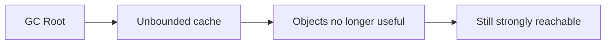
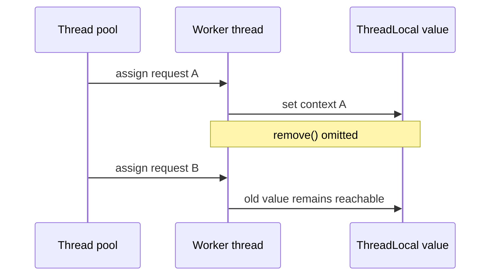

# Memory Leaks

> [!summary] За 30 секунд
> Java memory leak — это не «объект забыли удалить вручную», а ситуация, когда application больше не нуждается в объектах, но они остаются strongly reachable от GC roots. Garbage Collector освобождает только unreachable objects и не понимает business usefulness.

## 1. Reachability против usefulness

```text
GC question:
Достижим ли object от GC root?

Application question:
Нужен ли object бизнес-логике?
```

Если ответы разные, возможна leak:



## 2. Основные GC roots

Типичные roots:

- active thread stacks;
- static fields;
- JNI references;
- class loaders;
- JVM internal structures.

Leak analysis ищет retention path от большого object graph к root.

## 3. Unbounded collections

```java
private static final Map<String, Result> CACHE = new ConcurrentHashMap<>();

void remember(String key, Result result) {
    CACHE.put(key, result);
}
```

Если нет eviction, TTL или lifecycle cleanup, map растёт до memory pressure.

Production cache требует:

- maximum size/weight;
- expiration или explicit invalidation;
- metrics;
- ownership;
- bounded key cardinality.

## 4. ThreadLocal leak в thread pool

```java
static final ThreadLocal<RequestContext> CONTEXT = new ThreadLocal<>();

void process(Request request) {
    CONTEXT.set(buildContext(request));
    handle(request);
}
```

Worker pool thread живёт дольше request. Его `ThreadLocalMap` удерживает value после завершения обработки.

Правильно:

```java
try {
    CONTEXT.set(buildContext(request));
    handle(request);
} finally {
    CONTEXT.remove();
}
```



## 5. Listener и callback registrations

```java
publisher.addListener(component::onEvent);
```

Если publisher живёт дольше component, listener reference удерживает component и весь связанный object graph.

Нужен symmetric lifecycle:

```java
publisher.removeListener(listener);
```

или registration handle:

```java
try (Subscription subscription = publisher.subscribe(listener)) {
    // bounded lifecycle
}
```

## 6. ClassLoader leaks

Application server, plugin system или hot reload может создавать новый class loader, но старый остаётся reachable через:

- static registry;
- active thread;
- `ThreadLocal`;
- JDBC driver registration;
- logging framework;
- timer task.

Один retained class loader удерживает все loaded classes и static state соответствующего deployment.

## 7. Resource leak против heap leak

Не вся leak проявляется в heap:

```text
heap objects
file descriptors
sockets
DB connections
threads
native buffers
direct memory
```

Например, незакрытый stream может создать file-descriptor exhaustion без большого Java heap.

Используйте try-with-resources:

```java
try (InputStream input = resource.getInputStream()) {
    return parse(input);
}
```

## 8. Symptoms

Типичные признаки:

- old-generation occupancy растёт после каждого GC;
- GC pauses учащаются;
- heap не возвращается к стабильному baseline;
- cache size растёт без bound;
- thread count или open files растут;
- OOM появляется только после длительной работы;
- restart временно решает проблему.

Один высокий heap usage ещё не доказывает leak: это может быть legitimate live set или недостаточный heap sizing.

## 9. Диагностический процесс

```text
1. Подтвердить monotonic growth
2. Снять heap histogram
3. Снять heap dump
4. Найти dominators
5. Найти retention path до GC root
6. Связать retained graph с lifecycle owner
7. Исправить ownership/bounds
8. Повторить load test
```

Полезные инструменты:

- `jcmd GC.class_histogram`;
- heap dump;
- Eclipse MAT;
- Java Flight Recorder;
- native memory tracking;
- application metrics.

## 10. Dominator tree

Dominator — object, через который проходит каждый path к удерживаемому graph. Большой retained size у dominator часто указывает на настоящий owner:

```text
ConcurrentHashMap
    ↓
1,000,000 cache entries
    ↓
large DTO graphs
```

Нужно исправлять owner и lifecycle, а не отдельный leaf object.

## 11. Weak references — не универсальное исправление

`WeakHashMap` или `WeakReference` полезны только когда semantics действительно допускают исчезновение entries при GC.

Они не заменяют:

- bounded cache;
- explicit lifecycle;
- close/unregister;
- correct ownership.

GC pressure не должен становиться business eviction policy случайно.

## 12. Production prevention

- назначать owner каждого long-lived collection;
- задавать bounds и TTL;
- закрывать resources;
- удалять `ThreadLocal` в `finally`;
- отписывать listeners;
- ограничивать thread creation;
- измерять cardinality и retained state;
- проводить soak tests, а не только короткие benchmarks.

## 13. Interview answer

> Java leak возникает, когда ненужные application objects остаются reachable от GC roots. Частые причины — unbounded caches, ThreadLocal в pools, listeners, static registries и class-loader retention. Диагностика строится на heap growth, dominator tree и retention path; исправление — ownership, bounded lifetime и cleanup, а не «запустить GC чаще».

## Memory Hook

> **GC удаляет unreachable, а не useless.**

## Sources

- [[98_SOURCES/Java Concurrency Sources|Java concurrency and JVM diagnostic sources]]
