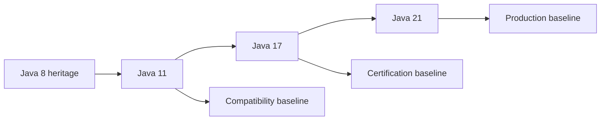
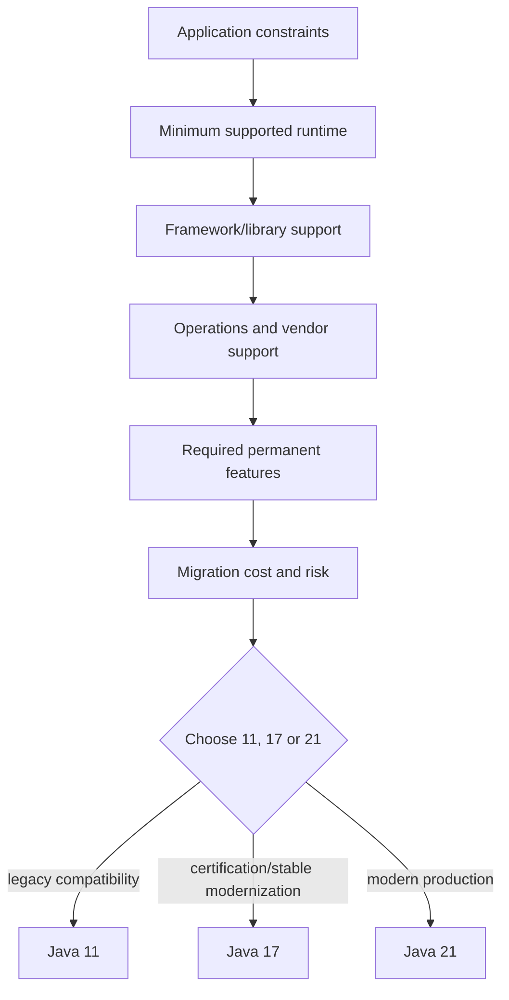

# Java 11, 17 and 21 LTS Evolution

> [!summary]
> Java knowledge is cumulative but not interchangeable. Java 11 is the enterprise compatibility baseline, Java 17 is the `1Z0-829` language/API baseline, and Java 21 is the modern production baseline. Correct reasoning requires knowing when a feature became permanent, when an API is preview/incubator, and which migration risks change runtime behavior even when source code still compiles.

# 1. Cumulative model



Java 21 contains the permanent platform features inherited from Java 17 and Java 11, but exam and migration answers must use the semantics of the named target release.

# 2. Feature-state taxonomy

| State | Meaning | Usage rule |
|---|---|---|
| Permanent | Standard Java SE/JDK feature | Safe to teach as stable for that release. |
| Preview | Language/VM feature requiring preview enablement | Must be compiled and run with preview flags; can change or disappear. |
| Incubator | API/module still incubating | Requires explicit module access and can change incompatibly. |
| Experimental VM | Runtime feature not yet permanent | Treat as operational experiment, not stable contract. |
| Deprecated | Discouraged but still present | Teach replacement and migration path. |
| Deprecated for removal | Planned removal | Treat as active migration risk. |
| Removed | No longer in that JDK | Add dependency, replace API or redesign. |

Exam trap: presence in one JDK release does not imply permanent status.

# 3. Java 11 role

Java 11 is the first LTS after modularization and remains common in enterprise systems. Its practical significance is not only new APIs but the migration boundary from Java 8-era assumptions.

## Important Java 11 capabilities

```text
standard java.net.http HTTP Client
single-file source-code launch
var syntax in lambda parameters
Flight Recorder in the OpenJDK distribution
TLS 1.3
Nest-Based Access Control
Dynamic class-file constants
String and Files API additions
Predicate.not
Optional refinements
Epsilon GC
experimental ZGC
```

## Important Java 11 removals and migration risks

```text
Java Web Start and browser plugin removed
JavaFX no longer bundled
Java EE and CORBA modules removed
JAXB and JAX-WS no longer bundled
JRE image/distribution assumptions changed
JDK-internal API access becomes a migration concern
module-path/classpath boundaries matter
```

# 4. Java 17 role

Java 17 is the language and API baseline for `1Z0-829`. It includes the complete permanent evolution from 11 through 17, not only the JEPs listed on the JDK 17 release page.

## Permanent language features available by Java 17

```text
switch expressions
text blocks
records
pattern matching for instanceof
sealed classes
```

## Important API/runtime evolution by Java 17

```text
helpful NullPointerException messages
Stream.toList
Unix-domain socket channels
enhanced pseudo-random number generators
strong encapsulation of JDK internals
context-specific deserialization filters
new macOS/AArch64 support
```

## Removed/deprecated concerns by Java 17

```text
Nashorn removed
Pack200 removed
RMI Activation removed
experimental AOT/JIT compiler removed
Security Manager deprecated for removal
Applet API deprecated for removal
illegal reflective access workarounds become less viable
```

# 5. Java 21 role

Java 21 is the modern production LTS baseline. It adds permanent language and concurrency features while also containing preview/incubator APIs that must remain clearly separated.

## Permanent Java 21 features

```text
virtual threads
record patterns
pattern matching for switch
sequenced collections
Generational ZGC
Key Encapsulation Mechanism API
```

## Important inherited changes between 17 and 21

```text
UTF-8 becomes the default charset in JDK 18
Simple Web Server appears in JDK 18
expanded pattern matching development
runtime and GC refinements
observability improvements
```

## Preview/incubator in Java 21

Examples include APIs and language features that require exact status checking in JDK 21 documentation:

```text
structured concurrency preview
scoped values preview
string templates preview in JDK 21
Foreign Function and Memory API preview
Vector API incubator
```

Do not teach these as permanent Java 21 guarantees.

# 6. Language comparison

| Capability | Java 11 | Java 17 | Java 21 |
|---|---|---|---|
| `var` local variables | yes | yes | yes |
| `var` lambda parameters | yes | yes | yes |
| switch expressions | no | yes | yes |
| text blocks | no | yes | yes |
| records | no | yes | yes |
| sealed classes | no | yes | yes |
| pattern `instanceof` | no | yes | yes |
| record patterns | no | no | yes |
| pattern switch | no | preview in 17 | permanent in 21 |
| virtual threads | no | no | yes |
| sequenced collections | no | no | yes |

# 7. API comparison

## Strings and files

Java 11 introduces commonly used conveniences such as:

```java
"  ".isBlank();
"a\nb".lines();
"x".repeat(3);
Files.readString(path);
Files.writeString(path, content);
```

Later releases retain them and add other APIs, but the minimum runtime remains Java 11.

## HTTP Client

Java 11 standardizes `java.net.http.HttpClient` with synchronous and asynchronous request APIs.

```java
HttpClient client = HttpClient.newHttpClient();
HttpRequest request = HttpRequest.newBuilder(uri).GET().build();
CompletableFuture<HttpResponse<String>> future =
        client.sendAsync(request, HttpResponse.BodyHandlers.ofString());
```

The asynchronous path integrates with `CompletableFuture`; it does not imply virtual-thread execution.

## Collections

Java 21 introduces sequenced collection interfaces and first/last/reversed operations. Code compiled against these APIs cannot target Java 17 or 11 without adaptation.

# 8. Concurrency comparison

## Java 11

```text
platform threads
ExecutorService
ForkJoinPool
CompletableFuture
Flow API inherited from Java 9
concurrent collections
ThreadLocal
```

## Java 17

The same principal concurrency model is used for certification. Strong reasoning about JMM, happens-before, atomics, locks, executors and futures remains mandatory.

## Java 21

Virtual threads make thread-per-task practical for blocking I/O workloads.

```java
try (var executor = Executors.newVirtualThreadPerTaskExecutor()) {
    Future<String> future = executor.submit(() -> blockingCall());
    System.out.println(future.get());
}
```

Virtual threads do not remove downstream limits such as database pools, file descriptors, rate limits or memory pressure.

# 9. JVM and GC comparison

## Java 11

```text
G1 is the default collector
Epsilon available
ZGC experimental
Flight Recorder available
unified JVM logging
```

## Java 17

```text
ZGC and Shenandoah are mature low-pause options depending on distribution/platform
strong encapsulation affects agents/reflection
JFR/JMC are central diagnostic tools
```

## Java 21

```text
Generational ZGC available
virtual-thread observability matters
JFR/thread dumps need virtual-thread-aware interpretation
```

Collector choice must be based on latency, throughput, heap size, allocation rate and operational evidence.

# 10. Module and encapsulation progression

The module system exists before Java 11, but migrations often reach it at the 8→11 boundary.

```text
classpath permits broad visibility
module path introduces readability and exports
opens controls deep reflection
strong encapsulation limits internal JDK access
--add-opens is a migration bridge, not a long-term architecture
```

# 11. Compatibility dimensions

## Source compatibility

Can source code compile under the target compiler?

## Binary compatibility

Can previously compiled classes link and run?

## Behavioral compatibility

Does runtime behavior remain equivalent?

## Tooling compatibility

Do build plugins, agents, annotation processors and profilers support the target JDK?

## Operational compatibility

Do container images, GC flags, TLS defaults, charset, locale and observability behave as expected?

A migration can pass source compilation and still fail in the other dimensions.

# 12. `--release` versus `-source` and `-target`

`javac --release 11` constrains language level, generated bytecode target and accessible documented APIs to the selected release.

```bash
javac --release 11 Example.java
```

Using only `-source 11 -target 11` with a newer JDK can accidentally compile against newer APIs.

# 13. 8 → 11 migration path

```text
1 update build tool and plugins
2 run application on JDK 11 before recompilation
3 inventory JDK-internal and removed APIs with jdeps
4 add explicit JAXB/JAX-WS dependencies where needed
5 fix reflective-access warnings
6 verify TLS, locale, charset and GC behavior
7 compile with --release 11
8 run unit/integration/performance tests
9 update container/runtime packaging
```

# 14. 11 → 17 migration path

```text
1 update libraries that rely on deep JDK reflection
2 remove Nashorn/Pack200 assumptions
3 review strong encapsulation
4 replace obsolete VM flags
5 verify serialization filters and security behavior
6 compile with --release 17
7 test language/API modernization separately from runtime upgrade
8 compare GC/JFR evidence
```

# 15. 17 → 21 migration path

```text
1 upgrade build plugins and frameworks
2 run existing platform-thread code unchanged first
3 validate UTF-8 default and locale-sensitive behavior
4 adopt virtual threads only for suitable blocking workloads
5 preserve downstream concurrency limits
6 test ThreadLocal/context propagation
7 evaluate sequenced collection API usage
8 mark preview features explicitly
9 compare GC, JFR and startup evidence
```

# 16. Multi-release JAR boundary

A multi-release JAR can supply version-specific class implementations while retaining a lower baseline.

```text
META-INF/versions/17/...
META-INF/versions/21/...
```

This adds testing and packaging complexity. Prefer it only when one artifact must serve multiple runtimes and version-specific optimization is justified.

# 17. Preview-feature workflow

```bash
javac --release 21 --enable-preview Example.java
java --enable-preview Example
```

Both compile and runtime flags are required. Preview bytecode is tied to the release that produced it.

# 18. Production decision model



# 19. Common misconceptions

```text
Java 21 knowledge does not replace Java 17 exam semantics.
LTS does not mean every included feature is permanent.
Source compatibility does not prove runtime compatibility.
Virtual threads do not make blocking resources unlimited.
--add-opens is not a permanent module design.
A newer compiler without --release can leak newer APIs into older targets.
A preview feature can be changed or removed in a later release.
```

# 20. Required practical evidence

```text
compile common source with --release 11
compile Java 17 records/sealed/switch examples
compile Java 21 virtual-thread/pattern/sequenced examples
run migration diagnostics with jdeps
compare charset and locale behavior
capture JFR evidence
compare platform-thread and virtual-thread resource limits
```

# Related material

- [[00_HOME/Java 11 17 21 Complete Knowledge Program]]
- [[30_CERTIFICATIONS/Java/JAVA-LTS-B01/JAVA-LTS-B01 Roadmap]]
- [[30_CERTIFICATIONS/Java/JAVA-LTS-B01/JAVA-LTS-B01 Cards]]
- [[40_PRODUCTION_CASES/Java/Java 11 17 21 Migration Cases]]
- [[50_LABS/Java/JAVA-LTS-B01/README]]
- [[98_SOURCES/Java 11 17 21 Official Sources]]
