# Java 11, 17 and 21 Visual Deep Dive

> [!summary]
> Fifteen visual models for release roles, feature states, language/API evolution, migration, compatibility and runtime proof.

# 1. Cumulative LTS topology

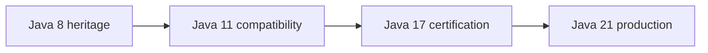

# 2. Feature-status decision

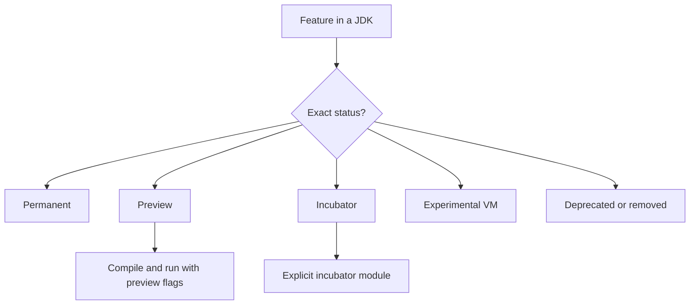

# 3. Version roles

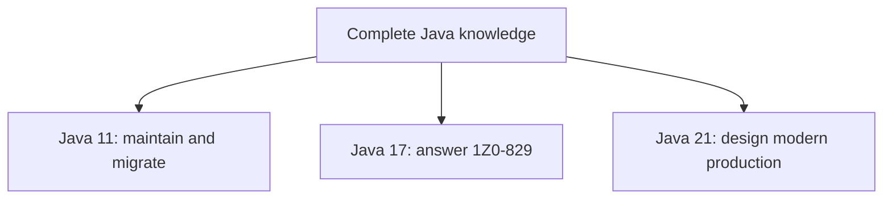

# 4. Java 8 to 11 migration

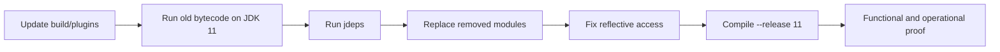

# 5. Java 11 to 17 migration

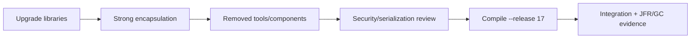

# 6. Java 17 to 21 migration

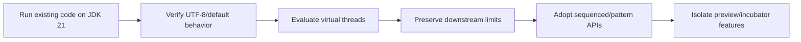

# 7. Language evolution

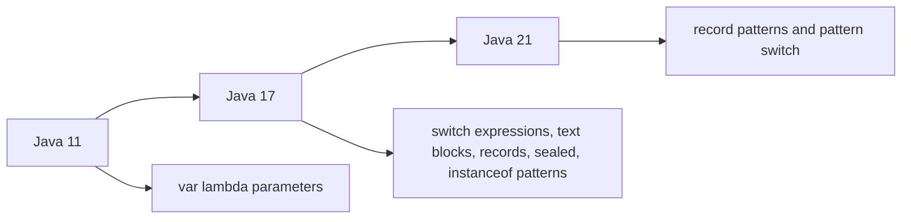

# 8. API evolution

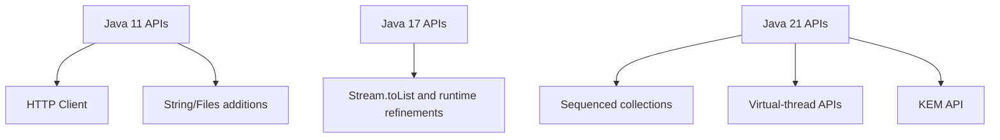

# 9. `--release` boundary

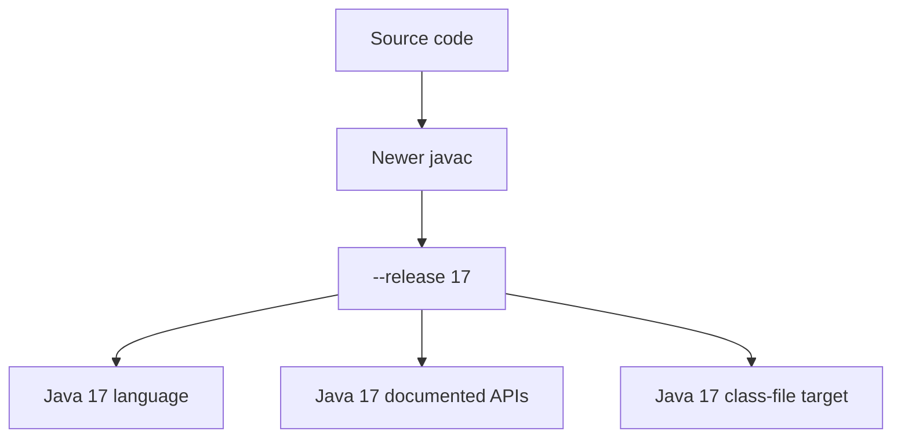

# 10. Compatibility dimensions

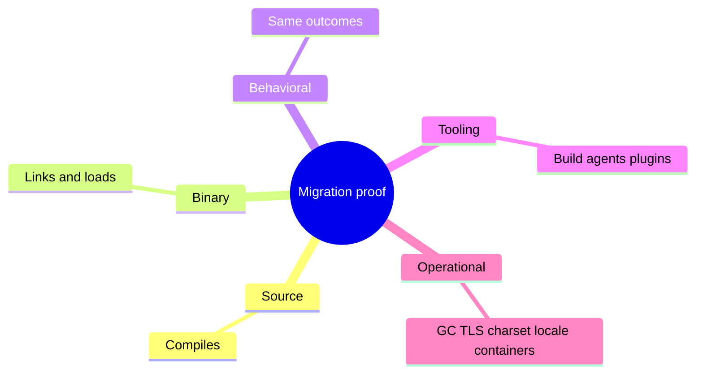

# 11. Virtual-thread capacity boundary

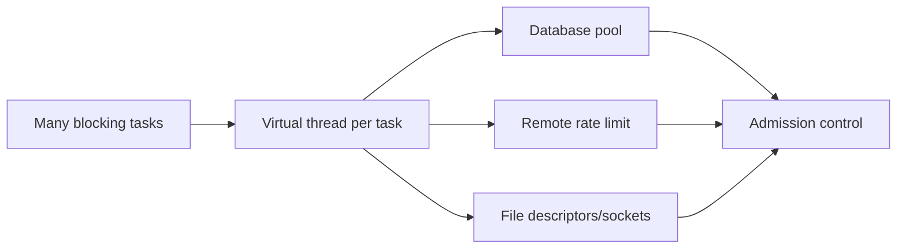

# 12. Module encapsulation progression

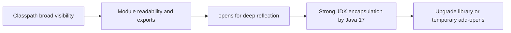

# 13. CI version matrix

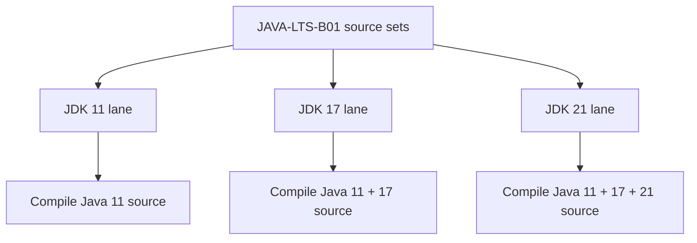

# 14. Java 17 exam boundary

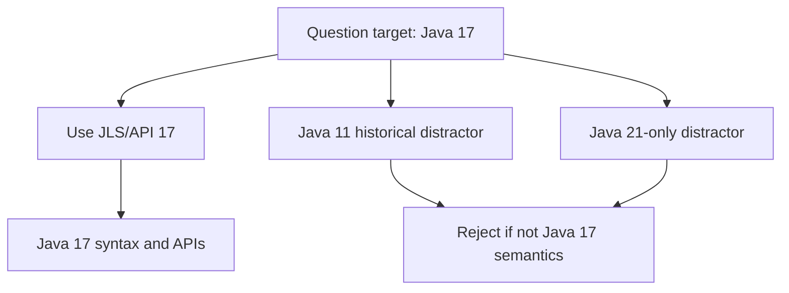

# 15. Runtime selection decision

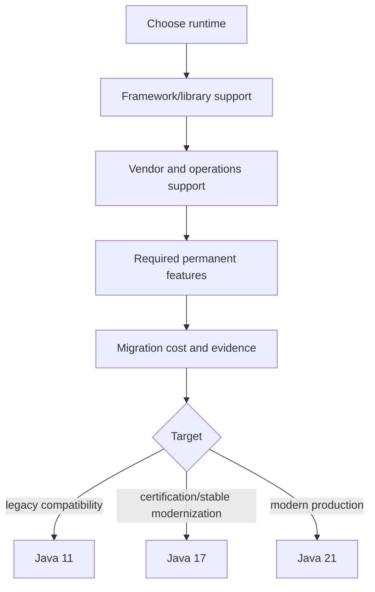

# Visual recall prompts

1. Reconstruct the three migration paths without notes.
2. Explain why `--release` covers more than `-source/-target`.
3. Draw the resource boundary around virtual threads.
4. Distinguish permanent, preview and incubator status.
5. Explain why a Java 17 exam answer must reject Java 21-only APIs.

# Related material

- [[10_CONCEPTS/Java/Versions/Java 11 17 21 LTS Evolution]]
- [[30_CERTIFICATIONS/Java/JAVA-LTS-B01/JAVA-LTS-B01 Roadmap]]
- [[30_CERTIFICATIONS/Java/JAVA-LTS-B01/JAVA-LTS-B01 Assessment]]
- [[50_LABS/Java/JAVA-LTS-B01/README]]
- [[98_SOURCES/Java 11 17 21 Official Sources]]
