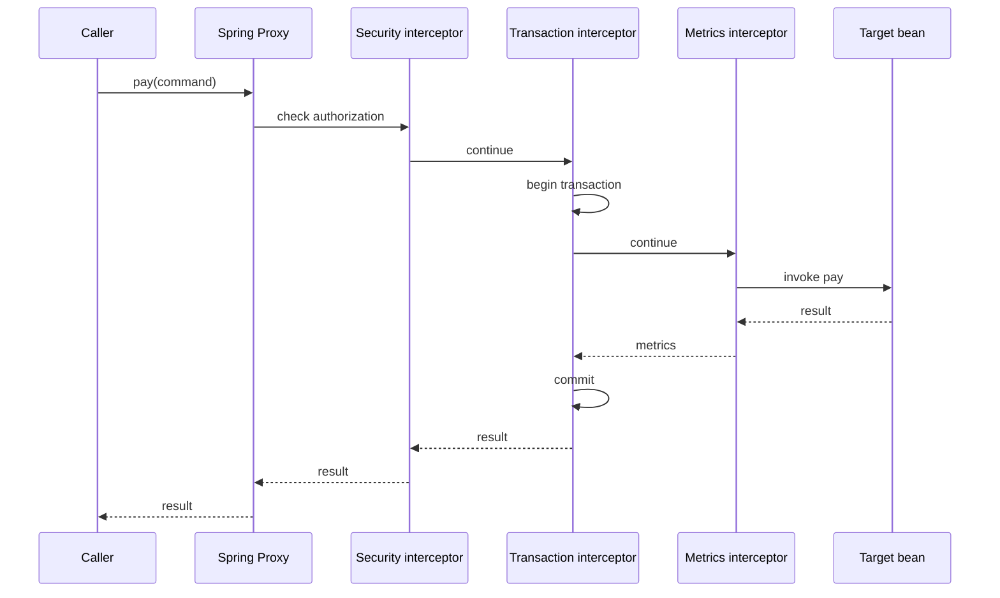
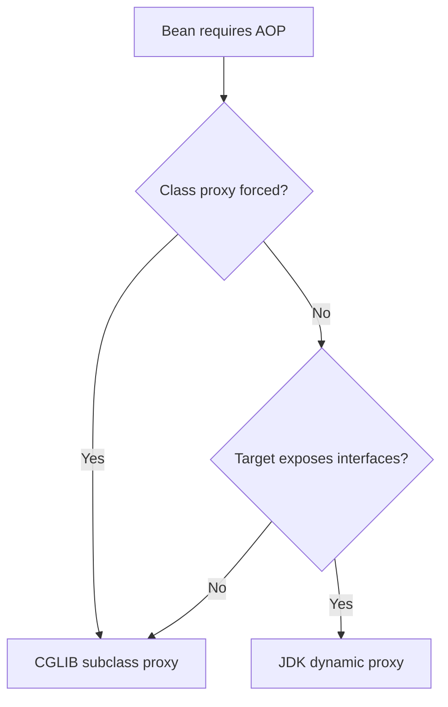
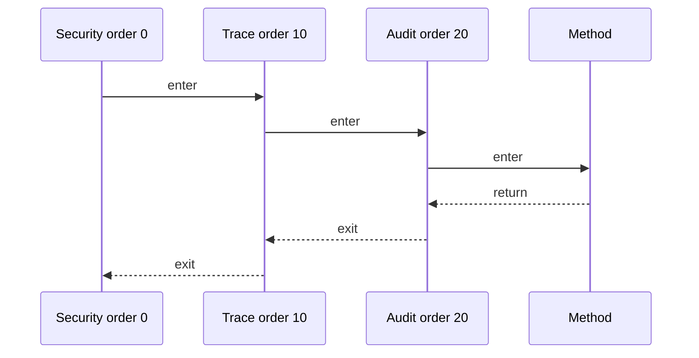

# Spring AOP Proxy Mechanics

> [!summary] За 30 секунд
> Spring AOP обычно оборачивает bean в proxy. Внешний вызов приходит в proxy, проходит interceptor/advisor chain и только затем достигает target. Внутренний вызов `this.otherMethod()` остаётся внутри target и обходит proxy, поэтому `@Transactional`, `@Async`, `@Cacheable` и method security могут не сработать.

## Главная ментальная модель



Сильный ответ об AOP должен всегда назвать:

1. caller;
2. proxy;
3. advisor/interceptor chain;
4. target;
5. method boundary;
6. условия, при которых proxy можно обойти.

---

# 1. Зачем нужен AOP

AOP выносит повторяющуюся инфраструктурную логику из business methods:

- transaction management;
- authorization;
- caching;
- asynchronous dispatch;
- retry;
- metrics;
- tracing;
- audit;
- rate limiting.

Плохо:

```java
public PaymentResult pay(PaymentCommand command) {
    checkPermission(command);
    Timer.Sample sample = startTimer();
    Transaction tx = beginTransaction();
    try {
        PaymentResult result = executePayment(command);
        commit(tx);
        audit(command, result);
        sample.stop();
        return result;
    } catch (RuntimeException error) {
        rollback(tx);
        sample.stop();
        throw error;
    }
}
```

С AOP business method может оставаться сфокусированным:

```java
@Transactional
@Timed
@PreAuthorize("hasAuthority('PAYMENT_EXECUTE')")
public PaymentResult pay(PaymentCommand command) {
    return executePayment(command);
}
```

> [!warning]
> AOP уменьшает повторение, но увеличивает количество неявных runtime-boundaries. Поэтому proxy diagnostics — часть профессиональной работы, а не аварийный трюк.

---

# 2. Термины без абстрактного тумана

## Aspect

Модуль cross-cutting concern. Например, аудит всех операций изменения лимита.

```java
@Aspect
@Component
class LimitAuditAspect {
}
```

## Join point

Точка выполнения, к которой может быть применён advice. В Spring AOP это прежде всего method execution на Spring bean.

## Pointcut

Правило выбора join points.

```java
@Pointcut("execution(* kz.bank.payment..*Service.*(..))")
void paymentServiceOperation() {
}
```

## Advice

Код, который выполняется относительно selected join point:

- before;
- after returning;
- after throwing;
- after/finally;
- around.

## Advisor

Пара `Pointcut + Advice`. На runtime Spring строит цепочку подходящих advisors для конкретного method invocation.

## Target

Исходный business object.

## Proxy

Object, который получает вызов caller и применяет advisors перед делегированием target.

## Weaving

Связывание aspect logic с join points. Spring AOP использует runtime proxies. AspectJ может выполнять compile-time или load-time weaving и не ограничен только proxy-boundary.

---

# 3. Реальный around advice

```java
@Aspect
@Component
@Order(20)
class OperationMetricsAspect {

    @Around("execution(* kz.bank.payment..*Service.*(..))")
    public Object measure(ProceedingJoinPoint joinPoint) throws Throwable {
        long started = System.nanoTime();
        String operation = joinPoint.getSignature().toShortString();

        try {
            Object result = joinPoint.proceed();
            recordSuccess(operation, System.nanoTime() - started);
            return result;
        } catch (Throwable error) {
            recordFailure(operation, error, System.nanoTime() - started);
            throw error;
        }
    }
}
```

## Почему `proceed()` критичен

Если around advice не вызвал `proceed()`, target method не выполняется.

Это может быть намеренно:

```java
@Around("@annotation(Idempotent)")
public Object returnSavedResult(ProceedingJoinPoint pjp) throws Throwable {
    Optional<Object> previous = repository.findResult(idempotencyKey(pjp));
    if (previous.isPresent()) {
        return previous.get();
    }
    return pjp.proceed();
}
```

Но случайно забытый `proceed()` превращает aspect в silent method suppression.

---

# 4. JDK Dynamic Proxy

## Механизм

JDK proxy реализует interfaces target bean.

```text
PaymentService interface
        ↑
JDK proxy implements PaymentService
        ↓
PaymentServiceImpl target
```

Пример:

```java
public interface PaymentService {
    PaymentResult pay(PaymentCommand command);
}

@Service
class PaymentServiceImpl implements PaymentService {
    @Override
    public PaymentResult pay(PaymentCommand command) {
        return execute(command);
    }
}
```

Caller должен зависеть от interface:

```java
private final PaymentService paymentService;
```

## Практическая граница

Метод, которого нет в proxied interfaces, не является доступным через JDK proxy reference.

Проблемно:

```java
PaymentServiceImpl bean = context.getBean(PaymentServiceImpl.class);
```

При JDK proxy такой lookup по concrete implementation может не соответствовать published proxy type.

## Когда JDK proxy удобен

- application уже проектируется через interfaces;
- dependency inversion является нормой;
- proxy должен публиковать только contract;
- не требуется advice на implementation-only methods.

---

# 5. CGLIB proxy

CGLIB proxy является runtime-generated subclass target class.

```text
PaymentServiceImpl
        ↑ extends
PaymentServiceImpl$$SpringCGLIB$$...
```

Spring использует class-based proxy, когда target не реализует interface или когда class proxying принудительно включено.

```java
@EnableAspectJAutoProxy(proxyTargetClass = true)
```

## Ограничения subclass proxy

- final class нельзя расширить;
- final method нельзя override и advise;
- private method нельзя override и advise;
- невидимый method также может быть недоступен для interception;
- constructor logic не должна зависеть от того, что advice уже активно.

### Реальный пример final method

```java
@Service
class ExchangeRateService {

    @Observed
    public final BigDecimal loadRate(String pair) {
        return remoteClient.load(pair);
    }
}
```

Annotation присутствует, но CGLIB не может override `final` method. Aspect не получит вызов.

---

# 6. Proxy selection



> [!important]
> Не выводи proxy type только по наличию interface в исходном коде. Общая auto-proxy infrastructure может получить `proxyTargetClass=true` от transaction, caching или AOP configuration и применить class-based proxying шире ожидаемого.

Диагностика:

```java
System.out.println(AopUtils.isAopProxy(bean));
System.out.println(AopUtils.isJdkDynamicProxy(bean));
System.out.println(AopUtils.isCglibProxy(bean));
System.out.println(AopUtils.getTargetClass(bean));
```

---

# 7. Self-invocation — главный production trap

```java
@Service
class PaymentService {

    public void processBatch(List<PaymentCommand> commands) {
        for (PaymentCommand command : commands) {
            processOne(command);
        }
    }

    @Transactional(propagation = Propagation.REQUIRES_NEW)
    public void processOne(PaymentCommand command) {
        repository.save(command);
    }
}
```

Ожидание: новая transaction для каждого payment.

Фактически:

```text
external caller
    ↓
proxy.processBatch()
    ↓
target.processBatch()
    ↓
this.processOne()
    ↓
NO proxy re-entry
    ↓
REQUIRES_NEW advice skipped
```

## Правильное исправление — отдельный collaborator

```java
@Service
class PaymentBatchService {
    private final SinglePaymentService singlePaymentService;

    void processBatch(List<PaymentCommand> commands) {
        for (PaymentCommand command : commands) {
            singlePaymentService.processOne(command);
        }
    }
}

@Service
class SinglePaymentService {

    @Transactional(propagation = Propagation.REQUIRES_NEW)
    public void processOne(PaymentCommand command) {
        repository.save(command);
    }
}
```

Теперь каждый вызов проходит через proxy другого bean.

## Альтернативы и trade-offs

### Self-injection

```java
@Autowired
@Lazy
private PaymentService self;
```

Работает через injected proxy, но скрывает design smell и усложняет lifecycle.

### AopContext

```java
((PaymentService) AopContext.currentProxy()).processOne(command);
```

Требует `exposeProxy=true`, создаёт сильную связь с Spring AOP и не является preferred architecture.

### AspectJ weaving

Не имеет proxy self-invocation limitation, но вводит другую build/runtime model.

---

# 8. `@Transactional` — реальный proxy case

```java
@Transactional
public void approveLoan(Long loanId) {
    Loan loan = repository.findByIdForUpdate(loanId);
    loan.approve();
    eventOutbox.save(LoanApproved.from(loan));
}
```

Proxy transaction interceptor выполняет:

```text
resolve transaction attributes
    ↓
obtain/start transaction
    ↓
invoke target
    ↓
commit or rollback
```

## Частые причины отсутствующей транзакции

- object создан через `new`;
- self-invocation;
- method не доступен для proxy interception;
- неверный transaction manager;
- checked exception не попадает под rollback rule;
- annotation находится не там, где её ищет выбранный proxy strategy;
- вызов произошёл до финальной proxy publication, например из lifecycle callback.

---

# 9. `@Async` — реальный proxy case

```java
@Async("notificationExecutor")
public CompletableFuture<Void> sendReceipt(Payment payment) {
    mailClient.send(payment);
    return CompletableFuture.completedFuture(null);
}
```

External call:

```text
request thread
    ↓
async proxy interceptor
    ↓
submit task to executor
    ↓
worker thread invokes target
```

Self-invocation:

```java
public void payAndNotify(Payment payment) {
    save(payment);
    sendReceipt(payment); // ordinary this-call
}
```

Результат: `sendReceipt()` может выполниться в request thread.

Production checks:

- executor name;
- queue capacity;
- rejection policy;
- context propagation;
- exception handling;
- shutdown;
- transaction boundary: async worker не продолжает transaction caller автоматически.

---

# 10. `@Cacheable` — тот же proxy law

```java
@Cacheable(cacheNames = "products", key = "#productId")
public ProductDto findProduct(Long productId) {
    return repository.findById(productId)
            .map(mapper::toDto)
            .orElseThrow(ProductNotFoundException::new);
}
```

External call:

```text
caller
    ↓
cache proxy
    ↓
lookup key
    ├─ hit  → return cached value
    └─ miss → invoke target → cache result
```

Self-invocation bypasses cache advice exactly like transaction advice.

Подробно: [[Spring Cache with Caffeine and Redis]].

---

# 11. Method security

```java
@PreAuthorize("hasRole('CREDIT_MANAGER')")
public void approveCredit(Long applicationId) {
    // ...
}
```

Security advice должно получить invocation через proxy.

Опасный сценарий:

```java
public void approveAutomatically(Long id) {
    approveCredit(id); // self-invocation may bypass method interceptor
}
```

Безопасность нельзя строить на предположении, что annotation является compile-time guard.

---

# 12. Pointcut design

## execution pointcut

```java
execution(public * kz.bank.credit..*Service.*(..))
```

## annotation pointcut

```java
@annotation(kz.bank.audit.Audited)
```

## target type

```java
within(kz.bank.payment..*)
```

## bean name

```java
bean(*PaymentService)
```

## arguments

```java
args(kz.bank.payment.PaymentCommand)
```

## Реальная рекомендация

Для business semantics часто надёжнее custom annotation:

```java
@Target(ElementType.METHOD)
@Retention(RetentionPolicy.RUNTIME)
public @interface AuditedOperation {
    String value();
}
```

чем хрупкое соглашение о package/name pattern.

---

# 13. Advice ordering

Допустим, к `approve()` применяются:

- security;
- tracing;
- transaction;
- audit;
- metrics.

Порядок определяет не только logs, но и semantics.

```text
Security outside transaction
    → unauthorized call не открывает transaction

Audit inside transaction
    → audit write может rollback вместе с business operation

Audit outside transaction
    → можно сохранить failure independently
```

Пример:

```java
@Aspect
@Order(0)
class SecurityAspect {
}

@Aspect
@Order(10)
class TracingAspect {
}

@Aspect
@Order(20)
class AuditAspect {
}
```

Меньшее значение обычно означает более высокий precedence при входе. При выходе nesting разворачивается в обратном порядке.



> [!warning]
> Когда несколько frameworks регистрируют advisors, не полагайся на случайный observed order. Настраивай documented order там, где semantics требуют его.

---

# 14. Exception handling inside advice

Плохо:

```java
@Around("@annotation(AuditedOperation)")
public Object audit(ProceedingJoinPoint pjp) {
    try {
        return pjp.proceed();
    } catch (Throwable error) {
        log.error("failed", error);
        return null;
    }
}
```

Aspect проглотил exception:

- transaction interceptor может увидеть normal return;
- caller получает `null`;
- rollback semantics могут измениться;
- production failure маскируется.

Правильно:

```java
catch (Throwable error) {
    auditFailure(error);
    throw error;
}
```

---

# 15. Proxy stacking и unified advisor chain

В большинстве Spring scenarios один published proxy может содержать advisors разных concerns:

```text
proxy
  ├─ method security advisor
  ├─ transaction advisor
  ├─ cache advisor
  ├─ async advisor
  └─ custom aspect advisors
```

Но custom code может случайно создать proxy поверх proxy.

Симптомы:

- неожиданный class name;
- duplicate logs;
- ordering отличается;
- type cast failures;
- target lookup усложняется.

Диагностика:

```java
Object bean = context.getBean(PaymentService.class);

System.out.println(bean.getClass());
System.out.println(AopUtils.isAopProxy(bean));
System.out.println(AopProxyUtils.ultimateTargetClass(bean));

if (bean instanceof Advised) {
    for (Advisor advisor : ((Advised) bean).getAdvisors()) {
        System.out.println(advisor);
    }
}
```

---

# 16. Object created with `new`

```java
PaymentService service = new PaymentService();
service.pay(command);
```

Spring не участвовал в создании object, поэтому отсутствуют:

- dependency injection;
- BeanPostProcessors;
- proxy;
- `@Transactional`;
- `@Async`;
- `@Cacheable`;
- method security.

Это одна из первых проверок при «annotation не работает».

---

# 17. Constructor и lifecycle boundary

```java
@Service
class StartupLoader {

    StartupLoader(PaymentService paymentService) {
        paymentService.load();
    }
}
```

Вызовы во время bean creation могут происходить до полной готовности всего graph. Также self-calls из constructor или `@PostConstruct` не являются external proxy calls.

Для orchestration после startup лучше рассмотреть:

- separate runner/orchestrator;
- `SmartInitializingSingleton`;
- context refreshed event;
- application readiness phase.

---

# 18. Реальная диагностическая процедура

Когда annotation не сработала:

1. Bean действительно создан Spring?
2. Runtime object является proxy?
3. JDK или CGLIB?
4. Caller вызывает proxy reference или raw target?
5. Нет ли self-invocation?
6. Method public/visible и не final?
7. Pointcut действительно match-ит method?
8. Annotation находится на runtime-visible element?
9. Advisor зарегистрирован в том же ApplicationContext?
10. Каков advisor order?
11. Не проглатывается ли exception другим advice?
12. Нет ли early reference или proxy-over-proxy?

## Минимальный диагностический bean

```java
@Component
class ProxyInspector implements ApplicationRunner {

    private final ApplicationContext context;

    ProxyInspector(ApplicationContext context) {
        this.context = context;
    }

    @Override
    public void run(ApplicationArguments args) {
        Object bean = context.getBean(PaymentService.class);
        System.out.println("runtimeClass=" + bean.getClass().getName());
        System.out.println("aopProxy=" + AopUtils.isAopProxy(bean));
        System.out.println("jdk=" + AopUtils.isJdkDynamicProxy(bean));
        System.out.println("cglib=" + AopUtils.isCglibProxy(bean));
        System.out.println("targetClass=" + AopUtils.getTargetClass(bean));
    }
}
```

---

# 19. JDK vs CGLIB comparison

| Question | JDK proxy | CGLIB proxy |
|---|---|---|
| Proxy shape | implements interfaces | subclasses target class |
| Requires interface | yes | no |
| Can expose implementation-only method | no through interface proxy | potentially, if overridable |
| Final class | interface proxy can still wrap implementation through contract | cannot subclass |
| Final method advice | interface method call may still be intercepted by JDK handler | cannot override final target method |
| Private method advice | no | no |
| Typical benefit | explicit contract | proxy concrete class |
| Typical risk | concrete-type lookup/cast assumptions | final/module/subclass constraints |

> [!important]
> Выбор proxy type не исправляет self-invocation. И JDK, и CGLIB proxy перехватывают вызов только когда caller вошёл через proxy reference.

---

# 20. Interview answer

> Spring AOP обычно реализован runtime proxy. JDK dynamic proxy реализует interfaces target, CGLIB создаёт subclass. Caller должен вызвать published proxy, тогда Spring строит advisor/interceptor chain и делегирует target. Self-invocation, manual `new`, final/private boundaries, wrong pointcut или early raw reference обходят advice. Поэтому диагностика начинается с runtime class, proxy type, caller path и списка advisors.

## Memory hooks

> **No proxy crossing — no proxy advice.**

> **JDK wraps a contract. CGLIB subclasses a class.**

> **Order defines nesting; nesting can change transactions and audit semantics.**

## Practice

- [[30_CERTIFICATIONS/Spring/2V0-72.22/AOP-B01/AOP-B01 Cards]]
- [[40_PRODUCTION_CASES/Spring/AOP and Cache Production Cases]]
- [[50_LABS/Spring/AOP-B01/README]]
- [[01_MAPS/Spring AOP and Caching Map.canvas]]

## Sources

- [[98_SOURCES/Spring AOP and Cache Sources]]
