# Spring AOP Visual Deep Dive

> [!summary]
> Эта заметка объясняет Spring AOP через визуальные модели и последовательности вызовов. Главный вопрос не «есть ли annotation», а **через какой object reference прошёл вызов и какие interceptors реально были включены в runtime chain**.

# 1. Annotation не выполняет поведение сама

`@Transactional`, `@Async`, `@Cacheable` и method-security annotations являются metadata. Поведение появляется, когда Spring infrastructure:

1. обнаруживает metadata;
2. создаёт advisor/interceptor;
3. оборачивает bean в proxy;
4. получает внешний method invocation через этот proxy.

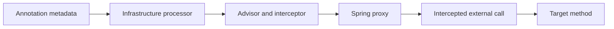

## Что происходит при создании bean

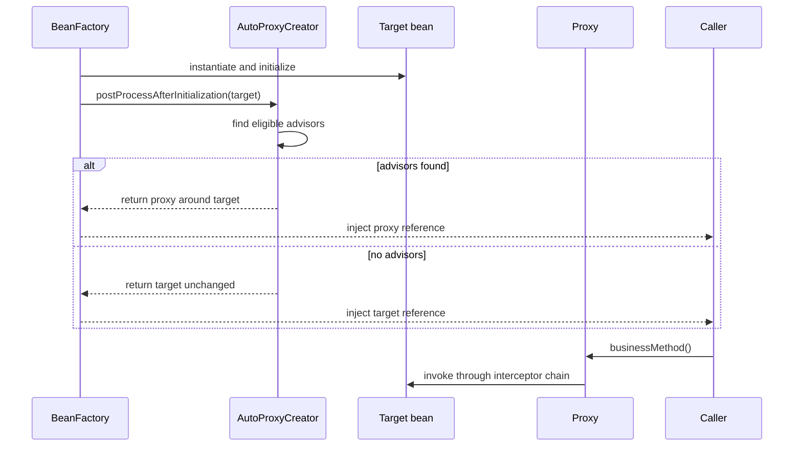

> [!important]
> Spring container обычно хранит и инъектирует proxy reference. Target остаётся внутренним объектом, к которому proxy делегирует вызов.

# 2. Proxy и target — разные роли

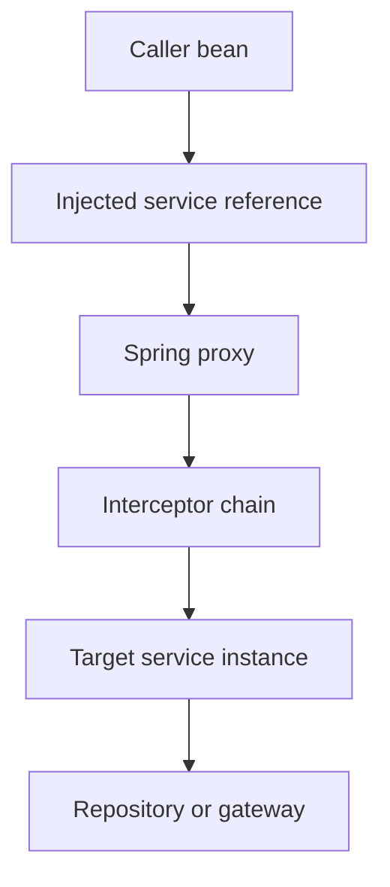

## Практический пример

```java
@Service
class PaymentService {

    @Transactional
    public PaymentResult pay(PaymentCommand command) {
        return execute(command);
    }
}
```

Фактически caller обычно получает не голый `PaymentService`, а proxy:

```text
paymentController.paymentService
    ↓
PaymentService$$SpringCGLIB$$...
    ↓
TransactionInterceptor
    ↓
PaymentService target
```

# 3. JDK proxy и CGLIB визуально

## JDK Dynamic Proxy

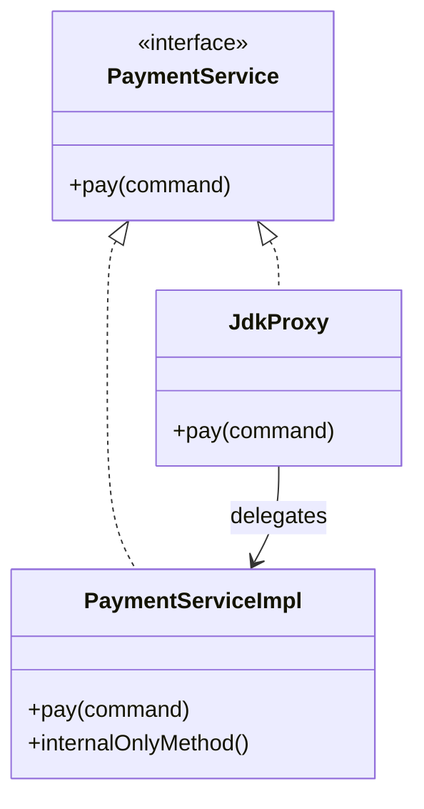

JDK proxy публикует interface contract. Method, отсутствующий в interface, нельзя вызвать через reference типа interface.

```java
PaymentService service = context.getBean(PaymentService.class);
service.pay(command);
```

## CGLIB proxy

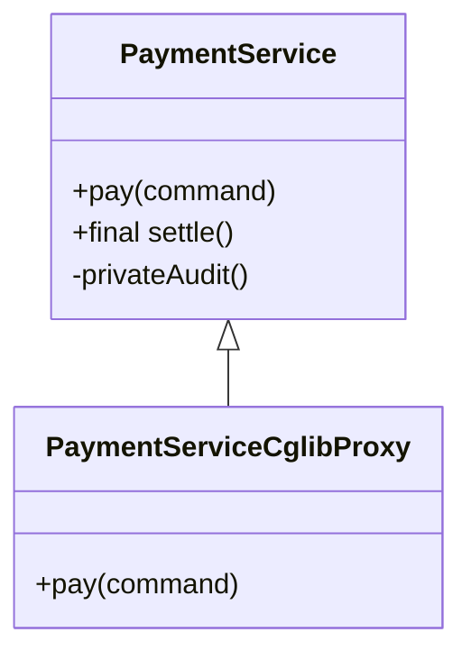

CGLIB proxy создаёт subclass и перехватывает overridable methods.

## Матрица перехватываемости

| Method | JDK proxy | CGLIB proxy | Причина |
|---|---:|---:|---|
| Public method из interface | Да | Да | Доступен proxy boundary |
| Public implementation-only method | Нет через interface reference | Да | JDK публикует interface contract |
| Final method | Не относится к interface limitation | Нет | Subclass не может override |
| Private method | Нет | Нет | Не является proxy-visible invocation |
| Self-invoked public method | Нет advice | Нет advice | Вызов не пересекает proxy |

# 4. External invocation против self-invocation

## Внешний вызов

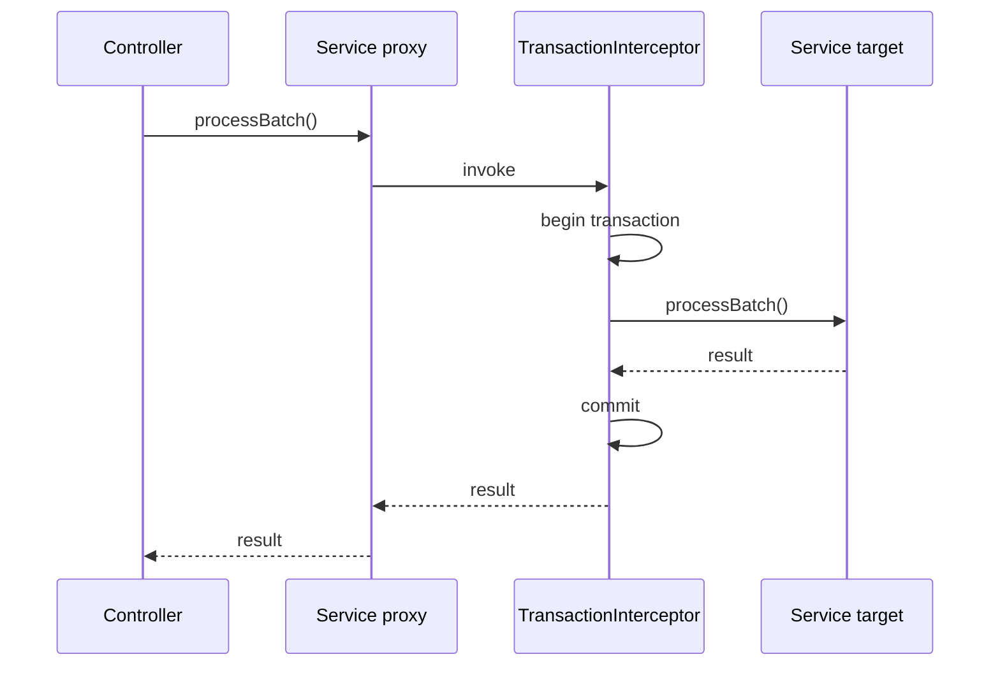

## Внутренний вызов через `this`

```java
@Service
class BatchService {

    public void processBatch(List<Item> items) {
        for (Item item : items) {
            processOne(item);
        }
    }

    @Transactional(propagation = Propagation.REQUIRES_NEW)
    public void processOne(Item item) {
        repository.save(item);
    }
}
```

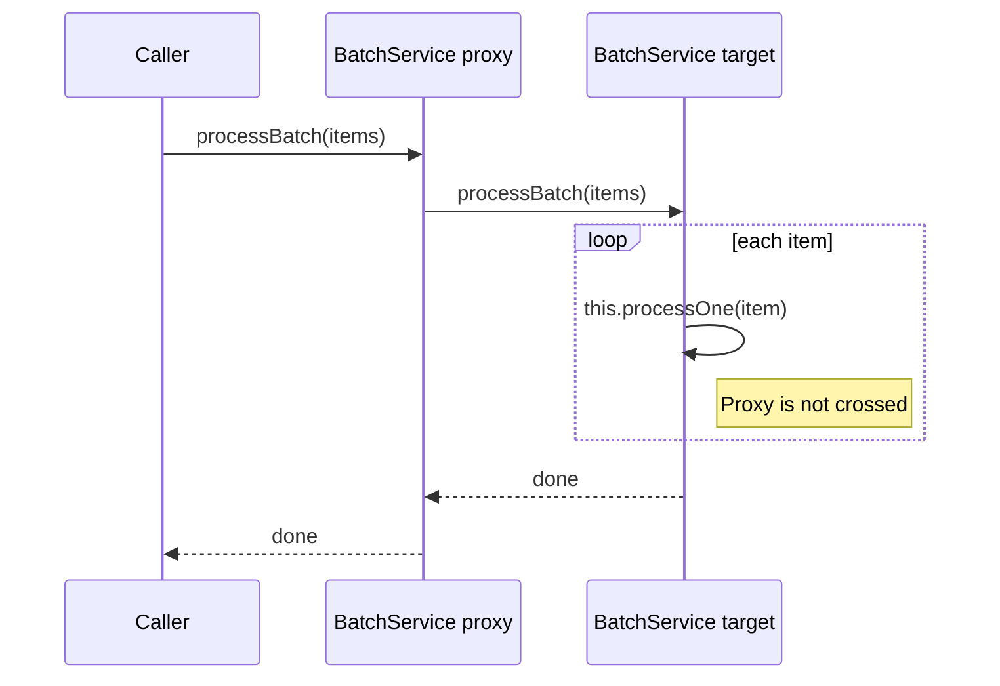

Результат: `REQUIRES_NEW` не создаётся для каждого item.

## Правильная декомпозиция

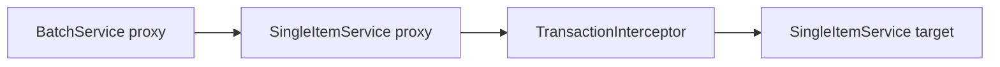

```java
@Service
class BatchService {
    private final SingleItemService singleItemService;

    public void processBatch(List<Item> items) {
        for (Item item : items) {
            singleItemService.processOne(item);
        }
    }
}

@Service
class SingleItemService {

    @Transactional(propagation = Propagation.REQUIRES_NEW)
    public void processOne(Item item) {
        repository.save(item);
    }
}
```

# 5. Advisor chain — это вложенные вызовы

Пусть порядок:

```text
Security  order 10
Tracing   order 20
Transaction order 30
Target
```

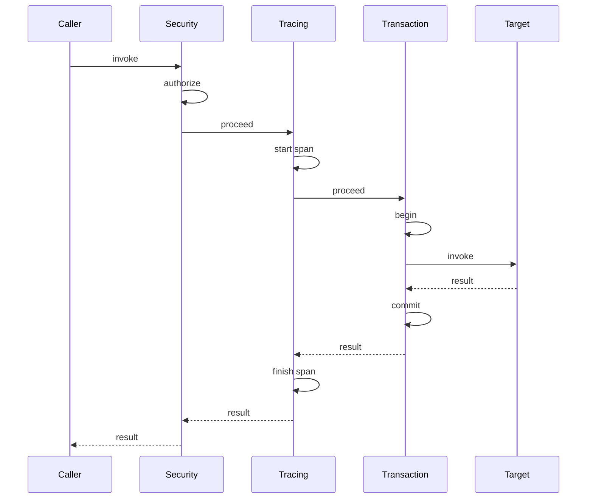

## Почему порядок меняет семантику

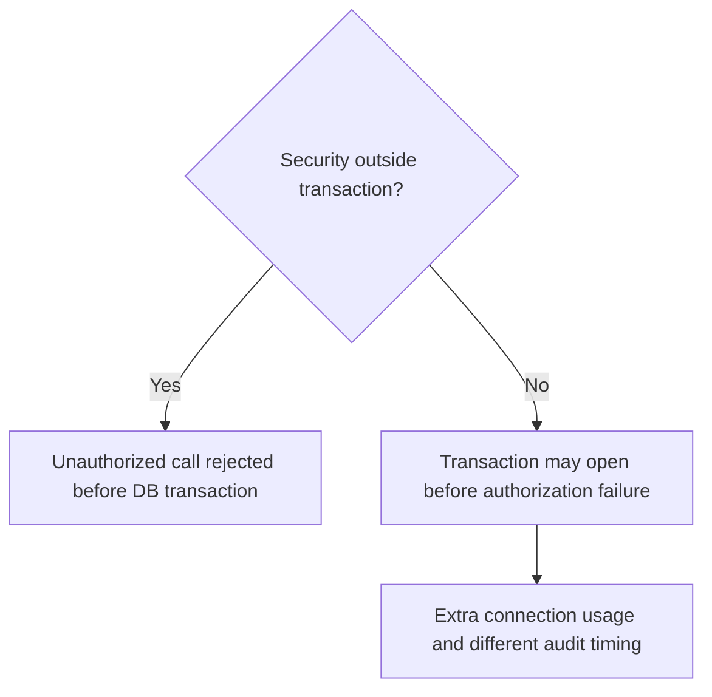

Порядок влияет на:

- момент открытия transaction;
- какие exceptions увидит outer interceptor;
- попадёт ли retry внутрь или снаружи transaction;
- будет ли tracing охватывать commit;
- когда будет записан audit.

# 6. Around advice и `proceed()`

```java
@Around("@annotation(Audited)")
public Object audit(ProceedingJoinPoint pjp) throws Throwable {
    auditStart(pjp);
    try {
        Object result = pjp.proceed();
        auditSuccess(pjp, result);
        return result;
    } catch (Throwable error) {
        auditFailure(pjp, error);
        throw error;
    }
}
```

## Нормальный путь

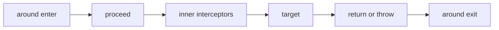

## Забытый `proceed()`

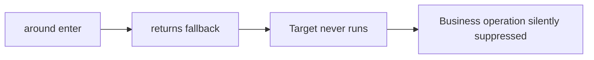

## Двойной `proceed()`

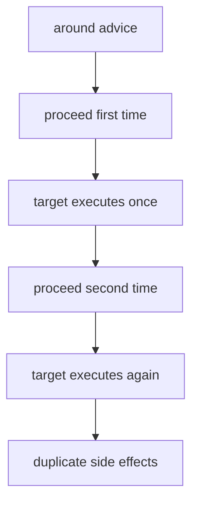

# 7. Exception propagation и rollback

## Корректный advice

```java
catch (Throwable error) {
    recordFailure(error);
    throw error;
}
```

## Опасный advice

```java
catch (Throwable error) {
    log.warn("ignored", error);
    return PaymentResult.failed();
}
```

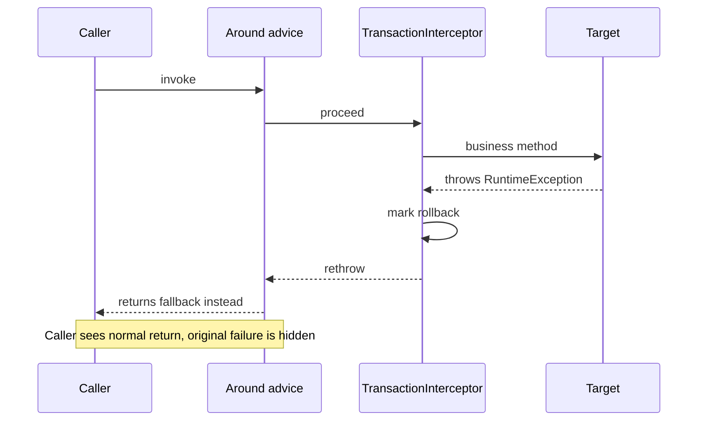

В зависимости от расположения advice относительно transaction interceptor swallowing может изменить rollback semantics или скрыть `UnexpectedRollbackException` context.

# 8. `@Async` — это proxy + executor + новый thread

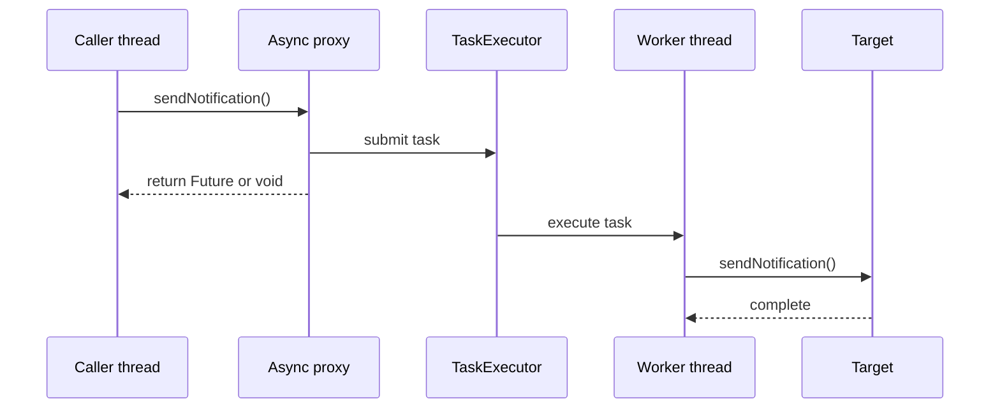

## Self-invocation ломает async dispatch

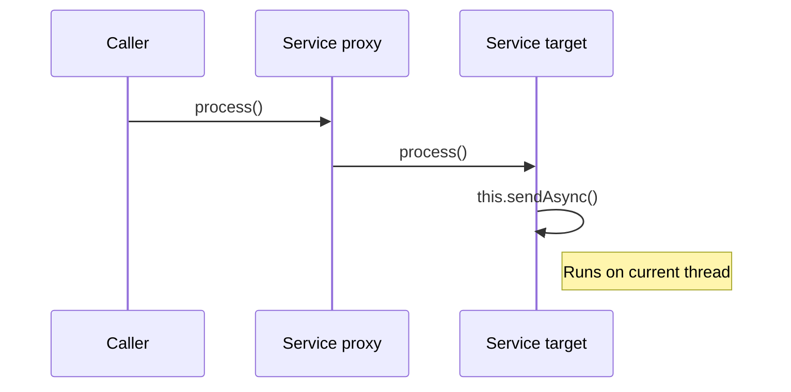

## Transaction context не переносится автоматически

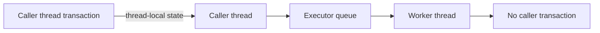

Async method должен открыть собственную transaction, если она нужна.

# 9. Method security и internal call

```java
@Service
class AccountService {

    public void closeDormantAccount(Long id) {
        closeAccount(id);
    }

    @PreAuthorize("hasRole('ADMIN')")
    public void closeAccount(Long id) {
        repository.close(id);
    }
}
```

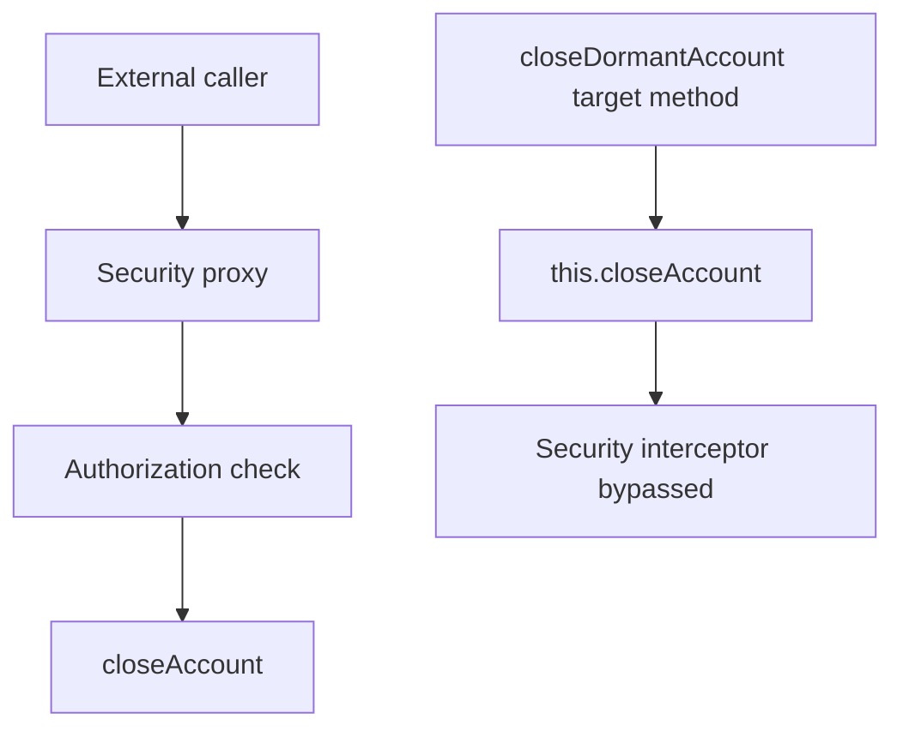

> [!warning]
> Method-security annotation не является compile-time guard. Она работает только при поддерживаемом intercepted invocation path.

# 10. Final, private и manual `new`

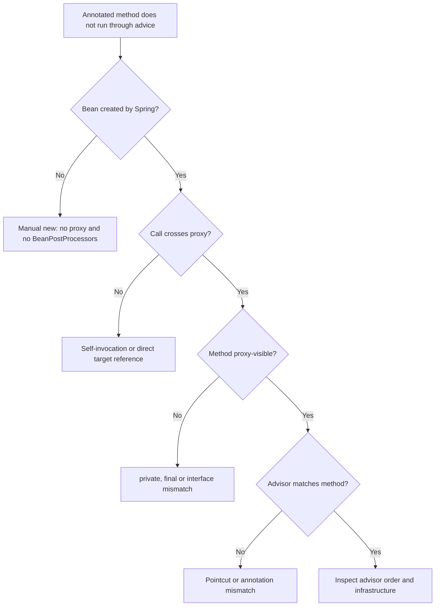

# 11. Runtime diagnostics

```java
Object bean = context.getBean(PaymentService.class);

System.out.println(AopUtils.isAopProxy(bean));
System.out.println(AopUtils.isJdkDynamicProxy(bean));
System.out.println(AopUtils.isCglibProxy(bean));
System.out.println(AopUtils.getTargetClass(bean));

if (bean instanceof Advised) {
    for (Advisor advisor : ((Advised) bean).getAdvisors()) {
        System.out.println(advisor);
    }
}
```

## Диагностическая последовательность

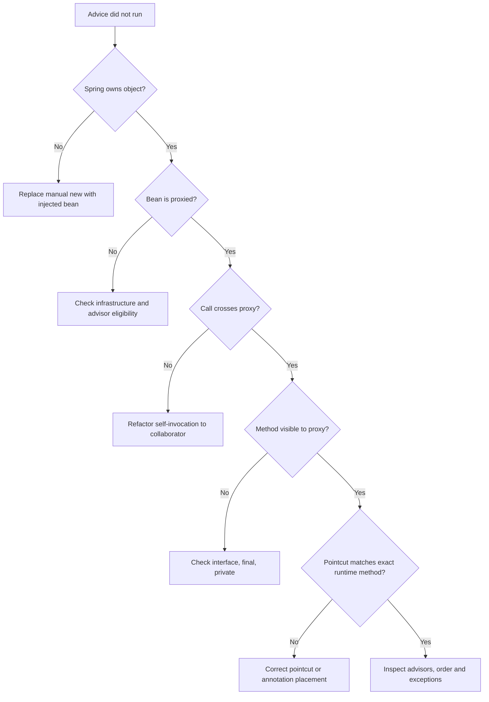

# 12. Полный production case: payment execution

## Требование

При выполнении платежа нужно:

1. проверить permission;
2. открыть transaction;
3. записать business rows;
4. отправить audit;
5. измерить latency;
6. не допустить duplicate retry side effects.

## Возможная цепочка

```mermaid
sequenceDiagram
    participant API as REST Controller
    participant SEC as Security interceptor
    participant TRACE as Trace interceptor
    participant RETRY as Retry interceptor
    participant TX as Transaction interceptor
    participant SVC as PaymentService
    participant DB as Database

    API->>SEC: pay(command)
    SEC->>SEC: authorize
    SEC->>TRACE: proceed
    TRACE->>TRACE: start span
    TRACE->>RETRY: proceed
    RETRY->>TX: attempt 1
    TX->>TX: begin
    TX->>SVC: pay(command)
    SVC->>DB: insert payment
    DB-->>SVC: transient failure
    SVC-->>TX: exception
    TX->>TX: rollback
    TX-->>RETRY: exception
    RETRY->>TX: attempt 2
    TX->>TX: begin new transaction
    TX->>SVC: pay(command)
    SVC->>DB: insert with idempotency key
    DB-->>SVC: success
    SVC-->>TX: result
    TX->>TX: commit
    TX-->>RETRY: result
    RETRY-->>TRACE: result
    TRACE->>TRACE: finish span
    TRACE-->>SEC: result
    SEC-->>API: response
```

## Что здесь нужно проверить

- Retry должен находиться **снаружи** transaction, если каждая попытка требует новой transaction.
- Idempotency должна защищать от повторного side effect.
- Security обычно выгодно выполнять до открытия transaction.
- Trace может охватывать все retry attempts либо каждую попытку отдельно — это архитектурное решение.

# 13. Как объяснять AOP на собеседовании

Хороший ответ строится по схеме:

```text
1. Spring создаёт proxy вокруг bean.
2. Caller должен вызвать method через proxy reference.
3. Proxy строит interceptor chain из подходящих advisors.
4. Chain выполняется до/после target method.
5. Self-invocation, private/final methods и manual new обходят или блокируют interception.
6. Диагностика начинается с ownership, proxy type, caller path и advisors.
```

# 14. Практические упражнения

1. Нарисовать sequence для `@Transactional + @Retryable` в двух вариантах order.
2. Сделать service с self-invoked `@Async` и вывести thread names.
3. Сравнить JDK и CGLIB через `AopUtils`.
4. Добавить around advice без `proceed()` и доказать, что target не выполнился.
5. Вывести `Advised#getAdvisors()` для transaction, cache и custom aspect.
6. Перенести secured method в collaborator и доказать восстановление authorization check.

## Related materials

- [[Spring AOP Proxy Mechanics]]
- [[30_CERTIFICATIONS/Spring/2V0-72.22/AOP-B01/AOP-B01 Cards]]
- [[50_LABS/Spring/AOP-B01/README]]
- [[40_PRODUCTION_CASES/Spring/AOP and Cache Production Cases]]
- [[Spring Cache Visual Deep Dive]]
