# Spring Boot Auto-configuration Visual Deep Dive

> [!summary]
> Visual route: application launch → environment → context → configuration parsing → candidate discovery → condition evaluation → bean-definition contribution → refresh → runners/readiness.

# 1. Full bootstrap pipeline

```mermaid
flowchart LR
    MAIN["main(args)"] --> APP["SpringApplication"]
    APP --> TYPE["Determine WebApplicationType"]
    TYPE --> ENV["Prepare Environment"]
    ENV --> CTX["Create ApplicationContext"]
    CTX --> LOAD["Load primary sources"]
    LOAD --> REFRESH["refresh()"]
    REFRESH --> EVENTS["Started events"]
    EVENTS --> RUNNERS["ApplicationRunner / CommandLineRunner"]
    RUNNERS --> READY["Application ready"]
```

# 2. `@SpringBootApplication` composition

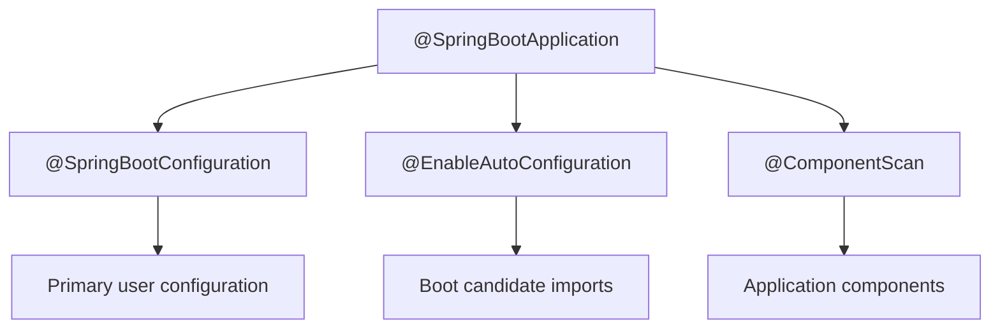

# 3. Three different discovery paths

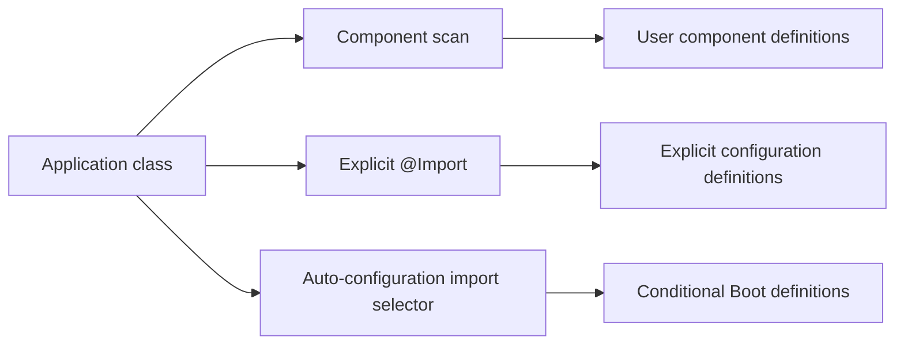

# 4. Main-class placement

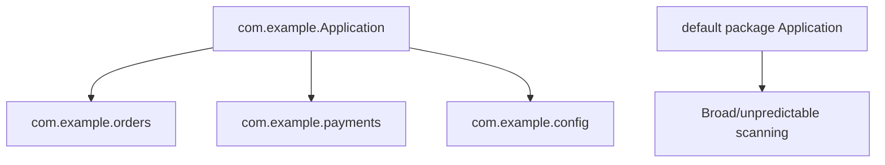

# 5. Environment before ordinary beans

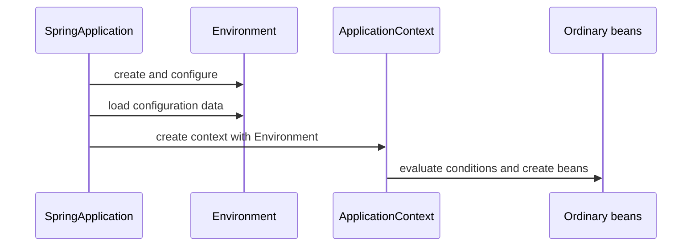

# 6. Application type decision

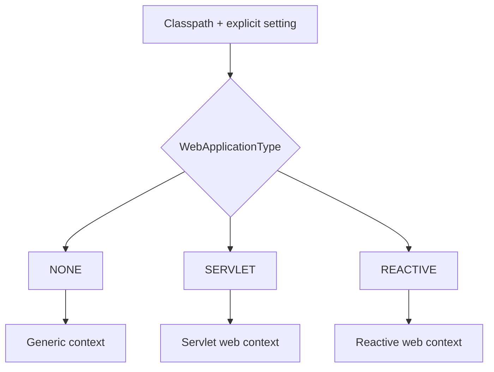

# 7. Auto-configuration candidate pipeline

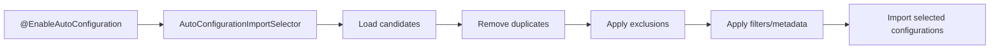

# 8. Boot 2.x versus current registration

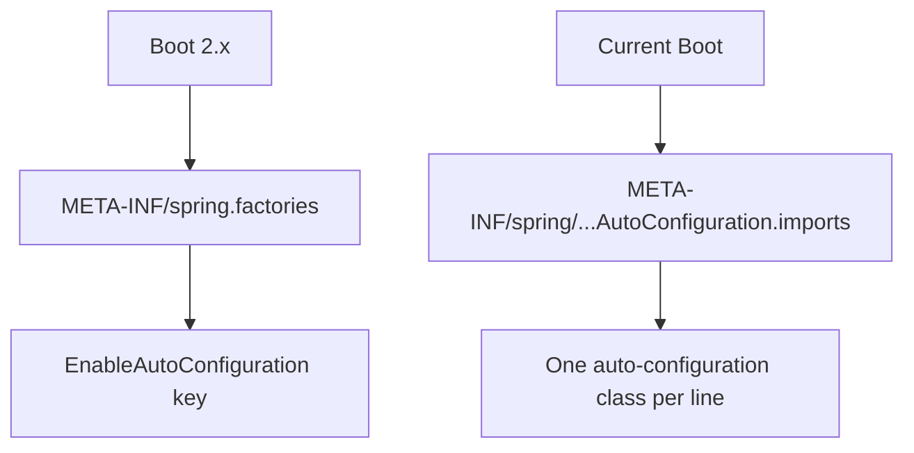

# 9. Deferred import effect

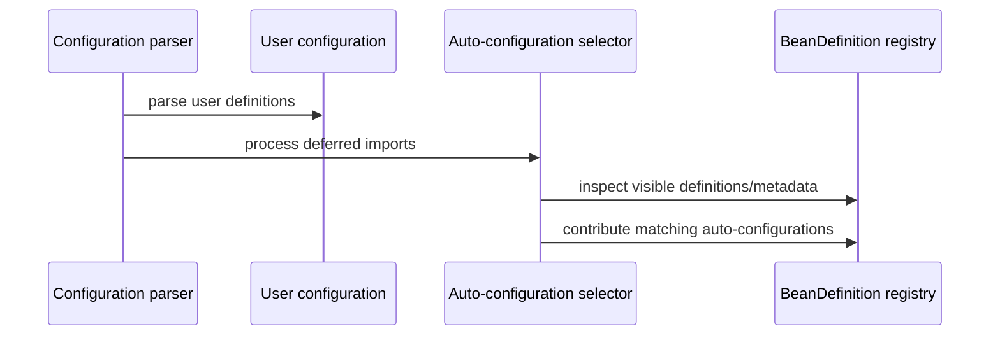

# 10. Condition composition

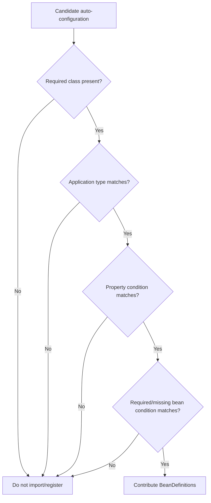

# 11. Classpath condition

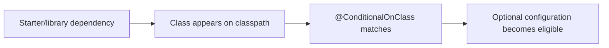

# 12. Missing-bean back-off

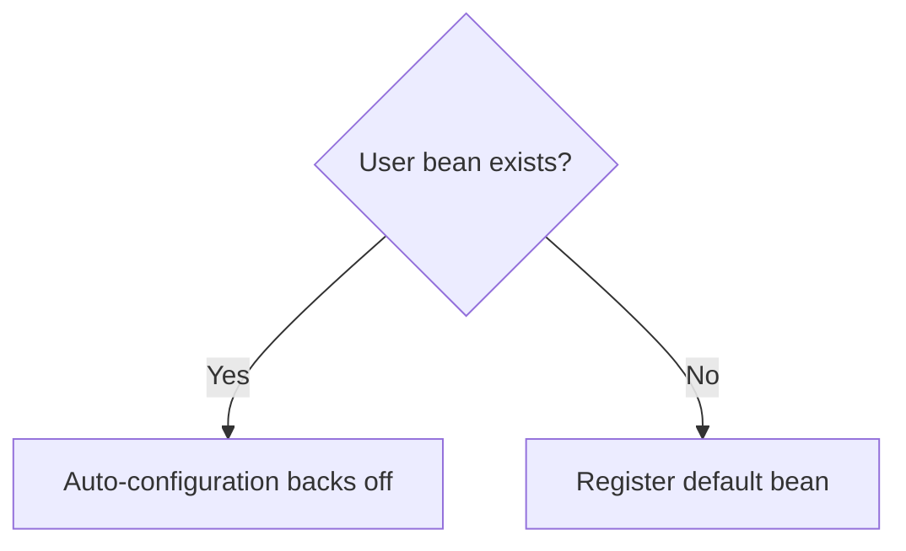

# 13. Property condition

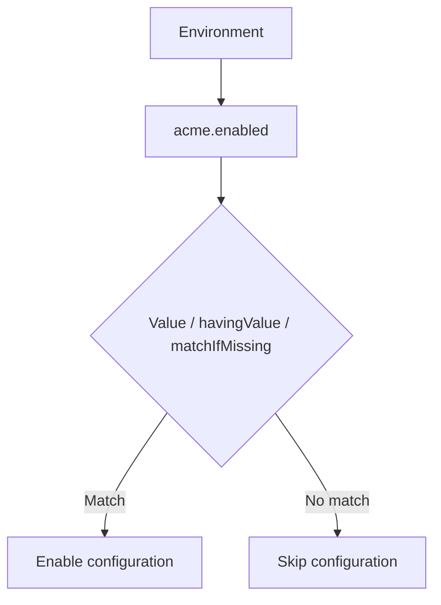

# 14. Match does not guarantee successful creation

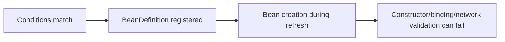

# 15. Positive versus negative condition report

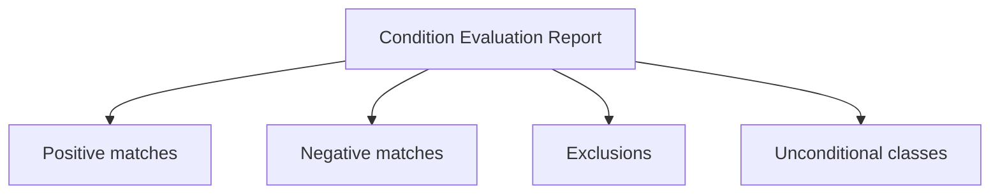

# 16. Diagnostic decision tree

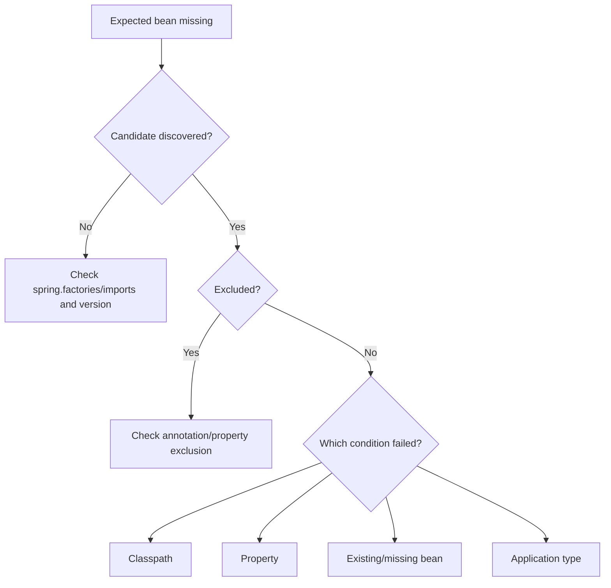

# 17. User override path

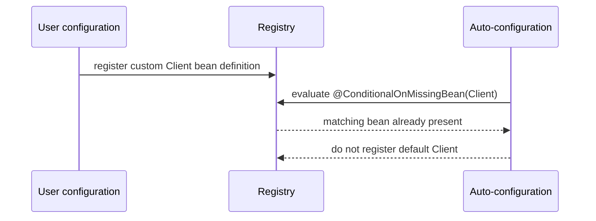

# 18. Exclusion paths

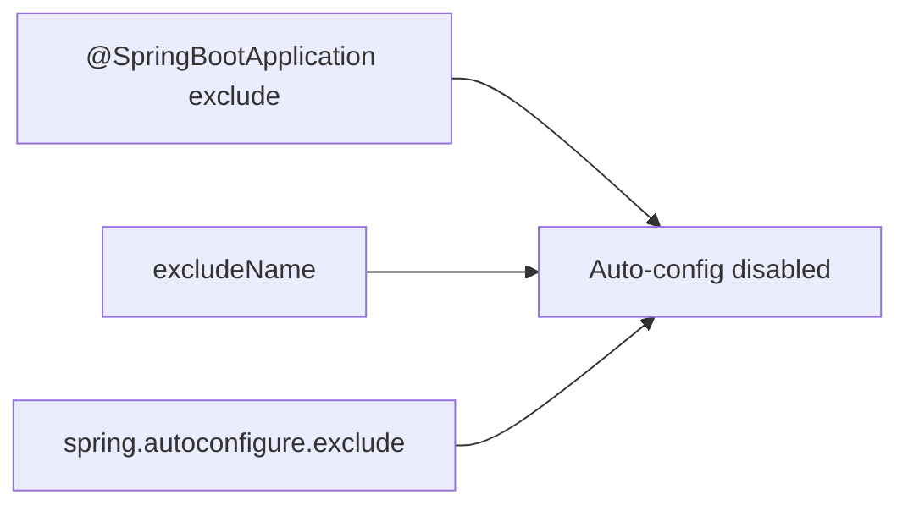

# 19. Ordering boundary

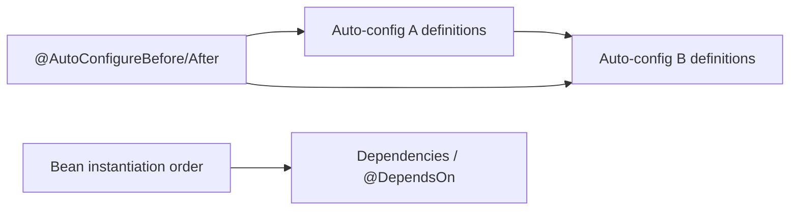

# 20. Starter versus auto-configuration

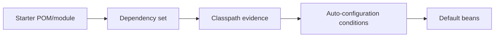

# 21. Dependency-management boundary

```mermaid
flowchart TD
    BOM["Boot dependency management"] --> VERSION["Chooses compatible versions"]
    DECL["Declared dependency"] --> PRESENT["Adds dependency"]
    VERSION --> BUILD["Resolved build graph"]
    PRESENT --> BUILD
```

# 22. Custom Boot 2.x auto-configuration

```mermaid
flowchart LR
    CLASS["@Configuration auto-config class"] --> CONDS["Conditional annotations"]
    CONDS --> BEANS["@Bean defaults"]
    SF["spring.factories"] --> CLASS
    USER["User bean"] --> BACKOFF["Missing-bean condition backs off"]
```

# 23. Current custom auto-configuration

```mermaid
flowchart LR
    AC["@AutoConfiguration"] --> CONDS["Conditions"]
    IMPORTS["AutoConfiguration.imports"] --> AC
    AC --> BEANS["Conditional default beans"]
```

# 24. `ApplicationContextRunner` test matrix

```mermaid
flowchart TB
    RUNNER["ApplicationContextRunner"] --> DEFAULT["Default context"]
    RUNNER --> PROP["withPropertyValues"]
    RUNNER --> USER["withBean / user configuration"]
    RUNNER --> FILTER["FilteredClassLoader"]
    DEFAULT --> ASSERT["Assert bean presence/absence"]
    PROP --> ASSERT
    USER --> ASSERT
    FILTER --> ASSERT
```

# 25. Failure analyzer path

```mermaid
flowchart LR
    EX["Startup exception"] --> ANALYZER["Matching FailureAnalyzer"]
    ANALYZER --> DESC["Description"]
    ANALYZER --> ACTION["Suggested action"]
    DESC --> LOG["Failure report"]
    ACTION --> LOG
```

# 26. Startup events and runners

```mermaid
flowchart LR
    START["Starting"] --> ENV["Environment prepared"]
    ENV --> CTX["Context prepared/loaded"]
    CTX --> REFRESH["Context refreshed"]
    REFRESH --> STARTED["Application started"]
    STARTED --> RUNNER["Runners"]
    RUNNER --> READY["Ready"]
    START --> FAIL["Failed event on startup error"]
```

# 27. Runner comparison

```mermaid
flowchart TD
    ARGS["Startup arguments"] --> CLR["CommandLineRunner: String[]"]
    ARGS --> AR["ApplicationRunner: ApplicationArguments"]
    CLR --> ORDER["Ordered execution"]
    AR --> ORDER
```

# 28. Lazy initialization trade-off

```mermaid
flowchart LR
    LAZY["Global lazy initialization"] --> FAST["Less startup work"]
    LAZY --> LATE["Failures move to first use"]
    LAZY --> FIRST["First-request latency"]
```

# 29. Embedded servlet startup

```mermaid
flowchart LR
    SERVLETCTX["Servlet application context"] --> FACTORY["ServletWebServerFactory bean"]
    FACTORY --> SERVER["Embedded server"]
    SERVER --> DISPATCH["DispatcherServlet infrastructure"]
```

# 30. Worked example — custom client

```mermaid
flowchart TD
    LIB["Acme library on classpath"] --> ONCLASS["@ConditionalOnClass"]
    PROP["acme.enabled=true"] --> ONPROP["@ConditionalOnProperty"]
    USER{"Custom AcmeClient bean?"} -->|"No"| DEFAULT["Create default AcmeClient"]
    USER -->|"Yes"| KEEP["Keep user bean"]
    ONCLASS --> USER
    ONPROP --> USER
```

Evidence plan:

```text
ApplicationContextRunner default case
property-disabled case
FilteredClassLoader missing-library case
user-bean back-off case
invalid-properties failure case
```

# 31. Interview explanation map

```mermaid
flowchart LR
    Q["How does Boot auto-configure?"] --> E["EnableAutoConfiguration"]
    E --> C["Discover candidates"]
    C --> F["Apply exclusions/filters"]
    F --> COND["Evaluate conditions"]
    COND --> DEF["Register definitions"]
    DEF --> REF["Refresh and create beans"]
    REF --> DIAG["Condition report + runner tests"]
```

## Route navigation

- **Canonical:** [[10_CONCEPTS/Spring/Boot/Spring Boot Bootstrap and Auto-configuration]]
- **Roadmap:** [[30_CERTIFICATIONS/Spring/2V0-72.22/SPRING-BOOT-B01/SPRING-BOOT-B01 Roadmap]]
- **Cards:** [[30_CERTIFICATIONS/Spring/2V0-72.22/SPRING-BOOT-B01/SPRING-BOOT-B01 Cards]]
- **Cases:** [[40_PRODUCTION_CASES/Spring/Spring Boot Auto-configuration Production Cases]]
- **Lab:** [[50_LABS/Spring/SPRING-BOOT-B01/README]]
- **Sources:** [[98_SOURCES/Spring Boot Auto-configuration Sources]]
