# Spring Boot Configuration Visual Deep Dive

> [!summary]
> Visual route: raw configuration sources → Config Data → ordered Environment → profiles/documents → resolved key → typed binding → conversion/validation → bean behavior → diagnostics.

# 1. Complete configuration pipeline

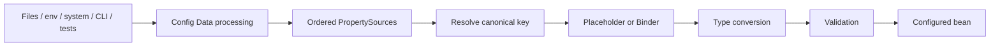

**How to read:** a wrong runtime value can originate at discovery, source ordering, key normalization, conversion or validation. Reading only one YAML file inspects one stage.

# 2. Ordered PropertySource chain

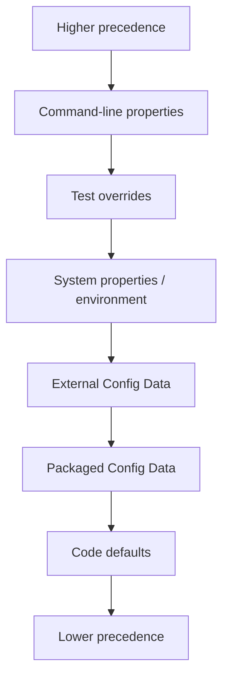

The exact category order is version-sensitive; the invariant is that the first/highest source containing the key wins.

# 3. Resolution decision

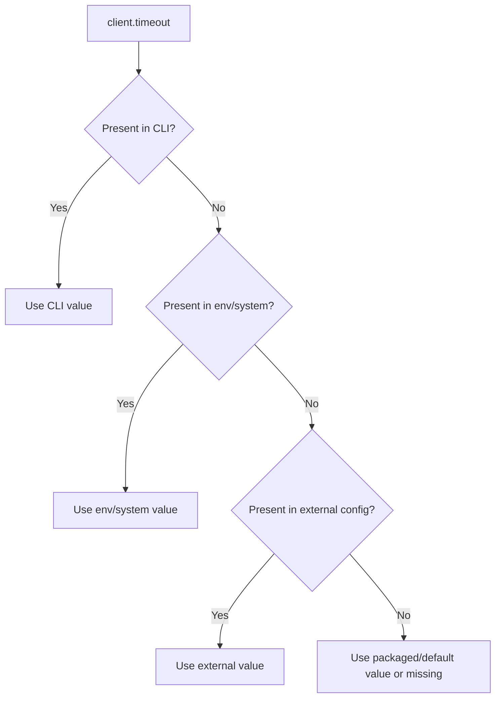

# 4. Config Data bootstrap timing

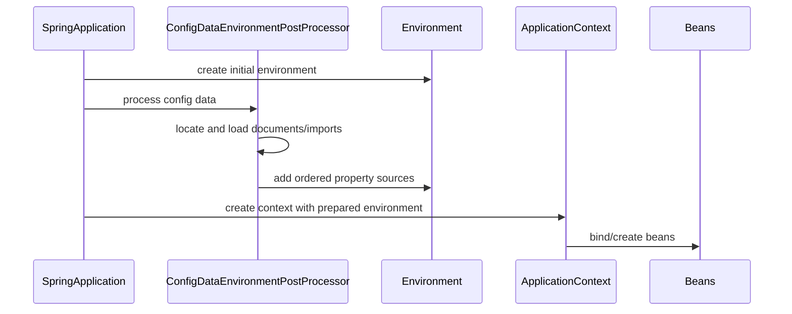

# 5. Default and external locations

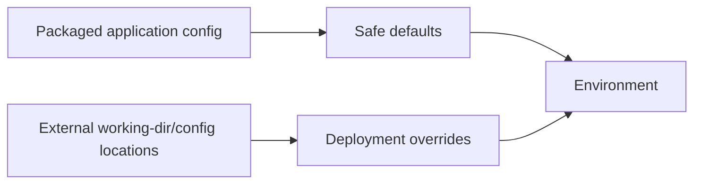

# 6. Replace versus extend locations

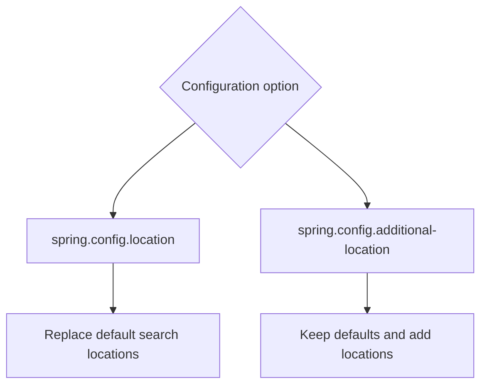

# 7. Import graph

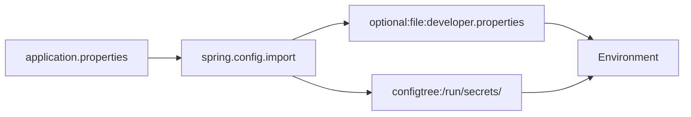

# 8. Mandatory versus optional import

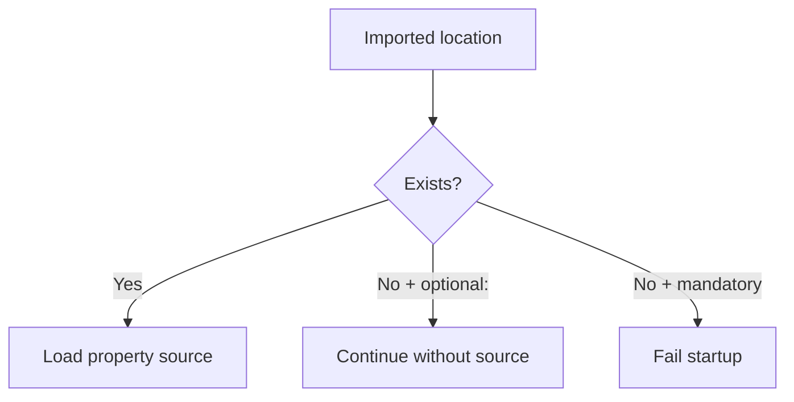

# 9. Config tree mapping

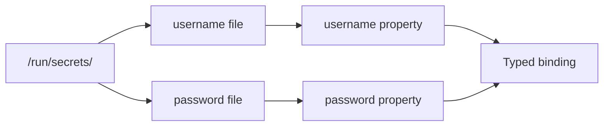

# 10. Multi-document activation

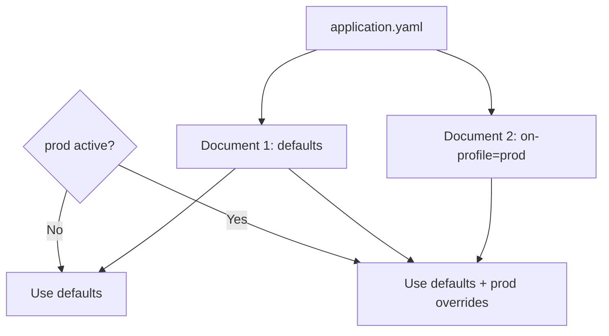

# 11. Profile-specific file composition

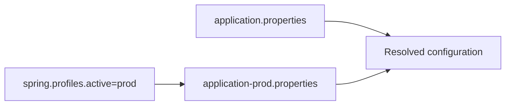

# 12. Default profile path

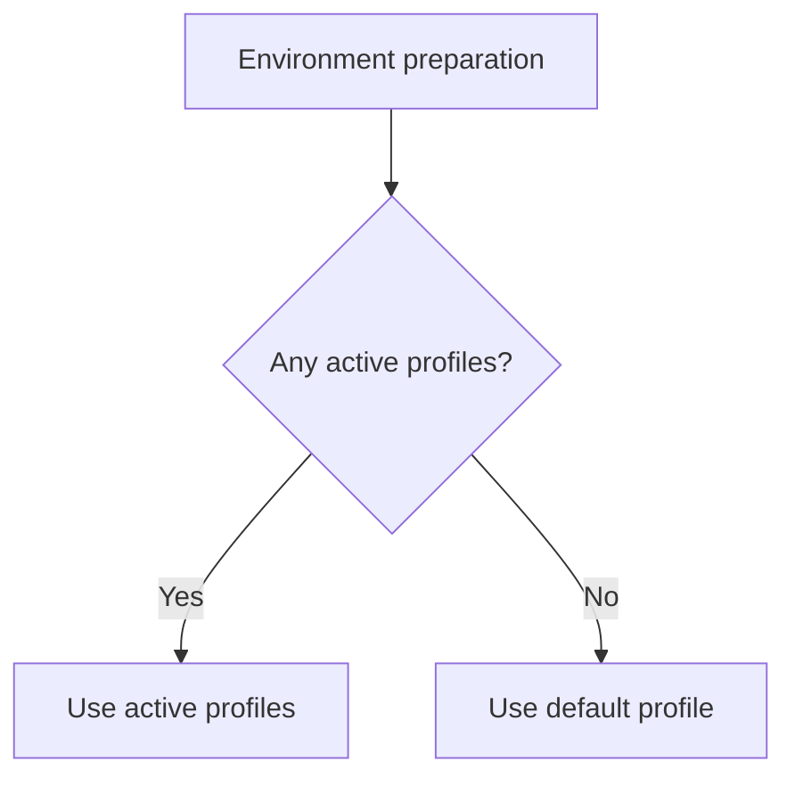

# 13. Profile group

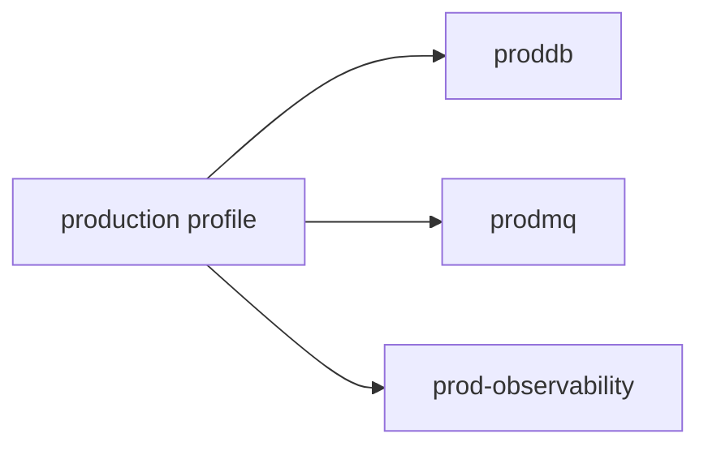

# 14. Flat key model

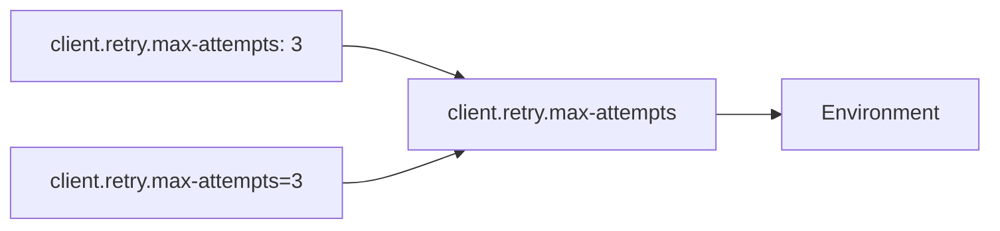

# 15. `@Value` path

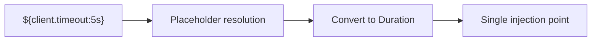

# 16. `@ConfigurationProperties` path

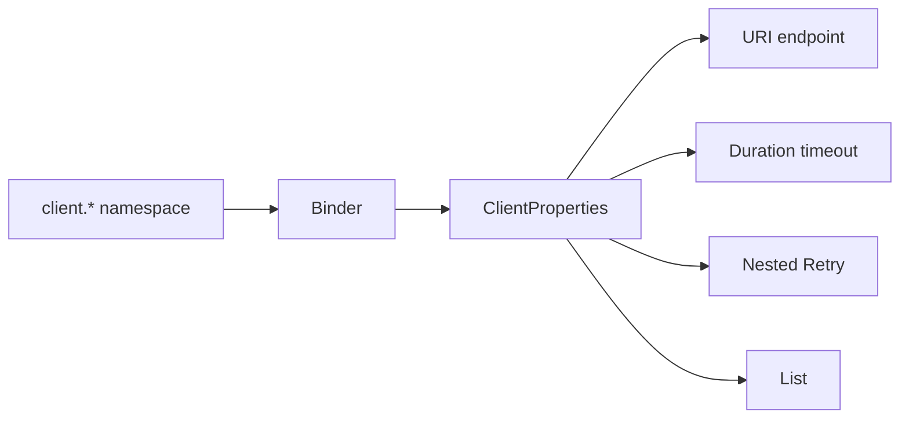

# 17. Choosing binding style

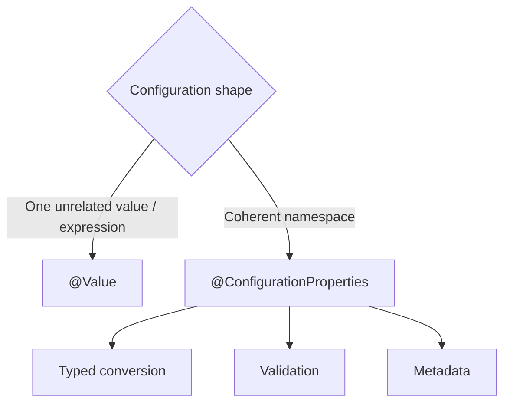

# 18. Registration paths

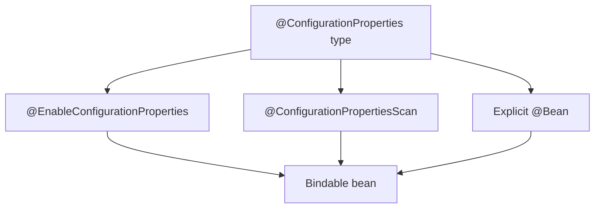

# 19. Relaxed binding normalization

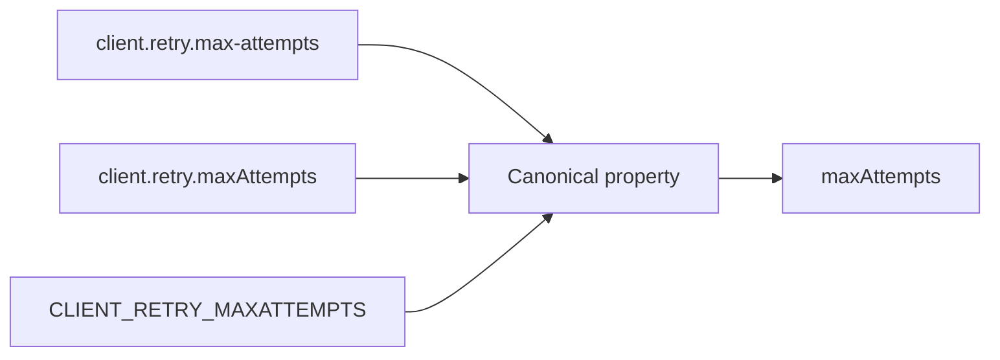

# 20. Nested binding

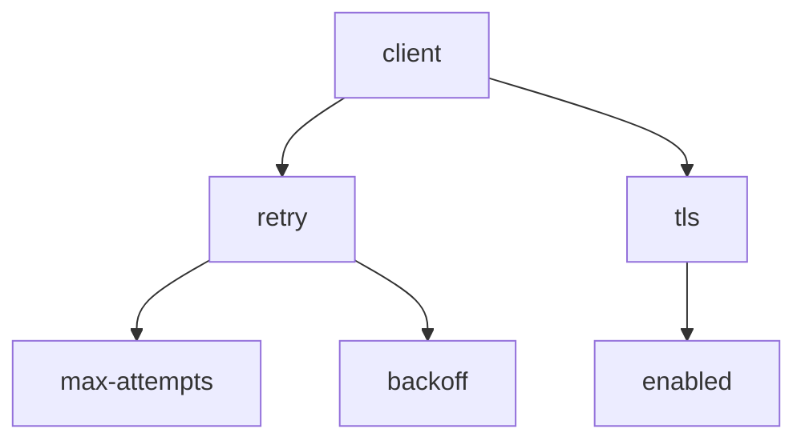

# 21. Collection binding

```mermaid
flowchart LR
    INDEX0["client.servers[0]"] --> LIST["List<URI>"]
    INDEX1["client.servers[1]"] --> LIST
    HEADER["client.headers.X-Tenant"] --> MAP["Map<String,String>"]
```

# 22. Conversion pipeline

```mermaid
flowchart LR
    RAW["String source value"] --> SERVICE["ConversionService / Binder converters"]
    SERVICE --> DURATION["Duration"]
    SERVICE --> SIZE["DataSize"]
    SERVICE --> URI["URI"]
    SERVICE --> ENUM["Enum"]
    SERVICE --> CUSTOM["Custom domain type"]
```

# 23. Validation failure path

```mermaid
sequenceDiagram
    participant ENV as Environment
    participant B as Binder
    participant V as Validator
    participant CTX as Context refresh

    ENV->>B: resolved client.* values
    B->>V: typed ClientProperties
    V-->>B: constraint violations
    B-->>CTX: bind/validation exception
    CTX-->>CTX: fail startup with report
```

# 24. Constructor binding version boundary

```mermaid
flowchart TB
    B25["Boot 2.5 exam baseline"] --> ANNO["Explicit @ConstructorBinding common"]
    CURRENT["Current Boot"] --> INFER["Single constructor can be inferred"]
    CURRENT --> RECORD["Records supported naturally"]
```

# 25. Unknown property diagnostic

```mermaid
flowchart TD
    SUPPLIED["client.timout=5s typo"] --> ENV["Environment contains key"]
    ENV --> BIND{"Any binding target consumes it?"}
    BIND -->|"No"| UNUSED["Application may still start"]
    BIND -->|"Strict/validated contract"| FAIL["Detect mismatch"]
```

# 26. Wrong value diagnostic tree

```mermaid
flowchart TD
    WRONG["Resolved value is wrong"] --> KEY{"Canonical key correct?"}
    KEY -->|"No"| FIXKEY["Fix spelling/relaxed form"]
    KEY -->|"Yes"| SOURCES{"Which sources contain key?"}
    SOURCES --> ORDER["Inspect precedence and origin"]
    ORDER --> PROFILE{"Expected profile/document active?"}
    PROFILE -->|"No"| ACTIVATE["Fix profile activation"]
    PROFILE -->|"Yes"| BIND{"Conversion/binding succeeds?"}
    BIND -->|"No"| CONVERT["Fix type/unit/converter/validation"]
    BIND -->|"Yes"| WINNER["Remove or document winning override"]
```

# 27. Secret exposure path

```mermaid
flowchart LR
    SECRET["Secret source"] --> ENV["Environment"]
    ENV --> BEAN["Credentials bean"]
    ENV --> ACTUATOR["env/configprops endpoints"]
    BEAN --> LOG["toString/logging"]
    ACTUATOR --> RISK["Exposure risk"]
    LOG --> RISK
    RISK --> CONTROLS["Sanitization + security + no Git secrets"]
```

# 28. Test override path

```mermaid
flowchart LR
    BASE["application-test.properties"] --> ENV["Test Environment"]
    TESTPROP["@TestPropertySource"] --> ENV
    BOOTPROP["@SpringBootTest properties"] --> ENV
    DYNAMIC["@DynamicPropertySource"] --> ENV
    ENV --> CACHE["Merged context cache key"]
```

# 29. Worked incident

```mermaid
flowchart TD
    SYMPTOM["Timeout is 30s, YAML says 3s"] --> ASSUME["Wrong: Boot ignored YAML"]
    SYMPTOM --> INSPECT["Inspect PropertySources"]
    INSPECT --> ENVVAR["CLIENT_TIMEOUT=30s"]
    ENVVAR --> WIN["Higher-priority value wins"]
    WIN --> REPAIR["Remove stale deployment override"]
    REPAIR --> PROOF["Context/deployment test asserts value and origin"]
```

# 30. Learning verification path

```mermaid
flowchart LR
    PRE["10-question pre-test"] --> CONCEPT["Canonical + visual route"]
    CONCEPT --> CARDS["35 stable card IDs"]
    CARDS --> CASES["Production incidents"]
    CASES --> LAB["Binding and validation tests"]
    LAB --> POST["15-question post-test"]
    POST --> PROGRESS["Per-card progress registry"]
```

## Route navigation

- **Canonical:** [[10_CONCEPTS/Spring/Boot/Spring Boot Externalized Configuration and Type-safe Binding]]
- **Roadmap:** [[30_CERTIFICATIONS/Spring/2V0-72.22/SPRING-BOOT-B02/SPRING-BOOT-B02 Roadmap]]
- **Cards:** [[30_CERTIFICATIONS/Spring/2V0-72.22/SPRING-BOOT-B02/SPRING-BOOT-B02 Cards]]
- **Assessment:** [[30_CERTIFICATIONS/Spring/2V0-72.22/SPRING-BOOT-B02/SPRING-BOOT-B02 Assessment]]
- **Cases:** [[40_PRODUCTION_CASES/Spring/Spring Boot Configuration Production Cases]]
- **Lab:** [[50_LABS/Spring/SPRING-BOOT-B02/README]]
- **Sources:** [[98_SOURCES/Spring Boot Externalized Configuration Sources]]
