# Spring Cache Visual Deep Dive

> [!summary]
> Spring Cache — это proxy-based orchestration, а не само хранилище. Для правильного проектирования нужно одновременно видеть четыре плоскости: **interception path**, **key identity**, **provider topology** и **consistency/invalidation timeline**.

# 1. Полная модель cache invocation

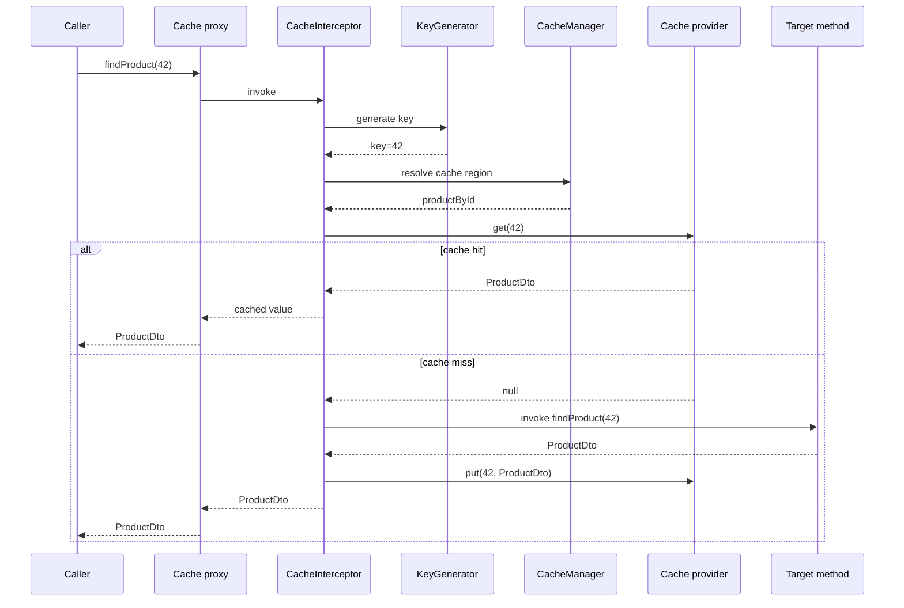

Главный вывод: cache hit не просто ускоряет method — он **полностью пропускает target invocation**.

# 2. Spring и provider отвечают за разные вещи

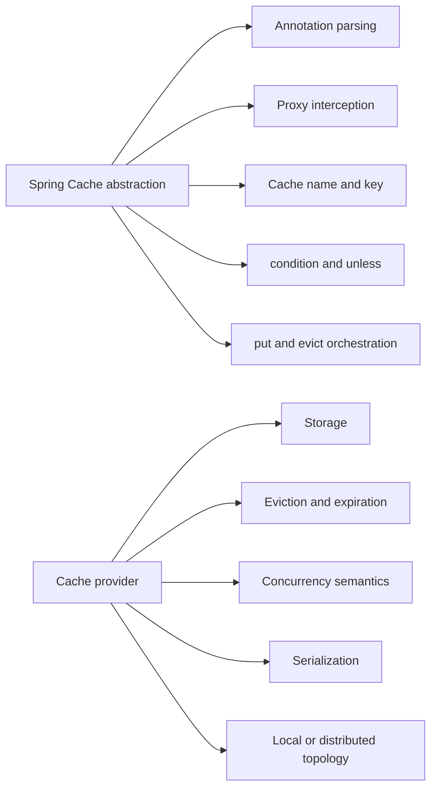

```text
Spring decides when.
Provider decides where and how.
```

# 3. `@Cacheable`: hit и miss как две разные программы

```java
@Cacheable(
        cacheNames = "productById",
        key = "#tenantId + ':' + #productId",
        unless = "#result == null"
)
public ProductDto findById(String tenantId, Long productId) {
    return repository.findRequired(tenantId, productId);
}
```

## Miss path

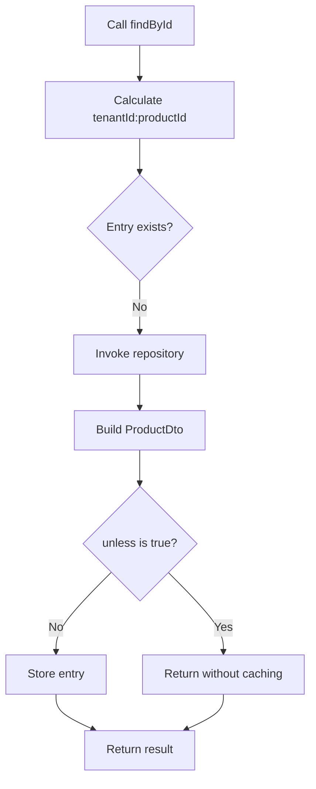

## Hit path

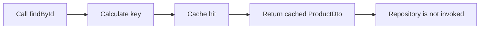

> [!warning]
> Side effects, audit inserts и metrics внутри cached target method выполняются только на misses.

# 4. `condition` и `unless`

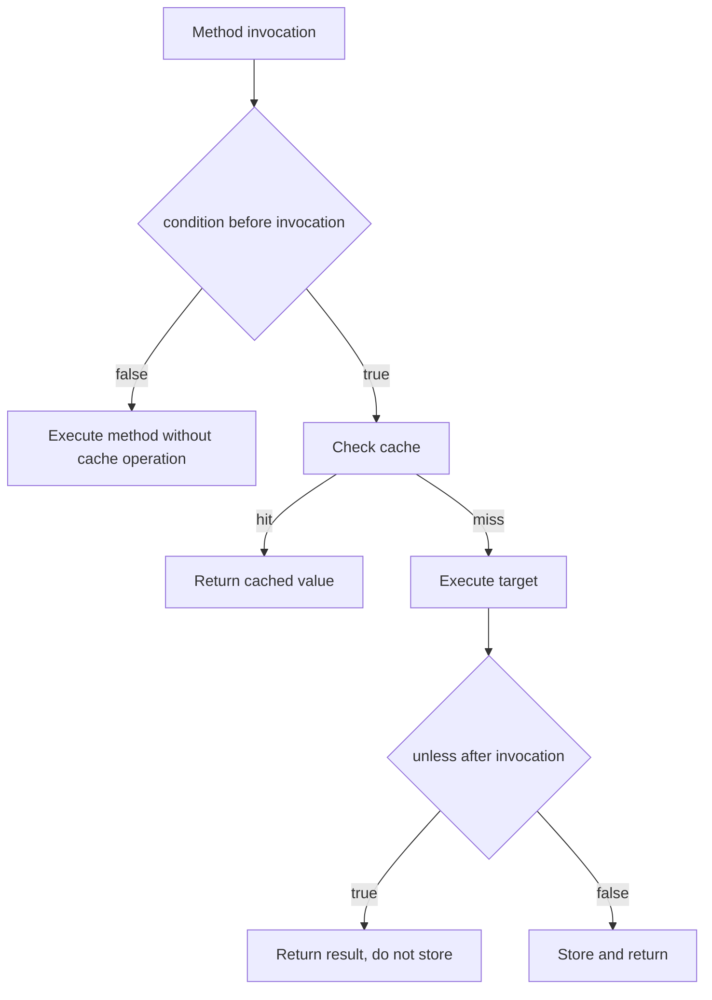

## Пример

```java
@Cacheable(
        cacheNames = "search",
        key = "#request.cacheKey()",
        condition = "#request.cacheable",
        unless = "#result == null || #result.items.isEmpty()"
)
public SearchResult search(SearchRequest request) {
    return gateway.search(request);
}
```

- `condition` не может использовать `#result`;
- `unless` может проверять result;
- `condition=false` не означает «не выполнять method»;
- `unless=true` не означает «вернуть null».

# 5. Cache key — модель identity и isolation

## Ошибочный key

```java
@Cacheable(cacheNames = "customer", key = "#customerId")
public CustomerDto find(String tenantId, Long customerId) {
    return repository.find(tenantId, customerId);
}
```

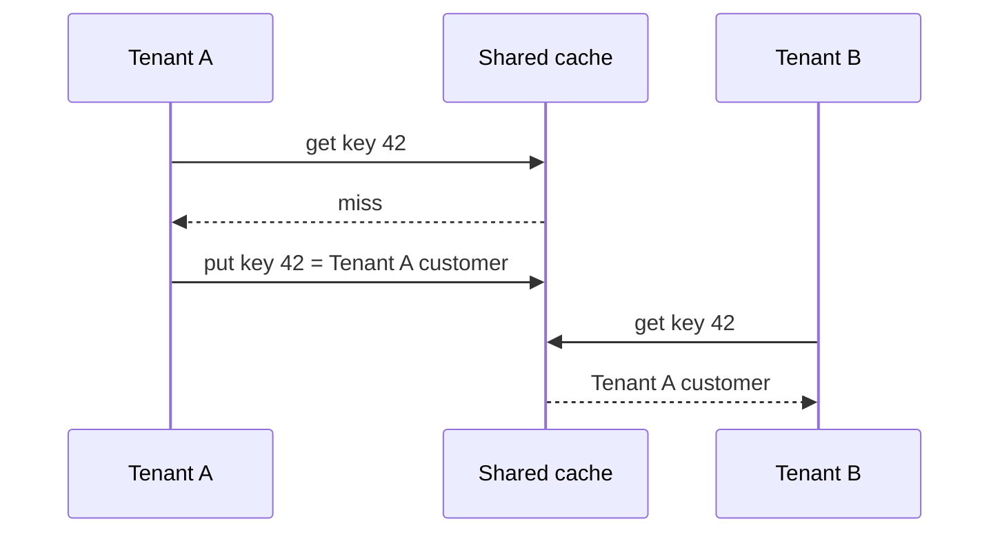

## Правильная identity

```text
customer:v3:{tenantId}:{customerId}
```

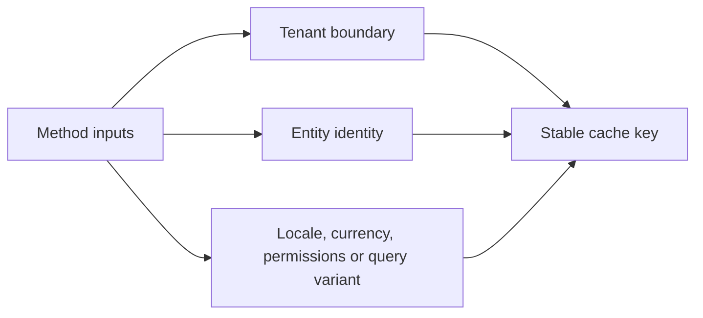

## Проверочный список key design

- включает ли key tenant/environment boundary;
- зависит ли result от locale, currency, role или feature flag;
- стабилен ли `toString()` аргумента;
- не содержит ли mutable object;
- одинаково ли формируется key на всех nodes и versions;
- нужна ли schema generation в prefix.

# 6. `@CachePut` и `@CacheEvict`

## `@CachePut`

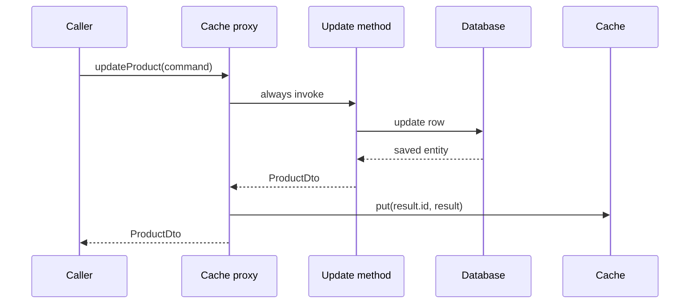

## `@CacheEvict` after invocation

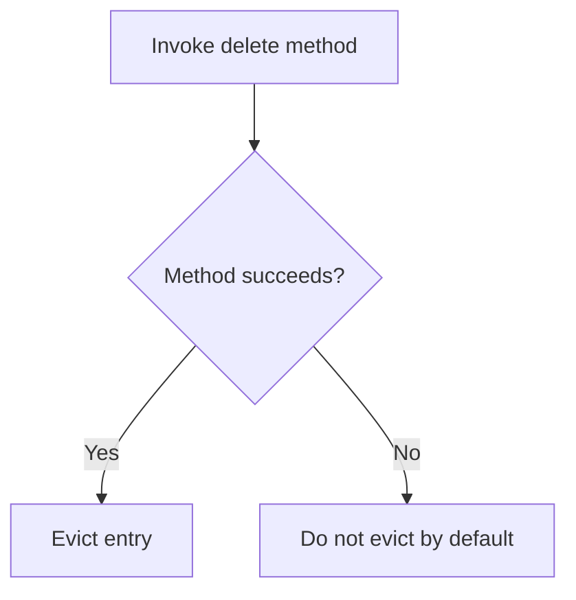

## `beforeInvocation=true`

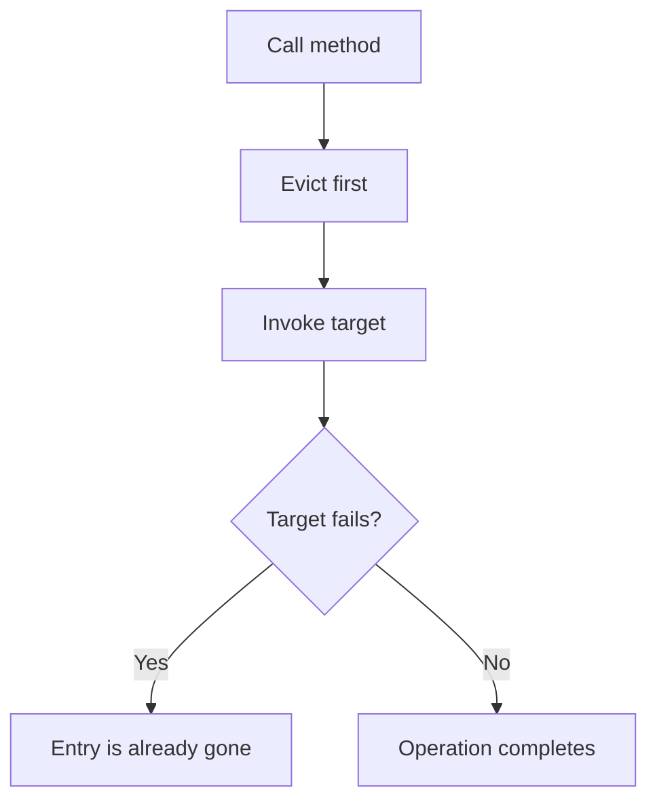

# 7. Transaction и cache timing

## Опасный порядок: cache обновился до commit

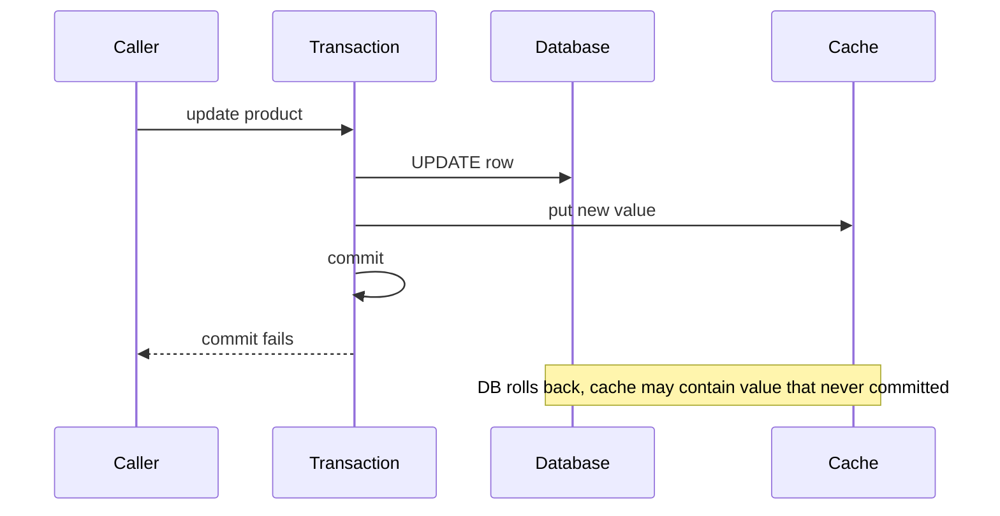

## Transaction-aware timing

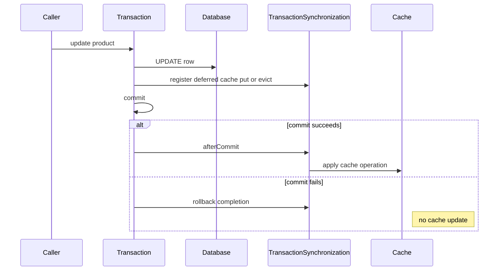

> [!important]
> Transaction-aware cache timing уменьшает окно inconsistency, но не создаёт XA atomicity между database и Redis.

# 8. Caffeine: локальная topology

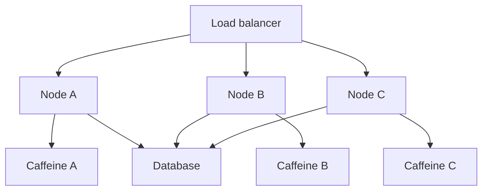

Каждая JVM имеет отдельный state:

```text
Node A cache key 42 = version 7
Node B cache key 42 = version 6
Node C cache key 42 = absent
```

## Почему это важно

- update на node A не инвалидирует B и C;
- restart очищает local cache;
- deployment создаёт cold nodes;
- sticky sessions могут маскировать inconsistency;
- hit ratio каждого node отличается.

# 9. Caffeine eviction и expiration

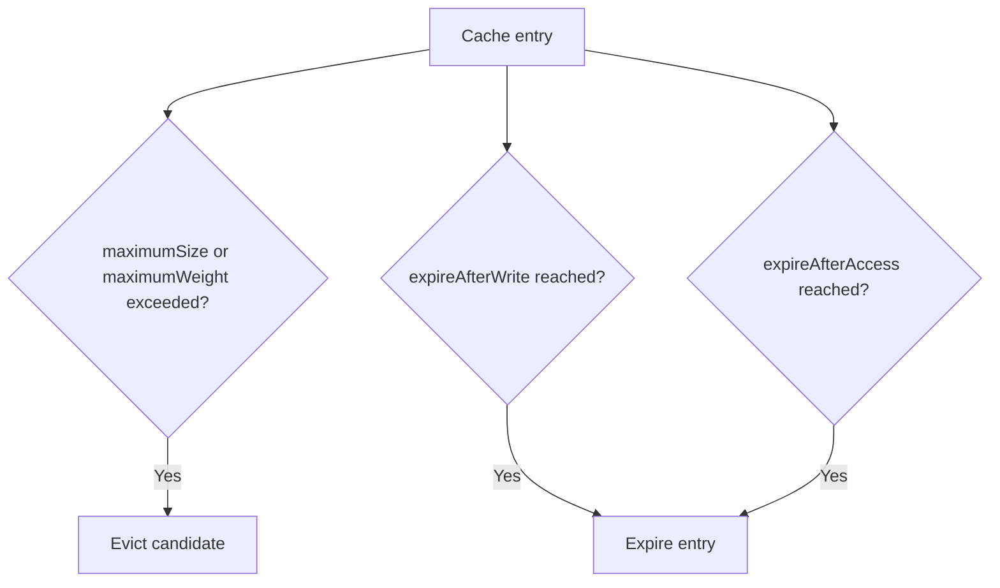

## `maximumSize` против `maximumWeight`

```text
maximumSize   → ограничивает количество entries
maximumWeight → ограничивает сумму custom weights
```

Большой PDF preview и маленький status DTO не должны обязательно считаться одинаково.

# 10. Redis: shared topology

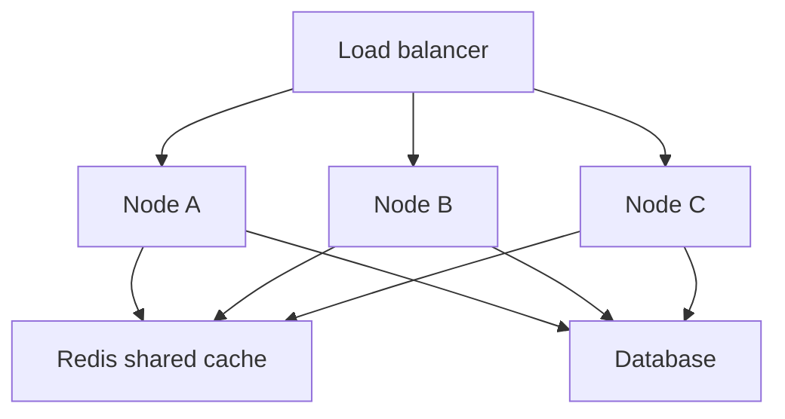

Shared state решает проблему независимых local entries, но добавляет:

- network latency;
- serialization boundary;
- Redis availability dependency;
- hot keys;
- connection-pool limits;
- cross-version compatibility.

# 11. Serialization как wire contract

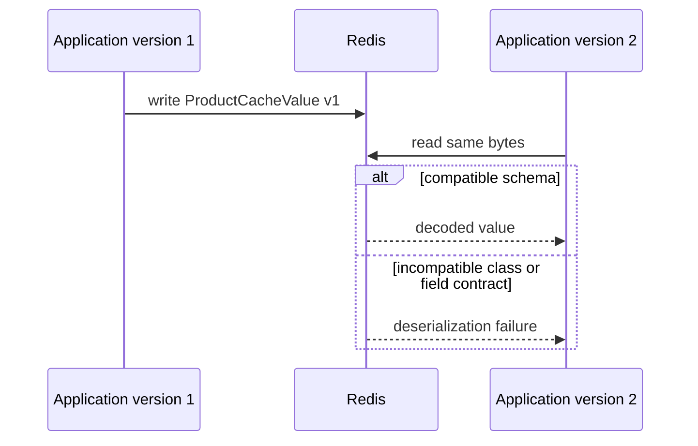

## Практический envelope

```java
final class ProductCacheValue {
    private int schemaVersion;
    private long id;
    private String name;
    private long sourceVersion;
}
```

## Versioned keyspace

```text
catalog:prod:product:v3::42
```

При несовместимом rollout можно сменить generation и прогреть новый keyspace без чтения старого format.

# 12. TTL не заменяет invalidation

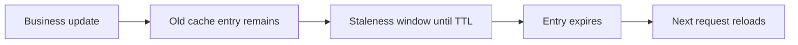

TTL отвечает на вопрос:

```text
Как долго entry может жить без явного изменения?
```

Invalidation отвечает:

```text
Что делать, когда business state уже изменился?
```

Для balance, permissions и limits допустимое staleness window может быть близко к нулю.

# 13. Cache stampede

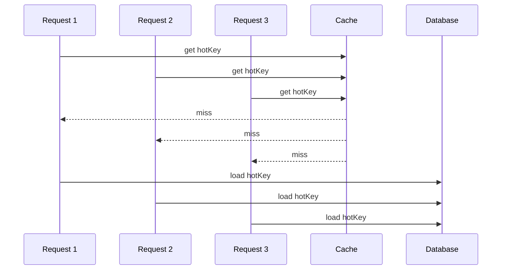

## Защита

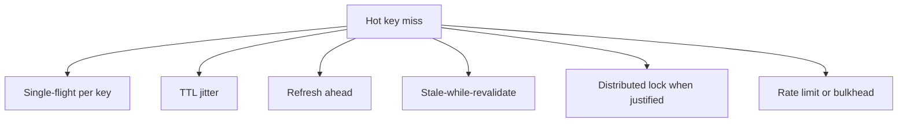

# 14. `sync=true`: граница локальной координации

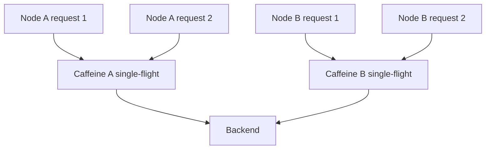

`sync=true` может объединить concurrent loads внутри конкретного provider/cache instance, но два nodes всё ещё способны одновременно загрузить один key.

# 15. L1 Caffeine + L2 Redis

## Read path

```mermaid
sequenceDiagram
    participant C as Caller
    participant L1 as Caffeine L1
    participant L2 as Redis L2
    participant DB as Database

    C->>L1: get key
    alt L1 hit
        L1-->>C: value
    else L1 miss
        L1->>L2: get key
        alt L2 hit
            L2-->>L1: value
            L1->>L1: populate
            L1-->>C: value
        else L2 miss
            L2->>DB: load
            DB-->>L2: value
            L2->>L2: store
            L2-->>L1: value
            L1->>L1: store
            L1-->>C: value
        end
    end
```

## Update и invalidation

```mermaid
sequenceDiagram
    participant U as Update service
    participant DB as Database
    participant L2 as Redis
    participant Bus as Invalidation channel
    participant A as Node A L1
    participant B as Node B L1
    participant C as Node C L1

    U->>DB: commit new version
    U->>L2: evict or update key
    U->>Bus: publish invalidation event
    Bus->>A: evict key
    Bus->>B: evict key
    Bus->>C: evict key
```

## Основной риск

Redis entry можно обновить, но remote L1 caches продолжат отдавать старые values, пока не истечёт L1 TTL или не придёт invalidation event.

# 16. Почему список cacheNames не создаёт L1/L2 автоматически

```java
@Cacheable(cacheNames = {"productsL1", "productsL2"}, key = "#id")
public ProductDto find(Long id) {
    return repository.find(id);
}
```

Эта запись не определяет полноценный multi-tier protocol:

- порядок lookup;
- promotion L2 → L1;
- partial hit behavior;
- invalidation всех L1 nodes;
- разные TTL;
- failure policy;
- version comparison.

Multi-level cache требует явного orchestration либо специализированного composite implementation.

# 17. Redis outage как каскадный failure

```mermaid
flowchart TD
    R["Redis outage"] --> B["All nodes bypass cache"]
    B --> D["Database traffic spikes"]
    D --> P["DB pool saturation"]
    P --> T["Request latency and timeouts"]
    T --> Retry["Clients retry"]
    Retry --> D
```

## Failure policy должна ответить

- fail-open или fail-closed;
- можно ли вернуть stale value;
- сколько direct DB traffic выдержит система;
- нужен ли rate limit;
- какие operations critical;
- как отключить cache retries;
- как контролировать connection storms после recovery.

# 18. Negative caching

```mermaid
flowchart TD
    A["Lookup entity 999"] --> B{"Found?"}
    B -->|No| C["Store short-lived NOT_FOUND marker"]
    C --> D["Repeated requests avoid DB"]
    D --> E["Short TTL expires"]
```

Negative caching полезен против repeated misses, но требует осторожности:

- object может быть создан сразу после miss;
- слишком длинный TTL скрывает новое состояние;
- authorization failure нельзя путать с absence;
- null serialization policy должна быть явной.

# 19. Metrics и observability

```mermaid
flowchart LR
    Metrics["Cache metrics"] --> Hit["hit rate"]
    Metrics --> Miss["miss rate"]
    Metrics --> Load["load latency"]
    Metrics --> Evict["eviction count"]
    Metrics --> Size["estimated size"]
    Metrics --> Errors["provider errors"]
    Metrics --> Stale["stale-version detection"]
```

Высокий hit rate сам по себе не доказывает корректность. Cache может быстро возвращать устаревшие или tenant-wrong values.

# 20. Диагностическое дерево

```mermaid
flowchart TD
    A["Cache seems ineffective or incorrect"] --> B{"Proxy crossing exists?"}
    B -->|No| B1["Check self-invocation and manual new"]
    B -->|Yes| C{"Correct CacheManager selected?"}
    C -->|No| C1["Check qualifiers, primary and resolver"]
    C -->|Yes| D{"Expected cache name exists?"}
    D -->|No| D1["Check configuration and dynamic creation"]
    D -->|Yes| E{"Calculated key stable and complete?"}
    E -->|No| E1["Fix identity, tenant and variants"]
    E -->|Yes| F{"Entry expires or is evicted too early?"}
    F -->|Yes| F1["Inspect TTL, size, weight and invalidations"]
    F -->|No| G{"Provider errors or topology mismatch?"}
    G -->|Yes| G1["Inspect Redis connectivity or local-node isolation"]
    G -->|No| H["Inspect hit, miss, load and stale-version metrics"]
```

# 21. Полный production case: product catalogue

## Требования

- 20 application nodes;
- product reads — 50 000 RPS;
- updates — 20 RPS;
- допустимая staleness — 5 seconds;
- Redis доступен, но возможны короткие outages;
- product DTO меняется при deployments.

## Возможная topology

```mermaid
flowchart TB
    Client["Clients"] --> LB["Load balancer"]
    LB --> A["Node A + Caffeine L1"]
    LB --> B["Node B + Caffeine L1"]
    LB --> N["Node N + Caffeine L1"]
    A --> R["Redis L2"]
    B --> R
    N --> R
    R --> DB["PostgreSQL"]
    Update["Product update service"] --> DB
    Update --> R
    Update --> Bus["Invalidation topic"]
    Bus --> A
    Bus --> B
    Bus --> N
```

## Политика

```text
L1 TTL            3 seconds
L2 TTL           10 minutes + jitter
Key generation    catalog:prod:product:v4:{tenant}:{id}
Value             ProductCacheValue schemaVersion=4
Update             DB commit → L2 evict → invalidation event
Redis outage       bounded DB fallback + rate limit + stale L1 where allowed
```

## Что проверять в production

- L1 hit ratio по node;
- Redis hit ratio;
- DB load during Redis outage;
- invalidation delivery lag;
- stale sourceVersion count;
- deserialization errors during rollout;
- hot-key load latency;
- cache key cardinality.

# 22. Как объяснять caching на собеседовании

```text
1. Spring Cache — proxy abstraction, provider — storage semantics.
2. @Cacheable на hit пропускает target method.
3. Key определяет identity и isolation.
4. Caffeine локален одной JVM; Redis разделяется между nodes.
5. TTL ограничивает возраст, но не заменяет invalidation.
6. sync=true не является distributed lock по умолчанию.
7. L1/L2 требует явного promotion и invalidation protocol.
8. Cache outage может перегрузить database.
9. Serialization — межверсионный wire contract.
10. Диагностика начинается с proxy, manager, cache, key, policy и metrics.
```

# 23. Практические упражнения

1. Доказать self-invocation для `@Cacheable` счётчиком repository calls.
2. Создать tenant collision с key только по `customerId`.
3. Запустить два JVM с Caffeine и показать независимые values.
4. Изменить Redis DTO между двумя versions и воспроизвести deserialization problem.
5. Запустить 20 threads на expired hot key и измерить stampede.
6. Сравнить `expireAfterWrite` и `expireAfterAccess`.
7. Смоделировать Redis outage и измерить рост DB load.
8. Реализовать L1 invalidation event и проверить три local nodes.

## Related materials

- [[Spring Cache with Caffeine and Redis]]
- [[30_CERTIFICATIONS/Spring/2V0-72.22/CACHE-B01/CACHE-B01 Cards]]
- [[50_LABS/Spring/CACHE-B01/README]]
- [[40_PRODUCTION_CASES/Spring/AOP and Cache Production Cases]]
- [[Spring AOP Visual Deep Dive]]
