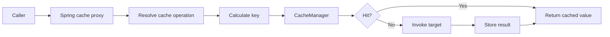
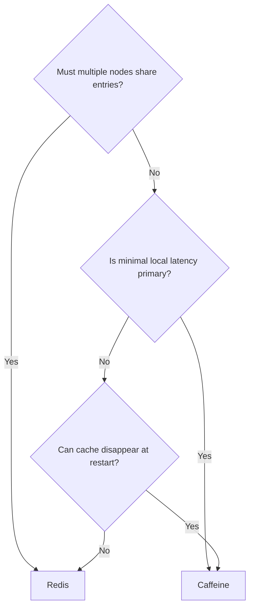
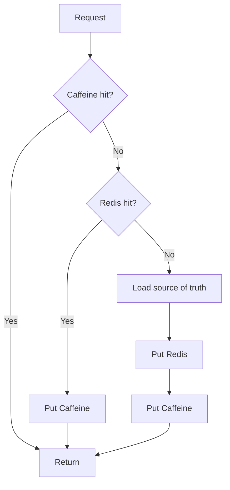

# Spring Cache with Caffeine and Redis

> [!summary] За 30 секунд
> Spring Cache — proxy-based abstraction, а не storage. `@Cacheable` вычисляет key и может вернуть cached value без вызова target method. `@CachePut` всегда выполняет method и записывает result. `@CacheEvict` удаляет entry. Caffeine хранит cache внутри одного JVM; Redis хранит serialized entries во внешнем shared store. Основные production-риски: неправильный key, self-invocation, stale data, stampede, Redis outage, serialization incompatibility и несогласованная L1/L2 invalidation.

## Главная модель



Spring отвечает за:

- annotations и AOP interception;
- cache name selection;
- key generation;
- `condition`/`unless` evaluation;
- put/evict orchestration;
- выбор `CacheManager` или `CacheResolver`.

Provider отвечает за:

- physical storage;
- concurrency behavior;
- expiration/eviction;
- serialization;
- distributed availability;
- provider-specific statistics.

> **Spring decides when. Provider decides where and how.**

---

# 1. Включение caching infrastructure

```java
@Configuration
@EnableCaching
class CacheConfiguration {
}
```

`@EnableCaching` регистрирует advisor/interceptor infrastructure. Annotation на method сама по себе не создаёт cache storage.

Нужен `CacheManager`:

```java
@Bean
CacheManager cacheManager() {
    return new ConcurrentMapCacheManager("productById");
}
```

Для production provider выбирается осознанно: Caffeine, Redis, JCache и другие.

---

# 2. `@Cacheable`: skip target on hit

```java
@Service
class ProductQueryService {

    private final ProductRepository repository;

    ProductQueryService(ProductRepository repository) {
        this.repository = repository;
    }

    @Cacheable(
            cacheNames = "productById",
            key = "#productId",
            unless = "#result == null"
    )
    public ProductDto findById(Long productId) {
        return repository.findById(productId)
                .map(ProductDto::from)
                .orElse(null);
    }
}
```

## First call

```text
findById(42)
    ↓
key 42 is absent
    ↓
repository call
    ↓
result stored
```

## Second call

```text
findById(42)
    ↓
key 42 exists
    ↓
return cached ProductDto
    ↓
repository method is skipped
```

## Important consequence

Любые side effects внутри cached query также пропускаются на hit.

Плохо:

```java
@Cacheable("customer")
public CustomerDto find(Long id) {
    auditRepository.save(new ReadAudit(id));
    return repository.load(id);
}
```

Audit будет создаваться только на misses. Cached query должен быть близок к side-effect-free read operation.

---

# 3. `condition` и `unless`

```java
@Cacheable(
        cacheNames = "search",
        key = "#request.cacheKey()",
        condition = "#request.cacheable",
        unless = "#result == null || #result.items.isEmpty()"
)
public SearchResult search(SearchRequest request) {
    return gateway.search(request);
}
```

- `condition` вычисляется до target invocation;
- `unless` вычисляется после target invocation и может использовать `#result`;
- `condition=false` означает: method выполняется, но cache operation не применяется;
- `unless=true` означает: result возвращается caller, но не сохраняется.

## Safe navigation

```java
unless = "#result?.items?.isEmpty()"
```

нужно применять осторожно и тестировать на фактической модели SpEL.

---

# 4. Критическая совместимость `sync=true`

```java
@Cacheable(
        cacheNames = "exchangeRate",
        key = "#pair",
        sync = true
)
public ExchangeRate load(String pair) {
    return remoteClient.load(pair);
}
```

`sync=true` просит provider выполнить combined get-or-load operation для одного key.

## Ограничения Spring Cache

При `sync=true`:

1. `unless` не поддерживается;
2. должен быть указан один cache;
3. operation нельзя комбинировать с другими cache operations на том же method.

Неверно:

```java
@Cacheable(
        cacheNames = "productById",
        sync = true,
        unless = "#result == null"
)
```

Это не просто сомнительный стиль, а несовместимая cache operation configuration.

## Provider boundary

`sync=true` является hint на provider semantics. Локальная coordination одного Caffeine cache не превращается в distributed lock между несколькими JVM.

```text
node A synchronizes load for key 42
node B synchronizes load for key 42
node C synchronizes load for key 42
```

Три nodes всё ещё могут одновременно выполнить три backend loads.

---

# 5. `@CachePut`: method always runs

```java
@Transactional
@CachePut(
        cacheNames = "productById",
        key = "#tenantId + ':' + #result.id"
)
public ProductDto update(
        String tenantId,
        UpdateProductCommand command
) {
    Product saved = repository.save(
            command.applyTo(repository.getRequired(tenantId, command.id()))
    );
    return ProductDto.from(saved);
}
```

Sequence:

```text
invoke target
    ↓
update source of truth
    ↓
produce canonical DTO
    ↓
put DTO into cache
```

`@CachePut` не является read optimization: target method выполняется всегда.

## Почему `@Cacheable` + `@CachePut` на одном method подозрительно

- `@Cacheable` хочет пропустить method на hit;
- `@CachePut` требует всегда выполнить method.

Такая комбинация допустима только при взаимоисключающих conditions и требует очень сильного обоснования.

---

# 6. `@CacheEvict`: remove stale copy

```java
@Transactional
@CacheEvict(
        cacheNames = "productById",
        key = "#tenantId + ':' + #productId"
)
public void delete(String tenantId, Long productId) {
    repository.delete(tenantId, productId);
}
```

По умолчанию eviction происходит после успешного method invocation.

## `beforeInvocation=true`

```java
@CacheEvict(
        cacheNames = "catalogSearch",
        allEntries = true,
        beforeInvocation = true
)
public void rebuildSearchIndex() {
    indexer.rebuild();
}
```

Cache очищается до выполнения method и останется очищенным даже при exception.

Это правильно только если failure semantics действительно требуют немедленной invalidation.

## Точечная eviction предпочтительнее clear

```text
evict product 42
```

лучше, чем:

```text
clear 2 million product entries
```

Mass eviction может создать miss storm.

---

# 7. Cache key — часть security и data contract

## Tenant collision

Опасно:

```java
key = "#customerId"
```

Если tenant A и tenant B имеют customer `42`, key collision может вернуть чужие данные.

Безопаснее:

```java
key = "#tenantId + ':' + #customerId"
```

## Environment и service isolation

Redis keyspace:

```text
bank:prod:catalog:v2:productById::tenant-A:42
```

Prefix может включать:

- service;
- environment;
- bounded context;
- schema version;
- cache name.

Не помещай sensitive personal data или secrets в plaintext key без необходимости.

## Object key stability

```java
@Cacheable("search")
public Result search(SearchRequest request)
```

Если `SearchRequest.equals/hashCode` не выражает logical identity, default key может быть нестабильным.

Предпочтительно:

```java
key = "#request.normalizedQuery + ':' + #request.page + ':' + #request.size"
```

---

# 8. Self-invocation: тот же AOP law

```java
@Service
class ProductService {

    public ProductPage loadPage(Long id) {
        ProductDto dto = find(id);
        return ProductPage.from(dto);
    }

    @Cacheable("productById")
    public ProductDto find(Long id) {
        return repository.load(id);
    }
}
```

`loadPage()` вошёл в target и вызвал `this.find()`. Cache interceptor не получил второй invocation.

Исправление:

```java
@Service
class ProductPageService {
    private final ProductQueryService queryService;

    ProductPage loadPage(Long id) {
        return ProductPage.from(queryService.find(id));
    }
}
```

Подробно: [[Spring AOP Proxy Mechanics]].

---

# 9. Cache stampede

```text
popular entry expires
    ↓
500 requests observe miss
    ↓
500 DB/HTTP loads
    ↓
backing service overload
```

Strategies:

- `sync=true` for provider-supported same-cache coordination;
- refresh-ahead;
- stale-while-revalidate;
- TTL jitter;
- request coalescing;
- distributed lock for selected expensive keys;
- bounded loader executor;
- database bulkhead;
- warm-up of known hot keys.

## TTL jitter

```text
base TTL 10 minutes
+ random 0..60 seconds
```

снижает вероятность одновременного expiration большого набора entries.

---

# 10. Negative caching

Частые requests к отсутствующему ID могут каждый раз нагружать source of truth.

Варианты:

```text
Optional.empty
explicit NotFound marker
short-lived negative entry
```

## Trade-off

Если object появился через 10 секунд, а negative TTL — 10 минут, callers ещё долго будут видеть отсутствие.

Рекомендации:

- negative TTL короче positive TTL;
- explicit marker вместо неявной null policy;
- create/update operation должна evict negative entry;
- измерять долю negative hits.

---

# 11. Caffeine — local in-memory cache

```text
node A → Caffeine A
node B → Caffeine B
node C → Caffeine C
```

## Java 8 configuration

```java
@Configuration
@EnableCaching
class CaffeineConfiguration {

    @Bean
    CacheManager cacheManager() {
        CaffeineCacheManager manager =
                new CaffeineCacheManager("productById", "exchangeRate");

        manager.setCaffeine(
                Caffeine.newBuilder()
                        .maximumSize(10_000)
                        .expireAfterWrite(5, TimeUnit.MINUTES)
                        .recordStats()
        );
        manager.setAllowNullValues(false);
        return manager;
    }
}
```

Для Java 8 lab используется Caffeine `2.9.3`.

## Сильные стороны

- нет network hop;
- очень низкая latency;
- эффективная concurrency;
- size/weight-based eviction;
- expiration;
- statistics;
- application не зависит от отдельного cache server для local reads.

## Ограничения

- entry виден только одному JVM;
- restart очищает cache;
- memory pressure остаётся в application heap;
- cross-node invalidation отсутствует автоматически;
- rolling deployment создаёт разные cache ages;
- load balancer распределяет hit rate между nodes.

---

# 12. Caffeine size и weight

## `maximumSize`

```java
Caffeine.newBuilder()
        .maximumSize(50_000)
```

Ограничивает число entries.

## `maximumWeight`

```java
Caffeine.newBuilder()
        .maximumWeight(100_000_000)
        .weigher((String key, ProductDto value) -> value.estimatedBytes())
```

Используется, когда один entry может занимать 2 KB, а другой — 5 MB.

> Weight является application estimate, а не точным измерением JVM retained heap.

---

# 13. Caffeine expiration

```java
expireAfterWrite(5, TimeUnit.MINUTES)
```

Срок отсчитывается после write/update.

```java
expireAfterAccess(10, TimeUnit.MINUTES)
```

Срок отсчитывается после последнего access.

## Expiration vs refresh

```text
expiration → value becomes unavailable/removed
refresh    → provider initiates reload, potentially serving old value meanwhile
```

Spring Cache annotations не выражают все native Caffeine capabilities. Для refresh-ahead может понадобиться native LoadingCache или custom adapter.

---

# 14. Caffeine statistics

```java
CaffeineCache springCache =
        (CaffeineCache) cacheManager.getCache("productById");

com.github.benmanes.caffeine.cache.Cache<Object, Object> nativeCache =
        springCache.getNativeCache();

CacheStats stats = nativeCache.stats();
```

Поля:

- hit count/rate;
- miss count;
- load success/failure;
- total load time;
- eviction count/weight;
- estimated size.

> Высокий hit rate не доказывает корректность: cache может стабильно возвращать stale или неправильно изолированные данные.

---

# 15. Redis — shared external cache

```text
node A ─┐
node B ─┼── Redis
node C ─┘
```

## Configuration for Spring Data Redis 2.7 generation

```java
@Bean
RedisCacheManager cacheManager(
        RedisConnectionFactory connectionFactory
) {
    GenericJackson2JsonRedisSerializer json =
            new GenericJackson2JsonRedisSerializer();

    RedisCacheConfiguration defaults =
            RedisCacheConfiguration.defaultCacheConfig()
                    .entryTtl(Duration.ofMinutes(10))
                    .disableCachingNullValues()
                    .computePrefixWith(
                            name -> "bank:prod:catalog:v2:" + name + "::"
                    )
                    .serializeKeysWith(
                            RedisSerializationContext.SerializationPair
                                    .fromSerializer(new StringRedisSerializer())
                    )
                    .serializeValuesWith(
                            RedisSerializationContext.SerializationPair
                                    .fromSerializer(json)
                    );

    Map<String, RedisCacheConfiguration> specific = new HashMap<>();
    specific.put(
            "exchangeRate",
            defaults.entryTtl(Duration.ofSeconds(30))
    );
    specific.put(
            "productById",
            defaults.entryTtl(Duration.ofMinutes(15))
    );

    return RedisCacheManager.builder(connectionFactory)
            .cacheDefaults(defaults)
            .withInitialCacheConfigurations(specific)
            .transactionAware()
            .build();
}
```

## Сильные стороны

- shared entries между application nodes;
- application restart не очищает shared cache;
- memory отделена от JVM heap;
- centralized TTL;
- shared eviction;
- operational inspection через Redis tools.

## Ограничения

- network latency;
- serialization/deserialization;
- Redis availability dependency;
- connection limits;
- hot keys;
- Redis memory policy;
- cluster/Sentinel topology;
- rolling-version compatibility;
- distributed stampede.

---

# 16. Redis serialization contract

Redis хранит bytes, а не Java object reference.

## Не кешировать persistence entity

Проблемы:

- lazy proxies;
- persistence context assumptions;
- bidirectional graphs;
- unstable internal fields;
- huge payloads;
- version coupling.

Предпочтительно:

```java
public final class CachedProduct {
    private String schemaVersion;
    private Long id;
    private String name;
    private BigDecimal price;
}
```

## JDK serialization

Риски:

- Java-specific binary format;
- class evolution;
- operational unreadability;
- security implications;
- coupling to exact class names.

## JSON serialization

Плюсы:

- читаемость;
- interoperability;
- easier diagnostics.

Риски:

- polymorphic type metadata;
- larger payload;
- date/time format;
- backward compatibility;
- field rename/type change.

## Versioned namespace

```text
bank:prod:catalog:v1:productById::42
bank:prod:catalog:v2:productById::42
```

позволяет безопаснее провести rolling migration.

---

# 17. Redis TTL — freshness contract

| Data | Reasoning |
|---|---|
| exchange rate | seconds/minutes; source changes often |
| product details | minutes plus explicit eviction on update |
| country directory | hours; rarely changes |
| authorization decision | short and carefully invalidated |
| negative result | shorter than positive result |

## Ошибка мышления

> «Поставим TTL 5 минут, значит consistency решена».

Нет. В течение пяти минут stale value всё ещё допустимо. TTL лишь ограничивает максимальную жизнь entry при отсутствии других invalidation events.

---

# 18. Redis prefix и clear strategy

Prefix:

```text
service:environment:context:schema:cacheName::businessKey
```

Cache-wide clear в большом keyspace может быть дорогим. `KEYS`-based clearing плохо масштабируется. Версия Spring Data Redis, driver и deployment topology определяют доступность `SCAN`-based batch strategy.

Production questions:

1. Сколько entries в region?
2. Нужен ли вообще `allEntries=true`?
3. Можно ли сменить namespace generation вместо clear?
4. Redis standalone, Sentinel или Cluster?
5. Lettuce или Jedis?
6. Как ведёт себя clear во время peak load?

---

# 19. Transaction-aware cache timing

```java
RedisCacheManager.builder(connectionFactory)
        .transactionAware()
        .build();
```

Идея: cache put/evict синхронизируется с Spring transaction completion там, где integration это поддерживает.

Без ordering:

```text
DB update starts
    ↓
cache receives new value
    ↓
DB transaction rolls back
    ↓
cache contains data never committed in DB
```

> `transactionAware()` не создаёт atomic distributed transaction между database и Redis. Это coordination of timing, не XA guarantee.

Для критичной consistency часто проще:

```text
DB transaction commits
    ↓
after-commit event/outbox
    ↓
cache invalidation
```

с пониманием временного окна и retry semantics.

---

# 20. Caffeine vs Redis

| Criterion | Caffeine | Redis |
|---|---|---|
| Location | JVM heap | external process/cluster |
| Network | none | required |
| Shared between nodes | no | yes |
| Survives app restart | no | yes |
| Serialization | usually no | required |
| Latency | minimal | network + codec |
| Failure dependency | local memory | Redis availability |
| Invalidation scope | current node | shared L2 |
| Operational complexity | lower | higher |
| Typical role | L1/hot local data | shared L2/distributed data |

## Decision tree



---

# 21. L1 Caffeine + L2 Redis



## Главный риск

После update:

```text
DB updated
Redis evicted
Caffeine node A evicted
Caffeine nodes B/C still contain old value
```

Нужен protocol:

- invalidation event;
- local TTL;
- version/generation token;
- Pub/Sub или message broker;
- explicit bounded-staleness contract.

## Race после invalidation

```text
node B starts loading old value
invalidation event arrives
node B completes and writes old value after event
```

Одного broadcast недостаточно без version/order semantics.

---

# 22. Redis outage policy

## Policy A: fail request

Используется, если cache — serving source и backend нельзя безопасно вызвать напрямую.

## Policy B: bypass to source of truth

Подходит, если source имеет достаточную capacity.

Риск:

```text
Redis outage
    ↓
all nodes bypass
    ↓
database overload
    ↓
full system outage
```

## Policy C: stale local fallback

Повышает availability, но требует явного freshness contract.

Controls:

- circuit breaker;
- bulkhead;
- rate limiter;
- bounded DB concurrency;
- retry suppression;
- stale cache;
- cache-loss load test.

---

# 23. Real multi-tenant product service

```java
@Service
@CacheConfig(cacheNames = "productById")
class ProductQueryService {

    private final ProductRepository repository;

    @Cacheable(
            key = "#tenantId + ':' + #productId",
            unless = "#result == null"
    )
    public ProductDto find(
            String tenantId,
            Long productId
    ) {
        return repository.find(tenantId, productId)
                .map(ProductDto::from)
                .orElse(null);
    }
}
```

Write service:

```java
@Service
@CacheConfig(cacheNames = "productById")
class ProductCommandService {

    @Transactional
    @CachePut(key = "#tenantId + ':' + #result.id")
    public ProductDto update(
            String tenantId,
            UpdateProductCommand command
    ) {
        Product product = repository.save(
                command.applyTo(
                        repository.getRequired(tenantId, command.id())
                )
        );
        return ProductDto.from(product);
    }

    @Transactional
    @CacheEvict(key = "#tenantId + ':' + #productId")
    public void delete(String tenantId, Long productId) {
        repository.delete(tenantId, productId);
    }
}
```

Review questions:

1. Одинаков ли key format во всех operations?
2. Что происходит с list/search caches?
3. Когда cache put/evict становится visible относительно DB commit?
4. Как обрабатывается not-found?
5. Что будет при Redis outage?
6. Совместим ли DTO с предыдущей application version?
7. Как инвалидируется Caffeine на других nodes?

---

# 24. Metrics, которые доказывают пользу

- hit/miss rate per cache;
- load latency;
- load failures;
- eviction count;
- estimated local size;
- Redis command latency;
- Redis connection errors;
- value payload size;
- DB requests avoided;
- stale-data incidents;
- concurrent loads per key;
- cache outage fallback traffic;
- serialization failures;
- invalidation lag.

Плохая метрика:

```text
cache contains 100,000 entries
```

Она не отвечает, полезны ли entries, актуальны ли они и сколько memory занимают.

---

# 25. Диагностика «кеш не работает»

1. `@EnableCaching` активен?
2. Bean создан Spring?
3. Runtime object является proxy?
4. Caller вошёл через proxy или self-invocation?
5. Какой `CacheManager` выбран?
6. Какой cache name?
7. Какой key вычислен?
8. `condition` пропускает operation?
9. `unless` veto-ит result?
10. Не используется ли запрещённая комбинация `sync=true` + `unless`?
11. Provider разрешает null?
12. Entry уже истёк?
13. Другой operation выполняет eviction?
14. Caffeine entry ищется на том же node?
15. Redis prefix/environment совпадает?
16. Serializer читает старую версию value?
17. Есть реальные hit/miss metrics?
18. Не создаётся ли отдельный context и новый CacheManager?

---

# Senior interview answer

> Spring Cache — proxy-based abstraction над CacheManager и provider caches. `@Cacheable` проверяет key и пропускает target invocation при hit; `@CachePut` всегда вызывает method; `@CacheEvict` удаляет entry. Caffeine — быстрый local in-memory cache одного JVM. Redis — shared external cache с network и serialization costs. `sync=true` помогает координировать same-key load в рамках provider, но не поддерживает `unless` и не является автоматически cluster-wide lock. Production design должен определить key identity, TTL, invalidation, outage policy, serializer compatibility, stampede controls и L1/L2 consistency.

## Memory hooks

> **Spring Cache decides when. Provider decides where and how.**

> **Caffeine is local speed. Redis is shared state.**

> **Every cache entry is a replicated copy with a freshness contract.**

> **TTL limits age; invalidation follows business change.**

## Practice

- [[30_CERTIFICATIONS/Spring/2V0-72.22/CACHE-B01/CACHE-B01 Cards]]
- [[40_PRODUCTION_CASES/Spring/AOP and Cache Production Cases]]
- [[50_LABS/Spring/CACHE-B01/README]]
- [[01_MAPS/Spring AOP and Caching Map.canvas]]

## Sources

- [[98_SOURCES/Spring AOP and Cache Sources]]
