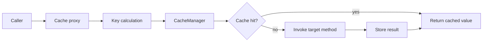
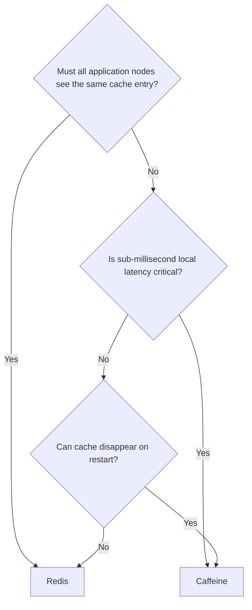

# Spring Cache with Caffeine and Redis

> [!summary] За 30 секунд
> Spring Cache — abstraction и AOP advice, а не storage. `@Cacheable` вычисляет key, спрашивает выбранный `CacheManager`, при hit возвращает значение без вызова method, при miss вызывает target и сохраняет result. Caffeine хранит данные локально в памяти одного JVM; Redis хранит их вне процесса и позволяет нескольким application instances использовать общий cache. Выбор влияет на latency, consistency, failure modes и invalidation.

## Главная модель



Spring отвечает за:

- annotations;
- key calculation;
- conditional caching;
- method interception;
- selection of cache/cache manager;
- put/evict orchestration.

Cache provider отвечает за:

- physical storage;
- eviction policy;
- TTL/TTI semantics;
- serialization;
- concurrency behavior;
- distributed availability;
- statistics.

---

# 1. `@EnableCaching`

```java
@Configuration
@EnableCaching
class CacheConfiguration {
}
```

Spring регистрирует infrastructure, которая ищет cache annotations и создаёт proxy/advisor.

> [!warning]
> Annotation сама по себе не кеширует. Нужны caching infrastructure и `CacheManager`.

---

# 2. `@Cacheable`

```java
@Service
class ProductQueryService {

    private final ProductRepository repository;

    ProductQueryService(ProductRepository repository) {
        this.repository = repository;
    }

    @Cacheable(
            cacheNames = "productById",
            key = "#productId",
            unless = "#result == null",
            sync = true
    )
    public ProductDto findById(Long productId) {
        return repository.findById(productId)
                .map(ProductDto::from)
                .orElse(null);
    }
}
```

## Hit

```text
findById(42)
    ↓
key = 42
    ↓
cache contains 42
    ↓
return cached ProductDto
    ↓
repository is not called
```

## Miss

```text
findById(42)
    ↓
cache miss
    ↓
repository call
    ↓
store result under key 42
    ↓
return result
```

## `condition` vs `unless`

```java
@Cacheable(
    cacheNames = "search",
    key = "#request.normalizedKey()",
    condition = "#request.cacheable",
    unless = "#result == null || #result.items.isEmpty()"
)
```

- `condition` проверяется до method invocation;
- `unless` может проверять `#result` после invocation и veto-ить запись.

---

# 3. Cache key — часть data contract

Плохой key:

```java
@Cacheable(cacheNames = "customer")
public Customer find(CustomerSearchRequest request)
```

Если `CustomerSearchRequest` не имеет стабильных `equals/hashCode`, cache hit может зависеть от object identity.

Хороший key:

```java
@Cacheable(
    cacheNames = "customerByTenantAndId",
    key = "#tenantId + ':' + #customerId"
)
public Customer find(String tenantId, Long customerId)
```

## Tenant isolation

Ключ только по `customerId` опасен:

```text
Tenant A, customer 42
Tenant B, customer 42
```

Без tenant в key один tenant может получить data другого tenant.

## Versioning key namespace

При несовместимом изменении serialized value:

```text
v1:productById::42
v2:productById::42
```

Versioned prefix позволяет мигрировать без массового чтения старого schema.

---

# 4. `@CachePut`

```java
@CachePut(cacheNames = "productById", key = "#result.id")
public ProductDto update(UpdateProductCommand command) {
    Product product = repository.save(command.apply());
    return ProductDto.from(product);
}
```

Method всегда выполняется, затем result записывается в cache.

Использование:

- write-through update;
- обновление cache после успешной business operation;
- сохранение canonical value, возвращённого persistence layer.

Не смешивай без крайней необходимости `@Cacheable` и `@CachePut` на одном method: один advice хочет пропустить invocation при hit, другой обязан invocation выполнить.

---

# 5. `@CacheEvict`

```java
@CacheEvict(cacheNames = "productById", key = "#productId")
public void delete(Long productId) {
    repository.deleteById(productId);
}
```

## Eviction после success

По умолчанию eviction выполняется после успешного method invocation.

## `beforeInvocation=true`

```java
@CacheEvict(
    cacheNames = "productSearch",
    allEntries = true,
    beforeInvocation = true
)
public void rebuildIndex() {
    // ...
}
```

Cache очищается даже если method завершится exception. Это меняет failure semantics и должно быть осознанным решением.

## Точечная eviction против `allEntries`

Предпочтительно:

```text
evict product 42
```

а не:

```text
clear every product cache entry
```

Cache-wide clear создаёт miss storm и нагрузку на database.

---

# 6. Self-invocation

```java
@Service
class ProductService {

    public ProductDto loadForPage(Long id) {
        return findById(id); // this-call
    }

    @Cacheable(cacheNames = "productById", key = "#id")
    public ProductDto findById(Long id) {
        return repository.load(id);
    }
}
```

`loadForPage()` вошёл в target, затем вызвал `this.findById()`. Cache proxy не получил второй вызов.

Исправление:

```java
@Service
class ProductPageService {
    private final ProductQueryService productQueryService;

    ProductDto loadForPage(Long id) {
        return productQueryService.findById(id);
    }
}
```

Подробно: [[Spring AOP Proxy Mechanics]].

---

# 7. `sync=true` и cache stampede

Cache stampede:

```text
popular key expires
    ↓
100 request threads observe miss
    ↓
100 database queries
    ↓
database overload
```

```java
@Cacheable(
    cacheNames = "exchangeRate",
    key = "#pair",
    sync = true
)
public ExchangeRate load(String pair) {
    return remoteClient.load(pair);
}
```

`sync=true` просит cache provider синхронизировать загрузку одного key, чтобы несколько concurrent callers не выполняли underlying method одновременно.

> [!warning]
> Это не универсальная distributed lock guarantee. Для нескольких JVM нужно проверить semantics конкретного cache provider. Локальная single-flight coordination не равна cluster-wide coordination.

Другие strategies:

- probabilistic early refresh;
- refresh-ahead;
- stale-while-revalidate;
- distributed lock;
- request coalescing;
- TTL jitter;
- background warming.

---

# 8. Negative caching

Если missing product постоянно запрашивается, каждый miss может идти в database.

Варианты:

```text
cache Optional.empty()
cache explicit NotFound marker
short TTL for negative result
```

Риски:

- новый product появится, но negative entry ещё жив;
- null handling различается между providers;
- marker serialization должна быть стабильной.

Рекомендация: отдельный короткий TTL и явная модель, а не случайное кеширование `null`.

---

# 9. Caffeine — локальный L1 cache

Caffeine хранит entries в heap конкретного JVM.

```text
Application node A → Caffeine A
Application node B → Caffeine B
Application node C → Caffeine C
```

## Configuration для Java 8 / Caffeine 2.9

```java
@Configuration
@EnableCaching
class CaffeineConfiguration {

    @Bean
    CacheManager cacheManager() {
        CaffeineCacheManager manager = new CaffeineCacheManager(
                "productById",
                "exchangeRate"
        );

        manager.setCaffeine(
                Caffeine.newBuilder()
                        .maximumSize(10_000)
                        .expireAfterWrite(5, TimeUnit.MINUTES)
                        .recordStats()
        );

        manager.setAllowNullValues(false);
        return manager;
    }
}
```

## Сильные стороны

- very low latency;
- нет network hop;
- хорошая concurrency;
- rich eviction/expiration policies;
- statistics;
- removal listeners;
- loading/async variants в native API;
- application продолжает работать без external cache service.

## Ограничения

- данные не разделяются между nodes;
- restart очищает cache;
- heap consumption;
- invalidation должна доходить до каждого instance;
- hit rate зависит от traffic distribution по nodes;
- rolling deployment создаёт разные cache ages.

## `maximumSize`

```java
Caffeine.newBuilder()
        .maximumSize(50_000)
```

Ограничивает количество entries. Это лучше unbounded map, но не гарантирует ограничение по реальному memory size объекта.

## `maximumWeight`

```java
Caffeine.newBuilder()
        .maximumWeight(100_000_000)
        .weigher((String key, ProductDto value) -> value.estimatedBytes())
```

Используется, если entries сильно различаются по размеру.

## Expiration

```java
expireAfterWrite(5, TimeUnit.MINUTES)
```

Entry истекает через интервал после write/update.

```java
expireAfterAccess(10, TimeUnit.MINUTES)
```

Entry истекает после периода отсутствия access.

## Refresh

Native Caffeine LoadingCache может поддерживать refresh-after-write. Refresh и expiration — разные механизмы:

- expiration удаляет/делает entry unavailable;
- refresh инициирует обновление, часто сохраняя старое значение до completion.

Spring Cache abstraction не выражает все native Caffeine capabilities одной annotation. Для advanced behavior может понадобиться native cache API или custom integration.

## Statistics

```java
CaffeineCache springCache =
        (CaffeineCache) cacheManager.getCache("productById");

com.github.benmanes.caffeine.cache.Cache<Object, Object> nativeCache =
        springCache.getNativeCache();

System.out.println(nativeCache.stats());
```

Наблюдать:

- hit rate;
- miss count;
- eviction count;
- load time;
- estimated size.

---

# 10. Redis — shared distributed cache

```text
Application node A ─┐
Application node B ─┼── Redis
Application node C ─┘
```

## Configuration, aligned with Spring Data Redis 2.7

```java
@Configuration
@EnableCaching
class RedisCacheConfigurationModule {

    @Bean
    RedisCacheManager redisCacheManager(
            RedisConnectionFactory connectionFactory
    ) {
        GenericJackson2JsonRedisSerializer json =
                new GenericJackson2JsonRedisSerializer();

        RedisCacheConfiguration defaults =
                RedisCacheConfiguration.defaultCacheConfig()
                        .entryTtl(Duration.ofMinutes(10))
                        .disableCachingNullValues()
                        .computePrefixWith(
                                cacheName -> "bank:v1:" + cacheName + "::"
                        )
                        .serializeKeysWith(
                                RedisSerializationContext.SerializationPair
                                        .fromSerializer(new StringRedisSerializer())
                        )
                        .serializeValuesWith(
                                RedisSerializationContext.SerializationPair
                                        .fromSerializer(json)
                        );

        Map<String, RedisCacheConfiguration> caches = new HashMap<>();
        caches.put(
                "exchangeRate",
                defaults.entryTtl(Duration.ofSeconds(30))
        );
        caches.put(
                "productById",
                defaults.entryTtl(Duration.ofMinutes(15))
        );

        return RedisCacheManager.builder(connectionFactory)
                .cacheDefaults(defaults)
                .withInitialCacheConfigurations(caches)
                .transactionAware()
                .build();
    }
}
```

## Сильные стороны

- shared cache для нескольких application nodes;
- data survives individual application restart;
- centralized TTL;
- можно разделить memory pressure от JVM heap;
- cross-node updates/evictions видны через общий store;
- Redis data structures доступны вне Spring Cache abstraction при отдельной необходимости.

## Ограничения

- network latency;
- serialization cost;
- Redis outage становится dependency failure;
- connection pool/resource limits;
- hot keys;
- memory eviction policy Redis;
- cluster topology;
- cache value compatibility между application versions;
- distributed stampede не исчезает автоматически.

---

# 11. Redis serialization

По умолчанию конкретная версия Spring Data Redis может использовать JDK serialization для values. Для production часто выбирают JSON, но это архитектурный контракт.

## JDK serialization risks

- Java-specific binary representation;
- class evolution issues;
- unreadable operationally;
- coupling to Java types;
- security concerns при небезопасной десериализации arbitrary data.

## JSON benefits

- operational visibility;
- language interoperability;
- easier debugging.

## JSON risks

- type metadata/security configuration;
- larger payload;
- field evolution;
- polymorphism;
- date/time representation;
- backward compatibility.

### DTO для cache value

Предпочтительно кешировать стабильный DTO:

```java
final class CachedProduct {
    private String schemaVersion;
    private Long id;
    private String name;
    private BigDecimal price;
}
```

а не Hibernate entity с lazy proxies и persistence context semantics.

---

# 12. Redis TTL

```java
RedisCacheConfiguration.defaultCacheConfig()
        .entryTtl(Duration.ofMinutes(5))
```

TTL — business freshness decision.

Примеры:

| Cache | Suggested reasoning |
|---|---|
| exchange rate | seconds/minutes; source changes often |
| product catalog | minutes; updates trigger eviction |
| country directory | hours; rarely changes |
| authorization decision | very short and carefully invalidated |
| negative result | shorter than positive result |

> [!danger]
> TTL не является исправлением отсутствующей invalidation strategy. Большой TTL может отдавать stale data; маленький TTL может превратить cache в periodic load generator.

## TTL jitter

Если миллион entries записаны одновременно с одинаковым TTL, они могут истечь одновременно.

```text
base TTL 10 min
+ random jitter 0..60 sec
```

Jitter распределяет reload load во времени.

---

# 13. Redis key prefix

Плохой keyspace:

```text
productById::42
```

Лучше:

```text
bank:production:catalog:v2:productById::42
```

Prefix может включать:

- system/service;
- environment;
- bounded context;
- schema version;
- cache name.

Не включай secrets или personal data в plaintext keys без необходимости: keys видны в monitoring и diagnostics.

---

# 14. Redis clear strategy

Cache-wide clear в большом keyspace может быть дорогим.

Spring Data Redis writer/batch strategy зависит от версии и driver. Текущая documentation отдельно предупреждает о `KEYS` для large keyspaces и предлагает `SCAN`-based strategy там, где driver/topology поддерживают её.

Production questions:

- сколько keys в cache region;
- какая clear command strategy;
- Redis standalone или cluster;
- Lettuce или Jedis;
- можно ли заменить clear на versioned namespace;
- можно ли evict точечно.

---

# 15. Transaction-aware cache manager

```java
RedisCacheManager.builder(connectionFactory)
        .transactionAware()
        .build();
```

Transaction-aware mode откладывает cache put/evict до transaction completion там, где это поддерживается integration layer.

Без согласования возможна проблема:

```text
DB update begins
    ↓
cache updated
    ↓
DB transaction rolls back
    ↓
cache contains value that DB never committed
```

Но даже transaction-aware cache не создаёт distributed atomic transaction между Redis и database. Это ordering aid, а не XA guarantee.

---

# 16. Caffeine vs Redis

| Criterion | Caffeine | Redis |
|---|---|---|
| Location | local JVM heap | external process/cluster |
| Latency | extremely low | network + serialization |
| Shared between nodes | no | yes |
| Survives app restart | no | yes |
| Failure dependency | process memory | Redis availability |
| Invalidation scope | current node | shared store |
| Memory pressure | JVM heap | Redis memory |
| Best use | hot local data | shared distributed data |
| Operational complexity | low | higher |
| Serialization | usually object reference | required bytes/value format |

## Decision tree



---

# 17. Two-level cache: Caffeine L1 + Redis L2

```text
request
    ↓
L1 Caffeine hit? ─ yes → return
    ↓ no
L2 Redis hit? ─ yes → put L1 → return
    ↓ no
load database
    ↓
put Redis
    ↓
put Caffeine
    ↓
return
```

## Почему это не бесплатное ускорение

Теперь существуют две copies и две invalidation problems.

Update на node A:

```text
DB updated
Redis updated/evicted
Caffeine A evicted
Caffeine B/C still contain old value
```

Нужен protocol:

- Redis Pub/Sub invalidation;
- message broker invalidation event;
- short L1 TTL;
- versioned values;
- local cache generation;
- write-through service that evicts all layers;
- tolerance for bounded staleness.

## Упрощённый custom implementation

```java
class TwoLevelProductCache {
    private final Cache local;
    private final Cache remote;

    ProductDto get(Long id, Supplier<ProductDto> loader) {
        ProductDto value = local.get(id, ProductDto.class);
        if (value != null) {
            return value;
        }

        value = remote.get(id, ProductDto.class);
        if (value != null) {
            local.put(id, value);
            return value;
        }

        value = loader.get();
        remote.put(id, value);
        local.put(id, value);
        return value;
    }

    void evict(Long id) {
        local.evict(id);
        remote.evict(id);
    }
}
```

Это teaching shape, а не завершённый distributed protocol. Нужно добавить concurrency, null policy, error handling, metrics и cross-node invalidation.

---

# 18. Cache-aside failure policies

## Redis unavailable

Варианты:

1. Fail request — cache является critical dependency.
2. Bypass cache and query database — cache является optimization.
3. Serve stale local value — availability важнее freshness.
4. Circuit breaker around cache access.

Выбор должен быть явным.

### Опасный fallback

Если Redis упал и все nodes сразу пошли в DB:

```text
cache outage
    ↓
100% misses/bypass
    ↓
database overload
    ↓
full system outage
```

Нужны:

- bulkhead;
- rate limit;
- local fallback;
- stale data policy;
- database capacity model;
- cache outage runbook.

---

# 19. Write patterns

## Cache-aside

Read:

```text
cache → miss → DB → cache put
```

Write:

```text
DB commit → cache evict
```

Простая и распространённая модель.

## Write-through

Application writes through cache abstraction, cache/store integration updates backing storage. Требует конкретного provider design.

## Write-behind

Cache подтверждает write раньше, backing store обновляется позже. Высокий риск consistency/data-loss и редко должен появляться случайно.

---

# 20. Evict or update?

## Update cache

```java
@CachePut(cacheNames = "productById", key = "#result.id")
```

Плюсы:

- следующий read hit;
- нет reload.

Риски:

- нужно построить canonical representation;
- несколько related caches могут остаться stale;
- transaction rollback ordering.

## Evict cache

```java
@CacheEvict(cacheNames = "productById", key = "#id")
```

Плюсы:

- следующий read строит value из source of truth;
- проще consistency reasoning.

Риски:

- miss latency;
- stampede после массовой eviction.

---

# 21. Real product example

```java
@Service
@CacheConfig(cacheNames = "productById")
class ProductApplicationService {

    private final ProductRepository repository;

    @Cacheable(
            key = "#tenantId + ':' + #productId",
            unless = "#result == null",
            sync = true
    )
    public ProductDto find(
            String tenantId,
            Long productId
    ) {
        return repository.find(tenantId, productId)
                .map(ProductDto::from)
                .orElse(null);
    }

    @Transactional
    @CachePut(key = "#tenantId + ':' + #result.id")
    public ProductDto update(
            String tenantId,
            UpdateProductCommand command
    ) {
        Product product = repository.save(
                command.applyTo(repository.getRequired(tenantId, command.id()))
        );
        return ProductDto.from(product);
    }

    @Transactional
    @CacheEvict(key = "#tenantId + ':' + #productId")
    public void delete(String tenantId, Long productId) {
        repository.delete(tenantId, productId);
    }
}
```

Questions to review:

- одинаков ли key expression во всех methods;
- когда выполняется cache update относительно transaction commit;
- нужно ли evict search/list caches;
- кешируется ли not-found;
- что произойдёт при Redis outage;
- совместим ли DTO между versions;
- есть ли tenant isolation.

---

# 22. Metrics

Минимальный dashboard:

- hit ratio by cache;
- miss rate;
- load latency;
- load failures;
- eviction count;
- cache size;
- Redis command latency;
- Redis connection failures;
- serialized payload size;
- stale-data incidents;
- DB queries avoided;
- stampede/concurrent load count.

> [!important]
> Высокий hit ratio не доказывает пользу. Cache может возвращать stale data, хранить слишком большие values или кешировать дешёвую операцию, усложняя систему без измеримого выигрыша.

---

# 23. Production diagnostic checklist

Когда кеш «не работает»:

1. `@EnableCaching` активен?
2. Bean является Spring proxy?
3. Нет self-invocation?
4. Какой `CacheManager` выбран?
5. Cache name существует?
6. Какой key реально вычислен?
7. `condition` не запретил cache?
8. `unless` не отклонил result?
9. Null caching разрешён provider?
10. Entry уже истёк?
11. Eviction выполняется другим method/node?
12. Redis prefix/environment правильный?
13. Serialization успешно читает старый value?
14. Caffeine cache локален именно этому node?
15. Есть metrics hits/misses?
16. Не создаётся ли новый ApplicationContext/CacheManager?

---

# 24. Senior interview answer

> Spring Cache — proxy-based abstraction над CacheManager и Cache providers. `@Cacheable` проверяет key и может пропустить target invocation при hit; `@CachePut` всегда вызывает method и обновляет entry; `@CacheEvict` удаляет entry. Caffeine — быстрый local in-memory cache одного JVM, Redis — shared distributed cache с network и serialization costs. Основные production risks: неправильные keys, self-invocation, stale data, stampede, cache-wide eviction, Redis outage, serialization compatibility и несогласованная L1/L2 invalidation.

## Memory hooks

> **Spring Cache decides when. Provider decides where and how.**

> **Caffeine is local speed. Redis is shared state.**

> **A cached value is a replicated copy; every copy needs a freshness contract.**

## Practice

- [[30_CERTIFICATIONS/Spring/2V0-72.22/CACHE-B01/CACHE-B01 Cards]]
- [[40_PRODUCTION_CASES/Spring/AOP and Cache Production Cases]]
- [[50_LABS/Spring/CACHE-B01/README]]
- [[01_MAPS/Spring AOP and Caching Map.canvas]]

## Sources

- [[98_SOURCES/Spring AOP and Cache Sources]]
