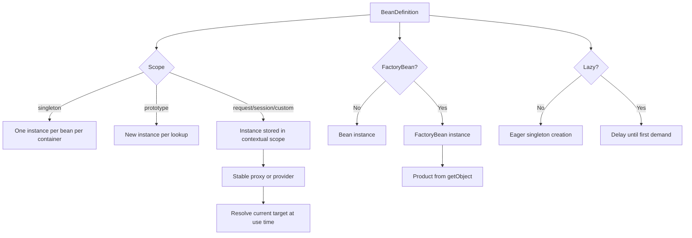
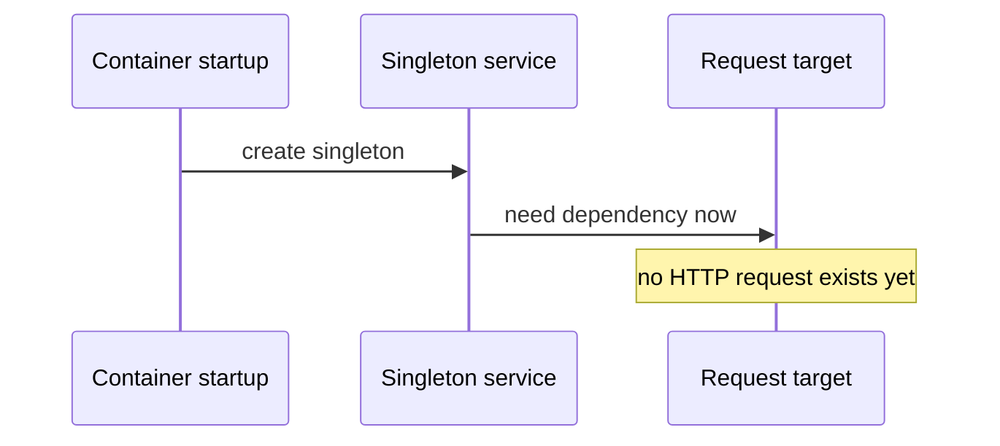
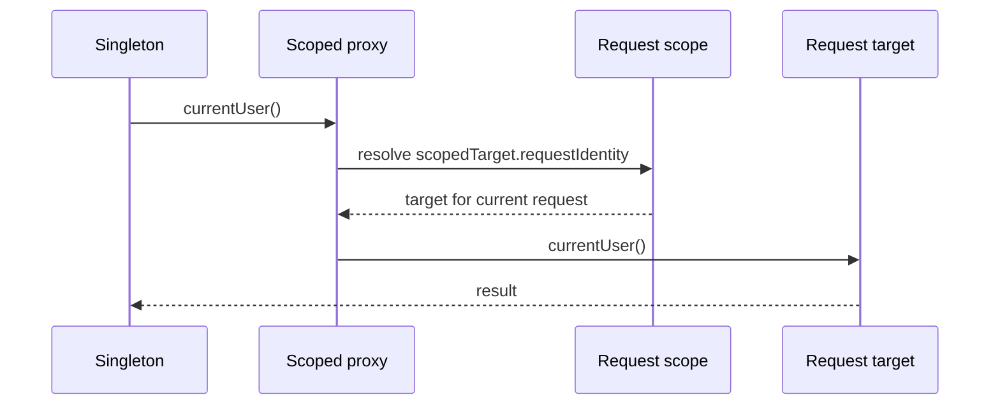
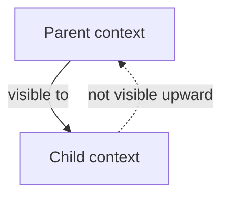
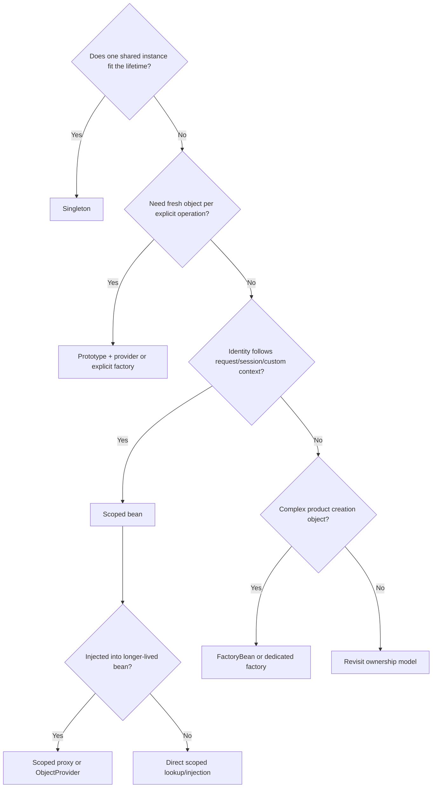

# Advanced Core: Scopes, FactoryBean and Context Hierarchy

> [!summary] За 30 секунд
> Scope определяет **границу identity и lifetime** bean. Scoped proxy или `ObjectProvider` позволяет long-lived bean безопасно получать short-lived target. `FactoryBean` отделяет container-managed factory от создаваемого продукта. Lazy initialization меняет момент создания, но не scope. Parent/child contexts образуют направленную visibility hierarchy: child видит parent, parent не видит child.

## Главная ментальная модель



Нужно всегда разделять четыре вопроса:

1. **Identity:** сколько экземпляров логически существует?
2. **Resolution:** когда выбирается конкретный экземпляр?
3. **Lifetime:** как долго он живёт?
4. **Ownership:** кто обязан его уничтожить?

---

# Part I. Bean scopes

## 1. Singleton scope

Spring singleton означает:

```text
one bean definition
inside one container
→ one cached instance
```

Это не GoF singleton и не JVM-global object.

```java
@Configuration
class AppConfig {

    @Bean
    PaymentService paymentService() {
        return new PaymentService();
    }
}
```

Один `ApplicationContext` возвращает одну и ту же instance:

```java
PaymentService first = context.getBean(PaymentService.class);
PaymentService second = context.getBean(PaymentService.class);

assert first == second;
```

Но два независимых contexts создают два singleton instances:

```java
try (var firstContext = new AnnotationConfigApplicationContext(AppConfig.class);
     var secondContext = new AnnotationConfigApplicationContext(AppConfig.class)) {

    assert firstContext.getBean(PaymentService.class)
            != secondContext.getBean(PaymentService.class);
}
```

> [!warning] Exam trap
> Spring singleton — **per-container, per-bean-definition**, а не «один object на весь JVM».

## 2. Singleton и thread safety

Singleton scope ничего не говорит о thread safety.

```java
@Component
class UnsafeCounter {
    private int value;

    int increment() {
        return ++value;
    }
}
```

Bean один, но requests могут вызывать его параллельно.

Правильный вывод:

```text
singleton identity
≠
serialized access
≠
immutable state
≠
thread safety
```

Stateless services естественно подходят singleton scope. Stateful singleton требует отдельного concurrency protocol.

## 3. Prototype scope

```java
@Bean
@Scope(ConfigurableBeanFactory.SCOPE_PROTOTYPE)
ReportBuilder reportBuilder() {
    return new ReportBuilder();
}
```

Каждый lookup создаёт новый object:

```java
ReportBuilder first = context.getBean(ReportBuilder.class);
ReportBuilder second = context.getBean(ReportBuilder.class);

assert first != second;
```

Prototype означает:

- container создаёт object;
- выполняет dependency injection;
- выполняет initialization callbacks;
- возвращает object caller;
- после этого не управляет полным destruction lifecycle автоматически.

> [!danger] Ownership boundary
> `@PreDestroy` и configured destroy methods prototype bean не вызываются автоматически при закрытии context.

## 4. Prototype внутри singleton

Проблемный expectation:

```java
@Component
class ExportService {
    private final ReportBuilder builder;

    ExportService(ReportBuilder builder) {
        this.builder = builder;
    }

    Report export() {
        return builder.build();
    }
}
```

Даже если `ReportBuilder` prototype, dependency injection singleton выполняется один раз:

```text
singleton ExportService creation
    ↓
resolve prototype ReportBuilder once
    ↓
inject one instance
    ↓
all later export() calls reuse it
```

Scope prototype не превращает field в автоматический factory.

## 5. ObjectProvider for runtime lookup

```java
@Component
class ExportService {
    private final ObjectProvider<ReportBuilder> builders;

    ExportService(ObjectProvider<ReportBuilder> builders) {
        this.builders = builders;
    }

    Report export() {
        ReportBuilder builder = builders.getObject();
        return builder.build();
    }
}
```

Каждый `getObject()` обращается к container и применяет scope semantics.

Для prototype:

```text
getObject() #1 → instance A
getObject() #2 → instance B
```

`ObjectProvider` полезен для:

- runtime lookup;
- optional dependency;
- ordered stream нескольких beans;
- scoped target resolution;
- lazy lookup without field-level lazy proxy.

> [!tip] Memory hook
> **Provider does not cache the target; the target scope decides identity.**

## 6. ObjectProvider methods

| Method | Zero candidates | One candidate | Many candidates |
|---|---|---|---|
| `getObject()` | exception | returns bean | ambiguity exception |
| `getIfAvailable()` | `null` | returns bean | ambiguity exception |
| `getIfUnique()` | `null` | returns bean | `null` unless unique/primary resolution applies |
| `stream()` | empty | one element | all matching beans |
| `orderedStream()` | empty | one element | ordered matching beans |

Optionality and ambiguity remain separate problems.

## 7. Web scopes

Common web scopes:

- request;
- session;
- application;
- websocket.

They require web-aware infrastructure. A regular non-web `ApplicationContext` does not automatically know request/session scope.

### Request scope

```text
one HTTP request
→ one scoped target
```

### Session scope

```text
one HTTP session
→ one scoped target across multiple requests
```

### Application scope

Bound to servlet application lifecycle. It is not identical to ordinary Spring singleton semantics because the storage boundary is the servlet application context.

## 8. The lifetime mismatch problem

A singleton is created once at startup. A request bean exists only inside a request.

Direct injection without indirection asks Spring to solve a future request target during singleton construction.



Solutions:

- scoped proxy;
- `ObjectProvider<T>`;
- `ObjectFactory<T>`;
- explicit method parameter at request boundary.

## 9. Scoped proxy

```java
@Component
@RequestScope(proxyMode = ScopedProxyMode.TARGET_CLASS)
class RequestIdentity {
    private final UUID id = UUID.randomUUID();
}
```

The singleton receives a stable proxy:

```text
singleton field
→ scoped proxy
→ current request target
```

At each method call, proxy obtains the target associated with current scope.



## 10. TARGET_CLASS vs INTERFACES

```java
@Scope(
    value = WebApplicationContext.SCOPE_REQUEST,
    proxyMode = ScopedProxyMode.INTERFACES
)
```

### Interface proxy

- consumer depends on interface;
- JDK dynamic proxy;
- only interface methods are exposed.

### Target-class proxy

- class-based proxy;
- consumer may depend on concrete class;
- class/method proxy restrictions matter.

Do not couple business code to generated proxy class identity.

## 11. Scope is not proxy

These are separate decisions:

```text
scope
→ where and how target instance is stored

proxyMode
→ how a longer-lived collaborator reaches current target
```

A prototype bean without proxy is still prototype when explicitly requested. A scoped proxy does not change target scope.

## 12. Custom scope

Custom scope implements:

```java
org.springframework.beans.factory.config.Scope
```

Core responsibilities:

- get/create object;
- remove object;
- register destruction callback;
- expose contextual object;
- conversation identifier.

A custom scope is justified when identity follows a domain context not covered by standard scopes, such as tenant job, workflow execution or explicit conversation.

Avoid using custom scope to hide ordinary application state.

---

# Part II. FactoryBean

## 13. Why FactoryBean exists

A `FactoryBean<T>` lets container manage a factory while normal lookup exposes the produced object.

```java
@Component("client")
class ClientFactoryBean implements FactoryBean<Client> {

    @Override
    public Client getObject() {
        return createConfiguredClient();
    }

    @Override
    public Class<?> getObjectType() {
        return Client.class;
    }

    @Override
    public boolean isSingleton() {
        return true;
    }
}
```

Normal lookup:

```java
Client client = context.getBean("client", Client.class);
```

Factory dereference:

```java
ClientFactoryBean factory =
        context.getBean("&client", ClientFactoryBean.class);
```

## 14. Product identity vs factory identity

There are two managed identities:

```text
bean name: client
    ├── normal lookup → FactoryBean product
    └── &client       → FactoryBean instance
```

`&` is not part of the declared bean name. It is a dereference prefix understood by `BeanFactory`.

## 15. FactoryBean is not the same as @Bean factory method

### `@Bean` method

```java
@Bean
Client client() {
    return new Client();
}
```

The method is configuration metadata that creates the bean.

### `FactoryBean<Client>`

The factory object itself is a managed bean and normal lookup is transparently redirected to `getObject()`.

Memory formula:

```text
@Bean = factory method in configuration
FactoryBean = bean that acts as a product factory
```

## 16. FactoryBean singleton semantics

`FactoryBean.isSingleton()` describes product identity from this factory.

It does not change the scope of the FactoryBean instance itself.

Possible model:

```text
FactoryBean bean scope = singleton
FactoryBean product       = non-singleton
```

or:

```text
FactoryBean bean scope = prototype
FactoryBean product       = singleton per factory instance
```

These are different axes and should be reasoned separately.

## 17. getObjectType()

Accurate object type information helps:

- by-type lookup;
- autowiring candidate discovery;
- tooling;
- avoiding premature product creation.

Returning `null` may reduce container ability to predict product type before factory initialization.

## 18. FactoryBean lifecycle ownership

The container manages lifecycle of FactoryBean as a bean.

The product lifecycle depends on how the product is created and exposed. A FactoryBean that creates external resources must define explicit ownership:

- is product cached?
- who closes it?
- does factory destruction close cached product?
- can multiple consumers share it?
- what happens on partial initialization failure?

Do not assume product destruction automatically follows arbitrary resource ownership.

---

# Part III. Lazy initialization

## 19. @Lazy changes creation time, not scope

```java
@Bean
@Lazy
ExpensiveClient expensiveClient() {
    return new ExpensiveClient();
}
```

The bean remains singleton unless scope says otherwise.

```text
singleton + eager
→ create during context startup

singleton + lazy
→ create on first demand
```

## 20. Lazy bean forced eagerly

```java
@Component
class StartupService {
    StartupService(ExpensiveClient client) {
    }
}
```

If `StartupService` is eager singleton, Spring must satisfy constructor dependency and therefore creates the lazy client at startup.

`@Lazy` on bean definition is not a force field against eager dependencies.

## 21. Lazy injection proxy

```java
@Component
class StartupService {
    StartupService(@Lazy ExpensiveClient client) {
    }
}
```

A lazy-resolution proxy can defer target resolution until use.

For optional and repeated lookup, `ObjectProvider` is usually more explicit.

## 22. Lazy trade-offs

Benefits:

- lower startup work;
- defer rarely used integration;
- avoid unnecessary resource allocation.

Costs:

- first-call latency;
- configuration errors appear later;
- runtime failure instead of startup failure;
- harder readiness reasoning;
- hidden initialization contention.

Production rule:

> Use lazy initialization when delayed ownership is intentional, not as a blanket fix for slow startup or circular design.

---

# Part IV. Circular dependencies and early references

## 23. Constructor cycle

```java
@Component
class A {
    A(B b) {
    }
}

@Component
class B {
    B(A a) {
    }
}
```

```text
create A
→ need B
→ create B
→ need fully constructed A
→ impossible
```

Constructor cycles fail because neither object can be constructed first.

## 24. Setter/field cycle

Historically, Spring Framework can resolve some singleton setter/field cycles by exposing an early reference after instantiation but before full initialization.

Conceptual sequence:

```text
instantiate A
→ expose early A reference
→ populate A needs B
→ instantiate B
→ B receives early A
→ finish B
→ finish A
```

This is not a recommendation.

Risks:

- collaborator receives partially initialized object;
- proxy consistency becomes complex;
- initialization order becomes fragile;
- design responsibility becomes bidirectional;
- framework/Boot policy may reject cycles.

## 25. Early reference is not fully initialized bean

The existence of a reference does not imply:

- dependencies populated;
- `@PostConstruct` executed;
- proxy chain finalized;
- invariants established.

This connects directly to [[Container Extension Points]] and `SmartInstantiationAwareBeanPostProcessor.getEarlyBeanReference()`.

## 26. Better ways to break cycles

Preferred options:

1. Extract third responsibility.
2. Introduce domain event.
3. Move orchestration to higher-level service.
4. Depend on narrower interface.
5. Pass runtime value as method parameter.
6. Use provider only when delayed lookup represents real lifecycle semantics.

Bad reflex:

```java
@Lazy
```

added solely to make a design cycle start.

It may hide the cycle without reducing conceptual coupling.

## 27. Framework vs Boot circular-reference policy

Core Spring Framework describes mechanisms for certain early references.

Spring Boot may choose a stricter default policy for application startup. That policy is version-specific Boot behavior and must not be confused with what the underlying container is technically capable of doing.

---

# Part V. Parent and child ApplicationContext

## 28. Directed visibility



Child lookup:

1. search local child factory;
2. if no local match, delegate to parent.

Parent lookup never searches children.

## 29. Shadowing by name

Parent:

```text
bean name = auditService
implementation = SharedAuditService
```

Child:

```text
bean name = auditService
implementation = ModuleAuditService
```

Child lookup resolves local definition. Parent remains unchanged.

Shadowing can be useful but creates diagnosis complexity. Log context identity and bean source when debugging.

## 30. Type lookup in hierarchy

Do not casually assume every listable lookup aggregates parent and child beans identically. APIs differ between local `ListableBeanFactory` operations and hierarchical lookup utilities.

For architecture:

- define explicitly which context owns which services;
- avoid relying on accidental parent aggregation;
- test both name and type resolution paths.

## 31. Lifecycle ownership across hierarchy

Parent and child have separate lifecycle boundaries.

Closing child should destroy child-owned singleton beans, not automatically destroy parent-owned beans.

Closing parent while children still depend on it creates invalid ownership order.

Safe shutdown order:

```text
close children
→ close parent
```

## 32. Typical hierarchy use

Classic web architecture:

```text
root context
    shared services, repositories, infrastructure

child servlet context
    controllers, view infrastructure, web-specific adapters
```

Modern Boot applications often use one primary context, but hierarchy remains relevant for modular systems, tests, integration containers and framework internals.

---

# Part VI. Resource abstraction

## 33. Resource is a handle, not guaranteed file

```java
Resource resource = context.getResource("classpath:rules.json");
```

Possible implementations:

- `ClassPathResource`;
- `FileSystemResource`;
- `UrlResource`;
- `ByteArrayResource`;
- servlet-context resource.

Do not assume:

```java
resource.getFile()
```

works for classpath resources inside a packaged JAR.

Prefer stream access:

```java
try (InputStream input = resource.getInputStream()) {
    // read content
}
```

## 34. Resource location semantics

The same location string can be interpreted according to loader context.

Explicit prefixes improve clarity:

```text
classpath:config/rules.json
file:/opt/app/rules.json
https://example.org/rules.json
```

For multiple resources, `ResourcePatternResolver` supports patterns such as:

```text
classpath*:META-INF/spring.factories
```

Pattern semantics and packaged-archive behavior require careful testing.

## 35. ResourceLoader injection

`ApplicationContext` implements `ResourceLoader`.

Application code can depend on narrower abstraction:

```java
@Component
class TemplateLoader {
    private final ResourceLoader resources;

    TemplateLoader(ResourceLoader resources) {
        this.resources = resources;
    }
}
```

This avoids pulling the full context API into business code.

---

# Part VII. MessageSource

## 36. ApplicationContext as MessageSource

```java
String message = context.getMessage(
        "payment.failed",
        new Object[]{paymentId},
        Locale.ENGLISH
);
```

Message resolution uses:

- message code;
- arguments;
- locale;
- optional default message.

## 37. messageSource bean name

An `ApplicationContext` looks for a bean named:

```text
messageSource
```

If no local source exists, resolution can delegate to parent context.

A bean with the correct type but an unrelated name does not automatically become the context’s internal message source contract.

## 38. ResourceBundleMessageSource

```java
@Bean
MessageSource messageSource() {
    ResourceBundleMessageSource source =
            new ResourceBundleMessageSource();
    source.setBasename("messages");
    source.setDefaultEncoding("UTF-8");
    return source;
}
```

Files:

```text
messages.properties
messages_ru.properties
messages_de.properties
```

## 39. MessageSource is not business-error design

MessageSource localizes presentation text. It should not replace:

- stable machine-readable error codes;
- domain exception taxonomy;
- structured API error contract;
- observability fields.

Recommended separation:

```text
errorCode = PAYMENT_LIMIT_EXCEEDED
messageCode = payment.limit.exceeded
localizedMessage = rendered at boundary
```

---

# Part VIII. Lifetime and ownership design

## 40. Scope selection table

| Need | Candidate mechanism |
|---|---|
| Stateless shared service | singleton |
| Fresh stateful helper per operation | prototype + provider or explicit factory |
| One object per HTTP request | request scope |
| One object per user session | session scope |
| Current short-lived target inside singleton | scoped proxy or provider |
| Delay expensive optional integration | lazy/provider |
| Hide complex product creation | `FactoryBean` or simpler `@Bean` factory method |
| Module-specific override | child context, explicit module registry or configuration |

## 41. Scope selection anti-patterns

### Stateful singleton by accident

Mutable request data stored in singleton field.

### Prototype as automatic freshness

Prototype injected once into singleton.

### Session scope for database state

Large or non-serializable objects accumulate in HTTP session.

### Lazy as circular-dependency repair

Startup succeeds, architecture remains cyclic.

### Child context as service locator partition

Context hierarchy used without clear ownership and shutdown model.

### FactoryBean for trivial object creation

Complex infrastructure used where a simple `@Bean` method is clearer.

## 42. Senior interview answer

> Spring scope defines identity and lifetime boundary. Singleton is one bean instance per definition per container; prototype creates a new instance per lookup but transfers destruction ownership to the caller. When a long-lived singleton needs a shorter-lived target, direct injection is insufficient because resolution happens once; use a scoped proxy or `ObjectProvider` to resolve at use time. `FactoryBean` separates factory identity from product identity, with `&name` returning the factory. Lazy changes creation timing, not scope. Parent-child contexts have downward visibility: child sees parent and may shadow by name, while parent cannot see child. Every design must state who creates, resolves and destroys each object.

## 43. Decision tree



## 44. Exam traps

> [!question] Does prototype mean a singleton receives a new dependency on every method call?

> [!answer]- Answer
> No. Direct dependency injection occurs when the singleton is created. Use provider/proxy/factory for repeated lookup.

> [!question] Does `@Lazy` change singleton into prototype?

> [!answer]- Answer
> No. It changes creation timing, not scope.

> [!question] What does `context.getBean("factory")` return for a FactoryBean?

> [!answer]- Answer
> The product. Use `&factory` to retrieve the FactoryBean instance.

> [!question] Can parent context resolve a bean defined only in child?

> [!answer]- Answer
> No. Visibility is downward from child to parent lookup, not upward.

> [!question] Are prototype destruction callbacks invoked on context close?

> [!answer]- Answer
> Not automatically. Destruction ownership must be handled explicitly.

## 45. Memory hooks

```text
Singleton: one per definition per container.
Prototype: new per lookup; caller owns cleanup.
Scoped proxy: stable handle, changing target.
Provider: ask container now.
FactoryBean: name gives product, &name gives factory.
Lazy: later creation, same scope.
Cycle: reference availability is not initialization completeness.
Hierarchy: child sees parent; parent does not see child.
Resource: handle, not necessarily File.
MessageSource: code + arguments + locale.
```

## Practice

- [[01_MAPS/Spring Advanced Core Map.canvas]]
- [[30_CERTIFICATIONS/Spring/2V0-72.22/CORE-B06/CORE-B06 Cards]]
- [[40_PRODUCTION_CASES/Spring/Advanced Core Production Cases]]
- [[50_LABS/Spring/Core-B06/README]]

## Sources

- [[98_SOURCES/Spring Advanced Core Sources]]
