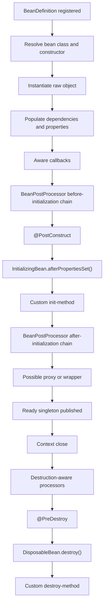
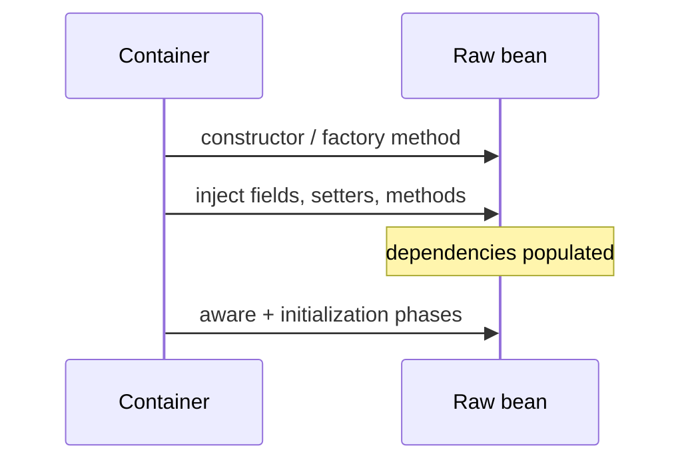
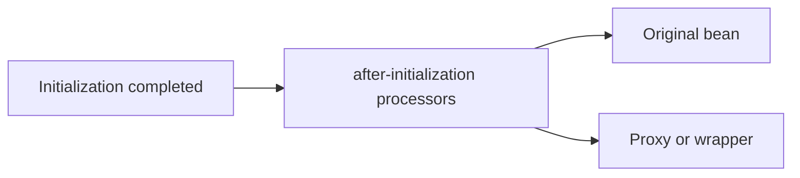
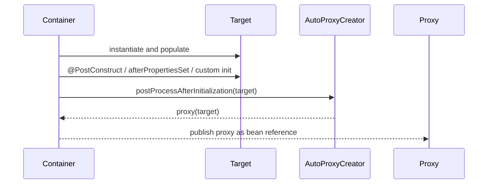
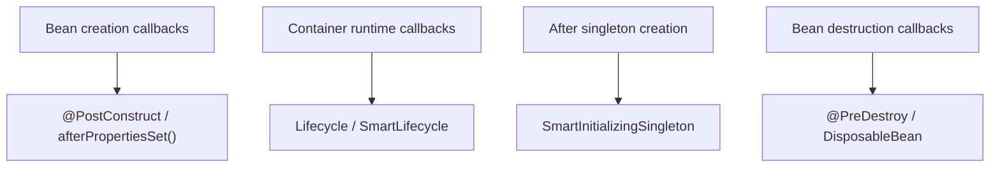

# Bean Lifecycle from Definition to Destruction

> [!summary] За 30 секунд
> Spring bean проходит путь от **metadata (`BeanDefinition`)** к экземпляру, dependency population, aware callbacks, `BeanPostProcessor` before-initialization phase, initialization callbacks, `BeanPostProcessor` after-initialization phase и возможному proxy. При закрытии контекста singleton bean получает destruction callbacks. Prototype destruction Spring автоматически не завершает.

## Главная ментальная модель: фабрика, контроль качества и упаковка

Представь производственную линию:

1. **BeanDefinition** — технологическая карта изделия.
2. **Instantiation** — создана заготовка объекта.
3. **Dependency population** — установлены комплектующие.
4. **Aware callbacks** — изделию сообщают служебную информацию фабрики.
5. **Before-initialization processors** — предварительный контроль и annotation-driven callbacks.
6. **Initialization callbacks** — самопроверка и подготовка изделия.
7. **After-initialization processors** — финальная упаковка; здесь часто появляется proxy.
8. **Singleton publication** — готовое изделие доступно потребителям.
9. **Destruction** — управляемое освобождение ресурсов при shutdown.

> [!danger] Главная ошибка
> **Instantiation не равно initialization.** Конструктор создал объект, но Spring ещё мог не установить зависимости, не вызвать `@PostConstruct` и не создать финальный proxy.

## Карта жизненного цикла



> [!warning] Схема показывает устойчивые фазы, а не абсолютный порядок каждого внутреннего processor.
> `@PostConstruct` вызывается специальным `BeanPostProcessor` внутри before-initialization chain. Поэтому относительный порядок `@PostConstruct` и вашего собственного processor зависит от ordering processors.

# 1. BeanDefinition — это рецепт, а не bean

`BeanDefinition` хранит metadata, необходимую container:

- bean class или factory method;
- scope;
- constructor arguments;
- property values;
- lazy flag;
- autowire-candidate information;
- primary flag;
- qualifiers;
- init method;
- destroy method;
- dependencies and role metadata.


> [!question] Существует ли bean сразу после регистрации BeanDefinition?

> [!answer]- Ответ
> Нет. Зарегистрирован metadata recipe. Singleton обычно создаётся позднее во время context refresh, а lazy/prototype bean — при запросе согласно scope semantics.

## Exam Trap

`BeanDefinition` не является «объектом business class». Это container metadata о том, как объект создать и управлять им.

# 2. Instantiation — создание raw instance

На этапе instantiation Spring выбирает способ создания:

- constructor;
- static factory method;
- instance factory method;
- `@Bean` method;
- custom instantiation strategy.

```java
class ReportService {
    ReportService(ReportRepository repository) {
        // constructor execution = instantiation phase
    }
}
```

После возврата конструктора объект существует, но lifecycle ещё не завершён.

## Почему нельзя делать слишком много в constructor

В constructor:

- field/setter dependencies ещё могут быть не установлены;
- aware callbacks ещё не вызваны;
- `@PostConstruct` ещё не выполнен;
- bean может ещё не быть proxied;
- вызов overridable method может попасть в частично построенный объект.

Хороший constructor:

- принимает обязательные зависимости;
- проверяет простые локальные invariants;
- не запускает фоновые процессы;
- не выполняет тяжёлый remote I/O.

# 3. Dependency population

После создания raw instance container устанавливает зависимости и property values.

```java
class ExportService {
    private AuditClient auditClient;

    @Autowired
    void setAuditClient(AuditClient auditClient) {
        this.auditClient = auditClient;
    }
}
```

К моменту обычных initialization callbacks bean должен получить необходимые properties.



## Constructor injection nuance

Constructor dependency передаётся во время instantiation, но это не означает, что весь bean lifecycle завершён. Constructor injection решает обязательность dependency, а не отменяет последующие phases.

# 4. Aware callbacks

Aware interfaces позволяют bean узнать container infrastructure.

Часто встречаются:

- `BeanNameAware`;
- `BeanClassLoaderAware`;
- `BeanFactoryAware`;
- `EnvironmentAware`;
- `ResourceLoaderAware`;
- `ApplicationEventPublisherAware`;
- `MessageSourceAware`;
- `ApplicationContextAware`.

## Упрощённая последовательность

```text
normal property population
        ↓
BeanNameAware / BeanClassLoaderAware / BeanFactoryAware
        ↓
context-specific aware callbacks
        ↓
initialization callbacks
```

`ApplicationContextAware` вызывается после normal property population, но до `afterPropertiesSet()` и custom init method.

## BeanNameAware

```java
class NamedWorker implements BeanNameAware {
    private String beanName;

    @Override
    public void setBeanName(String name) {
        this.beanName = name;
    }
}
```

Используется для infrastructure/logging cases, но business logic не должна зависеть от случайного bean name без необходимости.

## ApplicationContextAware

```java
class ContextLookupService implements ApplicationContextAware {
    private ApplicationContext context;

    @Override
    public void setApplicationContext(ApplicationContext context) {
        this.context = context;
    }
}
```

> [!warning]
> Возможность lookup beans через context не означает, что это хороший default design. Обычно explicit dependency injection сохраняет IoC и делает зависимости видимыми.

## Memory Hook

> **Aware = container introduces itself before init.**

# 5. BeanPostProcessor — interception points вокруг initialization

`BeanPostProcessor` получает каждый новый bean instance и может:

- проверить marker interface;
- внедрить дополнительное поведение;
- обработать lifecycle annotations;
- вернуть wrapper;
- создать proxy;
- заменить возвращаемый bean другим объектом.

```java
class LoggingProcessor implements BeanPostProcessor {
    @Override
    public Object postProcessBeforeInitialization(Object bean, String beanName) {
        System.out.println("before init: " + beanName);
        return bean;
    }

    @Override
    public Object postProcessAfterInitialization(Object bean, String beanName) {
        System.out.println("after init: " + beanName);
        return bean;
    }
}
```

## Before-initialization contract

К этому моменту bean уже instantiated и populated. Callback выполняется до `InitializingBean.afterPropertiesSet()` и custom init method.


## After-initialization contract

Выполняется после initialization callbacks. Processor может вернуть original bean или wrapper/proxy.



## Return value matters

```java
@Override
public Object postProcessAfterInitialization(Object bean, String beanName) {
    if (bean instanceof PaymentService) {
        return createProxy(bean);
    }
    return bean;
}
```

Container продолжает использовать returned object. Если это proxy, injection points обычно получают proxy, а не raw target.

## Returning null

В Spring 5.3, если processor возвращает `null`, последующие processors для этой phase не вызываются, а предыдущий результат используется согласно processor chain semantics. Это редкий и рискованный extension technique; в учебном и business-коде обычно возвращают bean.

# 6. Где находится @PostConstruct

`@PostConstruct` выглядит как отдельная магия, но фактически обрабатывается infrastructure `BeanPostProcessor`.

```java
class CacheIndex {
    @PostConstruct
    void buildIndex() {
        // dependencies already injected
    }
}
```

Устойчивое утверждение:

- dependencies уже populated;
- callback происходит до `afterPropertiesSet()`;
- callback происходит до custom init method;
- bean ещё не считается полностью готовым и опубликованным;
- обычный AOP proxy, создаваемый after-initialization, ещё не является финальным объектом вокруг target.

## Важная тонкость processor ordering

Нельзя универсально сказать:

> «Любой custom `postProcessBeforeInitialization` всегда вызывается до `@PostConstruct`».

Почему: `@PostConstruct` вызывает один из processors внутри общей before-initialization chain. Порядок зависит от `PriorityOrdered`, `Ordered` и регистрации processors.

## Что делать в @PostConstruct

Подходит:

- validation configuration;
- построение локального immutable index;
- подготовка derived state;
- дешёвая и ограниченная initialization.

Осторожно:

- долгий network call;
- запуск потоков без shutdown protocol;
- ожидание другого singleton, который ожидает текущий bean;
- массовая database migration;
- self-invocation метода, на который рассчитывают AOP advice.

Spring 5.3 предупреждает, что initialization callbacks singleton выполняются внутри singleton creation lock; тяжёлая активность и внешний bean access могут привести к initialization deadlock.

# 7. Порядок initialization callbacks

Если bean использует разные методы для трёх механизмов, Spring вызывает их так:

```text
1. @PostConstruct
2. InitializingBean.afterPropertiesSet()
3. custom init-method
```

```java
class LifecycleBean implements InitializingBean {

    @PostConstruct
    void annotatedInit() {
        System.out.println("1");
    }

    @Override
    public void afterPropertiesSet() {
        System.out.println("2");
    }

    void customInit() {
        System.out.println("3");
    }
}
```

```java
@Bean(initMethod = "customInit")
LifecycleBean lifecycleBean() {
    return new LifecycleBean();
}
```

## Если method name совпадает

Если один и тот же method настроен несколькими lifecycle mechanisms, Spring старается не вызывать его повторно. Но такой design хуже читается; лучше не смешивать один method name для нескольких контрактов.

# 8. InitializingBean.afterPropertiesSet

```java
class ConnectionRegistry implements InitializingBean {
    @Override
    public void afterPropertiesSet() {
        validateConfiguration();
    }
}
```

Плюсы:

- точный lifecycle contract;
- compile-time interface;
- удобно для infrastructure components.

Минусы:

- class зависит от Spring API;
- business object становится framework-coupled.

Для application beans обычно предпочтительнее `@PostConstruct` или custom init method.

## Exam Trap

`afterPropertiesSet()` не вызывается сразу после constructor. Он вызывается после dependency/property population и before custom init method.

# 9. Custom init method

```java
class ClientPool {
    void open() {
        // validate and prepare
    }
}

@Bean(initMethod = "open")
ClientPool clientPool() {
    return new ClientPool();
}
```

Преимущество: класс остаётся POJO и не зависит от Spring annotation/interface.

Требование: method обычно должен быть no-arg и возвращать `void` для ясного lifecycle contract.

# 10. Proxy creation

Обычная модель Spring AOP:

```text
raw target fully initialized
        ↓
postProcessAfterInitialization
        ↓
auto-proxy creator returns proxy
        ↓
other beans receive proxy
```



## Почему @Transactional в @PostConstruct не срабатывает как ожидается

`@PostConstruct` выполняется на target в initialization phase. Обычный external call через final proxy ещё не происходит. Поэтому self-invocation или ожидание transactional advice внутри init callback — ненадёжная модель.

```java
@PostConstruct
void init() {
    loadDataTransactionally(); // direct call on this, not external proxy call
}
```

Лучше:

- вынести transactional operation в другой bean;
- запускать после context refresh;
- использовать `SmartInitializingSingleton` для after-all-singletons phase;
- использовать explicit startup orchestration.

## Raw target vs proxy

Initialization callback вызывается на raw target. AOP interceptors обычно применяются к вызовам через proxy после завершения lifecycle.

> [!danger]
> Если raw target каким-то образом утёк наружу до proxy creation, часть вызовов может обходить advice. Это одна из причин избегать publication `this` из constructor/init.

## Advanced nuance

Некоторые infrastructure processors могут создавать early proxy references для circular dependency resolution или short-circuit bean creation. Это implementation-sensitive advanced behavior; базовый lifecycle route должен опираться на стандартный путь «target init → after-init proxy».

# 11. Когда bean считается готовым

Для singleton bean container публикует готовую reference после successful initialization и after-initialization processing.

До этого момента:

- initialization может завершиться exception;
- processor может заменить bean;
- proxy ещё может не существовать;
- singleton creation lock ещё может удерживаться.

## Failure behavior

Если initialization callback бросает exception:

- bean creation считается failed;
- bean не публикуется как готовый singleton;
- context refresh может завершиться failure;
- уже созданные singletons могут быть уничтожены при rollback/close.

# 12. SmartInitializingSingleton и ContextRefreshedEvent

Если работа должна происходить **после создания всех regular singleton beans**, рассмотрите:

```java
class WarmupCoordinator implements SmartInitializingSingleton {
    @Override
    public void afterSingletonsInstantiated() {
        // all regular singleton beans have been instantiated
    }
}
```

или:

```java
@EventListener(ContextRefreshedEvent.class)
void onContextReady() {
    // context refresh completed
}
```

Это лучше для coordination, которая требует доступа к другим fully initialized singletons.

> [!warning]
> `SmartInitializingSingleton` не является общим callback каждого scope; это singleton-oriented container extension.

# 13. Destruction lifecycle

При закрытии `ApplicationContext` managed singleton beans получают destruction callbacks.

Порядок разных destruction mechanisms:

```text
1. @PreDestroy
2. DisposableBean.destroy()
3. custom destroy-method
```

```java
class ManagedClient implements DisposableBean {

    @PreDestroy
    void annotatedDestroy() {
        System.out.println("1");
    }

    @Override
    public void destroy() {
        System.out.println("2");
    }

    void closeClient() {
        System.out.println("3");
    }
}
```

```java
@Bean(destroyMethod = "closeClient")
ManagedClient managedClient() {
    return new ManagedClient();
}
```

## Destruction-aware processors

`DestructionAwareBeanPostProcessor` может выполнить callback перед уничтожением bean. Это infrastructure extension, отдельный от обычных `postProcessBeforeInitialization`/`postProcessAfterInitialization`.

# 14. Singleton destruction requires context close

```java
try (AnnotationConfigApplicationContext context =
         new AnnotationConfigApplicationContext(AppConfig.class)) {
    context.getBean(Service.class).work();
} // close triggers destruction callbacks
```

Если standalone application не закрывает context, managed resources могут не получить lifecycle shutdown.

Для web/server runtime shutdown обычно интегрирован с framework/container, но custom resources всё равно должны иметь корректный destroy contract.

# 15. Prototype scope: container stops early

Spring создаёт и инициализирует prototype bean, но не управляет его полным destruction lifecycle после передачи клиенту.

```java
@Bean
@Scope("prototype")
TemporarySession temporarySession() {
    return new TemporarySession();
}
```

`@PreDestroy`, `DisposableBean.destroy()` и custom destroy method не вызываются container автоматически для обычного prototype lifecycle.

Ответственность за cleanup лежит на consumer или custom lifecycle manager.

## Memory Hook

> **Prototype: Spring creates it, caller retires it.**

# 16. @Bean destroyMethod inference

У `@Bean` destroy method может быть задан явно:

```java
@Bean(destroyMethod = "shutdown")
Client client() {
    return new Client();
}
```

Spring также поддерживает inferred destroy method для public `close()` или `shutdown()` в типичных Java configuration scenarios. Для экзамена важно различать:

- explicit lifecycle contract;
- inferred convenience;
- `AutoCloseable` semantics;
- prototype limitation.

Для критичных ресурсов explicit configuration часто понятнее.

# 17. Lifecycle callbacks не равны Lifecycle interface

Не путать:

- `@PostConstruct` / `InitializingBean` — initialization bean;
- `@PreDestroy` / `DisposableBean` — destruction bean;
- `Lifecycle` / `SmartLifecycle` — start/stop semantics container runtime;
- `SmartInitializingSingleton` — callback after singleton pre-instantiation.



# 18. Common production failures

## Failure 1. Heavy I/O in @PostConstruct

Symptoms:

- slow application startup;
- initialization deadlock;
- readiness timeout;
- partial external side effects before context failure.

Better:

- local validation in init;
- explicit warmup coordinator;
- bounded async startup with readiness state;
- migration tooling outside ordinary bean init.

## Failure 2. Expecting AOP in init callback

Symptoms:

- `@Transactional` does not open transaction;
- metrics/security/retry advice absent;
- raw-target method call.

Better:

- external call through another bean;
- post-refresh event;
- explicit proxy-aware orchestration only when justified.

## Failure 3. Resource not closed

Symptoms:

- thread leak;
- file descriptor leak;
- client connection leak;
- tests hang after context use.

Better:

- `@PreDestroy` or destroy method;
- close context in tests/tools;
- make ownership explicit.

## Failure 4. Assuming prototype cleanup

Symptoms:

- temporary clients/sessions accumulate;
- cleanup method never called.

Better:

- caller-owned `close()`;
- scoped abstraction;
- custom bean post-processor/lifecycle registry only if truly needed.

# 19. Interview answer

> Spring first registers a BeanDefinition, then creates a raw instance, populates dependencies, invokes aware callbacks, runs the BeanPostProcessor before-initialization chain, executes initialization callbacks in the order `@PostConstruct`, `afterPropertiesSet`, custom init method, and then runs after-initialization processors that may return an AOP proxy. The resulting reference is published as the bean. On context close, managed singleton destruction runs `@PreDestroy`, `DisposableBean.destroy`, and custom destroy method. Prototype destruction is not managed automatically.

# 20. Decision table

| Need | Recommended mechanism |
|---|---|
| Framework-neutral local initialization | `@PostConstruct` or custom init method |
| Spring infrastructure component | `InitializingBean` may be acceptable |
| Access bean name/container infrastructure | specific `Aware` interface |
| Modify many beans | `BeanPostProcessor` |
| Wrap beans with proxy | after-initialization processor / auto-proxy creator |
| Work after all regular singletons exist | `SmartInitializingSingleton` |
| Work after context refresh | `ContextRefreshedEvent` |
| Release singleton resource | `@PreDestroy` or destroy method |
| Prototype cleanup | explicit caller/custom ownership |

# 21. Memory palace

```text
Recipe      → BeanDefinition
Birth       → instantiation
Assembly    → dependency population
Introduction→ Aware callbacks
Inspection  → before-init processors
Training    → init callbacks
Uniform     → after-init proxy
Service     → published bean
Retirement  → destruction callbacks
```

> **Definition → Instance → Dependencies → Aware → Before → Init → After/Proxy → Ready → Destroy**

# Проверка понимания

> [!question] Почему constructor и `@PostConstruct` — не одно и то же?

> [!answer]- Ответ
> Constructor создаёт raw instance. До `@PostConstruct` container завершает dependency population и aware callbacks; `@PostConstruct` находится в initialization phase.

> [!question] Почему нельзя гарантировать, что любой custom BPP before-init выполнится до `@PostConstruct`?

> [!answer]- Ответ
> Потому что `@PostConstruct` сам вызывается infrastructure BeanPostProcessor внутри общей ordered chain. Относительное положение зависит от ordering processors.

> [!question] Где обычно появляется AOP proxy?

> [!answer]- Ответ
> Обычно after initialization callbacks, когда auto-proxy creator возвращает wrapper из `postProcessAfterInitialization`.

> [!question] Получит ли prototype bean автоматический `@PreDestroy` при закрытии context?

> [!answer]- Ответ
> Обычно нет. Container передаёт prototype клиенту и не отслеживает его полный destruction lifecycle.

## Связанные материалы

- [[30_CERTIFICATIONS/Spring/2V0-72.22/CORE-B03/CORE-B03 Cards|CORE-B03 Cards]]
- [[01_MAPS/Spring Bean Lifecycle Map.canvas|Spring Bean Lifecycle Canvas]]
- [[40_PRODUCTION_CASES/Spring/Bean Lifecycle Production Cases|Bean Lifecycle Production Cases]]
- [[50_LABS/Spring/Core-B03/README|Bean Lifecycle Lab]]
- [[98_SOURCES/Spring Bean Lifecycle Sources|Primary Sources]]
