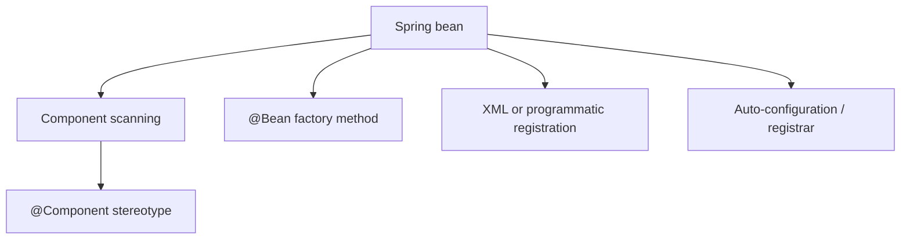

# Bean vs Component

> [!summary] За 30 секунд
> **Bean** — любой object, зарегистрированный и управляемый Spring container. **Component** — один из способов обнаружить и зарегистрировать bean через classpath scanning. Каждый успешно обнаруженный component становится bean, но не каждый bean создан из `@Component`.

## 1. Главное различие

| Bean | Component |
|---|---|
| container-managed object | class marked for component scanning |
| широкое понятие | механизм регистрации |
| может прийти из `@Bean`, XML, registrar, auto-configuration | обычно `@Component` или stereotype |
| может быть third-party class | annotation ставится на собственный class |



## 2. `@Component`

```java
@Component
public class PricingService {
}
```

Если package входит в component scan, Spring создаёт `BeanDefinition`, затем managed instance.

Stereotypes:

```text
@Component
@Service
@Repository
@Controller
@RestController
@Configuration
```

Они являются специализированными component annotations. Некоторые stereotypes добавляют дополнительную semantics, например exception translation для repository infrastructure.

## 3. `@Bean`

```java
@Configuration
class ClientConfiguration {

    @Bean
    PaymentClient paymentClient(HttpClient httpClient) {
        return new PaymentClient(httpClient, Duration.ofSeconds(2));
    }
}
```

`@Bean` удобен, когда:

- class принадлежит third-party library;
- construction требует explicit parameters;
- нужен conditional/profile configuration;
- нужно несколько beans одного class с разными settings;
- factory method должен скрыть construction details.

## 4. Один class — несколько beans

```java
@Bean("fastClient")
PaymentClient fastClient() {
    return new PaymentClient(Duration.ofMillis(300));
}

@Bean("slowClient")
PaymentClient slowClient() {
    return new PaymentClient(Duration.ofSeconds(5));
}
```

Bean identity определяется `BeanDefinition` и bean name, а не только Java class.

`@Component` по умолчанию обычно создаёт одну scanned definition для class, хотя additional definitions могут быть зарегистрированы другими способами.

## 5. Component scanning boundary

```java
@ComponentScan("kz.bank.payment")
```

Class с `@Component` вне scan tree не становится bean автоматически.

Типичная ошибка:

```text
annotation присутствует
package не сканируется
        ↓
NoSuchBeanDefinitionException
```

Проверять нужно не только annotation, но и registration path.

## 6. Bean lifecycle одинаков после регистрации

После создания `BeanDefinition` container применяет общий lifecycle:

```text
instantiate
populate dependencies
Aware callbacks
BeanPostProcessors
initialization
possible proxy
publication
destruction
```

То есть `@Component` и `@Bean` отличаются primarily **источником metadata**, а не тем, что один object «настоящий Spring bean», а другой нет.

## 7. Почему не нужно ставить обе annotations

```java
@Component
class PaymentClient {
}

@Configuration
class Config {
    @Bean
    PaymentClient paymentClient() {
        return new PaymentClient();
    }
}
```

Это может создать две candidate definitions и ambiguity.

Правило:

- own application service с простым construction → stereotype;
- explicit infrastructure/factory construction → `@Bean`;
- не регистрировать один logical component двумя независимыми путями без явной причины.

## 8. `@Configuration` тоже component

`@Configuration` meta-annotated `@Component`, поэтому configuration class может быть обнаружен scanning.

Но `@Bean` methods внутри configuration создают **отдельные bean definitions**. Configuration class itself и products её factory methods — разные beans.

## 9. Interview trap

Неверно:

> `@Bean` используется для methods, а `@Component` для classes, поэтому они обозначают разные lifecycle types.

Точно:

> Они являются разными registration mechanisms. После регистрации оба products управляются container lifecycle.

## 10. Decision table

| Situation | Recommended mechanism |
|---|---|
| application service owned by team | `@Service` / `@Component` |
| repository adapter | `@Repository` |
| third-party client | `@Bean` |
| multiple differently configured instances | several `@Bean` methods |
| conditional infrastructure | configuration + `@Bean` |
| dynamic definitions | registrar / programmatic API |

## 11. Interview answer

> Bean — любой object, управляемый Spring container. Component — class, который может быть обнаружен component scanning и зарегистрирован как bean. Beans также создаются через `@Bean`, auto-configuration, XML и programmatic registration. После создания BeanDefinition lifecycle одинаков; различается registration source.

## Memory Hook

> **Bean — результат управления. Component — один путь регистрации.**

## Sources

- [[98_SOURCES/Spring Dependency Resolution Sources|Spring Core primary sources]]
