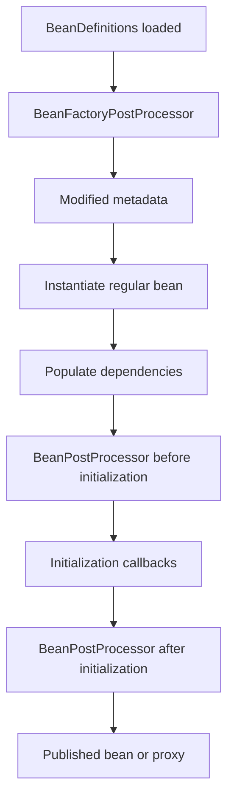
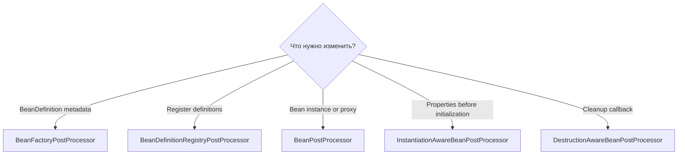

# BeanPostProcessor vs BeanFactoryPostProcessor

> [!summary] За 30 секунд
> `BeanFactoryPostProcessor` изменяет bean **metadata** после загрузки definitions, но до обычного создания beans. `BeanPostProcessor` обрабатывает реальные bean **instances** вокруг initialization и может вернуть wrapper/proxy. Один работает с recipe, другой — с приготовленным object.

## 1. Две плоскости container startup

```text
Metadata plane
BeanDefinition registry
        ↓
BeanFactoryPostProcessor
        ↓
finalized definitions

Instance plane
instantiate bean
populate dependencies
        ↓
BeanPostProcessor callbacks
        ↓
published bean/proxy
```



## 2. BeanFactoryPostProcessor

Contract:

```java
void postProcessBeanFactory(
        ConfigurableListableBeanFactory beanFactory
);
```

Он вызывается, когда definitions уже доступны, но обычные application beans ещё не должны быть instantiated.

Пример изменения metadata:

```java
@Component
class TimeoutMetadataProcessor implements BeanFactoryPostProcessor {

    @Override
    public void postProcessBeanFactory(
            ConfigurableListableBeanFactory beanFactory
    ) {
        BeanDefinition definition =
                beanFactory.getBeanDefinition("paymentClient");

        definition.getPropertyValues()
                .add("timeoutMs", 2500);
    }
}
```

## 3. BeanDefinitionRegistryPostProcessor

Это более раннее расширение `BeanFactoryPostProcessor`, которое может регистрировать новые definitions:

```java
class PluginRegistrar
        implements BeanDefinitionRegistryPostProcessor {

    @Override
    public void postProcessBeanDefinitionRegistry(
            BeanDefinitionRegistry registry
    ) {
        registry.registerBeanDefinition(
                "dynamicPlugin",
                BeanDefinitionBuilder
                        .genericBeanDefinition(DynamicPlugin.class)
                        .getBeanDefinition()
        );
    }
}
```

Порядок conceptual callbacks:

```text
postProcessBeanDefinitionRegistry
        ↓
другие registry processors discovered
        ↓
postProcessBeanFactory
```

## 4. BeanPostProcessor

Contract:

```java
Object postProcessBeforeInitialization(
        Object bean,
        String beanName
);

Object postProcessAfterInitialization(
        Object bean,
        String beanName
);
```

Processor получает instance и может:

- inspect annotation;
- inject infrastructure;
- validate instance;
- wrap object;
- return proxy;
- replace published reference.

```java
class AuditProxyPostProcessor implements BeanPostProcessor {

    @Override
    public Object postProcessAfterInitialization(
            Object bean,
            String beanName
    ) {
        if (!bean.getClass().isAnnotationPresent(Audited.class)) {
            return bean;
        }
        return createAuditProxy(bean);
    }
}
```

## 5. Главное правило `getBean()` внутри BFPP

Плохо:

```java
public void postProcessBeanFactory(
        ConfigurableListableBeanFactory factory
) {
    PaymentService service = factory.getBean(PaymentService.class);
}
```

Это может преждевременно создать bean до регистрации всех post-processors и auto-proxy infrastructure.

Результат:

```text
premature instance
    ↓
неполная BPP chain
    ↓
missing @Transactional / @Async / security proxy
```

BFPP должен изменять definitions, а не выполнять business lookup.

## 6. Почему static `@Bean` часто нужен для BFPP

```java
@Configuration
class InfrastructureConfiguration {

    @Bean
    static PropertySourcesPlaceholderConfigurer placeholders() {
        return new PropertySourcesPlaceholderConfigurer();
    }
}
```

`static` позволяет зарегистрировать processor без раннего создания configuration instance и без нарушения configuration lifecycle.

## 7. Ordering

Auto-detected processors обычно упорядочиваются через:

```text
PriorityOrdered
Ordered
unordered
```

Но programmatically added `BeanPostProcessor` исполняются в registration order; ordering interfaces для этой группы могут не применяться так же, как при autodetection.

Ordering важен, потому что wrapper chain nested:

```text
Tracing BPP
    ↓
Security proxy
    ↓
Transaction proxy
    ↓
Target
```

## 8. Early dependencies processor-а

Если `BeanPostProcessor` напрямую зависит от business bean:

```java
class CustomProcessor implements BeanPostProcessor {
    CustomProcessor(PaymentService paymentService) {
    }
}
```

`PaymentService` может создаться слишком рано, пока processor chain ещё строится, и стать not eligible for full auto-proxying.

Processors должны зависеть primarily от lightweight infrastructure, metadata и factories/providers, а не от обычного business graph.

## 9. InstantiationAwareBeanPostProcessor

Дополнительные hooks выполняются раньше standard initialization:

```text
before instantiation
after instantiation
property population
before initialization
after initialization
```

Примеры:

- short-circuit normal instantiation;
- constructor candidate resolution;
- property injection;
- early proxy reference;
- circular-reference support.

Это всё ещё **instance plane**, хотя некоторые callbacks происходят до создания обычного target.

## 10. DestructionAwareBeanPostProcessor

```java
void postProcessBeforeDestruction(
        Object bean,
        String beanName
);
```

Используется для cleanup hooks поверх bean instance. Это не metadata processor.

## 11. Comparison table

| Dimension | BeanFactoryPostProcessor | BeanPostProcessor |
|---|---|---|
| Работает с | `BeanDefinition`/factory metadata | bean instances |
| Фаза | до regular bean creation | вокруг initialization |
| Может менять property metadata | да | уже поздно для recipe |
| Может регистрировать definitions | через BDRPP | нет как основная роль |
| Может вернуть proxy | нет | да |
| Типичный пример | placeholder/config metadata | transactions, injection, proxying |
| Главный риск | premature `getBean()` | early dependency / wrong ordering |

## 12. Выбор extension point



## 13. Interview answer

> BeanFactoryPostProcessor работает с container metadata до создания обычных beans; BeanDefinitionRegistryPostProcessor дополнительно регистрирует definitions. BeanPostProcessor работает с instances вокруг initialization и может вернуть proxy. В BFPP нельзя бездумно вызывать getBean, потому что premature instantiation может обойти часть processor/auto-proxy chain.

## Memory Hook

> **Factory processor edits the recipe. Bean processor edits or wraps the result.**

## Sources

- [[98_SOURCES/Spring Container Extension Point Sources|Spring container extension-point primary sources]]
