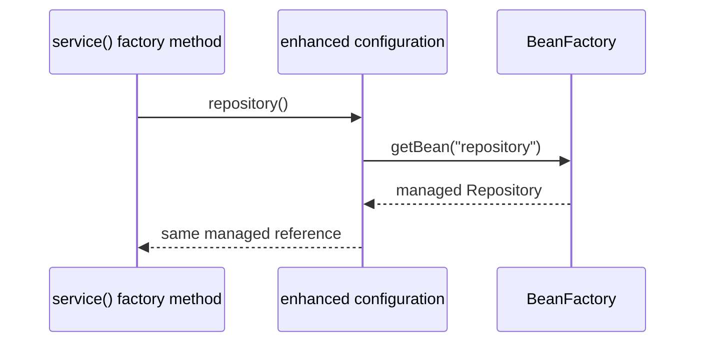
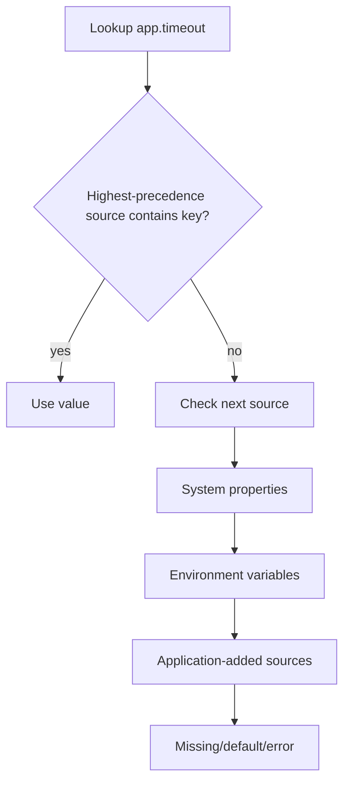

# Configuration, Profiles and Externalized Properties

> [!summary] За 30 секунд
> Spring configuration решает две разные задачи. **Configuration classes, imports, scanning и profiles формируют bean graph**. **Environment и PropertySource формируют значения, которыми этот graph настраивается**. Ошибки возникают, когда выбор структуры приложения смешивают с хранением runtime-параметров.

## Главная ментальная модель

```mermaid
flowchart TD
    A[Configuration inputs] --> B[Definition selection]
    A --> C[Value resolution]

    B --> B1[@Configuration and @Bean]
    B --> B2[@Import]
    B --> B3[Component scanning]
    B --> B4[@Profile]
    B --> D[BeanDefinition graph]

    C --> C1[Environment]
    C --> C2[PropertySource chain]
    C --> C3[Placeholders and @Value]
    C --> C4[Typed binding]
    C --> E[Resolved configuration values]

    D --> F[Bean creation]
    E --> F
```

> [!important]
> Profile отвечает прежде всего на вопрос **«какие bean definitions участвуют?»**. Property отвечает на вопрос **«какое значение использовать?»**.

---

# 1. `@Configuration` и `@Bean`

`@Configuration` обозначает class, основная роль которого — быть источником bean definitions.

```java
@Configuration
class ApplicationConfig {

    @Bean
    PaymentClient paymentClient() {
        return new PaymentClient();
    }
}
```

`@Bean` method описывает создание объекта, которым будет управлять container.

## Dependency через method parameter — самый прозрачный стиль

```java
@Bean
OrderService orderService(PaymentClient paymentClient) {
    return new OrderService(paymentClient);
}
```

Преимущества:

- dependency явно видна в signature;
- resolution выполняет container;
- не зависит от interception inter-bean call;
- одинаково понятна в full и lite configuration styles;
- проще тестировать и рефакторить.

---

# 2. Full `@Configuration` mode

В full mode configuration class обрабатывается так, чтобы вызовы `@Bean` methods могли быть перенаправлены к container-managed instances.

```java
@Configuration
class FullConfig {

    @Bean
    Repository repository() {
        return new Repository();
    }

    @Bean
    Service service() {
        return new Service(repository());
    }
}
```

Наивное чтение Java-кода говорит:

```text
service() вызывает repository()
        ↓
создаётся новый Repository
```

Но в full mode вызов `repository()` перехватывается enhanced configuration class и возвращает managed bean согласно scope.



## Что это даёт

- singleton semantics сохраняется при inter-bean calls;
- scope semantics сохраняется;
- lifecycle и post-processing применяются к managed instance;
- method call выглядит как Java call, но семантически является container lookup.

## Ограничения full mode

Для subclass-based enhancement configuration class и interceptable bean methods должны соответствовать ограничениям выбранной версии Spring. Практически важно:

- configuration class не должна мешать runtime subclassing;
- final/private method patterns могут нарушить interception assumptions;
- exact restrictions нужно сверять с используемой Spring version;
- в AOT/native scenarios предпочтительнее явные dependencies, а не скрытая магия inter-bean calls.

---

# 3. Lite `@Bean` mode

`@Bean` method может находиться в class, которая не является full `@Configuration`.

```java
@Component
class LiteFactory {

    @Bean
    Repository repository() {
        return new Repository();
    }

    @Bean
    Service service() {
        return new Service(repository());
    }
}
```

В lite mode вызов `repository()` внутри `service()` — обычный Java method call.

```text
service()
    ↓
ordinary repository() invocation
    ↓
new Repository()
```

Это может создать объект, который:

- не является тем же singleton bean из context;
- не проходит ожидаемый lifecycle как отдельный managed bean reference;
- не получает proxy/post-processing как container-returned bean;
- нарушает scope semantics.

> [!danger]
> Наличие `@Bean` на method не превращает любой внутренний вызов этого method в container lookup.

## Безопасный lite-style pattern

Использовать method parameters:

```java
@Bean
Service service(Repository repository) {
    return new Service(repository);
}
```

Теперь dependency разрешает container, а не ordinary Java call.

---

# 4. `proxyBeanMethods = false`

```java
@Configuration(proxyBeanMethods = false)
class ExplicitConfig {

    @Bean
    Repository repository() {
        return new Repository();
    }

    @Bean
    Service service(Repository repository) {
        return new Service(repository);
    }
}
```

`proxyBeanMethods = false` отключает runtime interception inter-bean method calls.

## Когда это хороший выбор

- каждый `@Bean` method самодостаточен;
- dependencies передаются parameters;
- methods не вызывают друг друга для получения managed beans;
- нужна более простая configuration model;
- важны startup/AOT optimizations;
- configuration class используется как декларативный factory list.

## Когда это опасно

```java
@Configuration(proxyBeanMethods = false)
class BrokenConfig {

    @Bean
    Repository repository() {
        return new Repository();
    }

    @Bean
    Service service() {
        return new Service(repository());
    }
}
```

`repository()` здесь ordinary call. Для singleton bean definition context всё ещё создаст managed `repository`, но `service` получит другой object.

## Memory Hook

> **Full mode protects method-to-method bean references. Explicit parameters remove the need for that protection.**

---

# 5. Full vs lite — не вопрос «какой annotation красивее»

| Свойство | Full `@Configuration` | Lite / `proxyBeanMethods=false` |
|---|---|---|
| Inter-bean method call | container-aware | ordinary Java call |
| Method parameters | поддерживаются | поддерживаются |
| Runtime enhancement | обычно требуется | не требуется |
| Hidden lookup semantics | есть | нет |
| Лучший dependency style | parameters или managed calls | parameters |
| Риск duplicate unmanaged object | ниже при method call | выше при method call |

## Senior-level recommendation

Даже в full mode предпочитай explicit method-parameter injection, если inter-bean call не даёт реальной выразительной ценности.

Причина:

```text
explicit dependency
    >
hidden interception dependency
```

по читаемости, тестируемости и переносимости.

---

# 6. Composition через `@Import`

`@Import` позволяет собрать configuration modules без широкого component scanning.

```java
@Configuration
@Import({DataConfig.class, MessagingConfig.class})
class ApplicationConfig {
}
```

## Что может импортироваться

В Spring 5.3 `@Import` поддерживает:

- `@Configuration` classes;
- regular component classes;
- `ImportSelector` implementations;
- `DeferredImportSelector` implementations;
- `ImportBeanDefinitionRegistrar` implementations.

## Простая configuration composition

```java
@Configuration
class DataConfig {
    @Bean DataSource dataSource() { ... }
}

@Configuration
@Import(DataConfig.class)
class ServiceConfig {
    @Bean OrderService orderService(DataSource dataSource) { ... }
}
```

## `ImportSelector`

Используется, когда imported configuration classes выбираются программно на основании metadata или environment-like conditions.

```java
class TransportImportSelector implements ImportSelector {
    @Override
    public String[] selectImports(AnnotationMetadata metadata) {
        return new String[] {KafkaConfig.class.getName()};
    }
}
```

## `DeferredImportSelector`

Выбор imports откладывается до обработки обычных configuration classes. Это особенно важно для framework/auto-configuration infrastructure.

## `ImportBeanDefinitionRegistrar`

Позволяет программно зарегистрировать definitions во время configuration parsing.

Используй, когда нужно зарегистрировать definitions, которые нельзя удобно выразить обычными `@Bean` methods.

> [!warning]
> Selector и registrar — infrastructure tools. Для обычного application module чаще достаточно явного `@Import(Config.class)`.

---

# 7. `@Import` против component scanning

## Component scanning

```java
@ComponentScan("com.example.payment")
```

Плюсы:

- удобно для homogenous application packages;
- автоматически находит stereotypes;
- снижает manual registration.

Риски:

- слишком широкий scan случайно включает adapters/configurations;
- test context поднимает лишние beans;
- module boundaries становятся неявными;
- одинаковые classes могут обнаруживаться из нескольких routes.

## Explicit imports

Плюсы:

- graph composition видна в code;
- module boundary контролируется;
- удобнее для reusable libraries;
- тест может импортировать только нужный slice.

Риски:

- больше явного configuration code;
- можно забыть required module;
- чрезмерно дробная composition создаёт import graph complexity.

## Selection rule

```text
Application package convention
    → component scan

Reusable module / optional feature / precise test slice
    → explicit @Import or enabling annotation
```

---

# 8. Profiles формируют bean definition graph

```java
@Configuration
@Profile("prod")
class ProductionDataConfig {
    @Bean DataSource dataSource() { ... }
}
```

Если profile expression не совпадает, definitions из configuration class не регистрируются.

## Method-level profile

```java
@Bean
@Profile("dev")
EmailSender fakeEmailSender() {
    return new LoggingEmailSender();
}
```

## Profile expression

В поддерживаемых версиях можно использовать expressions:

```java
@Profile("prod & !maintenance")
```

Всегда связывай syntax с version используемого Spring.

## Active profiles

Можно установить программно до refresh:

```java
AnnotationConfigApplicationContext context =
        new AnnotationConfigApplicationContext();
context.getEnvironment().setActiveProfiles("test");
context.register(AppConfig.class);
context.refresh();
```

## Default profile

Если active profiles отсутствуют, действует default profile mechanism. Имя default profile можно изменить через Environment.

> [!warning]
> Default profile — не то же самое, что application default property value.

---

# 9. Profiles не должны заменять feature flags

Profile обычно выбирается на startup и влияет на graph.

Feature flag может:

- меняться во время работы;
- зависеть от tenant/user/request;
- иметь percentage rollout;
- требовать audit trail;
- включать новый behavior без пересоздания context.

Неправильная модель:

```text
@Profile("new-algorithm")
```

для dynamic rollout.

Лучше:

```text
stable strategy beans
    +
feature-flag decision at runtime
```

## Profiles также не должны кодировать каждый deployment dimension

Плохой рост:

```text
dev
qa
uat
prod
prod-eu
prod-kz
prod-kz-blue
prod-kz-blue-dr
```

Лучше разделить:

- environment class → profile;
- endpoints/timeouts/credentials → properties/secrets;
- runtime rollout → feature flag;
- infrastructure topology → deployment platform.

---

# 10. `Environment`

`Environment` объединяет две функции:

1. profiles;
2. property resolution.

```java
@Component
class RuntimeInfo {
    RuntimeInfo(Environment environment) {
        boolean prod = environment.acceptsProfiles(
                Profiles.of("prod")
        );
        String region = environment.getProperty("app.region");
    }
}
```

## Хорошее применение

- infrastructure/configuration decisions;
- diagnostic endpoint;
- boundary adapter;
- startup validation;
- dynamic lookup, если значение действительно нужно читать по требованию.

## Плохое применение

```java
@Service
class PricingService {
    PricingService(Environment env) { ... }
}
```

с десятками string keys внутри business logic.

Проблемы:

- нет typed contract;
- keys размазаны по codebase;
- ошибки проявляются поздно;
- трудно валидировать и тестировать;
- business code зависит от configuration infrastructure.

---

# 11. `PropertySource` chain

Environment содержит ordered set property sources.



Точный порядок зависит от:

- plain Spring Framework setup;
- application-created sources;
- Spring Boot version;
- test framework overrides;
- command-line and deployment environment.

> [!danger]
> Нельзя учить один список precedence как универсальный для всех Spring/Boot versions.

## Plain Spring StandardEnvironment

Обычно включает system properties и system environment property sources. Дополнительные sources можно добавлять через:

- `@PropertySource`;
- `ApplicationContextInitializer`;
- programmatic Environment customization;
- test utilities.

## Spring Boot

Boot добавляет собственную external configuration model. Later/higher-precedence sources могут override earlier/lower-precedence values согласно конкретной версии Boot.

Spring Boot 2.4 изменил processing через Config Data. Поэтому production incident analysis обязан учитывать version.

---

# 12. `@PropertySource`

```java
@Configuration
@PropertySource("classpath:payment.properties")
class PaymentPropertiesConfig {
}
```

Это добавляет source в Environment.

## Ограничения

- не заменяет весь Spring Boot Config Data mechanism;
- ordering нескольких annotations/imported configurations может быть неочевидным;
- плохо подходит для сложной deployment precedence policy;
- properties могут быть добавлены слишком поздно для некоторых ранних Boot settings;
- YAML не является универсально поддерживаемым `@PropertySource` format без custom factory.

---

# 13. Placeholder resolution и `@Value`

```java
@Value("${payment.timeout-ms:1000}")
private int timeoutMs;
```

Состав:

```text
${key:default}
```

## Что важно понимать

- placeholder должен быть разрешён infrastructure processor;
- conversion к target type выполняется conversion system;
- missing property без default может fail startup;
- default после `:` является string representation, затем конвертируется;
- SpEL `#{...}` и property placeholder `${...}` — разные mechanisms.

## Strict placeholder behavior

В plain Spring можно зарегистрировать `PropertySourcesPlaceholderConfigurer`.

```java
@Bean
static PropertySourcesPlaceholderConfigurer placeholders() {
    return new PropertySourcesPlaceholderConfigurer();
}
```

`static` важен, потому что это `BeanFactoryPostProcessor`.

## Почему `@Value` плохо масштабируется

```java
@Value("${client.url}")
String url;

@Value("${client.timeout-ms}")
int timeout;

@Value("${client.retry.enabled}")
boolean retryEnabled;
```

Проблемы:

- нет cohesive configuration object;
- сложно валидировать комбинации;
- нет discoverable schema;
- scattered keys;
- неудобно передавать как dependency;
- refactoring менее безопасен.

---

# 14. Type-safe configuration

В Spring Boot для группы связанных properties предпочтителен typed configuration object.

Концептуально:

```java
@ConfigurationProperties(prefix = "payment")
public class PaymentProperties {
    private URI baseUrl;
    private Duration timeout;
    private Retry retry = new Retry();
}
```

Преимущества:

- grouped namespace;
- type conversion;
- validation;
- IDE metadata support;
- constructor/setter binding согласно Boot version и style;
- один dependency вместо множества strings;
- проще писать focused tests.

## `@Value` vs `@ConfigurationProperties`

| Сценарий | `@Value` | Typed properties |
|---|---:|---:|
| Одно локальное значение | удобно | возможно избыточно |
| Группа параметров | плохо масштабируется | предпочтительно |
| Validation | ручная/фрагментарная | естественная |
| Relaxed binding | ограниченно | Boot binder |
| Metadata/IDE | слабее | сильнее |
| Immutable configuration | неудобно | поддерживается version-specific style |

## Boundary rule

> Business service должен зависеть от typed domain-facing settings, а не от `Environment` и string keys.

---

# 15. Property precedence — объясняй через источник победившего значения

При incident:

```text
Expected timeout = 500
Actual timeout = 5000
```

не спрашивай только «что написано в application.yml?».

Спрашивай:

1. Какая Spring Boot version?
2. Какие PropertySources активны?
3. Какие profiles активны?
4. Есть ли profile-specific document?
5. Есть ли environment variable?
6. Есть ли command-line override?
7. Есть ли test property override?
8. Есть ли `spring.config.import` или external location?
9. Как key преобразован для environment variable naming?
10. Какое значение реально видит Environment?

## Diagnostic pattern

```java
ConfigurableEnvironment env = context.getEnvironment();
for (PropertySource<?> source : env.getPropertySources()) {
    Object value = source.getProperty("payment.timeout-ms");
    if (value != null) {
        log.info("{} -> {}", source.getName(), value);
    }
}
```

Не логируй secrets.

---

# 16. Secrets

Properties abstraction может технически читать secret, но architecture должна учитывать:

- secret store;
- access control;
- rotation;
- masking;
- audit;
- отсутствие secrets в Git;
- отсутствие secrets в exception/log output;
- short-lived credentials, где возможно.

> [!danger]
> `application-prod.properties` в repository — не secret-management system.

---

# 17. Configuration validation

Fail fast лучше, чем получить timeout или malformed URL при первом production request.

Проверять:

- required values;
- numeric ranges;
- URL/URI format;
- mutually dependent settings;
- profile-specific constraints;
- forbidden defaults в prod;
- secret placeholders, которые остались unresolved.

Пример invariant:

```text
retry.enabled = true
    requires
retry.maxAttempts > 0
and
retry.backoff > 0
```

Typed configuration object — естественное место для validation.

---

# 18. Configuration в тестах

## `@ActiveProfiles`

```java
@ActiveProfiles("test")
class PaymentIntegrationTest {
}
```

Выбирает profile-dependent definitions для test context.

## Test properties

В зависимости от testing stack можно использовать:

- `@TestPropertySource`;
- inline properties в test annotation;
- dynamic property registration;
- programmatic Environment;
- dedicated test configuration.

## Главная ловушка context cache

TestContext cache key учитывает configuration inputs. Бесконтрольное разнообразие profiles/properties создаёт много contexts и замедляет suite.

## Test design rule

```text
Test behavior
    not
accidental deployment file
```

Тест должен явно объявлять profile и critical properties, от которых зависит его graph.

---

# 19. Production-кейсы выбора mechanism

## Different implementation by environment

```text
dev → in-memory adapter
prod → real adapter
```

Подходит `@Profile`, если выбор делается на startup и меняет bean graph.

## Same implementation, different endpoint

```text
dev endpoint != prod endpoint
```

Используй property, не отдельный bean class только ради URL.

## Runtime percentage rollout

Используй feature flag/routing service, не profile.

## Optional library module

Используй explicit `@Import`, enabling annotation, selector или auto-configuration pattern.

## One local scalar

`@Value` допустим.

## Cohesive settings group

Typed properties object.

---

# 20. Частые ловушки

## Trap 1. «`@Bean` method всегда возвращает singleton»

Нет. Container управляет bean definition, но ordinary direct invocation lite method создаёт обычный object.

## Trap 2. «`proxyBeanMethods=false` делает beans prototype»

Нет. Scope managed definitions не меняется. Меняется semantics direct method calls внутри configuration code.

## Trap 3. «Profile — это набор properties»

Profile conditionally includes definitions. Profile-specific properties — отдельная Boot/config-data capability.

## Trap 4. «Environment variable всегда сильнее любого другого source»

Exact precedence зависит от setup/version. Нужна конкретная property-source chain.

## Trap 5. «`@PropertySource` загружает application.yml как Boot»

Нет. Boot Config Data и Framework `@PropertySource` — разные layers.

## Trap 6. «`@Value` и typed binding эквивалентны»

Они оба получают values, но typed binding даёт grouped contract, conversion, validation и metadata.

## Trap 7. «`@Import` создаёт object немедленно»

Он участвует в registration/configuration parsing. Bean creation происходит позже согласно lifecycle и laziness.

## Trap 8. «Active profile можно безопасно менять после refresh»

Bean graph уже сформирован. Изменение profile string не пересобирает существующий context.

---

# Decision Tree

```mermaid
flowchart TD
    A[Configuration need] --> B{Меняется bean graph?}
    B -->|Да| C{Выбор environment-wide на startup?}
    C -->|Да| D[@Profile]
    C -->|Нет| E{@Import / selector / registrar / feature architecture}

    B -->|Нет| F{Одно локальное scalar value?}
    F -->|Да| G[@Value or Environment at boundary]
    F -->|Нет| H{Связанная группа settings?}
    H -->|Да| I[Typed configuration properties]
    H -->|Нет| J[Explicit configuration object/API]
```

---

# Interview Answer

> Spring configuration имеет structural и value layers. `@Configuration`, `@Bean`, scanning, `@Import` и profiles формируют bean definitions. Environment и ordered PropertySources разрешают runtime values. Full `@Configuration` перехватывает inter-bean method calls и возвращает managed beans; lite mode и `proxyBeanMethods=false` выполняют обычные Java calls, поэтому dependencies лучше передавать parameters. Profiles подходят для startup graph variants, properties — для изменяемых значений, а cohesive settings лучше связывать в typed configuration object. Exact property precedence всегда нужно привязывать к конкретной Spring Boot version и фактической PropertySource chain.

# Memory Hooks

> **Graph choices use configuration and profiles. Value choices use properties. Runtime rollout uses feature flags.**

> **Full mode intercepts calls. Lite mode executes calls. Parameters avoid the ambiguity.**

> **Do not ask only “what is in the file?” Ask “which PropertySource won?”**

# Проверка понимания

> [!question] Что изменяет `proxyBeanMethods=false`?

> [!answer]- Ответ
> Он отключает interception direct calls между `@Bean` methods. Bean definitions и их scopes остаются container-managed, но внутренний method call становится обычным Java invocation.

> [!question] Когда использовать profile, а когда property?

> [!answer]- Ответ
> Profile — когда на startup нужно выбрать разные bean definitions. Property — когда implementation остаётся той же, но меняются endpoint, timeout, limits или другие values.

> [!question] Почему нельзя называть универсальный порядок Spring Boot property sources без версии?

> [!answer]- Ответ
> Потому что external configuration processing и precedence менялись между Boot versions, особенно с Config Data начиная с Boot 2.4, а tests и programmatic sources также меняют chain.

> [!question] Почему method-parameter injection надёжнее inter-bean call?

> [!answer]- Ответ
> Dependency resolution явно выполняет container и не зависит от full/lite interception semantics configuration class.

# Sources

- [[98_SOURCES/Spring Configuration and Profiles Sources]]
