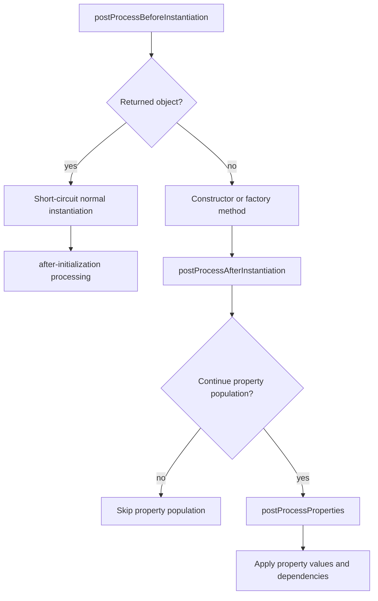
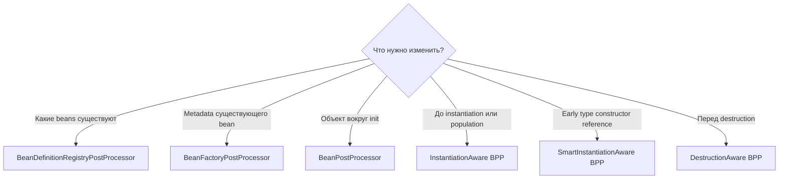

# Container Extension Points

> [!summary] За 30 секунд
> Spring container расширяется на двух принципиально разных уровнях. `BeanFactoryPostProcessor` и `BeanDefinitionRegistryPostProcessor` работают с **описаниями будущих beans до создания обычных объектов**. `BeanPostProcessor` и его специализированные подинтерфейсы работают с **конкретными bean instances во время их создания, initialization, proxying и destruction**.

## Главная ментальная модель: две плоскости


> [!important] Главное различие
> Metadata processors изменяют **рецепт**. Instance processors изменяют, проверяют или заменяют **приготовленный объект**.

## Почему это один из самых сложных разделов Spring

Названия похожи:

- `BeanPostProcessor`;
- `BeanFactoryPostProcessor`;
- `BeanDefinitionRegistryPostProcessor`;
- `InstantiationAwareBeanPostProcessor`;
- `SmartInstantiationAwareBeanPostProcessor`;
- `DestructionAwareBeanPostProcessor`.

Но они вмешиваются в разные фазы и имеют разные допустимые действия.

Плохое запоминание:

> «Все processors вызываются где-то до или после bean».

Хорошая модель:

1. **Registry phase** — какие definitions вообще существуют?
2. **Metadata phase** — как настроены существующие definitions?
3. **Instantiation phase** — создавать ли объект обычным способом?
4. **Population phase** — как заполнять dependencies и properties?
5. **Initialization phase** — что выполнить вокруг init callbacks?
6. **Publication phase** — какой reference станет bean: target или proxy?
7. **Destruction phase** — нужна ли дополнительная cleanup-логика?

---

# 1. BeanDefinitionRegistryPostProcessor

## Назначение

`BeanDefinitionRegistryPostProcessor` расширяет `BeanFactoryPostProcessor` и получает доступ к `BeanDefinitionRegistry` **до обычной metadata post-processing phase**.

Он может:

- регистрировать новые BeanDefinitions;
- удалять definitions;
- менять registration topology;
- создавать definitions на основании classpath scanning, внешней схемы или plugin metadata.

## Два callback

```java
public interface BeanDefinitionRegistryPostProcessor
        extends BeanFactoryPostProcessor {

    void postProcessBeanDefinitionRegistry(
            BeanDefinitionRegistry registry
    );

    void postProcessBeanFactory(
            ConfigurableListableBeanFactory beanFactory
    );
}
```

Сначала выполняется registry callback, затем inherited factory callback.

## Интуиция

`postProcessBeanDefinitionRegistry()` работает как архитектор, который может добавить новые этажи на план здания.

`postProcessBeanFactory()` работает как инженер, который уточняет параметры уже существующих помещений.

## Минимальный пример

```java
class PluginRegistryPostProcessor
        implements BeanDefinitionRegistryPostProcessor {

    @Override
    public void postProcessBeanDefinitionRegistry(
            BeanDefinitionRegistry registry
    ) {
        RootBeanDefinition definition =
                new RootBeanDefinition(PaymentPlugin.class);

        registry.registerBeanDefinition(
                "paymentPlugin",
                definition
        );
    }

    @Override
    public void postProcessBeanFactory(
            ConfigurableListableBeanFactory beanFactory
    ) {
        // optional second metadata phase
    }
}
```

## Когда использовать

- framework starter регистрирует beans динамически;
- plugin architecture превращает metadata в definitions;
- custom annotation scanning создаёт infrastructure definitions;
- нужно добавить bean before regular bean creation.

## Когда не использовать

- для изменения уже созданного object;
- для business routing во время request;
- для вызова service methods;
- когда обычного `@Bean` или `ImportBeanDefinitionRegistrar` достаточно.

---

# 2. BeanFactoryPostProcessor

## Назначение

`BeanFactoryPostProcessor` читает и изменяет configuration metadata после загрузки BeanDefinitions, но до создания обычных application beans.

```java
public interface BeanFactoryPostProcessor {
    void postProcessBeanFactory(
            ConfigurableListableBeanFactory beanFactory
    ) throws BeansException;
}
```

## Что допустимо

- изменить property values BeanDefinition;
- изменить scope;
- изменить lazy-init;
- добавить qualifier metadata;
- заменить class name или factory metadata;
- обработать placeholders;
- проверить definition invariants.

## Пример изменения metadata

```java
class TimeoutMetadataPostProcessor
        implements BeanFactoryPostProcessor {

    @Override
    public void postProcessBeanFactory(
            ConfigurableListableBeanFactory beanFactory
    ) {
        BeanDefinition definition =
                beanFactory.getBeanDefinition("remoteClient");

        definition.getPropertyValues()
                .add("timeoutMs", 2_000);
    }
}
```

Объект `remoteClient` в этот момент ещё не должен быть создан.

## Критическая ошибка: `getBean()` внутри BFPP

```java
@Override
public void postProcessBeanFactory(
        ConfigurableListableBeanFactory beanFactory
) {
    RemoteClient client = beanFactory.getBean(RemoteClient.class);
    client.configure();
}
```

Это вызывает premature instantiation.

Возможные последствия:

- bean создаётся до регистрации полного набора BPP;
- bean не получает proxy;
- annotations могут не обработаться;
- dependency graph создаётся слишком рано;
- container lifecycle становится непредсказуемым.

> [!danger] Правило
> В metadata phase работай с `BeanDefinition`, а не с application bean instance.

## Static @Bean для BFPP

```java
@Configuration
class InfrastructureConfiguration {

    @Bean
    static BeanFactoryPostProcessor timeoutProcessor() {
        return new TimeoutMetadataPostProcessor();
    }
}
```

`static` позволяет вызвать factory method без преждевременного создания configuration-class instance и связанных dependencies.

Плохо:

```java
@Bean
BeanFactoryPostProcessor processor(ApplicationService service) {
    return beanFactory -> service.prepare();
}
```

Сам processor требует application service, который теперь создаётся в ранней infrastructure phase.

---

# 3. BeanPostProcessor

## Назначение

`BeanPostProcessor` работает с каждым создаваемым bean instance вокруг initialization callbacks.

```java
public interface BeanPostProcessor {

    default Object postProcessBeforeInitialization(
            Object bean,
            String beanName
    ) {
        return bean;
    }

    default Object postProcessAfterInitialization(
            Object bean,
            String beanName
    ) {
        return bean;
    }
}
```

## Before initialization

Вызывается после instantiation, dependency population и aware callbacks, но до стандартных init callbacks.

Типичные задачи:

- вызвать annotation-driven lifecycle method;
- выполнить validation;
- применить marker interfaces;
- подготовить состояние перед init.

## After initialization

Вызывается после init callbacks.

Типичные задачи:

- вернуть proxy;
- вернуть decorator;
- зарегистрировать runtime instrumentation;
- заменить exposed reference.

## BPP может вернуть другой object

```java
@Override
public Object postProcessAfterInitialization(
        Object bean,
        String beanName
) {
    if (bean instanceof PaymentService) {
        return createProxy(bean);
    }
    return bean;
}
```

Consumer получит proxy, а не обязательно raw instance.

## `null` и processor chain

В Spring 5.3 callback contract допускает возврат `null` как сигнал остановить дальнейшую processing chain и использовать предыдущий result. Для прикладного processor безопасная модель — всегда возвращать текущий bean reference, если замена не требуется.

```java
return bean;
```

## Per-container scope

BPP действует только внутри container, где зарегистрирован.

Parent context processor не становится автоматически processor дочернего context и наоборот.

---

# 4. Как регистрируется BeanPostProcessor

## Auto-detection в ApplicationContext

`ApplicationContext` находит beans типа `BeanPostProcessor`, создаёт их в ранней startup phase и регистрирует до обычных application beans.

```java
@Bean
static AuditProxyPostProcessor auditProxyPostProcessor() {
    return new AuditProxyPostProcessor();
}
```

## Почему важен declared return type

Плохо:

```java
@Bean
Object auditProcessor() {
    return new AuditProxyPostProcessor();
}
```

Container может не распознать processor sufficiently early по factory-method type metadata.

Хорошо:

```java
@Bean
BeanPostProcessor auditProcessor() {
    return new AuditProxyPostProcessor();
}
```

или конкретный implementation type.

## Programmatic registration

```java
beanFactory.addBeanPostProcessor(
        new AuditProxyPostProcessor()
);
```

Особенности:

- выполняется в registration order;
- `PriorityOrdered` и `Ordered` игнорируются;
- programmatically added BPP идут раньше auto-detected processors.

Это не просто иной синтаксис. Это иной ordering contract.

---

# 5. Ordering processors

## Auto-detected processors

Для processors, найденных container как beans, применяется общая модель:

```text
PriorityOrdered
    ↓
Ordered
    ↓
unordered processors
```

Внутри одной категории используются order values и container registration details.

## Programmatic processors

```text
registration call 1
    ↓
registration call 2
    ↓
auto-detected processors
```

Implemented `Ordered` не меняет эту последовательность.

## Почему ordering опасен

Представим два processors:

1. validator ожидает raw class;
2. proxy creator заменяет bean на JDK proxy.

Если proxy creator выполняется раньше, validator может увидеть другой runtime type.

Другой пример:

1. metadata enricher добавляет marker;
2. proxy creator ищет marker.

Неправильный order — proxy не создаётся.

> [!tip] Production rule
> Между processors должен быть явный, тестируемый protocol. Не полагайся на случайный registration order.

---

# 6. BeanPostProcessor и ранняя инициализация

## Почему processors создаются рано

Чтобы processor обработал application bean, он сам должен существовать до создания этого bean.

Поэтому Spring сначала создаёт:

- BeanPostProcessor instances;
- их непосредственные dependencies;
- часть infrastructure beans.

## Главная ловушка

```java
class AuditPostProcessor implements BeanPostProcessor {

    @Autowired
    private PaymentService paymentService;
}
```

`PaymentService` создаётся как dependency processor слишком рано.

Возможный log:

```text
Bean 'paymentService' is not eligible for getting processed
by all BeanPostProcessor interfaces
```

Последствия:

- отсутствующий transaction proxy;
- отсутствующий async proxy;
- отсутствующий custom processor;
- raw target вместо expected decorated bean.

## Исправления

- processor зависит только от infrastructure abstractions;
- использовать lightweight metadata;
- использовать `ObjectProvider`, если lookup действительно должен быть delayed;
- не внедрять business service в processor;
- разделить detection и runtime collaboration.

---

# 7. InstantiationAwareBeanPostProcessor

`InstantiationAwareBeanPostProcessor` расширяет BPP и добавляет callbacks вокруг instantiation и property population.

## Lifecycle position



## postProcessBeforeInstantiation

```java
Object postProcessBeforeInstantiation(
        Class<?> beanClass,
        String beanName
)
```

Может вернуть object до обычного создания target.

Если возвращён non-null reference:

- standard target instantiation short-circuited;
- property population и standard initialization target не выполняются обычным путём;
- returned reference проходит after-initialization BPP chain.

Это advanced framework hook, не обычный способ создать business bean.

## postProcessAfterInstantiation

```java
boolean postProcessAfterInstantiation(
        Object bean,
        String beanName
)
```

Вызывается после constructor/factory method, но до population.

Возврат `false` говорит container не выполнять normal property population для этого bean.

## postProcessProperties

```java
PropertyValues postProcessProperties(
        PropertyValues pvs,
        Object bean,
        String beanName
)
```

Позволяет:

- обработать custom injection annotation;
- изменить property values;
- разрешить custom dependency markers;
- выполнить field/method injection.

`AutowiredAnnotationBeanPostProcessor` — canonical infrastructure example такого подхода.

---

# 8. SmartInstantiationAwareBeanPostProcessor

Это special-purpose extension, в первую очередь для framework infrastructure.

## predictBeanType

Позволяет предположить eventual bean type до полного создания.

Это важно для:

- type matching;
- proxy type prediction;
- infrastructure introspection.

## determineCandidateConstructors

Позволяет предложить constructors, которые container должен рассмотреть для autowiring.

Annotation-driven constructor resolution реализуется через такую infrastructure.

## getEarlyBeanReference

Позволяет предоставить early reference, обычно proxy-compatible, при разрешении определённых circular-reference scenarios.

```java
Object getEarlyBeanReference(
        Object bean,
        String beanName
)
```

> [!warning]
> Это не универсальное разрешение circular dependencies. Early reference усложняет identity, proxy consistency и lifecycle reasoning.

## Почему interface называется Smart

Он помогает container принять решения до завершения стандартного lifecycle:

- какой type ожидать;
- какой constructor использовать;
- какой reference можно отдать раньше.

---

# 9. DestructionAwareBeanPostProcessor

## Назначение

Дополнительный hook перед destruction callbacks bean.

```java
public interface DestructionAwareBeanPostProcessor
        extends BeanPostProcessor {

    void postProcessBeforeDestruction(
            Object bean,
            String beanName
    );

    default boolean requiresDestruction(Object bean) {
        return true;
    }
}
```

## Use cases

- удалить bean из external registry;
- завершить instrumentation;
- очистить framework-specific metadata;
- вызвать annotation-driven destruction method;
- вести lifecycle audit.

## requiresDestruction

Позволяет быстро определить, нужен ли destruction callback конкретному bean.

```java
@Override
public boolean requiresDestruction(Object bean) {
    return bean.getClass().isAnnotationPresent(Tracked.class);
}
```

Это особенно полезно, когда processor применим к малому subset большого container.

## Prototype boundary

DestructionAware BPP участвует в destruction только тогда, когда container фактически выполняет destruction lifecycle. Для обычного prototype Spring не управляет дальнейшим lifecycle после выдачи instance, поэтому automatic destruction остаётся ограниченным.

---

# 10. BeanFactoryPostProcessor vs BeanPostProcessor

| Вопрос | BeanFactoryPostProcessor | BeanPostProcessor |
|---|---|---|
| Работает с | BeanDefinition metadata | bean instances |
| Когда | до обычного bean creation | во время каждого bean lifecycle |
| Может добавить definition | нет напрямую | нет |
| Может изменить definition | да | не основная задача |
| Может вернуть proxy | нет | да |
| Можно вызывать application bean | не следует | processor уже работает с instance |
| Типичный пример | placeholder configurer | auto-proxy creator |

## Решение за 20 секунд



---

# 11. Custom annotation pattern

Предположим, нужен annotation-driven proxy.

```java
@Target(ElementType.TYPE)
@Retention(RetentionPolicy.RUNTIME)
public @interface Audited {
}
```

Processor:

```java
class AuditProxyPostProcessor implements BeanPostProcessor {

    @Override
    public Object postProcessAfterInitialization(
            Object bean,
            String beanName
    ) {
        if (!bean.getClass().isAnnotationPresent(Audited.class)) {
            return bean;
        }

        return Proxy.newProxyInstance(
                bean.getClass().getClassLoader(),
                bean.getClass().getInterfaces(),
                (proxy, method, args) -> {
                    audit(beanName, method.getName());
                    return method.invoke(bean, args);
                }
        );
    }
}
```

## Что нужно проверить

- bean имеет interface для JDK proxy;
- annotation ищется на target class, а не уже созданном proxy;
- processor не proxy-ит infrastructure beans;
- ordering с другими auto-proxy creators определён;
- не создаётся double proxy без необходимости;
- exceptions из reflection корректно unwrap-ятся;
- equals/hashCode/toString semantics осмыслены.

---

# 12. Framework example: почему @Autowired работает

`@Autowired` не является встроенной возможностью JVM и не выполняется самим annotation.

Infrastructure processor:

1. анализирует injection metadata;
2. находит annotated fields, methods и constructors;
3. участвует в constructor resolution;
4. выполняет dependency injection перед initialization.

Это важная общая формула Spring:

```text
annotation
    + processor
    + lifecycle phase
    = behavior
```

Без processor annotation остаётся metadata без действия.

---

# 13. Registration mistakes

## Ошибка 1. Processor объявлен как Object

```java
@Bean
Object myProcessor() {
    return new MyBeanPostProcessor();
}
```

Container может не обнаружить BPP sufficiently early.

## Ошибка 2. BFPP non-static @Bean

```java
@Bean
BeanFactoryPostProcessor metadataProcessor() {
    return new MetadataProcessor();
}
```

Это может преждевременно создать configuration class.

## Ошибка 3. Processor зависит от business service

```java
@Bean
static BeanPostProcessor processor(PaymentService service) {
    return new Processor(service);
}
```

Business service создаётся в processor-registration phase.

## Ошибка 4. BFPP вызывает getBean

Metadata phase превращается в premature instance phase.

## Ошибка 5. Programmatic registration ожидает @Order

```java
beanFactory.addBeanPostProcessor(first);
beanFactory.addBeanPostProcessor(second);
```

Реальный order определяется этими вызовами, а не annotations processors.

---

# 14. Production diagnostics

## Симптом: отсутствует @Transactional

Проверь:

1. Bean создавался до регистрации auto-proxy BPP?
2. Bean является direct dependency custom BPP?
3. Есть log `not eligible for getting processed by all BeanPostProcessor interfaces`?
4. Consumer получил raw target или proxy?
5. Custom processor возвращает original bean после уже созданного proxy?

## Симптом: custom annotation ничего не делает

Проверь:

- processor зарегистрирован как BPP;
- factory method declared return type;
- processor order;
- annotation retention `RUNTIME`;
- target class vs proxy class;
- component находится в том же ApplicationContext;
- processor не был создан после target bean.

## Симптом: container startup неожиданно создаёт много beans

Проверь:

- dependencies processors;
- `getBean()` в BFPP;
- type lookup в processor constructor;
- autowired collections внутри processor;
- non-static processor factory methods.

---

# 15. Interview answer

> Spring container extension points делятся на metadata-level и instance-level. `BeanDefinitionRegistryPostProcessor` может добавить definitions, `BeanFactoryPostProcessor` изменяет существующие definitions до ordinary bean instantiation, а `BeanPostProcessor` работает с instances вокруг initialization и может вернуть proxy. `InstantiationAwareBeanPostProcessor` добавляет hooks до instantiation и property population, `SmartInstantiationAwareBeanPostProcessor` участвует в type prediction, constructor selection и early references, а `DestructionAwareBeanPostProcessor` получает callback перед destruction. Ключевые production traps — premature bean creation, processor dependencies, ordering и потеря auto-proxy eligibility.

---

# 16. Exam traps

> [!warning] Trap 1
> `BeanFactoryPostProcessor` не является processor конкретных BeanFactory objects. Он изменяет metadata внутри BeanFactory.

> [!warning] Trap 2
> `BeanPostProcessor` вызывается не один раз на container, а для каждого создаваемого eligible bean instance.

> [!warning] Trap 3
> `@Order` не управляет programmatically registered BPP: там действует registration order.

> [!warning] Trap 4
> `postProcessBeforeInstantiation()` выполняется до обычного target creation, а `postProcessBeforeInitialization()` — после target creation и population.

> [!warning] Trap 5
> `BeanDefinitionRegistryPostProcessor` имеет обе фазы: registry callback и inherited factory callback.

> [!warning] Trap 6
> BPP и beans, которые они напрямую создают как dependencies, могут не получить полный auto-proxy processing.

---

# 17. Memory hooks

> **Registry adds recipes. Factory processor edits recipes. Bean processor edits meals.**

> **Before instantiation can replace creation. Before initialization cannot undo that the target already exists.**

> **Programmatic processors obey registration order, not their badges.**

> **A processor that eagerly touches business beans may remove the very proxy it was supposed to support.**

---

# 18. Проверка понимания

> [!question] Нужно динамически добавить 50 BeanDefinitions из external plugin manifest. Какой extension point выбрать?

> [!answer]- Ответ
> `BeanDefinitionRegistryPostProcessor`, потому что требуется изменить набор definitions до обычного bean creation.

> [!question] Нужно изменить timeout property в definition до создания client. Что использовать?

> [!answer]- Ответ
> `BeanFactoryPostProcessor` и изменение `BeanDefinition`, не `getBean()`.

> [!question] Нужно обернуть service proxy после init. Что использовать?

> [!answer]- Ответ
> `BeanPostProcessor.postProcessAfterInitialization()` либо готовую Spring AOP infrastructure.

> [!question] Почему business service, внедрённый в custom BPP, может остаться без transaction proxy?

> [!answer]- Ответ
> Он создаётся слишком рано как dependency processor, до регистрации полного набора BeanPostProcessor, включая auto-proxy infrastructure.

> [!question] Чем `postProcessBeforeInstantiation` отличается от `postProcessBeforeInitialization`?

> [!answer]- Ответ
> Первый вызывается до обычного target creation и может short-circuit instantiation. Второй работает с уже созданным, populated bean непосредственно перед init callbacks.

---

# Sources

- [[98_SOURCES/Spring Container Extension Point Sources]]
