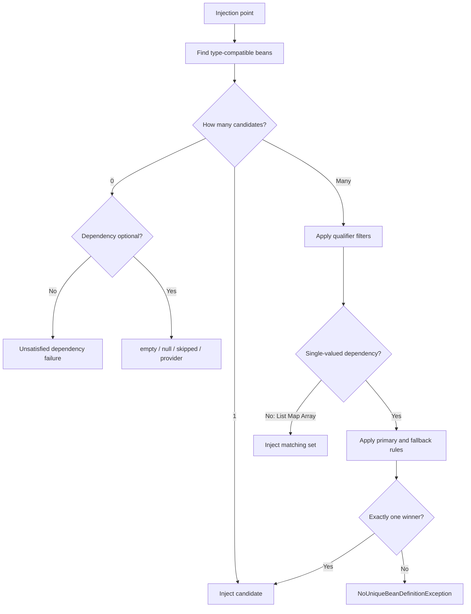
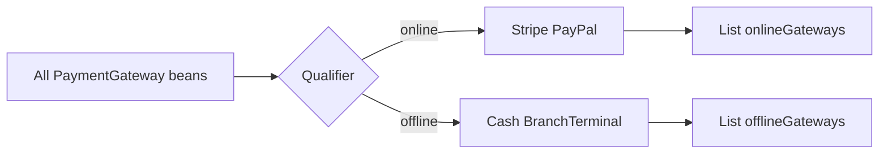

# Dependency Resolution and Optional Injection

> [!summary] За 30 секунд
> Spring сначала определяет beans, совместимые **по типу**, затем сужает множество кандидатов qualifiers и другими признаками, после чего выбирает единственный bean для single-valued dependency или собирает все подходящие beans для collection injection. Отсутствие зависимости и неоднозначность — разные проблемы и решаются разными средствами.

## Почему тема сложная

Разработчик часто запоминает набор аннотаций:

- `@Primary`;
- `@Qualifier`;
- `@Autowired(required = false)`;
- `Optional<T>`;
- `ObjectProvider<T>`.

Но на экзамене и в production важен не список, а **алгоритм разрешения зависимости**.



> [!important] Центральная развилка
> **Zero candidates**, **one candidate** и **many candidates** — три разных состояния. `Optional` помогает при zero. `@Qualifier` и `@Primary` помогают при many.

# 1. Type matching открывает дверь

```java
interface PaymentGateway {
    String id();
}
```

```java
@Bean
PaymentGateway stripeGateway() {
    return new StripeGateway();
}

@Bean
PaymentGateway paypalGateway() {
    return new PaypalGateway();
}
```

Injection point:

```java
CheckoutService(PaymentGateway gateway) {
    this.gateway = gateway;
}
```

Оба beans совместимы по типу. Поэтому Spring не должен угадывать бизнес-намерение и завершает создание context ошибкой неоднозначности.

## Ментальная модель

> Тип отвечает на вопрос **«кто способен выполнить контракт?»**.  
> Qualifier отвечает **«какая характеристика нужна именно здесь?»**.  
> Primary отвечает **«какой кандидат является стандартным выбором?»**.

# 2. `@Primary`: предпочитаемый default

```java
@Bean
@Primary
PaymentGateway stripeGateway() {
    return new StripeGateway();
}

@Bean
PaymentGateway paypalGateway() {
    return new PaypalGateway();
}
```

Для single-valued `PaymentGateway` будет выбран `stripeGateway`.

## Что `@Primary` делает

- участвует только после type matching;
- задаёт предпочтение среди нескольких подходящих candidates;
- разрешает неоднозначность, если primary candidate ровно один;
- может применяться к component class или `@Bean` method.

## Что `@Primary` не делает

- не удаляет остальные beans;
- не изменяет bean name;
- не превращает bean в singleton;
- не фильтрует `List<PaymentGateway>` до одного элемента;
- не создаёт порядок из нескольких primary beans.

> [!danger] Два primary
> Если среди оставшихся candidates два beans помечены `@Primary`, зависимость всё ещё неоднозначна.

## Memory Hook

> **Primary = default winner for one seat.** Если мест много, остальные candidates остаются.

# 3. `@Qualifier`: semantic filtering

```java
@Bean
@Qualifier("online")
PaymentGateway stripeGateway() {
    return new StripeGateway();
}

@Bean
@Qualifier("online")
PaymentGateway paypalGateway() {
    return new PaypalGateway();
}

@Bean
@Qualifier("offline")
PaymentGateway cashGateway() {
    return new CashGateway();
}
```

```java
CheckoutService(
        @Qualifier("offline") PaymentGateway gateway
) {
    this.gateway = gateway;
}
```

Spring сначала оставляет type-compatible `PaymentGateway`, затем фильтрует их по semantic label `offline`.

## Qualifier — не обязательно уникальное имя

```java
@Autowired
@Qualifier("online")
private List<PaymentGateway> onlineGateways;
```

В список попадут и Stripe, и PayPal, потому что qualifier может описывать категорию.

Хорошие qualifier values:

- `online`;
- `offline`;
- `persistent`;
- `inMemory`;
- `EMEA`;
- `highPriority`.

Хрупкие values:

- случайное техническое имя класса;
- имя, которое теряет смысл после рефакторинга;
- строка, используемая как неявный business enum без проверки компилятором.

## Custom qualifier annotation

```java
@Target({
        ElementType.FIELD,
        ElementType.PARAMETER,
        ElementType.METHOD,
        ElementType.TYPE
})
@Retention(RetentionPolicy.RUNTIME)
@Qualifier
public @interface Channel {
    ChannelType value();
}
```

Использование:

```java
@Bean
@Channel(ChannelType.ONLINE)
PaymentGateway stripeGateway() {
    return new StripeGateway();
}
```

```java
CheckoutService(
        @Channel(ChannelType.ONLINE) List<PaymentGateway> gateways
) {
    this.gateways = gateways;
}
```

Преимущества:

- меньше строковых опечаток;
- qualifier становится частью domain vocabulary;
- можно добавлять attributes;
- проще искать usages.

# 4. `@Qualifier` и `@Primary` вместе

Правильная модель:

```text
1. Type matching
2. Qualifier narrowing
3. Primary preference among remaining candidates
4. Name fallback and other resolution rules where applicable
```

Пример:

```java
@Bean
@Primary
@Qualifier("online")
PaymentGateway stripeGateway() { ... }

@Bean
@Qualifier("online")
PaymentGateway paypalGateway() { ... }

@Bean
@Qualifier("offline")
PaymentGateway cashGateway() { ... }
```

Injection point:

```java
CheckoutService(
        @Qualifier("online") PaymentGateway gateway
) { ... }
```

Qualifier оставляет два online beans, а primary выбирает Stripe среди них.

> [!warning] Экзаменационная ловушка
> Нельзя говорить, что `@Primary` «всегда сильнее» `@Qualifier`. Explicit semantic filter не должен игнорироваться глобальным default.

# 5. Bean-name fallback

При неоднозначности Spring может учитывать имя injection point как fallback против bean names.

```java
@Bean
PaymentGateway stripeGateway() { ... }

@Bean
PaymentGateway paypalGateway() { ... }
```

```java
CheckoutService(PaymentGateway stripeGateway) {
    this.gateway = stripeGateway;
}
```

Это может выбрать bean `stripeGateway`.

## Почему не стоит строить архитектуру только на этом

- parameter rename может изменить wiring;
- намерение слабее видно при code review;
- compiler settings и сохранение parameter names могут иметь значение в разных версиях;
- semantic qualifier лучше выражает бизнес-характеристику.

> [!tip]
> Name fallback удобен как convention. `@Qualifier` лучше как explicit contract.

# 6. `@Autowired` против `@Resource`

## `@Autowired`

- type-driven;
- qualifiers сужают candidates;
- поддерживает constructors и multi-argument methods;
- collection injection естественна.

## `@Resource`

- name-oriented semantics;
- удобно, когда нужен конкретный уникально именованный component;
- поддерживается для fields и single-argument setter methods;
- не является основным выбором для constructor injection.

Memory hook:

```text
@Autowired: Which bean of this type?
@Resource: Give me the resource with this name.
```

# 7. Multi-element injection

## List and array

```java
CheckoutPipeline(List<Validator> validators) {
    this.validators = validators;
}
```

Spring внедряет все matching validator beans.

## Set

```java
RuleEngine(Set<Rule> rules) { ... }
```

Используется, когда semantic duplicate и positional ordering не являются частью контракта.

## Map

```java
CheckoutRouter(Map<String, PaymentGateway> gateways) {
    this.gateways = gateways;
}
```

- keys — bean names;
- values — matching beans;
- стандартная форма использует `String` keys.

## Ordering

```java
@Component
@Order(10)
class FraudValidator implements Validator { ... }
```

```java
@Component
@Order(20)
class LimitValidator implements Validator { ... }
```

`List<Validator>` будет отсортирован согласно ordering contract.

> [!warning]
> `@Order` для injected list не означает порядок создания beans. Initialization order определяется dependency graph и отдельными lifecycle rules.

# 8. Qualifier-filtered collections

```java
CheckoutService(
        @Qualifier("online") List<PaymentGateway> onlineGateways,
        @Qualifier("offline") List<PaymentGateway> offlineGateways
) { ... }
```

Это сильный pattern для strategy groups.



# 9. Zero candidates: optional dependency models

## 9.1 `@Autowired(required = false)` field

```java
@Autowired(required = false)
private AuditSink auditSink = AuditSink.noop();
```

Если candidate отсутствует, field injection пропускается и сохраняется default value.

Недостатки:

- field injection скрывает dependency;
- mutable initialization;
- отсутствие видно хуже, чем в constructor contract.

## 9.2 Optional setter or method

```java
@Autowired(required = false)
void configureAudit(AuditSink auditSink) {
    this.auditSink = auditSink;
}
```

Если argument unavailable, метод **не вызывается вообще**.

Это не эквивалентно:

```java
configureAudit(null);
```

## 9.3 `Optional<T>`

```java
CheckoutService(Optional<AuditSink> auditSink) {
    this.auditSink = auditSink;
}
```

Плюсы:

- absence видна в constructor contract;
- не нужен raw `null`;
- удобно для одноразового решения при создании bean.

Ограничение:

- `Optional` решает zero candidates;
- не решает many candidates.

## 9.4 `@Nullable`

```java
CheckoutService(@Nullable AuditSink auditSink) {
    this.auditSink = auditSink;
}
```

Spring может передать `null`, а consuming code обязан его обработать.

## 9.5 `ObjectProvider<T>`

```java
class PricingService {
    private final ObjectProvider<DiscountPolicy> policies;

    PricingService(ObjectProvider<DiscountPolicy> policies) {
        this.policies = policies;
    }

    DiscountPolicy currentPolicy() {
        return policies.getIfAvailable(NoDiscountPolicy::new);
    }
}
```

ObjectProvider полезен для:

- lazy resolution;
- optional lookup;
- default supplier;
- repeated lookup;
- prototype-scoped dependency;
- iteration or stream over candidates.

## Provider method choice

| Method | Zero candidates | Many candidates |
|---|---|---|
| `getObject()` | failure | failure unless resolvable |
| `getIfAvailable()` | null/default | may still be ambiguous |
| `getIfUnique()` | null/default | null/default when not unique |
| `orderedStream()` | empty stream possible | returns ordered candidate stream |

> [!important]
> **Availability** и **uniqueness** — разные измерения. Метод, терпимый к zero, не обязательно терпим к many.

# 10. Constructor resolution

## Single constructor

```java
@Component
class CheckoutService {
    CheckoutService(PaymentGateway gateway) { ... }
}
```

В Spring 5.3 единственный constructor используется без явного `@Autowired`.

## Multiple constructors

Если несколько constructors помечены `@Autowired(required = false)`, Spring рассматривает их как candidates и выбирает наиболее «greedy» satisfiable constructor согласно resolution rules.

```java
@Component
class ReportService {

    @Autowired(required = false)
    ReportService(Repository repository, AuditSink auditSink) { ... }

    @Autowired(required = false)
    ReportService(Repository repository) { ... }
}
```

Если доступны обе dependencies, может быть выбран первый constructor; если AuditSink отсутствует — второй.

> [!danger]
> Нельзя пометить несколько constructors как required=true и ожидать, что Spring выберет «лучший».

# 11. Generics as qualifiers

```java
interface Store<T> { }

class StringStore implements Store<String> { }
class IntegerStore implements Store<Integer> { }
```

Injection:

```java
Service(Store<String> stringStore) { ... }
```

Generic parameter помогает различить candidates.

Коллекция:

```java
List<Store<Integer>> integerStores;
```

Raw type:

```java
Store store;
```

теряет часть selection information и может вернуть неоднозначность.

# 12. Excluding a bean from autowiring

XML configuration поддерживает:

```xml
<bean id="internalGateway"
      class="example.InternalGateway"
      autowire-candidate="false"/>
```

Такой bean:

- остаётся зарегистрированным;
- может быть получен explicit reference;
- сам может получать dependencies;
- исключается из type-based autowiring candidate set.

Это control of candidacy, а не отключение bean.

# 13. Decision table

| Ситуация | Подход |
|---|---|
| Один type, один default implementation | constructor injection |
| Несколько implementations, одна default | `@Primary` |
| Нужна конкретная semantic category | `@Qualifier` |
| Нужны все implementations | `List<T>` / array |
| Нужен lookup по bean name | `Map<String,T>` |
| Нужен фильтр группы strategies | qualifier + `List<T>` |
| Dependency может отсутствовать | `Optional<T>` / `@Nullable` / required=false |
| Нужен lazy или repeated lookup | `ObjectProvider<T>` |
| Нужен конкретный resource by name | рассмотреть `@Resource` |
| Generic type различает contract | generic qualifier |

# 14. Production design principles

1. **Default должен быть осознанным.** `@Primary` не должен скрывать отсутствие бизнес-решения.
2. **Qualifier должен выражать смысл.** `online`, а не случайное class name.
3. **Optional feature должна оставаться optional end-to-end.** Нельзя объявить integration optional, а затем безусловно вызвать её.
4. **Collection injection должна иметь contract порядка.** Либо порядок неважен, либо он явно задан.
5. **Неоднозначность лучше startup failure, чем случайный выбор.** Container останавливает приложение, не угадывая.
6. **Provider не должен превращаться в Service Locator abuse.** Использовать точечно, когда lazy/dynamic lookup действительно нужен.

# 15. Interview answer

> Spring dependency resolution начинается с type-compatible candidates. Для single-valued dependency container должен получить единственного winner: qualifier сужает множество, primary задаёт предпочтительный default, а name matching может использоваться как fallback. Для arrays, collections и maps внедряется matching set. Zero candidates моделируются отдельно через Optional, nullable, non-required injection или ObjectProvider. Главное — различать absence, ambiguity, filtering и lazy lookup.

# 16. Проверка понимания

> [!question] Почему `Optional<PaymentGateway>` не исправляет два matching beans?

> [!answer]- Ответ
> Optional описывает отсутствие candidate. При двух beans проблема не в отсутствии, а в неуникальности. Нужен qualifier, primary или изменение injection contract.

> [!question] Почему `@Primary` не уменьшает `List<PaymentGateway>` до одного элемента?

> [!answer]- Ответ
> List injection просит множество matching beans. Primary применяется для выбора winner у single-valued dependency, но не исключает остальные beans из candidate set.

> [!question] Чем qualifier лучше parameter-name fallback?

> [!answer]- Ответ
> Qualifier явно выражает semantic intent и устойчивее к рефакторингу имени параметра. Name fallback является convention и может быть менее очевидным.

## Memory Hook

> **Type finds. Qualifier filters. Primary prefers. Collections gather. Optional tolerates zero. Provider delays.**

## Practice

- [[30_CERTIFICATIONS/Spring/2V0-72.22/CORE-B02/CORE-B02 Cards|CORE-B02 Cards]]
- [[40_PRODUCTION_CASES/Spring/Dependency Resolution Production Cases|Production Cases]]
- [[50_LABS/Spring/Core-B02/README|Runnable Lab]]

## Sources

- [[98_SOURCES/Spring Dependency Resolution Sources|Primary Spring Sources]]
