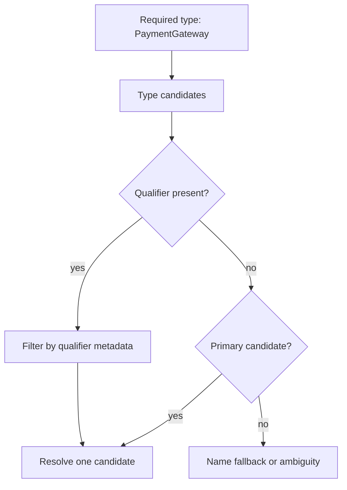

# Qualifier vs Primary

> [!summary] За 30 секунд
> `@Primary` задаёт default candidate среди нескольких beans одного required type. `@Qualifier` выражает конкретное semantic restriction на injection point. Qualifier точнее: если injection point содержит qualifier, primary не отменяет это ограничение.

## 1. Исходная проблема

```java
interface PaymentGateway {
    Receipt pay(Command command);
}

@Component
class CardGateway implements PaymentGateway {}

@Component
class TransferGateway implements PaymentGateway {}
```

Injection только по type неоднозначна:

```java
PaymentService(PaymentGateway gateway) {
}
```

Spring видит два candidates.

## 2. `@Primary` — default candidate

```java
@Primary
@Component
class CardGateway implements PaymentGateway {
}
```

Теперь unqualified injection получает `CardGateway`:

```java
PaymentService(PaymentGateway gateway) {
}
```

Ментальная модель:

```text
required type
    ↓
multiple candidates
    ↓
one candidate is primary
    ↓
select primary
```

`@Primary` полезен, когда один implementation действительно является system-wide default.

## 3. `@Qualifier` — semantic restriction

```java
@Component("cardGateway")
class CardGateway implements PaymentGateway {
}

@Component("transferGateway")
class TransferGateway implements PaymentGateway {
}
```

```java
PaymentService(
        @Qualifier("transferGateway") PaymentGateway gateway
) {
}
```

Qualifier сокращает candidate set до matching bean.



## 4. Приоритет между ними

```java
@Primary
@Component("cardGateway")
class CardGateway implements PaymentGateway {}

@Component("transferGateway")
class TransferGateway implements PaymentGateway {}
```

```java
PaymentService(
        @Qualifier("transferGateway") PaymentGateway gateway
) {
}
```

Result: `TransferGateway`.

Причина: qualifier определяет eligible candidate set. `@Primary` применяется как preference, когда после type matching всё ещё требуется выбрать default без более точного semantic constraint.

## 5. Qualifier не обязан быть bean name

Можно создать custom qualifier:

```java
@Target({FIELD, PARAMETER, TYPE, METHOD})
@Retention(RUNTIME)
@Qualifier
public @interface Channel {
    ChannelType value();
}
```

```java
@Channel(ChannelType.SMS)
@Component
class SmsNotificationSender implements NotificationSender {
}
```

```java
NotificationService(
        @Channel(ChannelType.SMS) NotificationSender sender
) {
}
```

Это лучше string name, когда selection отражает domain category.

## 6. Несколько qualifiers

Candidate должен удовлетворять всем constraints injection point:

```java
@Region("KZ")
@Channel(ChannelType.SMS)
NotificationSender sender;
```

Модель qualifier — не «уникальный ID», а filtering metadata.

## 7. Collections

```java
List<PaymentGateway> gateways;
```

Spring injects all eligible candidates. `@Primary` не сокращает collection до одного element.

Qualifier может отфильтровать collection:

```java
List<@Channel(ChannelType.CARD) PaymentGateway> gateways;
```

Точная поддержка type-use placement зависит от annotation target и используемой формы; часто qualifier ставится на parameter/field целиком:

```java
PaymentRouter(@Channel(ChannelType.CARD) List<PaymentGateway> gateways) {
}
```

## 8. Bean name fallback

Parameter или field name может участвовать в позднем name-based resolution при нескольких candidates:

```java
PaymentService(PaymentGateway cardGateway) {
}
```

Но это менее явный contract, зависит от metadata parameter names и легко ломается rename. Для semantic choice предпочтительнее qualifier.

## 9. Несколько primary candidates

Если два candidates помечены `@Primary`, ambiguity не устранена:

```text
candidate A primary
candidate B primary
        ↓
NoUniqueBeanDefinitionException
```

`@Primary` — preference marker, а не global rank number.

## 10. `@Priority` и order — другое измерение

Не путать:

```text
@Primary / @Qualifier → выбрать candidate для single-valued injection
@Order / Ordered      → упорядочить collection или processing chain
@Priority             → зависит от конкретного resolution/ordering context
```

Ordering не должен использоваться как скрытый способ выбрать business implementation.

## 11. Production design

Плохо:

```java
@Qualifier("gateway2")
```

Лучше:

```java
@PaymentMethod(CARD)
```

или explicit map/router:

```java
Map<PaymentMethod, PaymentGateway> gateways;
```

Selection semantics должны быть видны и устойчивы к rename.

## 12. Decision table

| Requirement | Mechanism |
|---|---|
| один default implementation | `@Primary` |
| конкретная category на injection point | `@Qualifier` |
| domain-rich category | custom qualifier annotation |
| все implementations | collection/map injection |
| runtime selection | explicit router/strategy registry |
| deterministic processing order | `@Order` / `Ordered` |

## 13. Interview answer

> `@Primary` выбирает default candidate при неоднозначном injection по type. `@Qualifier` ограничивает candidate set конкретной semantic metadata и поэтому является более точным contract. Qualifier не обязательно равен bean name и может быть custom annotation. Primary не влияет на injection всех beans в collection и не заменяет ordering.

## Memory Hook

> **Primary — default. Qualifier — requirement.**

## Sources

- [[98_SOURCES/Spring Dependency Resolution Sources|Spring dependency-resolution primary sources]]
