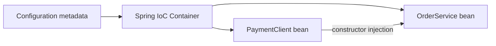

# Spring Core Foundations

> [!summary] За 30 секунд
> Spring IoC container создаёт, настраивает, связывает и управляет объектами. Эти managed objects называются beans. Container работает не напрямую с исходными аннотациями, а с внутренними BeanDefinition metadata.

## 1. IoC и Dependency Injection

### Без container

```java
class OrderService {
    private final PaymentClient client = new HttpPaymentClient();
}
```

`OrderService` сам:

- выбирает implementation;
- создаёт dependency;
- управляет lifecycle;
- трудно тестируется изолированно.

### С constructor injection

```java
class OrderService {
    private final PaymentClient client;

    OrderService(PaymentClient client) {
        this.client = client;
    }
}
```

Container создаёт collaborators и передаёт их объекту.



Различие:

- **IoC** — широкий принцип передачи контроля framework/container.
- **DI** — механизм передачи dependencies извне.

> [!tip] Memory Hook
> **IoC transfers control; DI transfers dependencies.**

## 2. Что такое Spring bean

Spring bean — обычный Java object, который:

- создан или зарегистрирован container;
- настроен согласно metadata;
- участвует в dependency resolution;
- получает lifecycle callbacks и post-processing;
- может быть обёрнут proxy.

> [!warning] Exam Trap
> Не каждый объект, созданный через `new` внутри Spring application, является bean.

## 3. BeanDefinition

BeanDefinition — внутренний recipe создания bean.


Он может хранить:

- class или factory method;
- constructor arguments;
- property values;
- scope;
- lazy/primary/autowire-candidate flags;
- init/destroy callbacks;
- dependencies.

> **Definition is the recipe; bean is the managed result.**

## 4. BeanFactory и ApplicationContext

`BeanFactory` задаёт фундаментальный container contract:

- bean creation;
- dependency resolution;
- lookup;
- scopes и lifecycle infrastructure.

`ApplicationContext` расширяет BeanFactory и добавляет application-level services:

- events;
- internationalized messages;
- resource loading/pattern resolution;
- environment and profiles;
- удобную регистрацию infrastructure post-processors.

| Capability | BeanFactory | ApplicationContext |
|---|---:|---:|
| Bean creation and lookup | да | да |
| Dependency injection | да | да |
| Application events | базовый contract нет | да |
| MessageSource | нет | да |
| Typical application choice | редко напрямую | да |

> [!tip] Memory Hook
> **BeanFactory is the engine; ApplicationContext is the application vehicle.**

## 5. Источники configuration metadata

Container может получить BeanDefinitions из:

- component scanning;
- Java `@Bean` methods;
- XML;
- programmatic registration.

Разные формы входа сходятся к общей metadata model.

## 6. Component scanning

`@Component` делает class candidate для scanning.

Специализации:

- `@Service` — service-layer intent;
- `@Repository` — persistence intent и инфраструктурная семантика exception translation;
- `@Controller` — web controller;
- `@Configuration` — configuration class.

```java
@Component
class PaymentService { }
```

Default name обычно:

```text
paymentService
```

> [!warning]
> Аннотация не запускает scanning сама. Class вне configured base packages не будет обнаружен.

## 7. @Bean

`@Bean` помечает factory method, return value которого становится managed bean.

```java
@Bean
PaymentClient paymentClient() {
    return new HttpPaymentClient();
}
```

Особенно полезно:

- third-party class нельзя изменить;
- нужна explicit factory logic;
- нужно задать init/destroy callbacks;
- configuration должна выбирать implementation.

## 8. @Component против @Bean

| | @Component | @Bean |
|---|---|---|
| Target | class | method |
| Registration | scanning | configuration processing |
| Construction control | class constructor | arbitrary factory logic |
| Third-party class | неудобно | удобно |

> [!tip] Memory Hook
> **Component marks the product class; Bean marks the factory method.**

## 9. @Configuration

`@Configuration` обозначает class-source bean definitions.

```java
@Configuration
class AppConfig {
    @Bean
    PaymentClient paymentClient() {
        return new HttpPaymentClient();
    }
}
```

В full configuration mode Spring поддерживает container-aware semantics вызовов между `@Bean` methods через enhancement. Это отдельная тема от простого факта наличия `@Bean` method.

## 10. Injection styles

### Constructor injection

Рекомендуется для required dependencies:

- dependency explicit;
- field может быть `final`;
- object не создаётся в invalid state;
- удобно тестировать;
- circular dependency проявляется раньше.

Если bean class имеет один constructor, `@Autowired` обычно не требуется.

### Setter injection

Подходит для optional/reconfigurable dependency, если object остаётся корректным без неё.

### Field injection

Поддерживается, но:

- скрывает dependencies;
- усложняет plain unit test;
- не позволяет final field;
- object трудно создать без reflection/container.

> [!warning] Exam framing
> Вопрос «что Spring поддерживает?» отличается от вопроса «что рекомендуется для required dependency?».

## 11. Decision map

```mermaid
flowchart TD
    A{Как зарегистрировать object?} -->|Own class in scan tree| B[@Component stereotype]
    A -->|Third-party or custom factory| C[@Bean method]
    D{Как передать dependency?} -->|Required| E[Constructor]
    D -->|Optional and mutable| F[Setter]
    D -->|Supported but hidden contract| G[Field]
```

## Interview Answer

> Spring container читает configuration metadata, превращает её в BeanDefinitions, создаёт beans и выполняет dependency injection и lifecycle processing. ApplicationContext расширяет BeanFactory. Components обнаруживаются scanning, а `@Bean` methods регистрируют return values через explicit factory configuration.

## Sources

- https://docs.spring.io/spring-framework/reference/core/beans.html
- https://docs.spring.io/spring-framework/reference/core/beans/definition.html
- https://docs.spring.io/spring-framework/reference/core/beans/annotation-config.html
- https://docs.spring.io/spring-framework/reference/core/beans/java/basic-concepts.html
