# Spring Core Visual Deep Dive

> [!summary] За 30 секунд
> Spring container не «магически создаёт объекты». Он читает configuration metadata, строит `BeanDefinition`, модифицирует definitions через factory post-processors, выбирает dependency candidates, создаёт instances, заполняет dependencies, вызывает lifecycle callbacks и пропускает bean через `BeanPostProcessor`. Visual route ниже показывает, где именно возникают ambiguity, early reference, proxy, scope и configuration failures.

# 1. Полный container pipeline

```mermaid
flowchart LR
    M["Configuration metadata"] --> D["BeanDefinition registry"]
    D --> F["BeanFactoryPostProcessor phase"]
    F --> I["Instantiate bean"]
    I --> P["Populate dependencies"]
    P --> A["Aware callbacks"]
    A --> B1["BeanPostProcessor before init"]
    B1 --> INIT["Initialization callbacks"]
    INIT --> B2["BeanPostProcessor after init"]
    B2 --> READY["Ready bean or proxy"]
    READY --> DESTROY["Destruction callbacks"]
```

Схема исправляет распространённую ошибку: lifecycle начинается не с constructor. До создания instance container уже имеет metadata и может изменить сам план создания bean.

# 2. Откуда берётся BeanDefinition

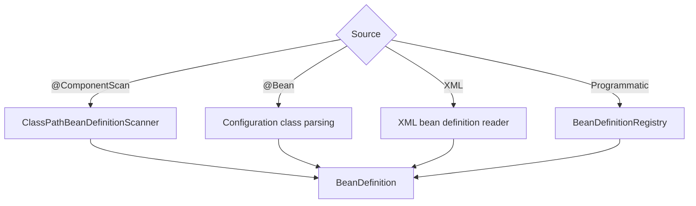

`BeanDefinition` — recipe, а не готовый object. Он содержит class/factory method, scope, lazy flag, qualifiers, init/destroy metadata и dependency information.

# 3. IoC как передача управления

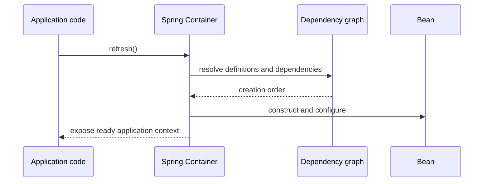

IoC означает, что application не определяет полный порядок `new`, wiring и lifecycle. Этот порядок вычисляет container.

# 4. Dependency resolution decision tree

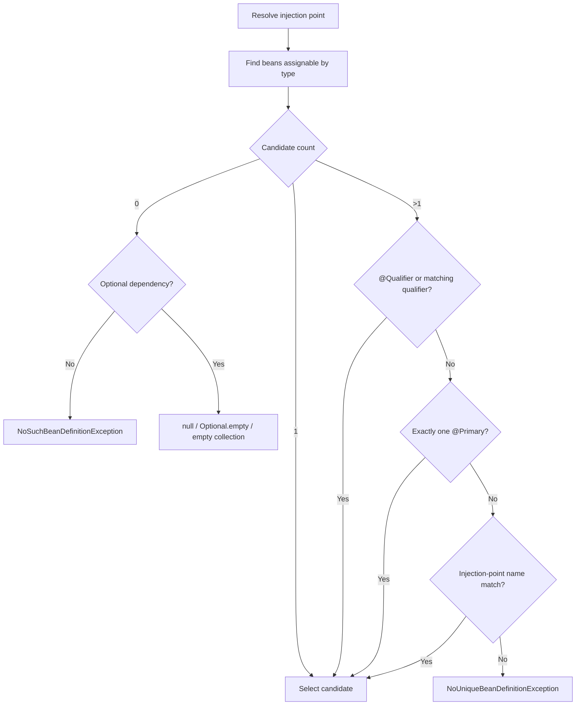

Порядок важен: `@Primary` не заменяет qualifier semantics, а field name не является первым универсальным правилом выбора.

# 5. Constructor injection path

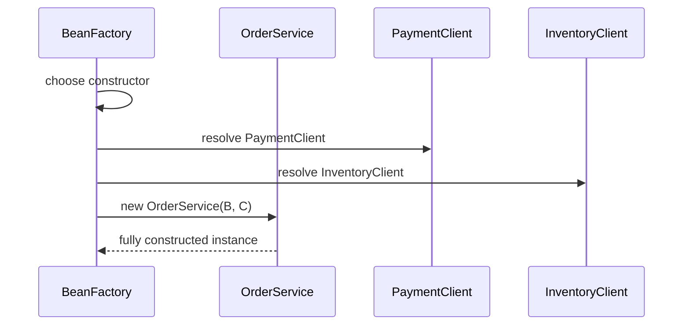

Constructor injection делает обязательные dependencies явными и позволяет получить immutable reference после construction. Если dependency graph цикличен, constructor injection не может создать ни одну сторону первой.

# 6. Collection injection

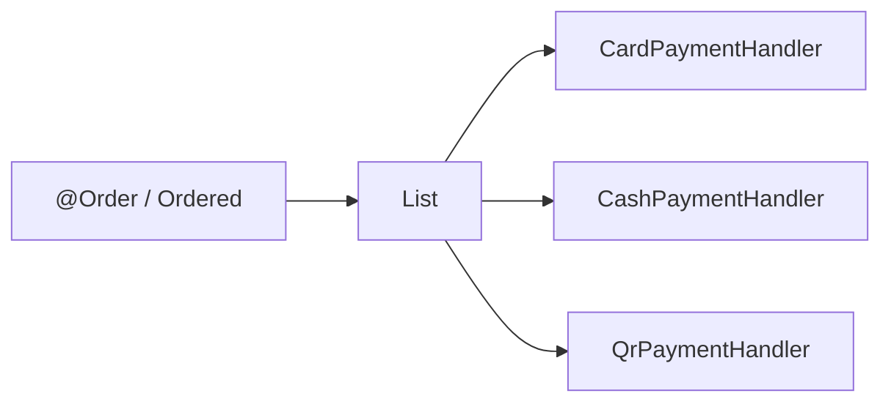

Collection injection означает «все подходящие candidates», а не ambiguity. Порядок можно задать `@Order`, `Ordered` или comparator container-а.

# 7. Optional dependency variants

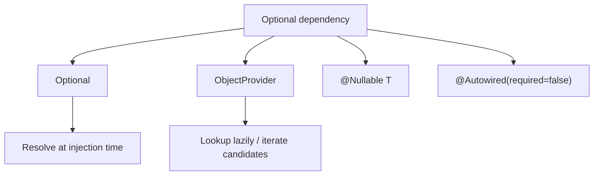

`ObjectProvider` полезен, когда lookup должен быть lazy, repeated или conditional. Он не должен маскировать плохо определённую architecture dependency.

# 8. Bean lifecycle timeline

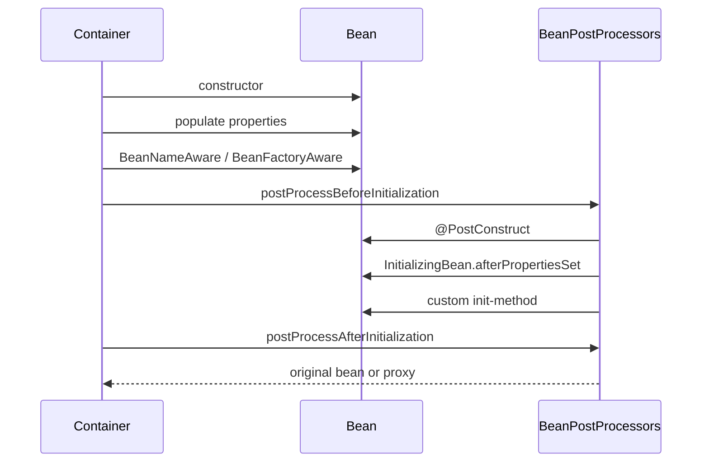

`@PostConstruct` выполняется после dependency population, но до того, как bean окончательно опубликован caller-ам через context.

# 9. Stable lifecycle phases versus internals

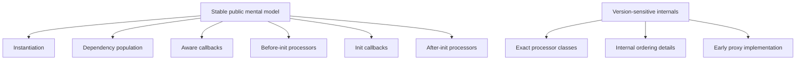

На интервью важно объяснять stable phases. Точные internal processor names следует маркировать версией Spring.

# 10. BeanFactoryPostProcessor versus BeanPostProcessor

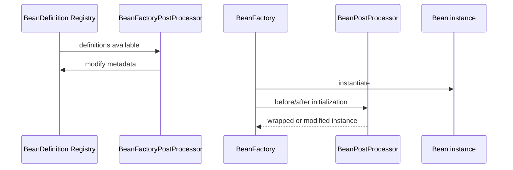

`BeanFactoryPostProcessor` работает с metadata до создания обычных beans. `BeanPostProcessor` работает с instances и может вернуть proxy.

# 11. Why non-static @Bean BFPP is dangerous

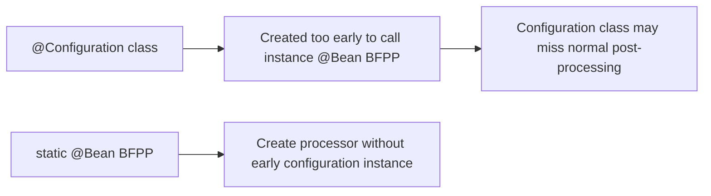

Для infrastructure `BeanFactoryPostProcessor` factory method обычно делают `static`, чтобы не создавать configuration instance преждевременно.

# 12. Proxy creation point

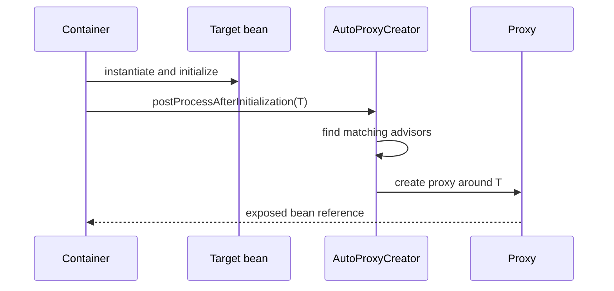

Caller обычно получает proxy после `postProcessAfterInitialization`, а не raw target. Поэтому direct manual construction обходит infrastructure.

# 13. Singleton scope

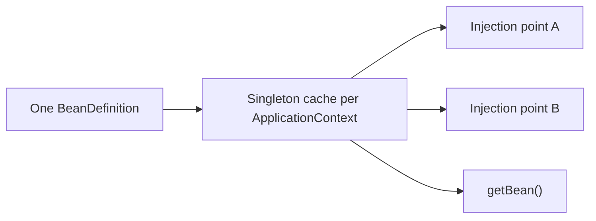

Spring singleton — один instance на bean name в конкретном `ApplicationContext`, а не один object на JVM.

# 14. Prototype scope

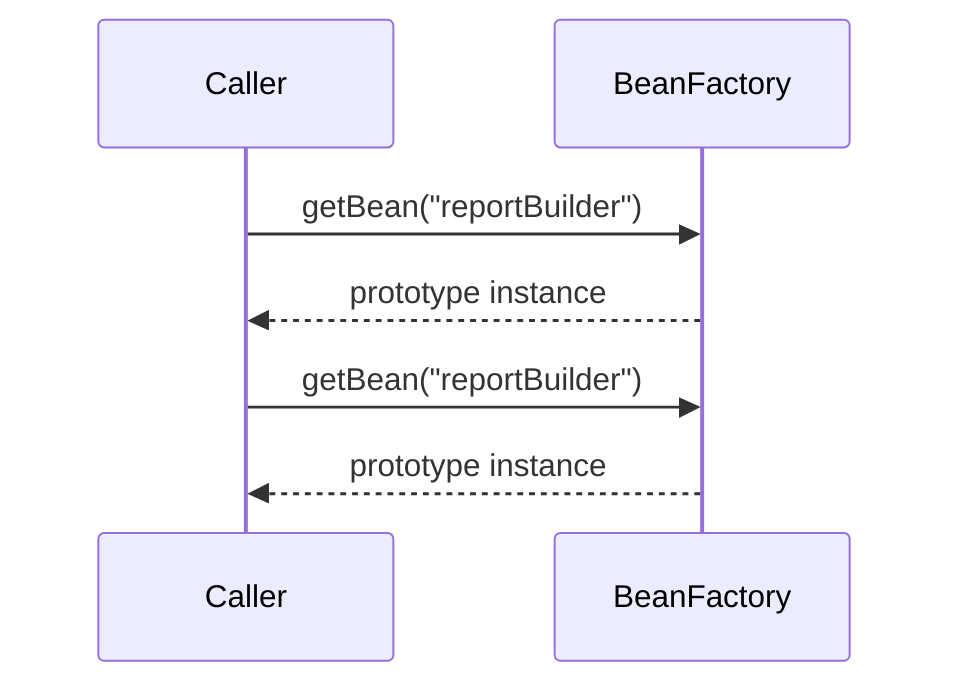

Container создаёт prototype, но не управляет полным destruction lifecycle каждой выданной instance. Cleanup остаётся ответственностью владельца.

# 15. Prototype injected into singleton trap

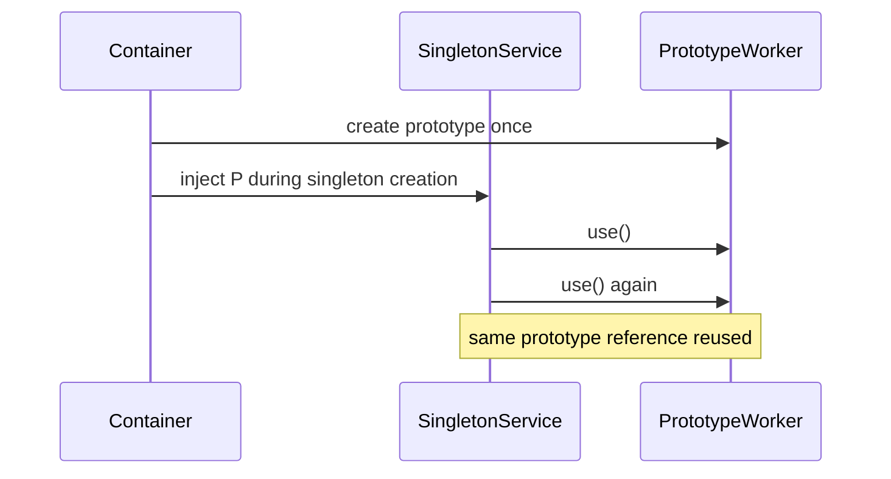

Исправления: `ObjectProvider`, scoped proxy или lookup method — в зависимости от intended ownership.

# 16. Request-scoped proxy

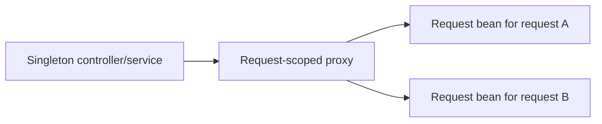

Singleton хранит стабильную proxy reference, а proxy на каждом request разрешает фактический scoped target.

# 17. FactoryBean two-object model

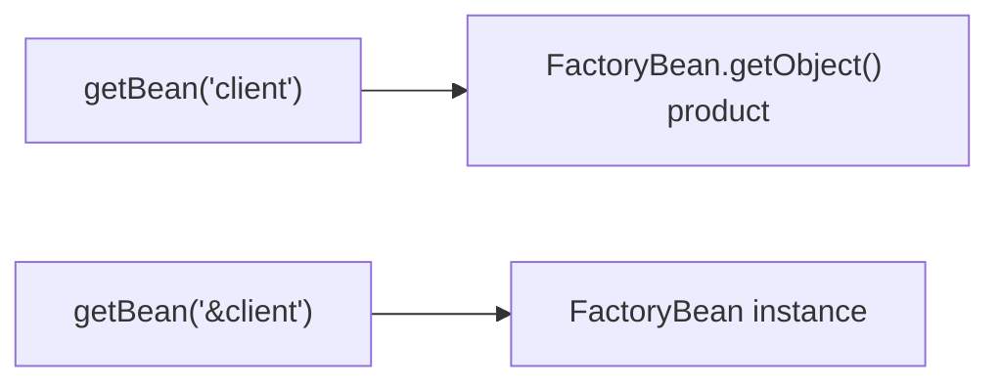

`FactoryBean<T>` — bean, который производит другой object. Prefix `&` запрашивает сам factory, а не product.

# 18. @Configuration proxyBeanMethods

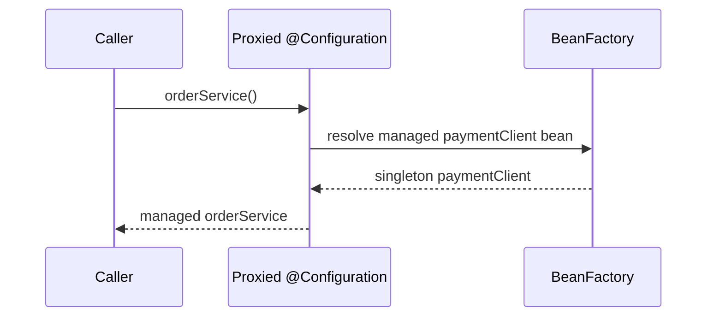

При `proxyBeanMethods=true` межметодные вызовы перехватываются для соблюдения container semantics. При `false` прямой Java-вызов factory method может создать новый object, если code явно вызывает метод.

# 19. Profiles and conditions

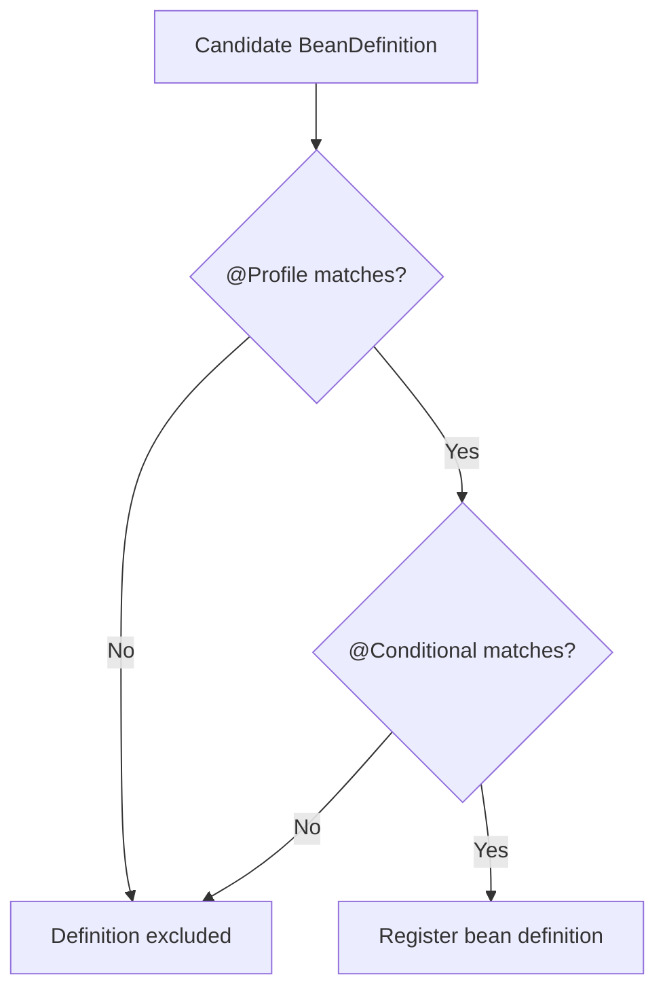

Profile/condition обычно решают, будет ли definition зарегистрирована. Это не runtime `if` вокруг каждого method call.

# 20. Externalized configuration precedence

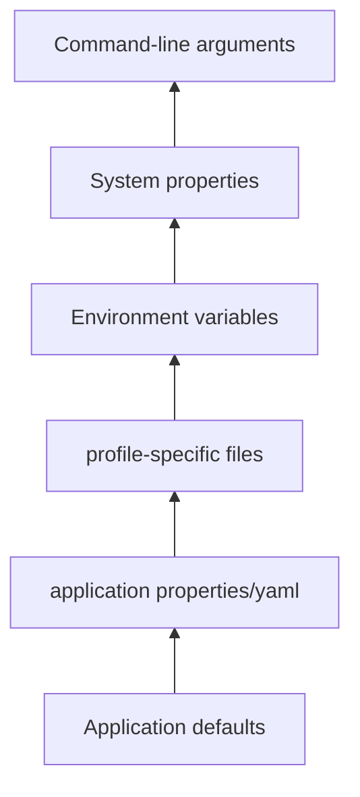

Точная precedence зависит от Spring Boot version и источников. Диаграмма показывает общую идею: later/higher-priority source может переопределить lower-priority value.

# 21. Circular dependency with constructors

```mermaid
flowchart LR
    A["ServiceA constructor needs B"] --> B["ServiceB constructor needs A"]
    B --> A
    A --> FAIL["Neither instance can be completed first"]
```

Лучшее исправление — пересмотреть responsibilities. `@Lazy` может разорвать creation path proxy, но не исправляет architectural cycle.

# 22. Early singleton reference concept

```mermaid
sequenceDiagram
    participant C as Container
    participant A as Bean A
    participant B as Bean B

    C->>A: instantiate A
    C->>C: expose early reference A
    C->>B: instantiate B and inject early A
    C->>A: inject completed B
    C->>A: finish initialization
```

Это упрощённая модель setter/field cycle support. Она не должна восприниматься как универсальная гарантия, особенно при proxies и constructor cycles.

# 23. Parent and child contexts

```mermaid
flowchart TB
    P["Parent context: shared infrastructure"] --> C1["Child web context A"]
    P --> C2["Child web context B"]
    C1 -. "can see parent" .-> P
    C2 -. "can see parent" .-> P
    P -. "cannot see child-only beans" .-> C1
```

Lookup обычно идёт child → parent. Parent не знает о child-only definitions.

# 24. Bean name collision and overriding

```mermaid
flowchart TD
    A["Definition source A: bean 'client'"] --> R["Registry"]
    B["Definition source B: bean 'client'"] --> R
    R --> POLICY{"Overriding allowed?"}
    POLICY -->|"No"| FAIL["Definition conflict"]
    POLICY -->|"Yes"| REPLACE["Later definition replaces earlier"]
```

Silent overriding делает runtime graph менее очевидным. В production предпочтительны уникальные names и explicit configuration.

# 25. Startup failure diagnostic tree

```mermaid
flowchart TD
    START["ApplicationContext fails"] --> MSG{"Failure type"}
    MSG -->|"NoSuchBean"| MISS["Check scanning, conditions, profiles, type"]
    MSG -->|"NoUniqueBean"| AMB["Check qualifiers, primary, generic type"]
    MSG -->|"BeanCurrentlyInCreation"| CYCLE["Inspect dependency cycle"]
    MSG -->|"Bind/placeholder"| PROP["Inspect property sources and prefix"]
    MSG -->|"BeanCreationException"| CAUSE["Read deepest cause and lifecycle phase"]
    MISS --> REPORT["Condition report / bean list"]
    AMB --> REPORT
    CYCLE --> GRAPH["Dependency graph"]
    PROP --> ENV["Environment and configuration metadata"]
    CAUSE --> TRACE["Constructor/init stack trace"]
```

# 26. Worked example — payment providers

Requirement: выбрать provider по market, не создавать ambiguity и позволить добавлять новые implementations.

```mermaid
flowchart LR
    CTRL["PaymentController"] --> ROUTER["PaymentRouter"]
    ROUTER --> MAP["Map<String, PaymentProvider>"]
    MAP --> VISA["VisaProvider"]
    MAP --> QR["QrProvider"]
    MAP --> CASH["CashProvider"]
```

```java
interface PaymentProvider {
    String code();
    PaymentResult pay(PaymentCommand command);
}

@Service
final class PaymentRouter {
    private final Map<String, PaymentProvider> providers;

    PaymentRouter(List<PaymentProvider> providerList) {
        this.providers = providerList.stream()
                .collect(Collectors.toMap(PaymentProvider::code, Function.identity()));
    }

    PaymentResult pay(String code, PaymentCommand command) {
        PaymentProvider provider = providers.get(code);
        if (provider == null) {
            throw new IllegalArgumentException("Unsupported provider: " + code);
        }
        return provider.pay(command);
    }
}
```

Evidence:

```text
1. Inspect ApplicationContext bean list.
2. Verify every provider has unique code.
3. Add duplicate-code startup validation.
4. Test router without starting full web layer.
```

# 27. Interview explanation

> Spring Core сначала строит metadata graph из `BeanDefinition`, затем применяет definition-level extension points, создаёт beans по dependency graph, выполняет injection и lifecycle callbacks, после чего instance-level post-processors могут вернуть proxy. При проблеме я сначала определяю phase: registration, candidate resolution, instantiation, population, initialization или post-processing.

# 28. Exercises

1. Нарисовать resolution tree для двух beans одного interface с `@Primary` и `@Qualifier`.
2. Объяснить, почему prototype внутри singleton не создаётся заново автоматически.
3. Показать, где `BeanFactoryPostProcessor` может изменить scope до instance creation.
4. Создать failing constructor cycle и исправить разделением responsibilities.
5. Через `ApplicationContext#getBeanDefinitionNames()` доказать registration profile-а.

## Related materials

- [[Spring Core Foundations]]
- [[Dependency Resolution and Optional Injection]]
- [[Bean Lifecycle from Definition to Destruction]]
- [[Container Extension Points]]
- [[Configuration Profiles and Externalized Properties]]
- [[Advanced Core Scopes FactoryBean and Context Hierarchy]]
- [[01_MAPS/Spring Core Visual Atlas.canvas]]
- [[30_CERTIFICATIONS/Spring/2V0-72.22/Spring Core Card Roadmap]]
