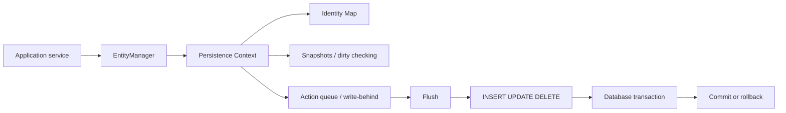

# Spring Data JPA — Persistence Context and Entity Lifecycle

> [!summary] За 30 секунд
> JPA работает не напрямую по модели «каждый setter сразу делает UPDATE». `EntityManager` управляет persistence context — identity map и transactional write-behind buffer. Загруженная entity становится managed; изменения managed state обнаруживаются dirty checking и превращаются в SQL при flush. Flush синхронизирует persistence context с database, но не завершает transaction. Commit фиксирует transaction. Detached object больше не отслеживается; `merge()` не «прикрепляет» исходный object, а копирует его state в managed copy и возвращает именно эту copy.

# 1. Главная ментальная модель



Сильное объяснение JPA всегда разделяет четыре вещи:

1. **Java object state** — что находится в полях object прямо сейчас.
2. **Persistence context state** — какие objects managed, removed или scheduled for insert/update.
3. **Database state inside current transaction** — какие SQL уже выполнены, но ещё не committed.
4. **Committed database state** — что увидят другие transactions согласно isolation level.

> Изменение Java object, flush SQL и commit transaction — три разные фазы.

---

# 2. Что такое persistence context

Persistence context — набор entity instances, которыми управляет `EntityManager`.

Для одной entity identity внутри одного persistence context существует одна canonical Java instance:

```java
Customer first = entityManager.find(Customer.class, 42L);
Customer second = entityManager.find(Customer.class, 42L);

System.out.println(first == second); // true
```

Conceptually:

```text
Persistence Context
└── Customer#42 → Java object 0x7fa1
```

Повторный `find()` обычно сначала проверяет first-level cache:

```text
find Customer#42
    ↓
identity map contains Customer#42?
    ├─ yes → return existing managed instance
    └─ no  → SELECT, register instance, return it
```

## Почему это важно

Внутри одного unit of work приложение не должно иметь два независимых managed representations одной database row. Иначе было бы непонятно, какой state считать canonical при flush.

## First-level cache нельзя отключить

Persistence context часто называют first-level cache. Это не optional performance plugin, а часть JPA identity semantics.

Он:

- локален конкретному `EntityManager`/persistence context;
- не разделяется между application nodes;
- обычно живёт в пределах transaction в Spring application;
- не заменяет Redis/Caffeine/second-level cache;
- хранит entities, а не произвольные DTO query results.

---

# 3. Entity lifecycle states

JPA определяет основные состояния:

```text
NEW → MANAGED → REMOVED
          ↓
       DETACHED
```

## 3.1 New / transient

```java
Customer customer = new Customer("Amina");
```

Object:

- существует в JVM;
- ещё не имеет managed identity в persistence context;
- не будет автоматически записан в DB;
- может иметь application-assigned ID, но это само по себе не делает его managed.

## 3.2 Managed / persistent

```java
entityManager.persist(customer);
```

После `persist()` new object становится managed.

Важно:

```text
persist()
≠ обязательно немедленный INSERT
```

Provider может выполнить INSERT:

- сразу, если это нужно для generated ID;
- при explicit flush;
- перед overlapping query;
- при commit.

## 3.3 Detached

Entity становится detached, например, когда:

- transaction-scoped persistence context закрывается;
- вызывается `entityManager.detach(entity)`;
- вызывается `entityManager.clear()`;
- закрывается `EntityManager`;
- object сериализуется и передаётся в другой tier.

Detached object сохраняет field values, но изменения больше не отслеживаются:

```java
Customer detached = loadAndReturn();
detached.rename("New name");

// SQL не будет, если object не merge/update через новый unit of work
```

## 3.4 Removed

```java
Customer customer = entityManager.find(Customer.class, id);
entityManager.remove(customer);
```

Managed entity переходит в removed state. DELETE выполняется при flush или раньше.

---

# 4. `persist()` и `merge()` — не одно и то же

## `persist()`

Используется прежде всего для new entity:

```java
Customer customer = new Customer("Ruslan");
entityManager.persist(customer);

System.out.println(entityManager.contains(customer)); // true
```

Исходный object становится managed.

## `merge()`

```java
Customer detached = loadOutsideTransaction();
detached.rename("Updated");

Customer managed = entityManager.merge(detached);
```

Критически важно:

```text
managed != detached
```

`merge()`:

1. находит или создаёт managed instance той же identity;
2. копирует state detached object в managed instance;
3. возвращает managed instance;
4. не делает исходный detached object managed.

```java
Customer managed = entityManager.merge(detached);

System.out.println(detached == managed); // false, обычно
System.out.println(entityManager.contains(detached)); // false
System.out.println(entityManager.contains(managed));  // true
```

## Типичная ошибка

```java
entityManager.merge(detached);
detached.rename("Second change");
```

`Second change` может не сохраниться: приложение продолжает менять detached instance, а JPA отслеживает returned managed copy.

Правильно:

```java
Customer managed = entityManager.merge(detached);
managed.rename("Second change");
```

## Почему `JpaRepository.save()` иногда делает persist, а иногда merge

`SimpleJpaRepository.save(entity)` концептуально выбирает:

```text
entity is new?
    ├─ yes → entityManager.persist(entity)
    └─ no  → entityManager.merge(entity)
```

Поэтому `save()` не означает универсальный SQL `UPDATE` и не гарантирует, что returned reference совпадает с input reference.

> Для new entity сохраняй returned value, если код зависит от provider-generated managed instance semantics.

---

# 5. Dirty checking

Dirty checking — механизм обнаружения изменений managed entities.

```java
@Transactional
public void renameCustomer(Long id, String newName) {
    Customer customer = repository.findById(id).orElseThrow(...);
    customer.rename(newName);
}
```

Здесь нет обязательного `repository.save(customer)`.

Sequence:

```text
SELECT customer
    ↓
managed entity registered
    ↓
customer.rename()
    ↓
state differs from snapshot
    ↓
flush
    ↓
UPDATE customer
```

## Snapshot-based explanation

Упрощённая модель:

```text
loaded snapshot: name = "Old"
current state:   name = "New"
                    ↓
dirty property detected
                    ↓
UPDATE name
```

Hibernate может применять bytecode enhancement и другие optimizations, но pedagogically полезная модель — сравнение managed state со snapshot.

## Почему setter не делает SQL сразу

```java
customer.setName("A");
customer.setName("B");
customer.setName("C");
```

Provider обычно отправит один итоговый UPDATE при flush, а не три SQL statements.

## Dirty checking требует managed state

```java
@Transactional
public void wrong(Customer detached) {
    detached.rename("X");
}
```

Если `detached` не является managed в текущем persistence context, JPA не обязана сохранить изменение.

Диагностика:

```java
entityManager.contains(customer)
```

---

# 6. Persistence context как transactional write-behind cache

Managed changes сначала накапливаются in-memory:

```text
persist Order
change Customer
remove OldAddress
        ↓
action queue
        ↓
flush
        ↓
INSERT / UPDATE / DELETE
```

Преимущества:

- уменьшение количества SQL;
- batching;
- ordering DML;
- единая identity;
- automatic dirty checking;
- cascading unit of work.

Риски:

- большой persistence context потребляет heap;
- flush может выполнить много неожиданного SQL;
- ошибка constraint может проявиться поздно;
- managed graph может случайно измениться и сохраниться;
- bulk processing без `clear()` приводит к memory growth.

---

# 7. Flush и commit

## Flush

Flush синхронизирует persistence context с database transaction:

```java
entityManager.flush();
```

Он превращает queued changes в SQL.

## Commit

Commit завершает physical transaction и делает изменения durable/visible согласно isolation.

```text
flush
    ↓
SQL executed inside TX
    ↓
commit
    ↓
changes finalized
```

## Flush не равен commit

```java
@Transactional
public void createThenFail() {
    repository.save(new Customer("A"));
    repository.flush();
    throw new RuntimeException("fail");
}
```

INSERT мог быть выполнен, но transaction rollback отменит его.

```text
INSERT executed
    ↓
RuntimeException
    ↓
ROLLBACK
    ↓
row absent after transaction
```

## Зачем explicit flush

### 1. Получить constraint failure раньше

```java
repository.save(customer);
repository.flush(); // unique/not-null/FK failure here
sendNextStep();
```

Без flush exception могла появиться только при transaction commit после выхода из service method.

### 2. Синхронизировать перед native operation

Когда следующий operation должен гарантированно видеть pending changes.

### 3. Batch processing

```java
for (int i = 0; i < rows.size(); i++) {
    entityManager.persist(map(rows.get(i)));

    if (i % 100 == 0) {
        entityManager.flush();
        entityManager.clear();
    }
}
```

`flush()` отправляет SQL, `clear()` освобождает managed objects.

## Опасность flush в цикле без clear

SQL отправляется, но persistence context продолжает хранить entities и snapshots. Heap всё ещё растёт.

---

# 8. Когда AUTO flush может произойти до commit

При `FlushModeType.AUTO` provider должен обеспечить корректность query results. Hibernate часто flush-ит перед JPQL/HQL query, которая пересекается с pending changes.

```java
Customer customer = new Customer("A");
entityManager.persist(customer);

long count = entityManager
        .createQuery("select count(c) from Customer c", Long.class)
        .getSingleResult();
```

Чтобы query увидел новую entity, provider может выполнить INSERT до query.

Следствие:

> SQL может появиться раньше commit даже без explicit `flush()`.

## `FlushModeType.COMMIT`

Просит отложить flush до commit, но portable code не должно строить бизнес-корректность на предположении, что provider никогда не flush-ит раньше.

---

# 9. `clear()`, `detach()` и `refresh()`

## `clear()`

```java
entityManager.clear();
```

Все managed entities становятся detached.

Unflushed changes теряются для дальнейшей synchronization:

```java
customer.rename("X");
entityManager.clear();
// change may not be persisted
```

Если изменения должны попасть в DB:

```java
entityManager.flush();
entityManager.clear();
```

## `detach(entity)`

Detach одного object:

```java
entityManager.detach(customer);
```

Useful для:

- controlled read models;
- предотвращения accidental dirty checking;
- long processing после чтения;
- тестирования detached behavior.

## `refresh(entity)`

```java
entityManager.refresh(customer);
```

Перезаписывает managed state значениями из database.

```text
managed local changes
    ↓
refresh
    ↓
database state overwrites them
```

---

# 10. Cascades

Cascade определяет распространение entity lifecycle operation по association.

```java
@OneToMany(
    mappedBy = "order",
    cascade = CascadeType.ALL,
    orphanRemoval = true
)
private List<OrderLine> lines = new ArrayList<>();
```

## Cascade types

- `PERSIST`;
- `MERGE`;
- `REMOVE`;
- `REFRESH`;
- `DETACH`;
- `ALL`.

## Cascade не равен database cascade

```text
JPA cascade
    = propagation EntityManager operation

ON DELETE CASCADE
    = database referential action
```

Они могут использоваться вместе, но это разные механизмы.

## Не ставь `CascadeType.ALL` механически

Для `@ManyToMany` cascade REMOVE часто опасен:

```text
delete User
    ↓
CascadeType.REMOVE
    ↓
delete shared Role?
```

Shared aggregate обычно не принадлежит lifecycle текущего parent.

---

# 11. Owning side association

В bidirectional association одна сторона определяет FK update.

```java
@Entity
class OrderLine {
    @ManyToOne(fetch = FetchType.LAZY)
    @JoinColumn(name = "order_id")
    private Order order;
}
```

`OrderLine.order` владеет relationship, потому что содержит `@JoinColumn`.

Parent side:

```java
@OneToMany(mappedBy = "order")
private List<OrderLine> lines;
```

## Helper methods обязательны

```java
public void addLine(OrderLine line) {
    lines.add(line);
    line.setOrder(this);
}
```

Плохо:

```java
order.getLines().add(line);
// line.order remains null
```

Java object graph и database relationship могут разойтись.

---

# 12. `orphanRemoval` и cascade REMOVE

## `orphanRemoval=true`

```java
order.removeLine(line);
```

Если child больше не принадлежит parent collection, provider удалит row.

## `CascadeType.REMOVE`

Удаление parent распространяет remove на children.

Разница:

```text
orphanRemoval
    child removed from relationship → DELETE child

cascade REMOVE
    parent removed → REMOVE child
```

---

# 13. Fetch types: LAZY и EAGER

JPA mapping задаёт default fetch plan, но production query должен иметь use-case-specific fetch plan.

## LAZY

Association загружается при доступе:

```java
Customer customer = repository.findById(id).orElseThrow(...);
customer.getOrders().size(); // may trigger SELECT
```

## EAGER

Association должна быть загружена до возврата entity, но provider может сделать это join-ом или дополнительными queries.

> `EAGER` не гарантирует один SQL и не лечит N+1.

## Почему `EAGER` как глобальное решение опасен

- every query получает лишний graph;
- cartesian multiplication;
- large payload;
- paging issues;
- unexpected SQL;
- невозможность «сделать eager association lazy» для конкретного query простым образом.

Рекомендуемая модель:

```text
mapping mostly LAZY
    +
explicit fetch plan per use case
```

---

# 14. LazyInitializationException

```java
public CustomerDto controller(Long id) {
    Customer customer = service.load(id);
    return mapper.toDto(customer); // accesses lazy orders outside TX
}
```

Sequence:

```text
transaction opens
    ↓
Customer loaded
    ↓
transaction/persistence context closes
    ↓
mapper accesses customer.orders
    ↓
proxy/collection cannot initialize
    ↓
LazyInitializationException
```

Правильные решения:

- fetch required graph inside transaction;
- map entity → DTO inside use-case transaction;
- projection query;
- fetch join;
- `@EntityGraph`;
- explicit query service.

Плохие pseudo-fixes:

- сделать всё `EAGER`;
- включить Open Session in View без понимания query behavior;
- ловить exception;
- вызывать `Hibernate.initialize()` в controller.

---

# 15. Open Session in View

OSIV держит persistence context открытым дольше service transaction, обычно до конца web request.

Плюс:

- lazy associations могут загрузиться во view/controller mapping.

Минусы:

- SQL выходит за пределы explicit service transaction;
- легко скрывает N+1;
- serialization может генерировать queries;
- connection/query timing становится менее очевидным;
- web layer начинает определять data-access plan.

Senior-level правило:

> Не спорь «OSIV всегда плохо/хорошо». Определи ownership query plan, latency, consistency и observability. Для API обычно предпочтительнее явный DTO/fetch plan внутри application transaction.

---

# 16. Optimistic locking

Entity:

```java
@Version
private long version;
```

Update conceptually:

```sql
update customer
set name = ?, version = version + 1
where id = ?
  and version = ?
```

Если affected rows = 0, другой transaction уже изменила entity.

Timeline:

```text
T1 loads version 5
T2 loads version 5
T1 commits → version 6
T2 update where version=5 → 0 rows
T2 → OptimisticLockException
```

## Что делать после conflict

- rollback current transaction;
- перечитать актуальный state;
- показать conflict user;
- повторить operation, только если business operation безопасна для retry;
- не retry-ить бесконечно.

## `OPTIMISTIC_FORCE_INCREMENT`

Форсирует version increment даже без обычного dirty update. Используется, когда чтение aggregate должно конфликтовать с concurrent modifications по domain policy.

---

# 17. Pessimistic locking

```java
@Lock(LockModeType.PESSIMISTIC_WRITE)
@Query("select c from Customer c where c.id = :id")
Optional<Customer> findLockedById(Long id);
```

Conceptually database выполняет `SELECT ... FOR UPDATE` или provider-specific equivalent.

Использовать, когда:

- конфликт высоковероятен;
- operation короткая;
- нужна сериализация доступа к конкретным rows;
- retry optimistic conflict слишком дорог.

Риски:

- blocking;
- deadlock;
- lock timeout;
- connection pool occupancy;
- reduced throughput;
- vendor-specific SQL behavior.

Правила:

- стабильный порядок блокировки;
- короткие transactions;
- никаких долгих remote calls под lock;
- explicit timeout;
- metrics по lock waits/deadlocks.

---

# 18. Entity equality и hashCode

Entity часто проходит состояния new → managed → detached, а generated ID появляется поздно.

Наивная реализация:

```java
@Override
public int hashCode() {
    return Objects.hash(id);
}
```

может изменить hashCode после persist, если ID был null и стал generated. Object потеряется в `HashSet`.

Подход зависит от модели:

- stable natural business key;
- immutable application-assigned UUID;
- осторожная generated-ID strategy;
- class/proxy awareness.

Не включай mutable associations и collections в `equals/hashCode`.

---

# 19. Entity listeners и callbacks

Callbacks:

- `@PrePersist`;
- `@PostPersist`;
- `@PreUpdate`;
- `@PostUpdate`;
- `@PreRemove`;
- `@PostRemove`;
- `@PostLoad`.

Пример:

```java
@PreUpdate
void updateModifiedAt() {
    modifiedAt = Instant.now();
}
```

Ограничения:

- callback привязан к persistence lifecycle, не к domain use case;
- порядок относительно cascades/provider internals не всегда portable;
- external network I/O внутри callback — плохая идея;
- callback не заменяет Transactional Outbox;
- `@PostPersist` не означает, что transaction уже committed.

---

# 20. Large batch processing

Плохо:

```java
@Transactional
public void importAll(List<Row> rows) {
    for (Row row : rows) {
        entityManager.persist(map(row));
    }
}
```

При миллионах rows persistence context удерживает все instances/snapshots.

Улучшение:

```java
for (int i = 0; i < rows.size(); i++) {
    entityManager.persist(map(rows.get(i)));

    if ((i + 1) % batchSize == 0) {
        entityManager.flush();
        entityManager.clear();
    }
}
```

Дополнительно:

- JDBC batch size;
- ordered inserts/updates;
- transaction chunking;
- retry per chunk;
- unique/error handling;
- metrics rows/sec and flush latency.

---

# 21. Bulk JPQL update bypasses managed state

```java
@Modifying
@Query("update Customer c set c.status = :status where c.lastSeen < :cutoff")
int deactivateOldCustomers(Status status, Instant cutoff);
```

Bulk query работает прямо по database rows и не синхронизирует каждую managed entity.

```text
managed Customer#42 status = ACTIVE
    ↓
bulk UPDATE DB status = INACTIVE
    ↓
managed object still says ACTIVE
```

Используй:

```java
@Modifying(
    flushAutomatically = true,
    clearAutomatically = true
)
```

или explicit flush/clear/refresh согласно use case.

> Bulk DML и persistence context — две разные state machines.

---

# 22. Repository `save()` внутри managed transaction

```java
@Transactional
public void rename(Long id, String name) {
    Customer customer = repository.findById(id).orElseThrow(...);
    customer.rename(name);
    repository.save(customer);
}
```

Последняя строка обычно избыточна: customer уже managed.

Это не всегда bug, но создаёт ложную ментальную модель «без save JPA не сохраняет».

Лучше:

```java
@Transactional
public void rename(Long id, String name) {
    Customer customer = repository.findById(id).orElseThrow(...);
    customer.rename(name);
}
```

`save()` нужен для:

- new aggregate через repository API;
- detached aggregate merge scenario;
- explicit repository abstraction contract.

---

# 23. Persistence boundary и DTO

Entity не должна автоматически становиться public API model.

Риски передачи entity наружу:

- lazy loading during JSON serialization;
- bidirectional recursion;
- leaking internal schema;
- accidental updates after merge;
- over-fetching;
- inability to evolve API separately;
- exposing audit/security fields.

Application service:

```java
@Transactional(readOnly = true)
public CustomerDetailsDto details(Long id) {
    Customer customer = repository.findDetailedById(id)
            .orElseThrow(...);

    return mapper.toDto(customer);
}
```

Transaction owns:

- query;
- fetch plan;
- mapping;
- consistency boundary.

---

# 24. Diagnostic checklist

Когда JPA ведёт себя неожиданно, спроси:

1. Entity new, managed, detached или removed?
2. Какой persistence context её содержит?
3. `entityManager.contains(entity)` возвращает true?
4. SQL уже flush-нут или только queued?
5. Transaction committed или ещё active?
6. Flush произошёл implicit перед query?
7. Association LAZY или EAGER?
8. Где mapper обращается к association?
9. Есть bulk DML, обходящий managed state?
10. `merge()` returned object используется?
11. Version field присутствует?
12. Lock mode реально применён query?
13. Persistence context не разросся?
14. OSIV скрывает дополнительные queries?
15. Exception возникает при method body, flush или commit?

---

# 25. Senior interview answer

> JPA `EntityManager` управляет persistence context — identity map и unit of work. Для одной database identity внутри context существует одна managed instance. Изменения managed entities отслеживаются dirty checking и преобразуются в SQL при flush. Flush синхронизирует in-memory state с текущей database transaction, но не commit-ит её. New entity обычно передаётся в `persist`, detached state — в `merge`, причём `merge` возвращает managed copy, а original остаётся detached. Fetch plan нужно определять per use case через projections, fetch join или entity graph, а не лечить N+1 глобальным EAGER. Concurrency контролируется version-based optimistic locking, pessimistic locks или atomic DB updates. Production diagnosis всегда разделяет object state, persistence-context state, flushed SQL и committed database state.

# Memory hooks

```text
Persistence context = identity map + unit of work.
Managed change = dirty checking candidate.
Flush sends SQL; commit finalizes transaction.
Persist manages original; merge returns managed copy.
LAZY defines timing, not transaction ownership.
EAGER does not guarantee one query.
Bulk DML bypasses managed instances.
@Version detects stale writers.
```

# Related materials

- [[10_CONCEPTS/Spring/Data/Spring Data Repositories Queries and Fetching]]
- [[30_CERTIFICATIONS/Spring/2V0-72.22/DATA-B01/DATA-B01 Cards]]
- [[40_PRODUCTION_CASES/Spring/Spring Data JPA Production Cases]]
- [[50_LABS/Spring/DATA-B01/README]]
- [[98_SOURCES/Spring Data JPA Sources]]
