# Spring Data JPA Visual Deep Dive

> [!summary]
> JPA становится понятной, когда отдельно видны **entity state**, **persistence context identity**, **SQL synchronization**, **query plan** и **transaction boundary**. `save()`, dirty checking, merge, LAZY и N+1 — это следствия этих моделей.

# 1. Entity lifecycle state machine

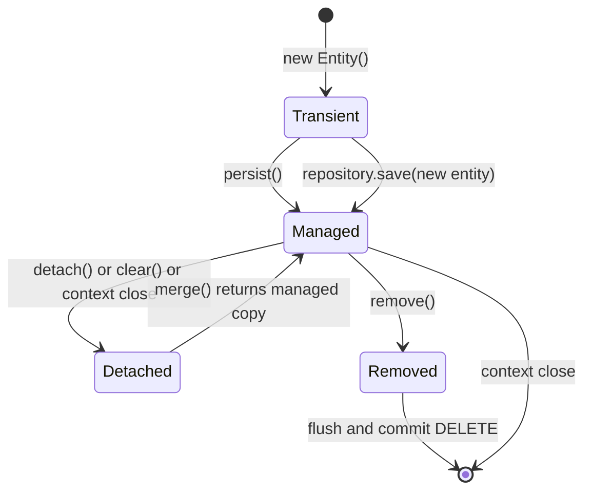

## Ключевая мысль

- **Transient** — обычный Java object без persistence identity в context.
- **Managed** — state отслеживается persistence context.
- **Detached** — identity есть, но изменения больше не отслеживаются.
- **Removed** — entity помечена для DELETE.

# 2. Persistence context как identity map

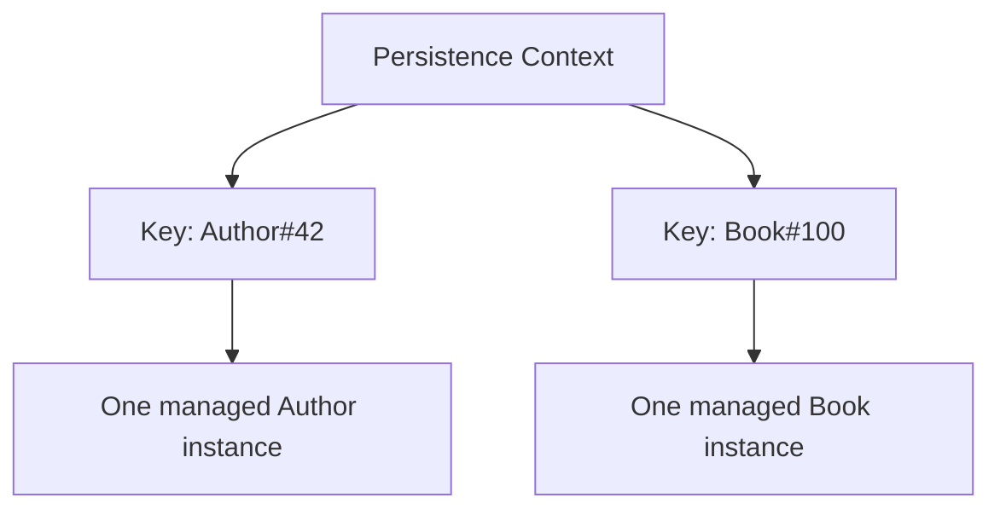

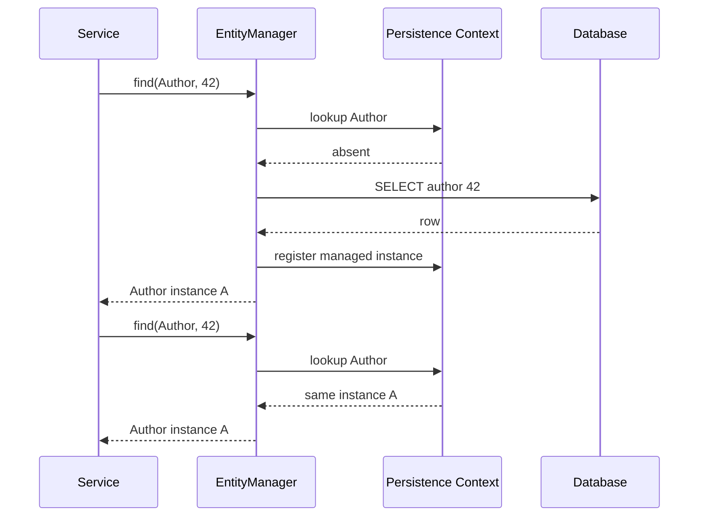

Внутри одного persistence context для одной database identity обычно существует одна canonical managed instance.

# 3. Dirty checking

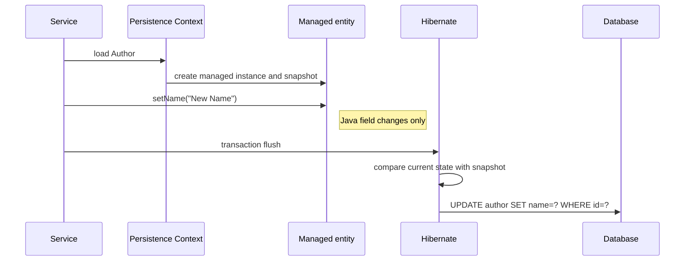

```java
@Transactional
public void rename(Long id, String name) {
    Author author = repository.findById(id).orElseThrow();
    author.setName(name);
}
```

`save()` не нужен для already-managed entity, потому что dirty checking работает по snapshot.

# 4. Write-behind, flush и commit

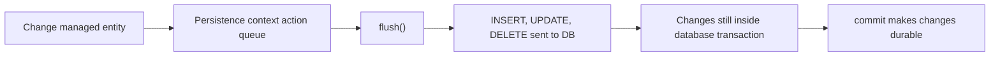

```text
change object ≠ execute SQL ≠ commit transaction
```

## Constraint failure timeline

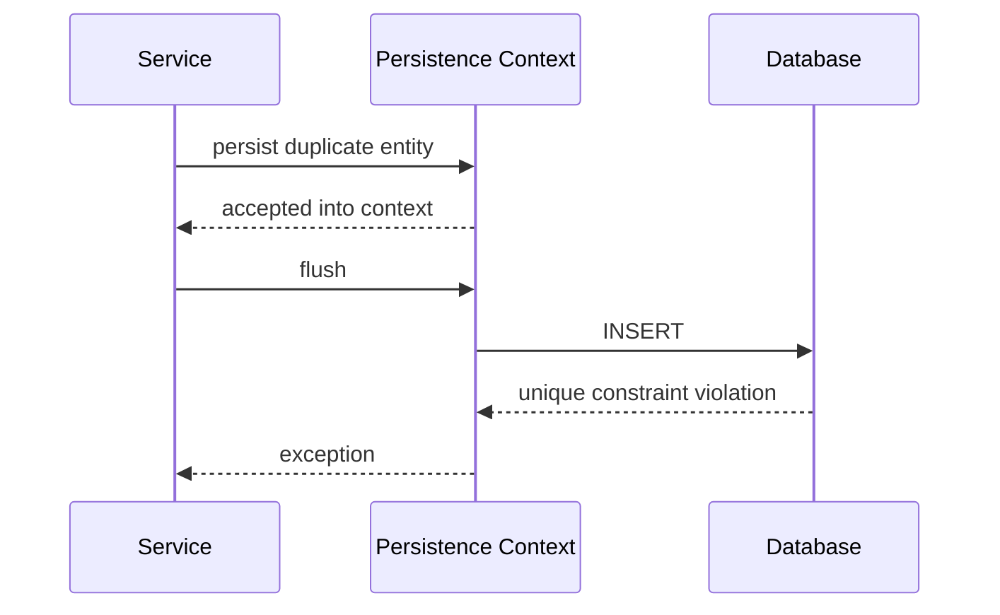

Without explicit flush, error may appear only during transaction commit.

# 5. `persist()` versus `merge()`

## `persist()`

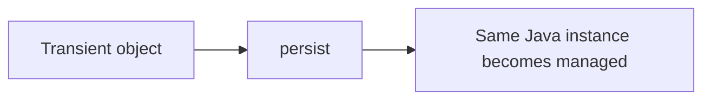

## `merge()`

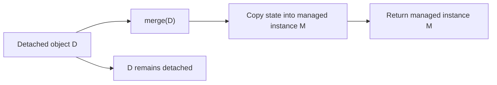

```java
Author managed = entityManager.merge(detached);
managed.setName("Tracked");
```

Игнорирование return value `merge()` — типовая ошибка.

# 6. `repository.save()` decision

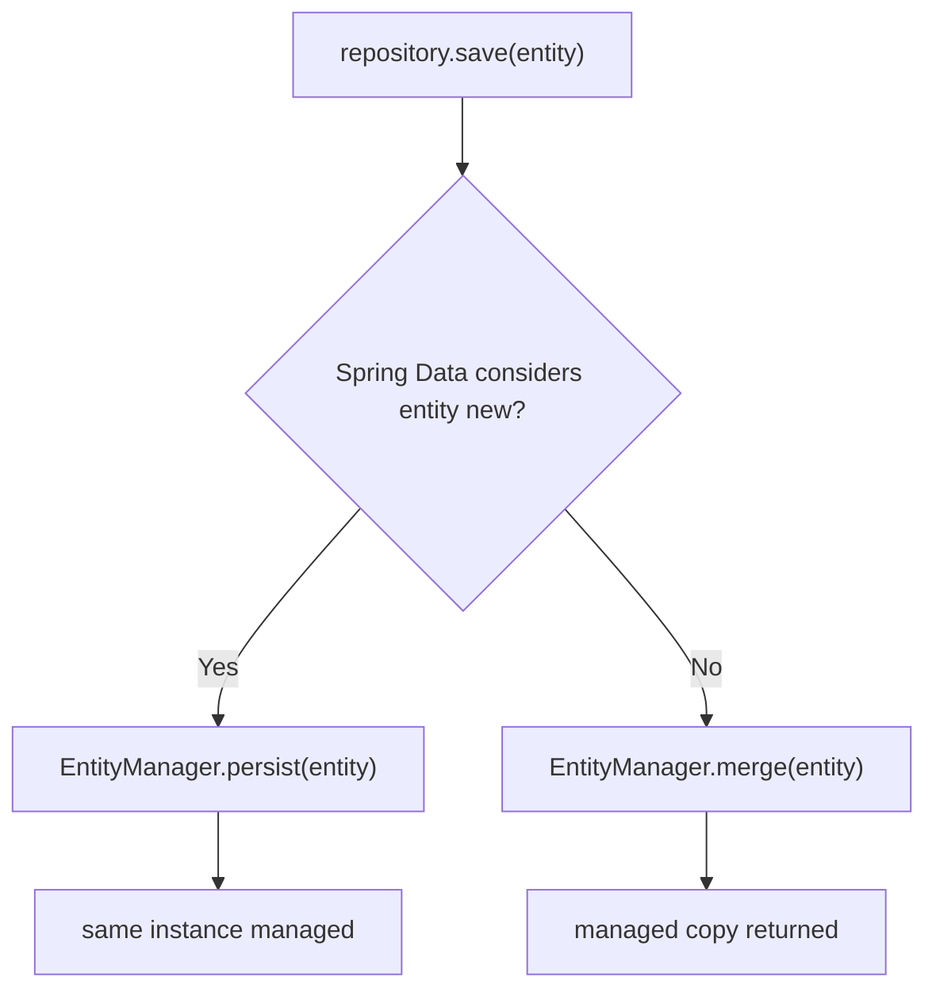

New-state detection может использовать ID, version property или `Persistable.isNew()`.

# 7. Detach and clear

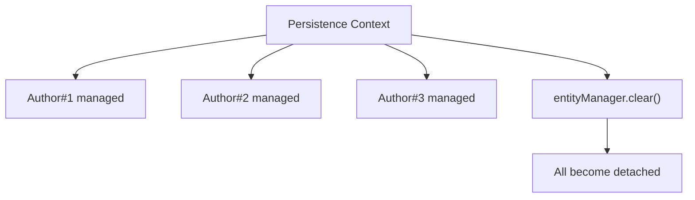

После detach изменения не приводят к automatic UPDATE.

```java
Author author = entityManager.find(Author.class, id);
entityManager.detach(author);
author.setName("Not tracked");
```

# 8. Batch processing and context growth

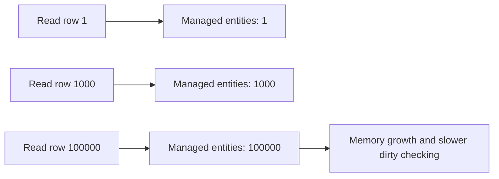

## Controlled batching

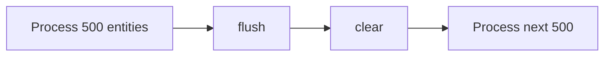

# 9. Bulk DML bypasses managed state

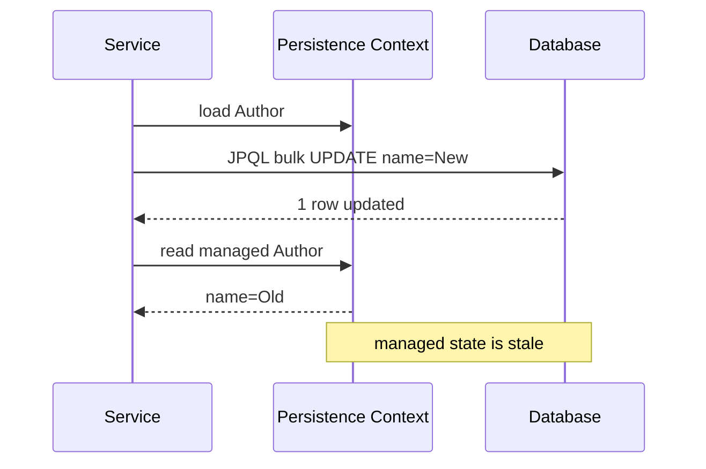

Bulk DML работает напрямую с database rows и не синхронизирует already-managed objects.

Corrective options:

- `clearAutomatically=true`;
- explicit `clear()`;
- `refresh(entity)`;
- separate transaction boundary.

# 10. LAZY loading

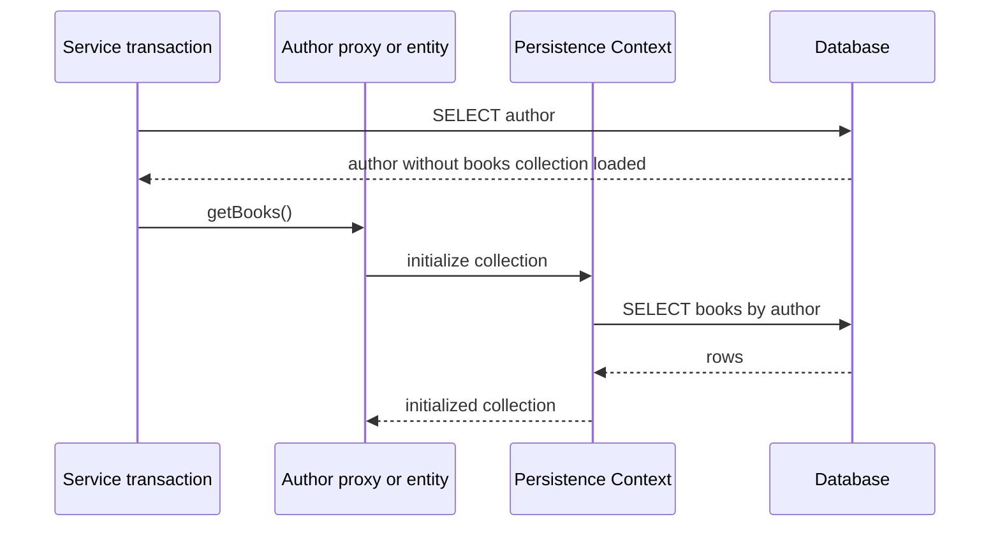

## Outside persistence context

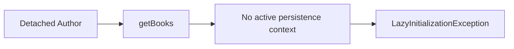

# 11. N+1 query pattern

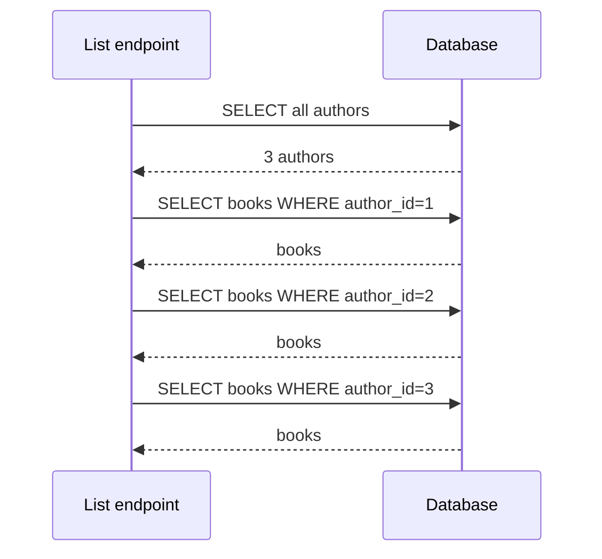

```text
1 root query + N association queries
```

LAZY не равно N+1. N+1 появляется из фактического access pattern и fetch plan.

# 12. Fetch join and EntityGraph

## Fetch join

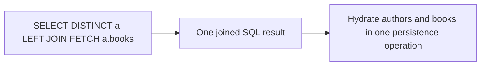

## EntityGraph

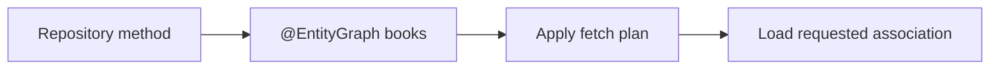

Fetch join задаёт fetch plan внутри query; EntityGraph позволяет задавать его декларативно рядом с repository method.

# 13. Collection fetch join and pagination

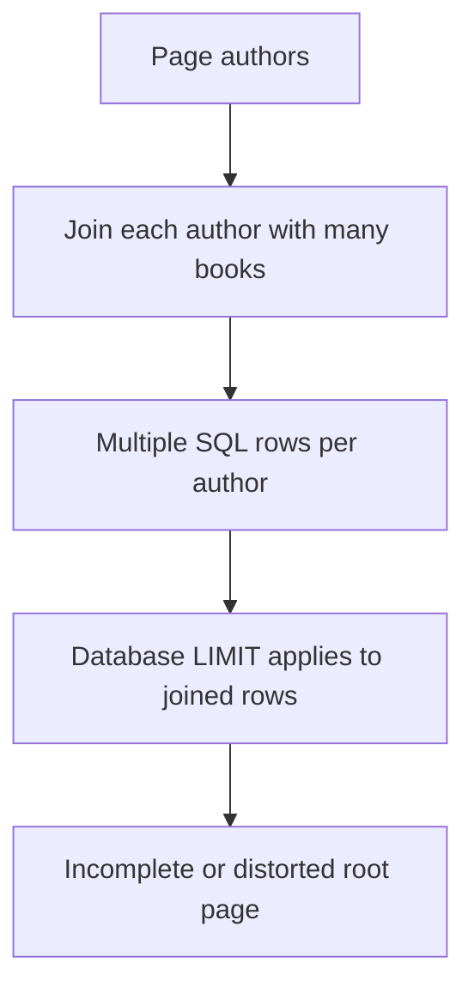

Для to-many pagination часто нужен two-step approach:

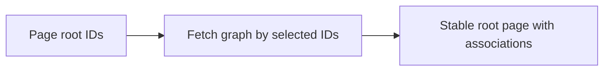

# 14. `Page` versus `Slice`

```mermaid
sequenceDiagram
    participant C as Caller
    participant R as Repository
    participant DB as Database

    C->>R: request Page
    R->>DB: content query with limit and offset
    R->>DB: count query
    DB-->>R: content plus total
    R-->>C: Page
```

```mermaid
sequenceDiagram
    participant C as Caller
    participant R as Repository
    participant DB as Database

    C->>R: request Slice size 20
    R->>DB: content query limit 21
    DB-->>R: up to 21 rows
    R-->>C: content and hasNext
```

`Slice` обычно избегает full count query.

# 15. Offset versus keyset pagination

## Offset

```mermaid
flowchart LR
    Q["OFFSET 100000 LIMIT 20"] --> Scan["Database may skip many rows"]
    Scan --> Result["Return next 20"]
```

## Keyset

```mermaid
flowchart LR
    Cursor["WHERE id greater than lastSeenId"] --> Index["Seek in ordered index"]
    Index --> Result["Return next 20"]
```

Keyset требует stable unique ordering и не даёт произвольного перехода на page number без дополнительных механизмов.

# 16. Optimistic locking

```mermaid
sequenceDiagram
    participant A as Transaction A
    participant DB as Row version=3
    participant B as Transaction B

    A->>DB: SELECT row version 3
    B->>DB: SELECT row version 3
    A->>DB: UPDATE ... WHERE version=3, set version=4
    DB-->>A: 1 row
    B->>DB: UPDATE ... WHERE version=3
    DB-->>B: 0 rows
    B-->>B: OptimisticLockException
```

Optimistic locking обнаруживает conflict; application должна решить retry, merge или user-facing conflict.

# 17. Pessimistic locking

```mermaid
sequenceDiagram
    participant A as Transaction A
    participant DB as Row 42
    participant B as Transaction B

    A->>DB: SELECT ... FOR UPDATE row 42
    DB-->>A: lock acquired
    B->>DB: SELECT ... FOR UPDATE row 42
    Note right of B: waits or times out
    A->>DB: commit and release lock
    DB-->>B: lock acquired
```

Lock ordering и timeout policy обязательны для контроля deadlocks и long waits.

# 18. Repository proxy path

```mermaid
sequenceDiagram
    participant S as Service
    participant P as Repository proxy
    participant Q as Query method resolver
    participant EM as EntityManager
    participant H as Hibernate
    participant DB as Database

    S->>P: findByStatusAndCreatedAtAfter()
    P->>Q: resolve derived query metadata
    Q->>EM: create and execute query
    EM->>H: translate JPQL or criteria
    H->>DB: SQL
    DB-->>H: rows
    H-->>EM: entities or projection
    EM-->>P: result
    P-->>S: result
```

# 19. Dynamic query composition

```mermaid
flowchart TD
    Request["Search request"] --> N{"name present?"}
    Request --> S{"status present?"}
    Request --> D{"date range present?"}
    N -->|Yes| PN["name predicate"]
    S -->|Yes| PS["status predicate"]
    D -->|Yes| PD["date predicate"]
    PN --> AND["compose with AND"]
    PS --> AND
    PD --> AND
    AND --> Query["Specification query"]
```

Specification полезна для composable predicates, но не обязана быть универсальным решением для reports, aggregation и provider-specific SQL.

# 20. Diagnostic decision tree

```mermaid
flowchart TD
    A["JPA behavior unexpected"] --> B{"Entity managed?"}
    B -->|No| B1["Check detach, clear, context close or merge result"]
    B -->|Yes| C{"SQL already flushed?"}
    C -->|No| C1["Force flush to expose DB error"]
    C -->|Yes| D{"Persistence context stale?"}
    D -->|Yes| D1["Check bulk DML, refresh or clear"]
    D -->|No| E{"Association access causes extra SQL?"}
    E -->|Yes| E1["Measure N+1 and choose fetch plan"]
    E -->|No| F{"Pagination or count query expensive?"}
    F -->|Yes| F1["Compare Slice, keyset and two-step fetching"]
    F -->|No| G["Inspect locking, isolation and database plan"]
```

# 21. Production case: order list endpoint

## Initial implementation

```java
Page<Order> orders = repository.findAll(pageable);
return orders.map(mapper::toDto);
```

Mapper accesses customer and lines for every order.

```mermaid
sequenceDiagram
    participant API as REST endpoint
    participant DB as Database

    API->>DB: SELECT page of orders
    API->>DB: SELECT COUNT orders
    loop each order
        API->>DB: SELECT customer
        API->>DB: SELECT order lines
    end
```

## Corrected query model

```mermaid
flowchart LR
    PageIDs["Page stable order IDs"] --> Projection["Fetch DTO projection or graph for IDs"]
    Projection --> SQLCount["Measure expected SQL count"]
    SQLCount --> API["Return DTOs outside persistence context"]
```

Evidence must include SQL count, query plan and database round-trip after `clear()`.

# 22. Interview explanation

```text
1. Persistence context is an identity map and change tracker.
2. Managed entities are updated through dirty checking at flush.
3. Flush sends SQL; commit makes transaction durable.
4. merge returns a managed copy and does not attach the argument.
5. Bulk DML bypasses managed state and may make context stale.
6. LAZY is a loading strategy; N+1 is a query-access pattern.
7. Fetch join and EntityGraph control fetch plans.
8. Page usually needs count; Slice can avoid it.
9. Optimistic locking detects version conflicts; pessimistic locking blocks competitors.
```

# 23. Exercises

1. Prove identity-map reference equality.
2. Modify managed entity without save and observe UPDATE on flush.
3. Ignore merge result and reproduce lost tracking.
4. Run bulk update and compare managed object with DB row.
5. Count N+1 statements and eliminate them with EntityGraph.
6. Compare Page and Slice SQL.
7. Reproduce optimistic conflict with two EntityManagers.
8. Run batch processing with and without periodic clear.

## Related materials

- [[Spring Data JPA Persistence Context and Entity Lifecycle]]
- [[Spring Data Repositories Queries and Fetching]]
- [[30_CERTIFICATIONS/Spring/2V0-72.22/DATA-B01/DATA-B01 Cards]]
- [[40_PRODUCTION_CASES/Spring/Spring Data JPA Production Cases]]
- [[50_LABS/Spring/DATA-B01/README]]
