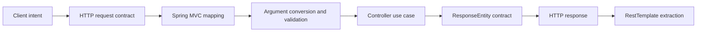

# REST Endpoints, ResponseEntity Contracts and RestTemplate

> [!summary]
> A REST endpoint is not “a Java method with an annotation”. It is an HTTP contract composed of method semantics, target URI, request headers, request body, response status, response headers and response body. `ResponseEntity` makes the server contract explicit. `RestTemplate` executes the client side of the same contract.

# Route navigation

- [[30_CERTIFICATIONS/Spring/2V0-72.22/SPRING-MVC-B02/SPRING-MVC-B02 Roadmap]]
- [[30_CERTIFICATIONS/Spring/2V0-72.22/SPRING-MVC-B02/SPRING-MVC-B02 Cards]]
- [[30_CERTIFICATIONS/Spring/2V0-72.22/SPRING-MVC-B02/SPRING-MVC-B02 Drills]]
- [[30_CERTIFICATIONS/Spring/2V0-72.22/SPRING-MVC-B02/SPRING-MVC-B02 Assessment]]
- [[40_PRODUCTION_CASES/Spring/Spring MVC REST Contract Production Cases]]
- [[50_LABS/Spring/SPRING-MVC-B02/README]]
- [[98_SOURCES/Spring MVC REST and RestTemplate Sources]]
- **Previous:** [[30_CERTIFICATIONS/Spring/2V0-72.22/SPRING-MVC-B01/SPRING-MVC-B01 Roadmap]]

# 1. One model for server and client



The endpoint and the client must agree on all of these dimensions:

```text
method + URI + request headers + request body
                    ↓
status + response headers + response body
```

A URL match alone is not enough. A request may fail because the method, `Content-Type`, `Accept`, required parameters or headers do not match.

# 2. HTTP method semantics

| Method | Safe | Idempotent | Typical purpose | Typical success |
|---|---:|---:|---|---|
| GET | yes | yes | read representation | `200 OK`, sometimes `304 Not Modified` |
| HEAD | yes | yes | GET metadata without response body | `200 OK` |
| OPTIONS | yes | yes | discover communication options | `200 OK` or `204 No Content` with `Allow` |
| POST | no | no by default | create subordinate resource or execute command | `201 Created`, `200 OK`, `202 Accepted` |
| PUT | no | yes | replace resource at known URI | `200 OK`, `204 No Content`, or `201 Created` |
| PATCH | no | not guaranteed | partial modification | `200 OK` or `204 No Content` |
| DELETE | no | yes at target-state level | remove resource | `204 No Content`, `200 OK`, or `202 Accepted` |

> [!important]
> Idempotent does not mean “the response is byte-for-byte identical”. It means repeating the same intended operation has the same target-state effect. Repeated DELETE may return `204` first and `404` later while remaining idempotent at the resource-state level.

## 2.1 Spring mapping shortcuts

```java
@GetMapping
@PostMapping
@PutMapping
@PatchMapping
@DeleteMapping
```

They are composed forms of `@RequestMapping(method = ...)`.

Prefer explicit method mappings. A method-level `@RequestMapping` without `method` can accept all HTTP methods and often creates an accidental contract.

```java
@RestController
@RequestMapping("/api/orders")
class OrderController {

    @GetMapping("/{id}")
    OrderResponse get(@PathVariable long id) { ... }

    @PostMapping
    ResponseEntity<OrderResponse> create(
            @Valid @RequestBody CreateOrderRequest request) { ... }
}
```

# 3. Request contract anatomy

## 3.1 Path variables identify a resource

```http
GET /api/orders/42
```

```java
@GetMapping("/{id}")
public OrderResponse get(@PathVariable long id) { ... }
```

Use path variables for identity or hierarchy. A malformed numeric value fails during type conversion before the controller method runs.

## 3.2 Query parameters modify selection

```http
GET /api/orders?status=PAID&page=0&size=20
```

```java
@GetMapping
public List<OrderResponse> search(
        @RequestParam Optional<String> status,
        @RequestParam(defaultValue = "0") int page,
        @RequestParam(defaultValue = "20") int size) { ... }
```

Use query parameters for filtering, sorting, pagination and optional controls. Do not model every search option as a new path segment.

## 3.3 Headers carry protocol metadata

```java
@GetMapping("/{id}")
public ResponseEntity<OrderResponse> get(
        @PathVariable long id,
        @RequestHeader(name = "If-None-Match", required = false) String etag) {
    ...
}
```

Headers are appropriate for content negotiation, caching, tracing, authentication and conditional requests. Business fields that must survive outside HTTP usually belong in the body or domain command, not only in headers.

## 3.4 `@RequestBody` invokes message conversion

```java
@PostMapping(consumes = MediaType.APPLICATION_JSON_VALUE)
public ResponseEntity<OrderResponse> create(
        @Valid @RequestBody CreateOrderRequest request) {
    ...
}
```

Pipeline:

```text
request Content-Type
→ mapping consumes condition
→ compatible HttpMessageConverter
→ deserialize bytes into Java object
→ Bean Validation
→ controller invocation
```

Failure boundaries:

| Failure | Typical result |
|---|---|
| unsupported request media type | `415 Unsupported Media Type` |
| malformed JSON or unreadable body | `400 Bad Request` |
| valid JSON but constraint violation | `400 Bad Request` by default |
| domain conflict after successful binding | often `409 Conflict` |

# 4. `Content-Type` and `Accept` are different contracts

```text
Content-Type = what representation is being sent
Accept       = what response representation is acceptable
```

Example:

```http
POST /api/orders
Content-Type: application/json
Accept: application/json
```

- `415` usually means the server cannot consume the request representation.
- `406` usually means the server cannot produce an acceptable response representation.

Do not “fix” a 406 by changing request `Content-Type`. Diagnose `Accept`, mapping `produces`, return type and available converters.

# 5. Response contract ownership

## 5.1 Returning a body object

```java
@GetMapping("/{id}")
public OrderResponse get(@PathVariable long id) {
    return service.get(id);
}
```

Under `@RestController`, the object is written through an `HttpMessageConverter`. The framework supplies the normal success status, typically `200 OK`.

Use this form when the contract is simply “success with body” and no special headers or status are required.

## 5.2 Returning `ResponseEntity<T>`

`ResponseEntity<T>` owns:

```text
HTTP status + response headers + optional body
```

```java
return ResponseEntity
        .ok()
        .eTag("\"order-42-v7\"")
        .cacheControl(CacheControl.maxAge(Duration.ofMinutes(5)))
        .body(order);
```

The body is still serialized through an `HttpMessageConverter`.

## 5.3 Common factories and builders

```java
ResponseEntity.ok(body);
ResponseEntity.status(HttpStatus.CREATED).body(body);
ResponseEntity.created(location).body(body);
ResponseEntity.accepted().build();
ResponseEntity.noContent().build();
ResponseEntity.badRequest().body(error);
ResponseEntity.notFound().build();
ResponseEntity.status(HttpStatus.CONFLICT).body(error);
```

> [!warning]
> `ResponseEntity.ok(null)` is still a `200 OK` contract. It is not the same as `404 Not Found`.

# 6. Status patterns that should be deliberate

## 6.1 Creation: `201 Created` plus `Location`

```java
URI location = ServletUriComponentsBuilder
        .fromCurrentRequest()
        .path("/{id}")
        .buildAndExpand(created.getId())
        .toUri();

return ResponseEntity.created(location).body(created);
```

`Location` identifies the created resource. This is stronger than returning only an ID in a body because it communicates the canonical URI at the protocol level.

## 6.2 No representation: `204 No Content`

```java
@DeleteMapping("/{id}")
public ResponseEntity<Void> delete(@PathVariable long id) {
    service.delete(id);
    return ResponseEntity.noContent().build();
}
```

A 204 response must not depend on a response body. Use 200 when a representation or result document is intentionally returned.

## 6.3 Asynchronous acceptance: `202 Accepted`

Use 202 when the request was accepted but processing is not complete. Prefer a status resource or job URI so the client can observe progress.

## 6.4 Conflict: `409 Conflict`

Typical domain conflicts:

- duplicate unique business key;
- illegal state transition;
- resource already allocated;
- version conflict expressed as a domain rule.

## 6.5 Conditional update: `412 Precondition Failed`

For optimistic HTTP concurrency:

```http
GET /api/orders/42
ETag: "v7"

PUT /api/orders/42
If-Match: "v7"
```

If the current version is no longer `v7`, reject the update with 412 rather than silently overwriting newer data.

# 7. Response headers are part of the API

Important headers:

| Header | Contract |
|---|---|
| `Location` | URI of a created or redirected resource |
| `ETag` | representation version token |
| `Last-Modified` | timestamp validator |
| `Cache-Control` | caching policy |
| `Vary` | cache key must include named request headers |
| `Allow` | supported methods, commonly relevant to OPTIONS/405 |
| `Retry-After` | when a client may retry |
| correlation header | cross-service diagnostics |

A controller returning the correct JSON with incorrect cache headers can still be a broken endpoint.

# 8. Error response contracts

## 8.1 Spring 5.3 exam baseline

A stable baseline uses a dedicated DTO and centralized advice:

```java
@RestControllerAdvice
class ApiExceptionHandler {

    @ExceptionHandler(OrderNotFoundException.class)
    ResponseEntity<ApiError> handle(OrderNotFoundException ex) {
        ApiError error = new ApiError(
                "ORDER_NOT_FOUND",
                ex.getMessage(),
                Instant.now());
        return ResponseEntity.status(HttpStatus.NOT_FOUND).body(error);
    }
}
```

`@RestControllerAdvice` combines global controller advice with response-body semantics.

Local `@ExceptionHandler` methods are considered before global advice for the same controller path. Multiple advice beans also have ordering rules. A broad `Exception.class` handler can hide framework-specific or more precise mappings.

## 8.2 Current production delta

Modern Spring supports RFC 9457 through:

```text
ProblemDetail
ErrorResponse
ErrorResponseException
ResponseEntityExceptionHandler
```

This is a current-version feature, not the answer to a Spring 5.3-only exam question unless the question explicitly asks for current behavior.

# 9. `HttpEntity`, `RequestEntity` and `ResponseEntity`

| Type | Direction | Contains |
|---|---|---|
| `HttpEntity<T>` | request or response abstraction | headers + body |
| `RequestEntity<T>` | client request | method + URI + headers + body |
| `ResponseEntity<T>` | server return or client response | status + headers + body |

Server code commonly returns `ResponseEntity<T>`. Client code commonly sends `HttpEntity<T>` or `RequestEntity<T>` and receives `ResponseEntity<T>`.

# 10. `RestTemplate` mental model


`RestTemplate` is synchronous and blocking. The calling thread normally waits until the response arrives or a timeout/error occurs.

A configured instance is typically shared. Configure it during application startup; do not mutate its converters, interceptors or request factory concurrently while requests are executing.

# 11. Choosing a `RestTemplate` operation

| Need | Method |
|---|---|
| GET body only | `getForObject` |
| GET status + headers + body | `getForEntity` |
| POST body only | `postForObject` |
| POST full response | `postForEntity` |
| POST created-resource location | `postForLocation` |
| PUT with no extracted body | `put` |
| DELETE with no extracted body | `delete` |
| PATCH body | `patchForObject` |
| arbitrary method/headers/generic response | `exchange` |
| lowest-level callback/extractor control | `execute` |

## 11.1 Body-only versus full response

```java
OrderResponse body =
        restTemplate.getForObject("/api/orders/{id}", OrderResponse.class, id);
```

```java
ResponseEntity<OrderResponse> response =
        restTemplate.getForEntity("/api/orders/{id}", OrderResponse.class, id);

HttpStatus status = response.getStatusCode();
HttpHeaders headers = response.getHeaders();
OrderResponse body = response.getBody();
```

Choose `getForEntity` when status or headers are part of the decision.

# 12. Sending headers and bodies

```java
HttpHeaders headers = new HttpHeaders();
headers.setContentType(MediaType.APPLICATION_JSON);
headers.setBearerAuth(token);
headers.setIfMatch("\"v7\"");

HttpEntity<UpdateOrderRequest> entity =
        new HttpEntity<>(request, headers);

ResponseEntity<OrderResponse> response = restTemplate.exchange(
        "/api/orders/{id}",
        HttpMethod.PUT,
        entity,
        OrderResponse.class,
        id);
```

`exchange` is the general-purpose operation because it exposes the complete request and response contract.

# 13. Generic response types

This loses element type information:

```java
List result = restTemplate.getForObject("/api/orders", List.class);
```

JSON objects often become `LinkedHashMap` values because Java erased `List<OrderResponse>`.

Preserve the generic type:

```java
ResponseEntity<List<OrderResponse>> response = restTemplate.exchange(
        "/api/orders",
        HttpMethod.GET,
        HttpEntity.EMPTY,
        new ParameterizedTypeReference<List<OrderResponse>>() {});
```

The anonymous subclass captures the generic type token.

# 14. URI construction and encoding

Avoid manual concatenation:

```java
String url = baseUrl + "/orders/" + id + "?status=" + status;
```

Prefer URI templates or `UriComponentsBuilder`:

```java
URI uri = UriComponentsBuilder
        .fromUriString(baseUrl)
        .pathSegment("api", "orders", "{id}")
        .queryParam("expand", "items")
        .buildAndExpand(id)
        .encode()
        .toUri();
```

Manual concatenation creates encoding, slash and injection defects.

# 15. Boot configuration with `RestTemplateBuilder`

In Boot 2.5, a configured builder is available for injection.

```java
@Bean
RestTemplate catalogRestTemplate(RestTemplateBuilder builder) {
    return builder
            .rootUri("https://catalog.internal")
            .setConnectTimeout(Duration.ofSeconds(2))
            .setReadTimeout(Duration.ofSeconds(3))
            .additionalInterceptors(new CorrelationIdInterceptor())
            .errorHandler(new CatalogErrorHandler())
            .build();
}
```

Important distinction:

- connect timeout: how long establishing the connection may take;
- read timeout: how long waiting for response data may take.

No timeout policy is a production resource-exhaustion risk.

# 16. Default error behavior

By default, 4xx and 5xx responses are treated as errors and usually become subclasses of `RestClientResponseException`, including:

```text
HttpClientErrorException
HttpServerErrorException
```

These exceptions preserve useful evidence such as status, headers and response body.

Do not catch `Exception` and replace all downstream failures with `null`. Translate them into an explicit service-level contract while preserving diagnostics.

# 17. Interceptors and observability

A `ClientHttpRequestInterceptor` can add:

- correlation IDs;
- authentication headers;
- logging metadata;
- metrics;
- tracing propagation.

Avoid logging secrets or full sensitive bodies. Interceptors are protocol infrastructure, not business retry engines.

# 18. Retrying safely

Retry decisions depend on operation semantics:

- GET is normally safe to retry under a controlled policy;
- PUT and DELETE are idempotent at the target-state level but may still trigger non-idempotent downstream side effects;
- POST should not be retried blindly unless an idempotency key or equivalent deduplication mechanism exists.

A timeout does not prove the server did not process the request.

# 19. Testing the client without a real server

`MockRestServiceServer` binds to a `RestTemplate` and verifies the request contract:

```java
MockRestServiceServer server =
        MockRestServiceServer.bindTo(restTemplate).build();

server.expect(requestTo("/api/orders/42"))
        .andExpect(method(HttpMethod.GET))
        .andRespond(withSuccess(
                "{\"id\":42,\"status\":\"PAID\"}",
                MediaType.APPLICATION_JSON));

OrderResponse result = client.get(42);

server.verify();
```

Test method, URI, headers, body and extraction. A unit test that mocks the client wrapper itself does not prove the HTTP contract.

# 20. `RestTemplate` versus current clients

| Client | Execution model | Best fit |
|---|---|---|
| `RestTemplate` | synchronous, blocking, template API | Spring 5.3 exam baseline and established blocking code |
| `RestClient` | synchronous, blocking, fluent API | modern synchronous Spring applications |
| `WebClient` | non-blocking/reactive | reactive pipelines, streaming and high concurrency with non-blocking dependencies |

> [!important]
> `RestTemplate` is not “broken”. It is mature and stable, but modern Spring provides newer client APIs. Migration is an architectural decision, not a search-and-replace exercise.

# 21. End-to-end contract example

## Server

```java
@PostMapping
public ResponseEntity<OrderResponse> create(
        @Valid @RequestBody CreateOrderRequest request) {

    OrderResponse created = service.create(request);
    URI location = URI.create("/api/orders/" + created.getId());

    return ResponseEntity
            .created(location)
            .eTag("\"v" + created.getVersion() + "\"")
            .body(created);
}
```

## Client

```java
HttpHeaders headers = new HttpHeaders();
headers.setContentType(MediaType.APPLICATION_JSON);
headers.setAccept(Collections.singletonList(MediaType.APPLICATION_JSON));

HttpEntity<CreateOrderRequest> entity =
        new HttpEntity<>(request, headers);

ResponseEntity<OrderResponse> response = restTemplate.exchange(
        "/api/orders",
        HttpMethod.POST,
        entity,
        OrderResponse.class);

if (response.getStatusCode() != HttpStatus.CREATED) {
    throw new IllegalStateException("Unexpected contract: " + response.getStatusCode());
}

URI location = response.getHeaders().getLocation();
OrderResponse created = response.getBody();
```

The client validates the protocol contract instead of assuming any 2xx response means the same thing.

# 22. Exam traps

1. `@RestController` is `@Controller` plus class-level `@ResponseBody` semantics.
2. `@RequestBody` uses `HttpMessageConverter`; it is not query-parameter binding.
3. `Content-Type` describes the sent representation; `Accept` describes the desired response.
4. `ResponseEntity` controls status and headers in addition to the body.
5. `201 Created` should normally include `Location`.
6. `204 No Content` must not rely on a body.
7. PUT is idempotent; PATCH is not automatically idempotent.
8. Repeated DELETE may return different statuses and still be idempotent.
9. `getForObject` returns a body; `getForEntity` returns the full response.
10. `exchange` is the flexible operation for methods, headers and generic types.
11. `ParameterizedTypeReference` preserves generic element types.
12. `RestTemplateBuilder` configures timeouts, interceptors, converters and error handling.
13. Default `RestTemplate` handling turns 4xx/5xx into exceptions.
14. A read timeout does not prove the server did not perform the operation.
15. `RestClient` and `WebClient` are current deltas; `RestTemplate` remains the exam baseline.

# Related material

- [[30_CERTIFICATIONS/Spring/2V0-72.22/SPRING-MVC-B02/SPRING-MVC-B02 Roadmap]]
- [[30_CERTIFICATIONS/Spring/2V0-72.22/SPRING-MVC-B02/SPRING-MVC-B02 Cards]]
- [[30_CERTIFICATIONS/Spring/2V0-72.22/SPRING-MVC-B02/SPRING-MVC-B02 Drills]]
- [[40_PRODUCTION_CASES/Spring/Spring MVC REST Contract Production Cases]]
- [[50_LABS/Spring/SPRING-MVC-B02/README]]
- [[98_SOURCES/Spring MVC REST and RestTemplate Sources]]
