# Spring MVC DispatcherServlet Visual Deep Dive

> [!summary]
> Thirty distinct models for reconstructing the Servlet request path, strategy selection, annotated-controller invocation, body/view rendering, exception translation, and diagnostic boundaries.

# Route navigation

- [[10_CONCEPTS/Spring/MVC/DispatcherServlet and Annotated Controller Pipeline]]
- [[30_CERTIFICATIONS/Spring/2V0-72.22/SPRING-MVC-B01/SPRING-MVC-B01 Roadmap]]
- [[01_MAPS/Spring MVC DispatcherServlet Map.canvas]]

# 1. End-to-end topology

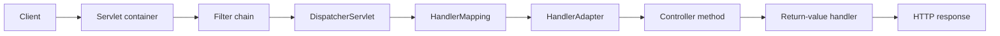

# 2. Front-controller responsibility split

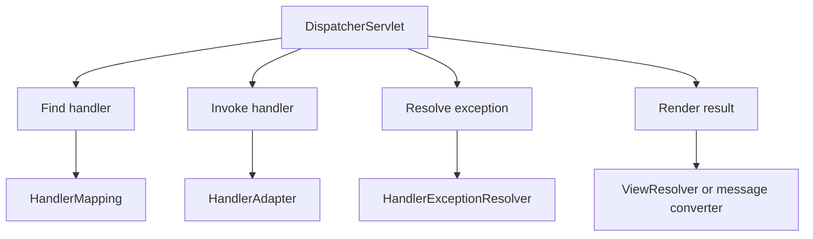

# 3. Servlet versus MVC boundaries

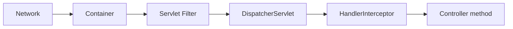

# 4. Traditional context hierarchy

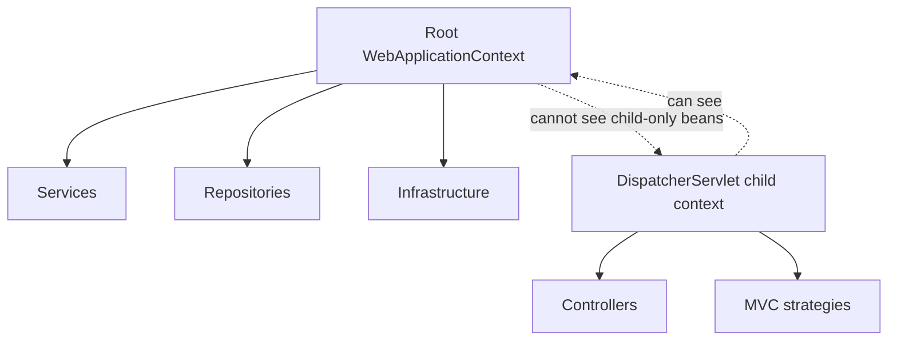

# 5. DispatcherServlet initialization

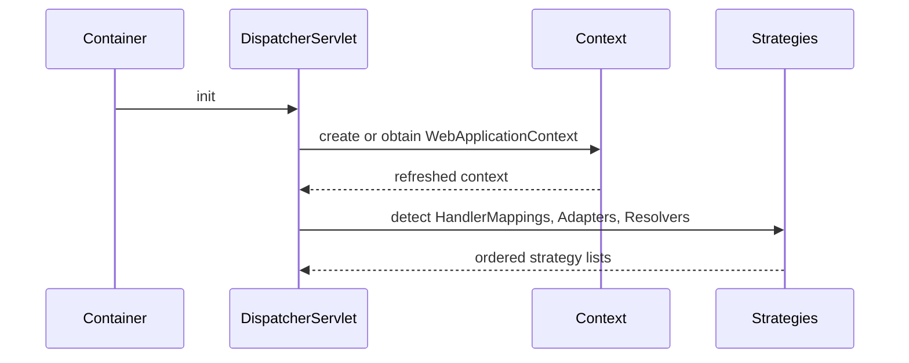

# 6. Special strategy beans

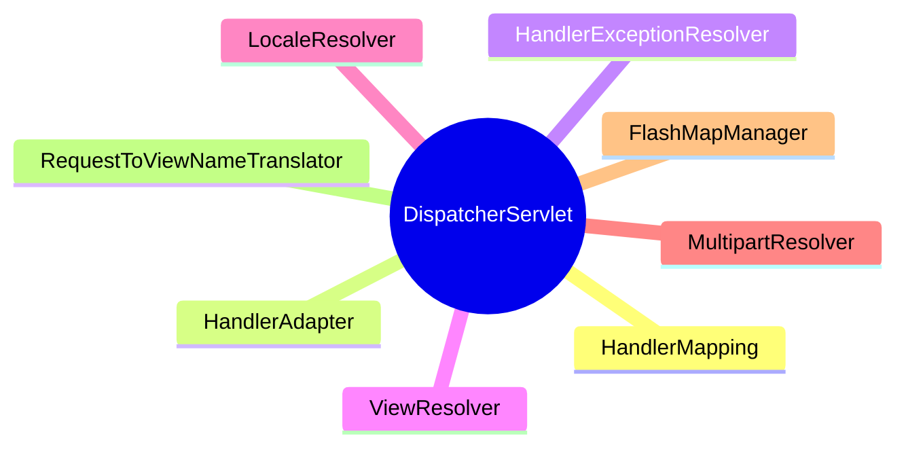

# 7. Request-processing sequence

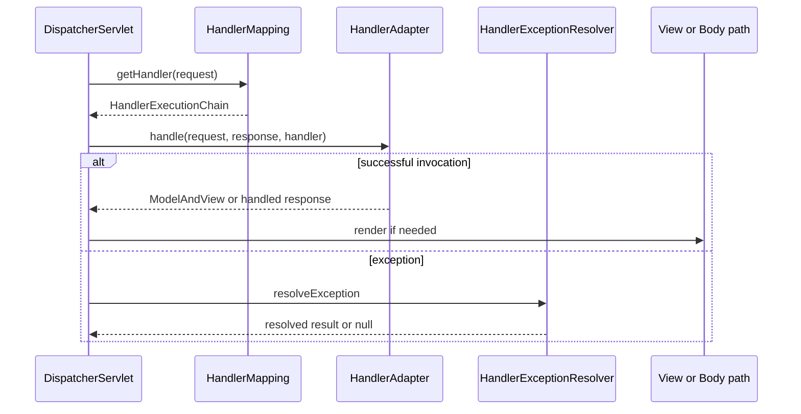

# 8. Ordered HandlerMapping selection

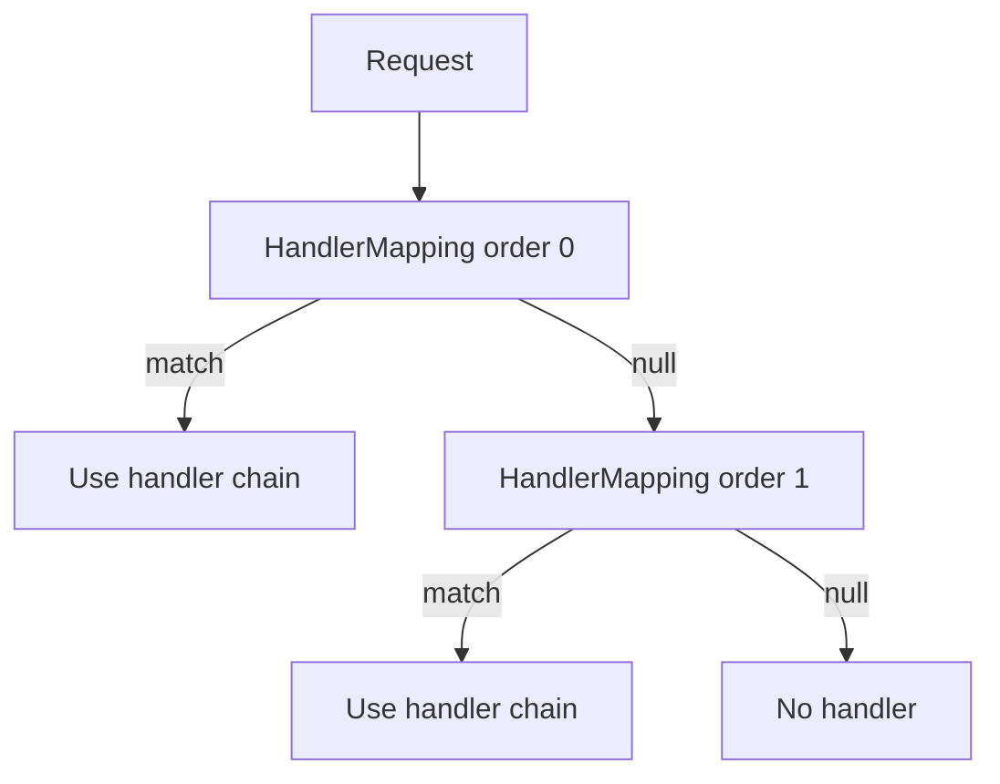

# 9. Startup mapping registration

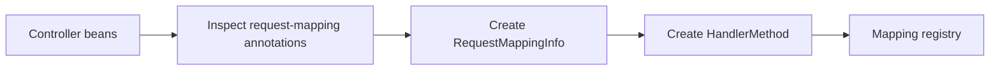

# 10. RequestMappingInfo condition set

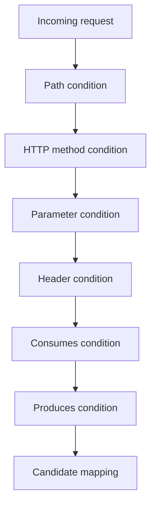

# 11. Best-match decision

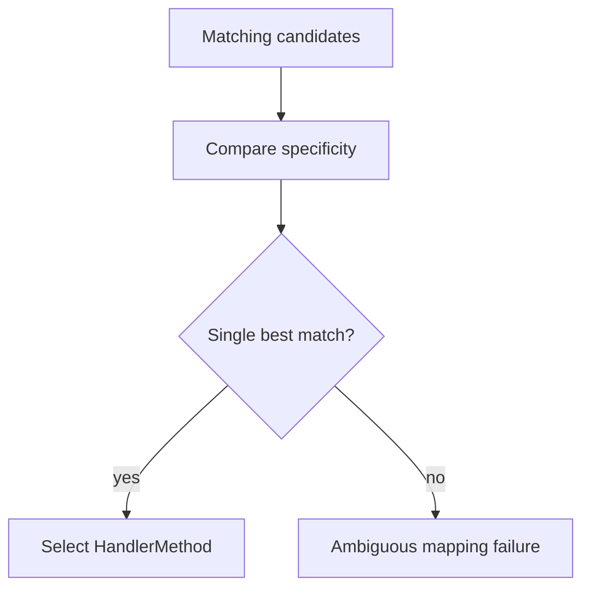

# 12. HandlerExecutionChain

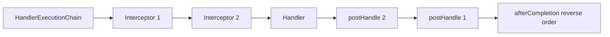

# 13. Interceptor short-circuit

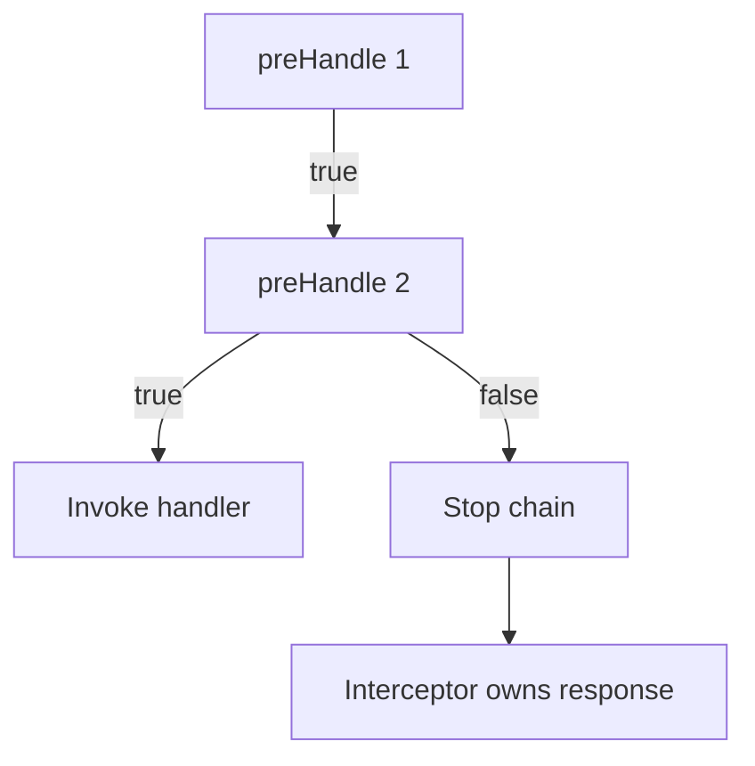

# 14. HandlerAdapter selection

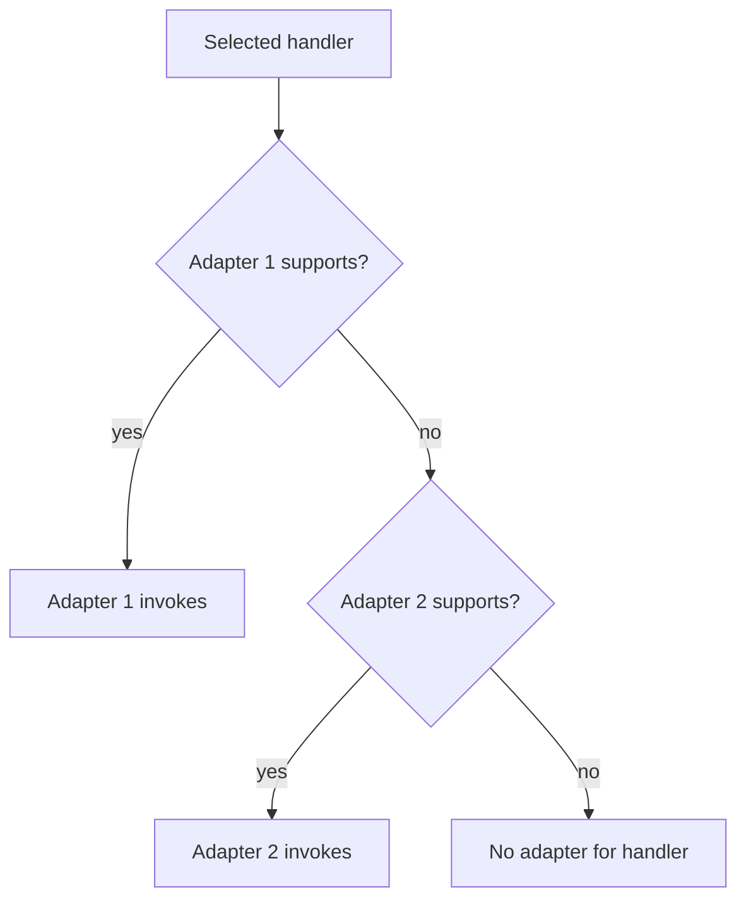

# 15. Annotated method adapter pipeline

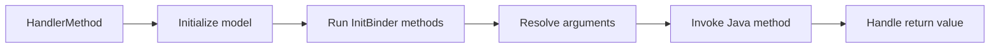

# 16. Argument resolver chain

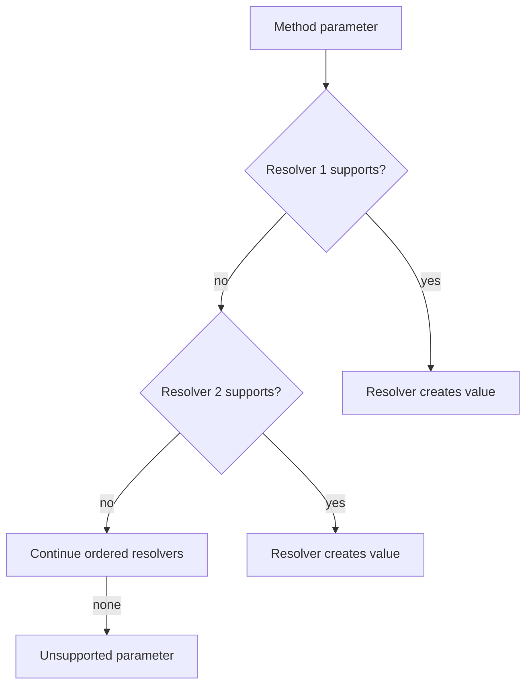

# 17. PathVariable path

```mermaid
flowchart LR
    URI[/catalog/42] --> PAT[/catalog/{id}]
    PAT --> VAR[id equals 42]
    VAR --> CONV[String to Long]
    CONV --> ARG[Controller argument]
```

# 18. RequestParam path

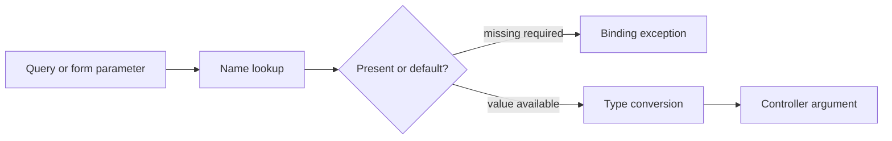

# 19. ModelAttribute binding

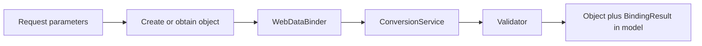

# 20. RequestBody conversion

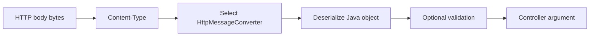

# 21. Conversion versus validation

```mermaid
flowchart TD
    RAW[Raw string] --> CONV{Can convert to target type?}
    CONV -->|no| TYPEERR[Type mismatch]
    CONV -->|yes| VALUE[Typed value]
    VALUE --> VALID{Satisfies constraints?}
    VALID -->|no| VALERR[Validation error]
    VALID -->|yes| OK[Invoke controller]
```

# 22. BindingResult adjacency

```mermaid
flowchart LR
    DTO[Validated DTO parameter] --> BR[Immediately following BindingResult]
    BR --> CAPTURE[Errors captured for controller]
    DTO --> OTHER[Unrelated parameter before BindingResult]
    OTHER --> EX[Errors raise exception instead]
```

# 23. Return-value handler chain

```mermaid
flowchart TD
    R[Raw method return value] --> H1{ModelAndView?}
    H1 -->|yes| MV[Model and view path]
    H1 -->|no| H2{ResponseBody or ResponseEntity?}
    H2 -->|yes| BODY[Message converter path]
    H2 -->|no| H3{View-name String?}
    H3 -->|yes| VIEW[ViewResolver path]
    H3 -->|no| NEXT[Other return-value handlers]
```

# 24. RestController body path

```mermaid
flowchart LR
    RET[Java return object] --> RVH[ResponseBody return-value handler]
    RVH --> NEG[Media-type negotiation]
    NEG --> CONV[HttpMessageConverter]
    CONV --> BYTES[Response bytes]
```

# 25. Controller view path

```mermaid
flowchart LR
    NAME[Logical view name] --> V1[ViewResolver order 0]
    V1 -->|null| V2[ViewResolver order 1]
    V1 -->|View| RENDER[Render model]
    V2 -->|View| RENDER
    RENDER --> RESPONSE[HTML response]
```

# 26. Exception resolution chain

```mermaid
flowchart TD
    EX[Exception] --> E1[ExceptionHandlerExceptionResolver]
    E1 -->|resolved| OUT[Error response or ModelAndView]
    E1 -->|null| E2[ResponseStatusExceptionResolver]
    E2 -->|resolved| OUT
    E2 -->|null| E3[DefaultHandlerExceptionResolver]
    E3 -->|resolved| OUT
    E3 -->|null| PROP[Propagate failure]
```

# 27. ControllerAdvice applicability

```mermaid
flowchart LR
    ADV[ControllerAdvice] --> SEL{Applies to controller?}
    SEL -->|yes| MODEL[ModelAttribute methods]
    SEL -->|yes| BIND[InitBinder methods]
    SEL -->|yes| ERR[ExceptionHandler methods]
    SEL -->|no| SKIP[Advice skipped]
```

# 28. No-handler diagnostic tree

```mermaid
flowchart TD
    R[404 symptom] --> REACH{Reached expected app?}
    REACH -->|no| ROUTE[Gateway or container routing]
    REACH -->|yes| MAP{HandlerMapping match?}
    MAP -->|no| COND[Inspect path, method, params, headers, consumes, produces]
    MAP -->|yes| DOMAIN{Controller returned domain not-found?}
    DOMAIN -->|yes| APP[Application exception policy]
    DOMAIN -->|no| RESOURCE[Static resource or later response path]
```

# 29. Embedded JAR versus WAR

```mermaid
flowchart TB
    CODE[Same controller code] --> JAR[Executable JAR]
    CODE --> WAR[WAR deployment]
    JAR --> EMB[Boot starts embedded container]
    WAR --> EXT[External container starts application]
    EMB --> DS1[DispatcherServlet]
    EXT --> DS2[DispatcherServlet]
```

# 30. Full production diagnostic path

```mermaid
flowchart LR
    A[Reach app] --> B[Filter chain]
    B --> C[Servlet mapping]
    C --> D[HandlerMapping]
    D --> E[Interceptor chain]
    E --> F[HandlerAdapter]
    F --> G[Argument resolvers]
    G --> H[Conversion and validation]
    H --> I[Controller]
    I --> J[Return-value handler]
    J --> K[Converter or ViewResolver]
    K --> L[ExceptionResolver if failed]
    L --> M[Committed status, headers, body]
```

# Visual recall prompts

1. Reconstruct diagrams 7, 15, 16, 23, and 26 without notes.
2. Explain why `HandlerMapping` cannot deserialize JSON.
3. Explain why `@ControllerAdvice` cannot catch a failure in an upstream Servlet filter.
4. Trace a `String` query parameter through conversion and validation.
5. Trace the same controller result through body rendering and view rendering.

# Related material

- [[10_CONCEPTS/Spring/MVC/DispatcherServlet and Annotated Controller Pipeline]]
- [[30_CERTIFICATIONS/Spring/2V0-72.22/SPRING-MVC-B01/SPRING-MVC-B01 Assessment]]
- [[50_LABS/Spring/SPRING-MVC-B01/README]]
