# Spring MVC REST Visual Deep Dive

> [!summary]
> Twenty-five models for reconstructing REST endpoint selection, request-body conversion, response contracts, error mapping and `RestTemplate` client execution.

# Route navigation

- [[10_CONCEPTS/Spring/MVC/REST Endpoints ResponseEntity and RestTemplate]]
- [[30_CERTIFICATIONS/Spring/2V0-72.22/SPRING-MVC-B02/SPRING-MVC-B02 Roadmap]]
- [[01_MAPS/Spring MVC REST Map.canvas]]

# 1. REST route boundary

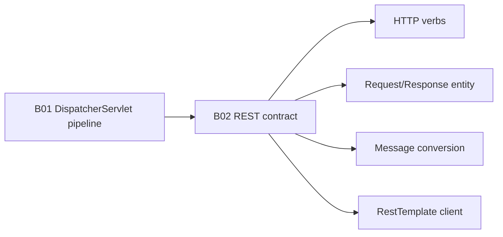

# 2. REST server topology

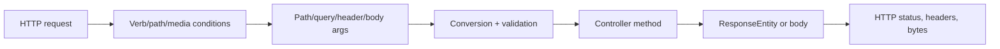

# 3. Verb-to-method mapping

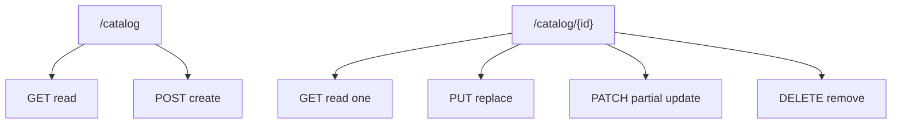

# 4. Mapping condition set

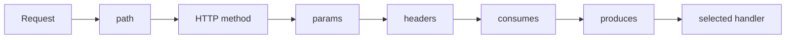

# 5. Input-source split

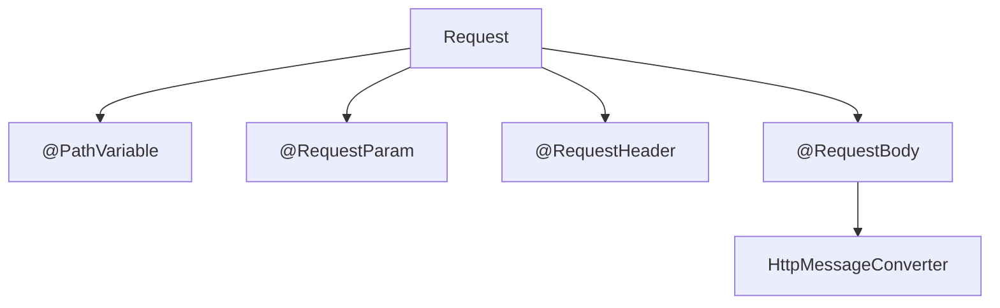

# 6. Request body path

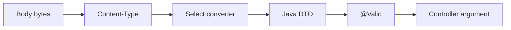

# 7. Validation failure path

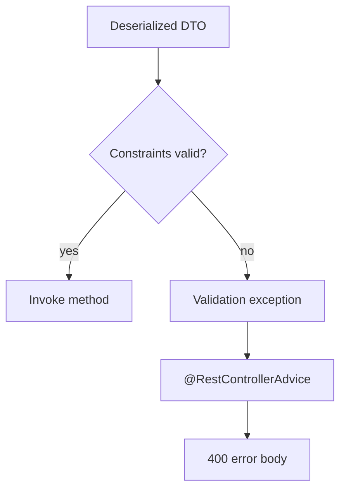

# 8. ResponseEntity contract

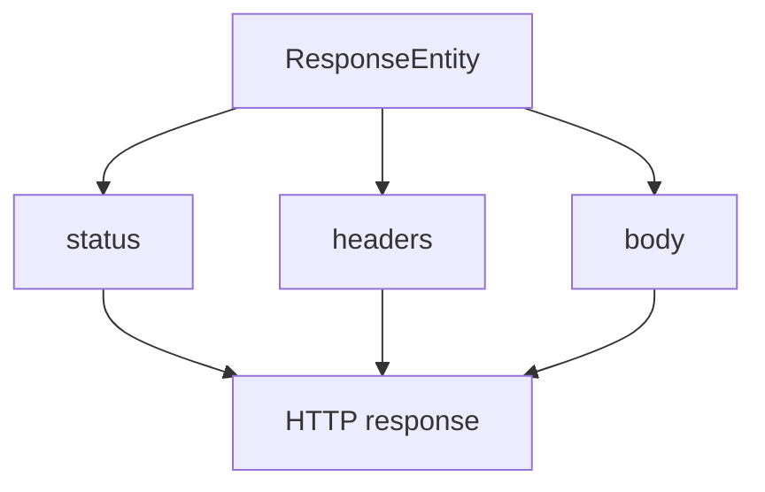

# 9. Create response

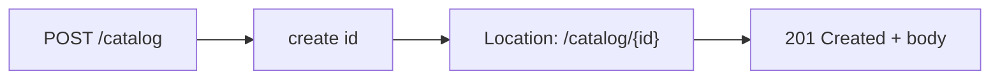

# 10. Delete response

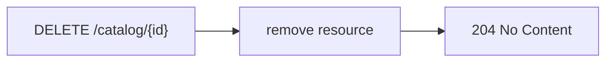

# 11. Content negotiation

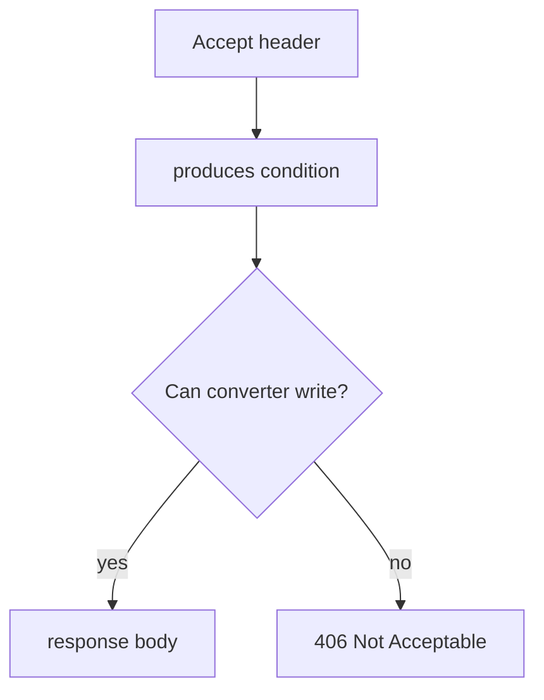

# 12. Consumes negotiation

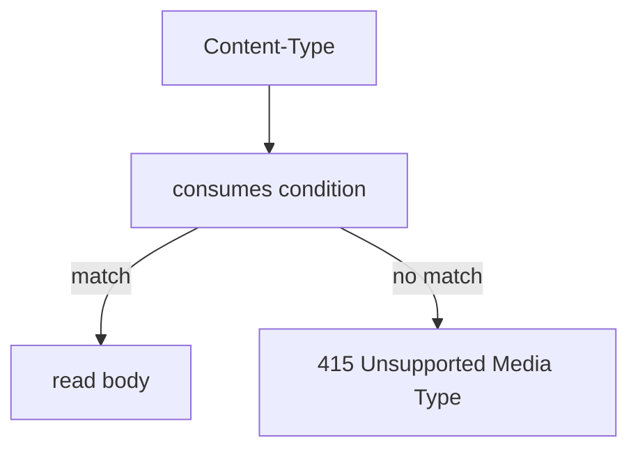

# 13. Status-code decision tree

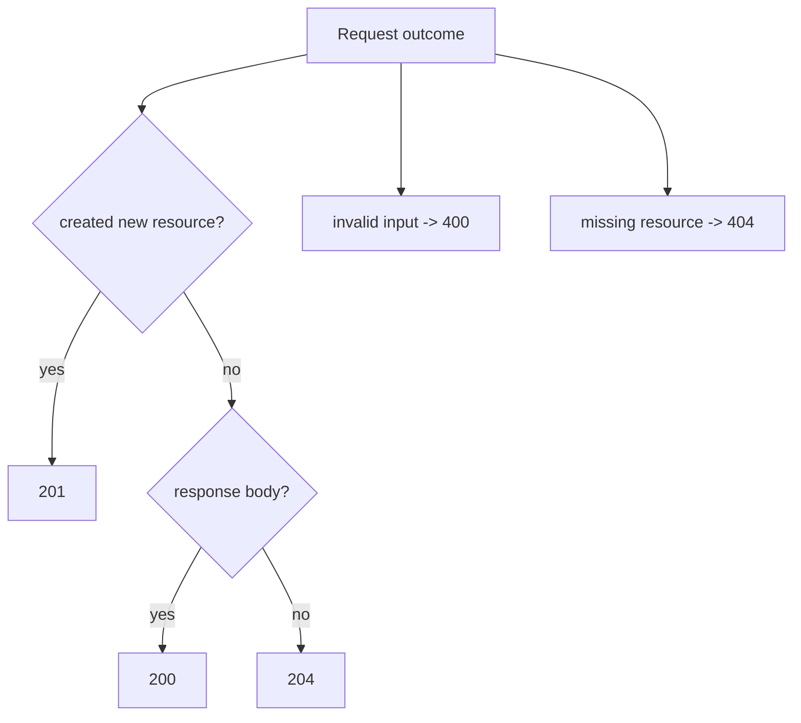

# 14. REST error contract

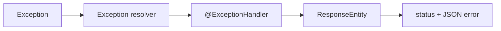

# 15. ResponseStatusException path

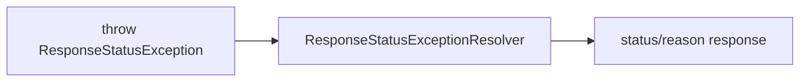

# 16. Server-side converter symmetry

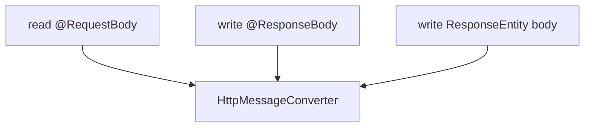

# 17. RestTemplate topology

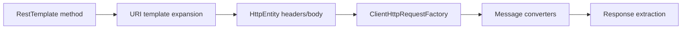

# 18. RestTemplate method choice

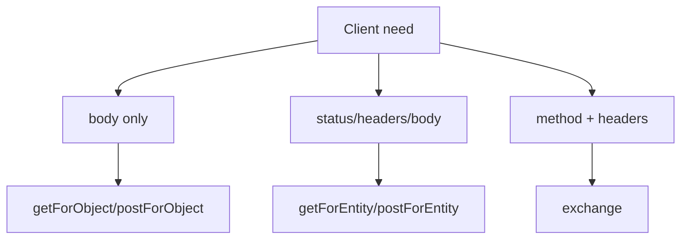

# 19. `exchange` path

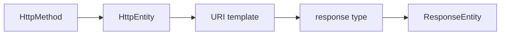

# 20. Client error handling

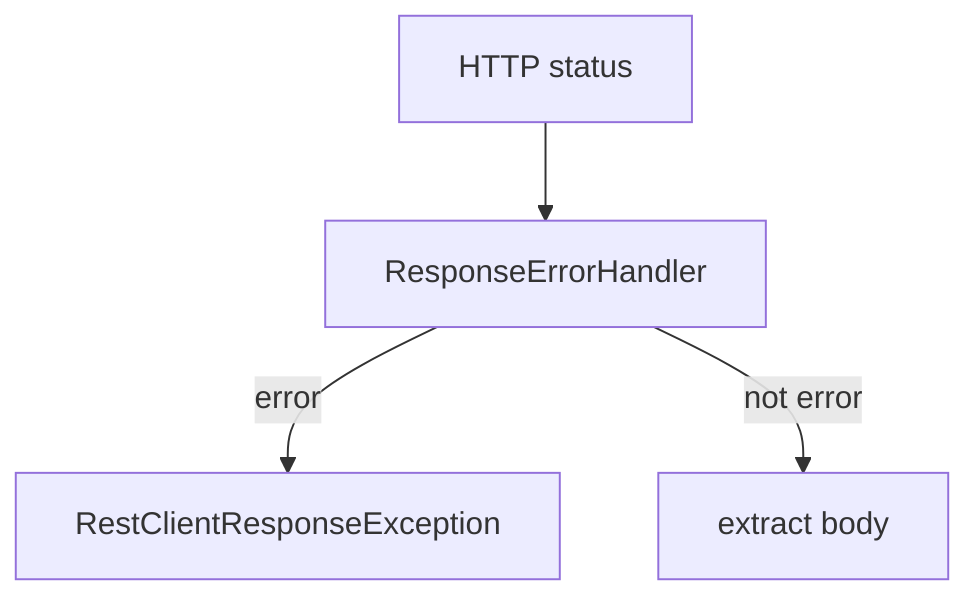

# 21. RestTemplateBuilder

```mermaid
flowchart TB
    BUILDER["RestTemplateBuilder"] --> ROOT["root URI"]
    BUILDER --> TIMEOUTS["timeouts"]
    BUILDER --> CONVERTERS["converters"]
    BUILDER --> INTERCEPTORS["interceptors"]
    BUILDER --> ERR["error handler"]
    BUILDER --> TEMPLATE["RestTemplate"]
```

# 22. Server MockMvc proof

```mermaid
flowchart LR
    TEST["MockMvc request"] --> DS["DispatcherServlet"]
    DS --> CTRL["REST controller"]
    CTRL --> ADVICE["Controller advice"]
    ADVICE --> ASSERT["status/header/json assertions"]
```

# 23. Client MockRestServiceServer proof

```mermaid
flowchart LR
    CLIENT["CatalogRestClient"] --> RT["RestTemplate"]
    RT --> MOCK["MockRestServiceServer"]
    MOCK --> EXPECT["expect method/URI/body"]
    EXPECT --> RESP["mock response"]
```

# 24. Current production delta

```mermaid
flowchart TB
    BASE["Exam baseline"] --> RT["RestTemplate"]
    CURRENT["Current production"] --> RC["RestClient"]
    CURRENT --> WC["WebClient"]
    BASE --> CUSTOMERR["custom error DTO"]
    CURRENT --> PD["ProblemDetail"]
```

# 25. Full route mental model

```mermaid
flowchart LR
    SERVER["REST server contract"] --> STATUS["status/header/body"]
    SERVER --> NEG["content negotiation"]
    SERVER --> ERROR["error contract"]
    CLIENT["REST client contract"] --> RT["RestTemplate"]
    RT --> EXCHANGE["exchange"]
    RT --> TESTS["MockRestServiceServer"]
```

# Visual recall prompts

1. Reconstruct diagrams 2, 6, 8, 11, 17 and 20 without notes.
2. Explain why 406 and 415 occur at different sides of the message-converter boundary.
3. Explain why `getForObject` cannot inspect response headers.
4. Explain why `ResponseEntity.created(location)` is different from returning a DTO with `200 OK`.
5. Trace the same DTO through server-side response writing and `RestTemplate` client-side reading.

# Related material

- [[10_CONCEPTS/Spring/MVC/REST Endpoints ResponseEntity and RestTemplate]]
- [[30_CERTIFICATIONS/Spring/2V0-72.22/SPRING-MVC-B02/SPRING-MVC-B02 Assessment]]
- [[50_LABS/Spring/SPRING-MVC-B02/README]]
