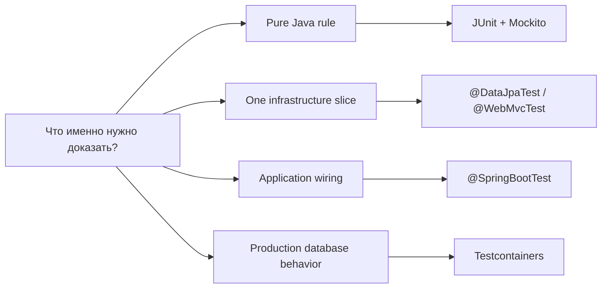

# Spring TestContext and Test Slices

> [!summary] За 30 секунд
> Spring tests надо выбирать по границе, которую требуется доказать. Plain unit test проверяет Java logic без container. TestContext integration test поднимает Spring `ApplicationContext` и применяет listeners, dependency injection, transaction management и context caching. Boot test slice поднимает только выбранный infrastructure layer. `@DataJpaTest` проверяет entities, repositories, JPA mappings и queries; он не является доказательством полного application wiring. `@SpringBootTest` проверяет более широкую интеграцию, но стоит дороже и не заменяет focused tests.

# 1. Главная модель выбора теста



Не существует универсально лучшей test annotation. Есть минимальный test scope, который способен опровергнуть нужный риск.

| Риск | Минимальный полезный тест |
|---|---|
| неправильная ветка business rule | unit test |
| неверный JPA mapping/query | `@DataJpaTest` |
| service transaction + repository interaction | Spring integration test |
| production PostgreSQL syntax/locking | Testcontainers PostgreSQL |
| HTTP serialization/security/filter chain | MVC/WebFlux slice или full web test |
| auto-configuration | `ApplicationContextRunner` или full context |

> Чем шире context, тем больше integration coverage, но тем выше цена запуска и тем хуже локализация причины failure.

# 2. TestContext Framework

Spring TestContext Framework связывает JUnit/TestNG с Spring container.

```text
JUnit Jupiter
    ↓
SpringExtension
    ↓
TestContextManager
    ↓
TestContext
    ↓
TestExecutionListeners
    ├── dependency injection
    ├── transaction management
    ├── SQL scripts
    ├── application events
    └── context dirtiness
```

## Ключевые роли

### `TestContextManager`

Оркестрирует test lifecycle и передаёт события listeners:

```text
before test class
prepare test instance
before each
before test method
after test method
after each
after test class
```

### `TestContext`

Хранит test-specific state:

- merged context configuration;
- current test class/method;
- `ApplicationContext`;
- attributes;
- context cache integration.

### `TestExecutionListener`

Реализует инфраструктурное поведение вокруг test execution. Например, `TransactionalTestExecutionListener` открывает test-managed transaction и по умолчанию откатывает её после test method.

# 3. Unit test против Spring test

## Pure unit test

```java
class PriceCalculatorTest {

    private final PriceCalculator calculator = new PriceCalculator();

    @Test
    void appliesVipDiscount() {
        Money result = calculator.calculate(
                Money.of(1000),
                CustomerType.VIP
        );

        assertThat(result).isEqualTo(Money.of(900));
    }
}
```

Здесь не нужны:

- `@SpringBootTest`;
- `@Autowired`;
- database;
- application properties;
- Spring proxy.

Преимущества:

- миллисекунды;
- deterministic setup;
- точная localization failure;
- легко покрывать edge cases.

## Когда unit test недостаточен

Unit test с mock repository не доказывает:

- корректность JPQL;
- column constraints;
- transaction rollback;
- proxy interception;
- serialization;
- database isolation;
- Spring configuration.

# 4. `@SpringJUnitConfig`

Для Spring Framework без Boot:

```java
@SpringJUnitConfig(TestConfiguration.class)
class PaymentServiceIntegrationTest {

    @Autowired
    PaymentService service;

    @Test
    void createsPayment() {
        // Spring context is available
    }
}
```

Это composed annotation:

```text
@ExtendWith(SpringExtension.class)
+
@ContextConfiguration
```

Полезно, когда нужен контролируемый небольшой context без Boot auto-configuration.

# 5. `@SpringBootTest`

```java
@SpringBootTest
class OrderApplicationIntegrationTest {

    @Autowired
    OrderService orderService;

    @Test
    void createsOrderThroughRealServiceGraph() {
        // full Boot application context
    }
}
```

Он обычно загружает main application configuration и Boot auto-configuration.

## Что он доказывает

- application beans совместимы;
- conditional auto-configurations выбраны;
- service/repository/event graph собирается;
- properties binding работает;
- proxy infrastructure присутствует.

## Чего он не гарантирует автоматически

- реальный web server, если не выбран соответствующий `webEnvironment`;
- production database, если test datasource заменён;
- качество отдельных business rules;
- отсутствие N+1;
- commit-time behavior, если test transaction откатывается до настоящего commit.

# 6. Boot test slices

Slice test поднимает ограниченную часть infrastructure.

Примеры:

| Annotation | Focus |
|---|---|
| `@DataJpaTest` | JPA entities, repositories, mapping, queries |
| `@JdbcTest` | JDBC infrastructure |
| `@WebMvcTest` | MVC controllers, converters, filters selected for MVC |
| `@WebFluxTest` | reactive web layer |
| `@JsonTest` | JSON serialization |
| `@RestClientTest` | REST client layer |

Модель:

```text
full application graph
        ↓ type filtering
selected slice
        ↓
smaller context + targeted auto-configuration
```

Slice не является «урезанным production startup test». Он должен проверять конкретный layer contract.

# 7. `@DataJpaTest`

```java
@DataJpaTest
class CustomerRepositoryTest {

    @Autowired
    CustomerRepository repository;

    @Autowired
    TestEntityManager entityManager;
}
```

По умолчанию Boot 2.7:

- сканирует `@Entity`;
- создаёт Spring Data JPA repositories;
- применяет JPA/Hibernate auto-configuration;
- конфигурирует embedded database, если она доступна;
- создаёт `TestEntityManager`;
- делает tests transactional;
- откатывает transaction после каждого test;
- не загружает обычные service/components без явного import.

## Что проверять в `@DataJpaTest`

- mapping;
- unique/not-null/FK constraints;
- derived queries;
- JPQL/native queries;
- projections;
- entity graphs;
- cascades/orphan removal;
- dirty checking;
- optimistic versioning;
- SQL count.

## Что не следует считать доказанным

- service orchestration;
- security;
- messaging;
- full transaction propagation graph;
- application startup;
- real PostgreSQL dialect, если используется H2.

# 8. `TestEntityManager`

`TestEntityManager` — test-oriented facade над JPA `EntityManager`.

```java
PurchaseOrder saved = entityManager.persistFlushFind(order);
```

Полезные operations:

- `persist()`;
- `persistAndFlush()`;
- `persistFlushFind()`;
- `flush()`;
- `clear()`;
- `find()`;
- `getId()`.

## Почему `flush()` и `clear()` важны

Плохой тест:

```java
repository.save(order);

assertThat(repository.findById(order.getId())).contains(order);
```

Оба вызова могут обслуживаться одним persistence context.

Более сильный тест:

```java
repository.save(order);
entityManager.flush();
entityManager.clear();

PurchaseOrder reloaded = repository.findById(order.getId()).orElseThrow();
assertThat(reloaded.getStatus()).isEqualTo("NEW");
```

Теперь test доказывает round-trip через database.

# 9. False positive из-за отсутствия flush

```java
@Test
void duplicateOrderNumberMustFail() {
    repository.save(new PurchaseOrder("ORD-1"));
    repository.save(new PurchaseOrder("ORD-1"));
}
```

Test может завершиться до SQL execution, если Hibernate отложил statement до flush.

Правильно:

```java
assertThatThrownBy(repository::flush)
        .isInstanceOf(DataIntegrityViolationException.class);
```

Spring reference прямо рекомендует manual flush в ORM integration tests, чтобы не получить false positive.

# 10. Test-managed transaction

```java
@DataJpaTest
class RepositoryTest {
    // each test method runs in a test-managed transaction
}
```

Путь:

```text
TransactionalTestExecutionListener
    ↓
begin test transaction
    ↓
@BeforeEach
    ↓
@Test
    ↓
@AfterEach
    ↓
rollback by default
```

## Важное различие

```text
test-managed transaction
≠
application-managed transaction
≠
Spring-managed service transaction
```

Application code с `REQUIRED` обычно присоединится к test transaction. `REQUIRES_NEW` может создать независимую transaction и закоммитить данные, которые rollback test transaction не удалит.

# 11. Ограничения `@Transactional` на test method

Test-managed transactions поддерживают не все attributes так же, как production interceptor.

Практически значимые правила:

- default rollback — да;
- `@Commit` / `@Rollback(false)` — да;
- transaction manager qualifier — да;
- `NOT_SUPPORTED` и `NEVER` — специальные способы отключить test transaction;
- isolation/readOnly/timeout/rollbackFor не следует считать эквивалентными production semantics для test-managed transaction;
- для explicit outcome используется `TestTransaction`.

# 12. `TestTransaction`

```java
@Test
@Transactional
void verifiesRealCommit() {
    repository.save(new PurchaseOrder("ORD-COMMIT"));

    TestTransaction.flagForCommit();
    TestTransaction.end();

    assertThat(TestTransaction.isActive()).isFalse();
    assertThat(repository.findByOrderNumber("ORD-COMMIT")).isPresent();

    TestTransaction.start();
}
```

Operations:

- `isActive()`;
- `flagForCommit()`;
- `flagForRollback()`;
- `end()`;
- `start()`.

Используется для:

- commit-time constraint;
- after-commit listener;
- committed database state;
- lifecycle outside test transaction.

# 13. `@BeforeTransaction` и `@AfterTransaction`

```java
@BeforeTransaction
void verifyInitialState() {
    assertThat(repository.count()).isZero();
}

@AfterTransaction
void verifyFinalState() {
    // runs after rollback or commit
}
```

В отличие от `@BeforeEach`/`@AfterEach`, эти callbacks выполняются вне test-managed transaction.

# 14. `@Commit` и `@Rollback`

```java
@Test
@Commit
void publishesCommittedState() {
    repository.save(new PurchaseOrder("ORD-1"));
}
```

```java
@Test
@Rollback
void remainsIsolated() {
    repository.save(new PurchaseOrder("ORD-2"));
}
```

Использовать `@Commit` нужно точечно. Массовый commit делает suite order-dependent и требует explicit cleanup.

# 15. Preemptive timeout trap

Spring transaction context привязан к текущему thread.

Опасно:

```java
assertTimeoutPreemptively(Duration.ofSeconds(2), () -> {
    repository.save(order);
});
```

JUnit может выполнить lambda в другом thread:

```text
test thread: test transaction active
worker thread: no test transaction
```

Worker writes могут закоммититься, хотя test transaction откатится.

Безопаснее использовать non-preemptive timeout или infrastructure-specific timeout.

# 16. Context cache

Spring кеширует `ApplicationContext` между test classes, если merged context configuration одинакова.

Cache key зависит от таких факторов, как:

- configuration classes;
- active profiles;
- property sources;
- context customizers;
- mock beans;
- parent context;
- resource locations.

## Почему suite становится медленным

```text
Test A: profile=test-a
Test B: profile=test-b
Test C: unique @MockBean set
Test D: unique inline properties
        ↓
4 different cache keys
        ↓
4 context startups
```

# 17. `@DirtiesContext`

```java
@DirtiesContext
class MutableGlobalStateTest {
}
```

Annotation удаляет context из cache и заставляет следующий compatible test создать новый context.

Использовать только когда test действительно меняет context-level state:

- singleton mutable state;
- environment mutation;
- dynamically registered beans;
- embedded server lifecycle corruption.

Не использовать как default cleanup database. Для database нужны transactions, truncation или isolated schema.

# 18. `@MockBean` trade-off

```java
@WebMvcTest(OrderController.class)
class OrderControllerTest {

    @MockBean
    OrderService orderService;
}
```

Плюсы:

- focused layer;
- быстрый setup;
- controlled collaborator behavior.

Минусы:

- mock участвует в context cache key;
- легко замокать слишком много;
- test может подтвердить controller, которого production service contract уже не удовлетворяет;
- не проверяется proxy/transaction behavior mocked bean.

# 19. `@Import` в slice test

Если slice должен включить один supporting component:

```java
@DataJpaTest
@Import(OrderQueryService.class)
class OrderQueryServiceJpaTest {
}
```

Это лучше, чем переходить на `@SpringBootTest` только ради одного bean.

Но если service использует messaging, security, cache и несколько repositories, slice перестаёт быть естественной границей — тогда нужен отдельный integration test.

# 20. `@Sql`

```java
@Sql("/sql/orders-before.sql")
@Test
void findsOverdueOrders() {
}
```

Полезно для:

- deterministic fixtures;
- complex database state;
- cleanup;
- database-specific DDL/DML.

Нужно понимать execution phase и transaction mode. SQL script может выполняться внутри test transaction или в isolated transaction, в зависимости от configuration.

# 21. Application events testing

```java
@RecordApplicationEvents
@SpringBootTest
class OrderEventsTest {

    @Autowired
    ApplicationEvents events;

    @Test
    void publishesOrderCreated() {
        service.create("ORD-1");

        assertThat(events.stream(OrderCreated.class)).hasSize(1);
    }
}
```

Это доказывает in-process publication, но не durable broker delivery.

# 22. Test pyramid без догматизма

```text
many focused unit tests
    ↓
selected slice tests
    ↓
service integration tests
    ↓
real database/container tests
    ↓
few end-to-end tests
```

Цель не максимизировать количество unit tests. Цель — закрыть каждый риск самым дешёвым тестом, который способен его обнаружить.

# 23. Production design rules

1. Не использовать `@SpringBootTest` для pure function.
2. Не считать H2 доказательством PostgreSQL semantics.
3. В ORM test использовать `flush()` для SQL/constraint evidence.
4. Использовать `clear()` для database round-trip evidence.
5. Отделять rollback-isolated tests от commit tests.
6. Не использовать preemptive timeouts с thread-bound test transaction.
7. Контролировать context cache fragmentation.
8. Не лечить database state через массовый `@DirtiesContext`.
9. Проверять N+1 statement count, а не глазами в логах.
10. Test name должен описывать invariant, а не вызываемый method.

# 24. Senior interview answer

> Spring TestContext integrates the test framework with Spring's `ApplicationContext`, dependency injection, listeners, context caching and test-managed transactions. I choose the smallest test scope that proves the risk: plain JUnit for domain logic, a slice such as `@DataJpaTest` for repository and mapping behavior, a full Spring context for application wiring and transaction orchestration, and Testcontainers for production database semantics. In JPA tests I force `flush()` to surface deferred SQL errors and use `clear()` before reload to avoid first-level-cache false positives. I also distinguish test-managed rollback from a real commit and use `TestTransaction`, `@Commit` or callbacks outside the transaction when commit behavior matters.

# 25. Memory hooks

```text
Unit test proves logic.
Slice test proves one infrastructure layer.
Full context proves wiring.
Container test proves real dependency behavior.
Flush proves SQL happened.
Clear proves reload happened.
Rollback keeps tests isolated.
Commit proves commit behavior.
DirtiesContext discards context, not database rows.
```
