# Spring Testing Visual Deep Dive

> [!summary]
> Тест должен доказывать конкретный риск на правильной границе. Главные различия: **unit vs Spring context**, **slice vs full context**, **test-managed vs service transaction**, **flush vs commit**, **H2 vs production database**.

# 1. Выбор границы теста

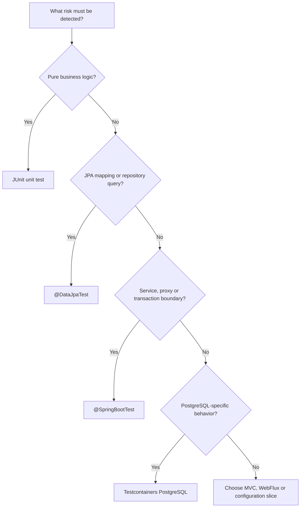

Минимальная граница уменьшает noise, но слишком узкая граница не видит production interaction.

# 2. TestContext lifecycle

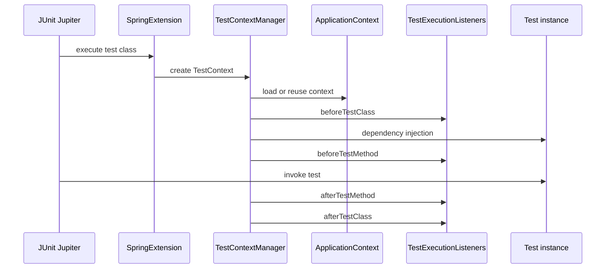

# 3. Context cache

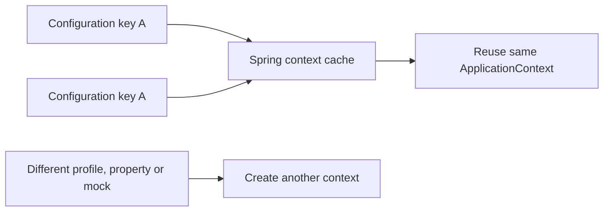

Context cache key может меняться из-за:

- profiles;
- properties;
- mock/spy definitions;
- context customizers;
- configuration classes;
- parent context.

# 4. Почему `@DirtiesContext` дорого

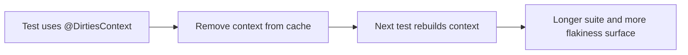

`@DirtiesContext` — инструмент для реально изменённого application context, а не database cleanup.

# 5. `@DataJpaTest` slice

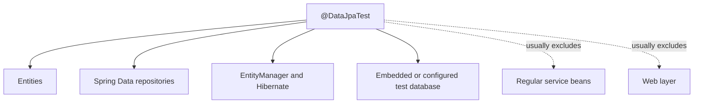

Slice test доказывает repository/JPA boundary, но не full service topology.

# 6. Test-managed transaction

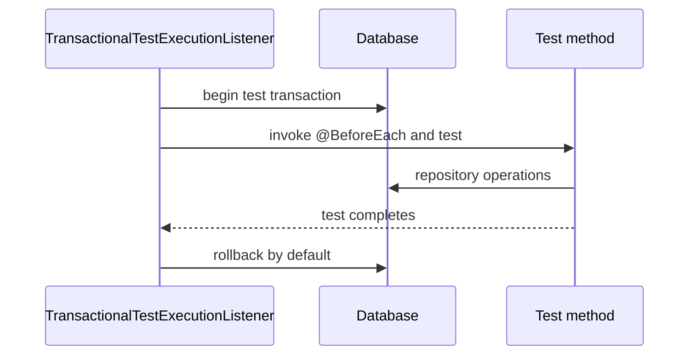

`@Transactional` на test method меняет topology: service может присоединиться к уже существующей test transaction.

# 7. Test transaction vs service transaction

## Test-level transaction

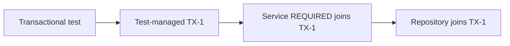

## Production-like caller

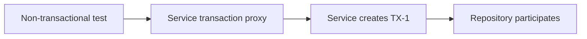

Для проверки реальной service transaction boundary test-level transaction часто нужно убрать.

# 8. `flush()` и false positive

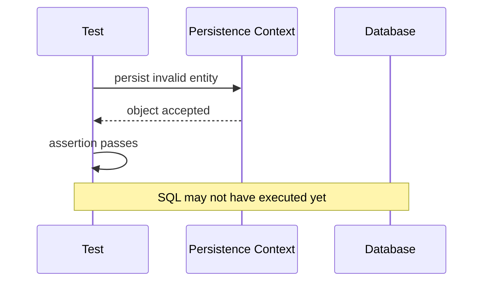

## Stronger test

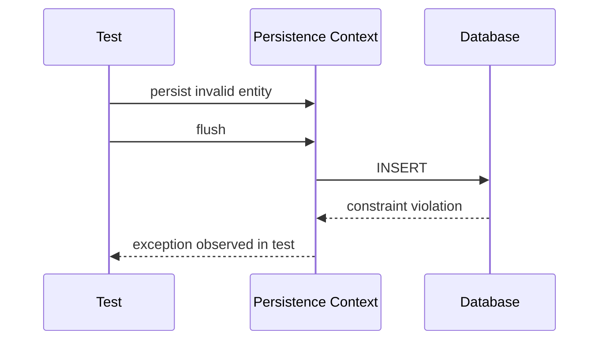

# 9. `clear()` и database round-trip

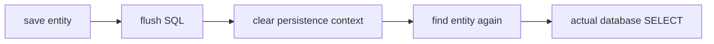

Без `clear()`, repository read может вернуть ту же managed instance и не доказать mapping/database state.

# 10. Commit boundary

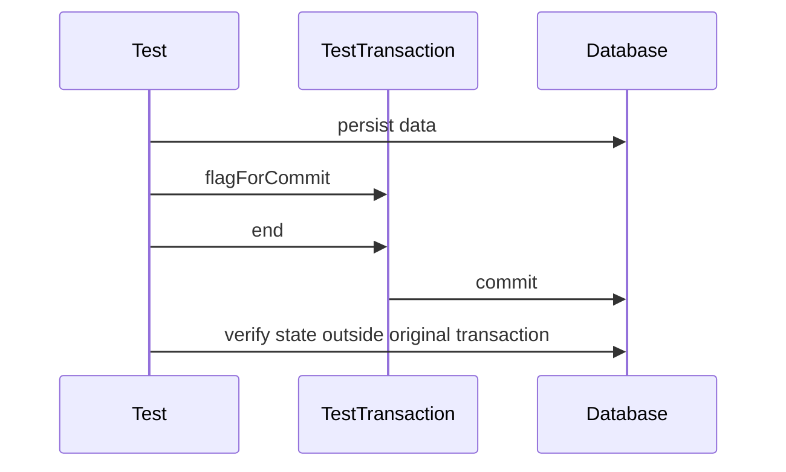

Commit-time constraints, deferred checks и after-commit listeners требуют реального commit, а не только flush.

# 11. `REQUIRES_NEW` inside test

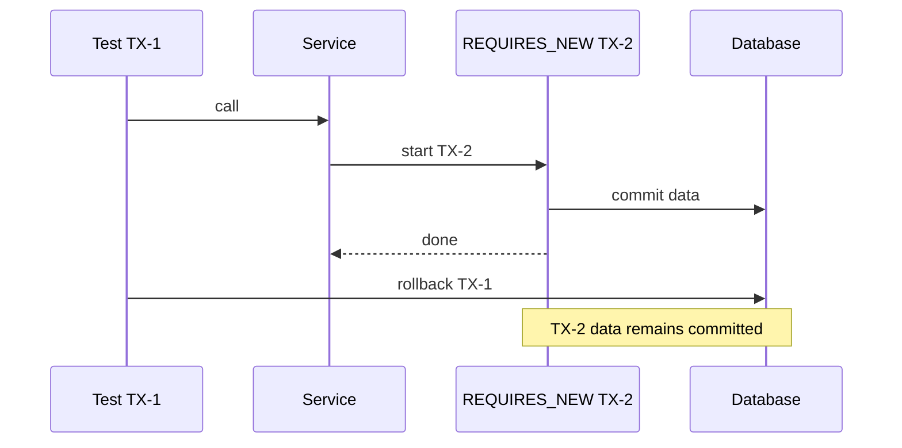

Default test rollback не удаляет independent committed transaction.

# 12. Preemptive timeout and thread boundary

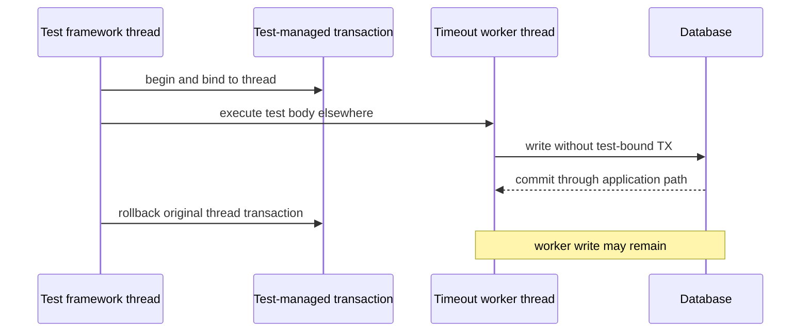

Thread-bound transaction context не переносится автоматически.

# 13. H2 versus PostgreSQL

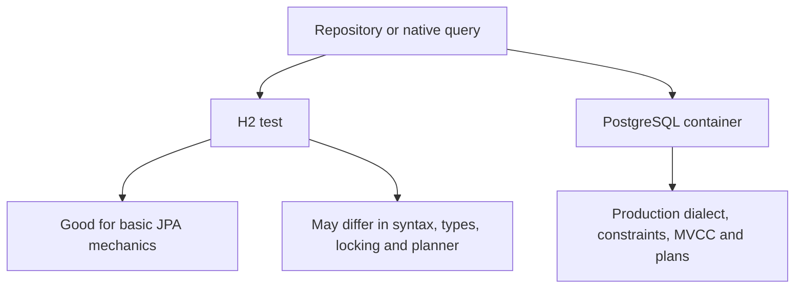

H2 не является эмулятором PostgreSQL во всех аспектах.

# 14. Testcontainers lifecycle

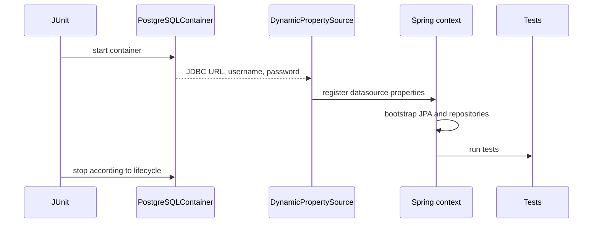

Static container обычно разделяется между methods одного test class; instance container может стартовать для каждого test instance.

# 15. Container and context lifecycle mismatch

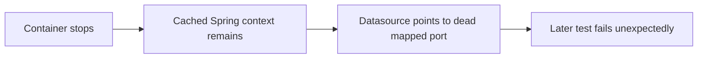

Container ownership должен быть согласован с context cache lifecycle.

# 16. N+1 regression test

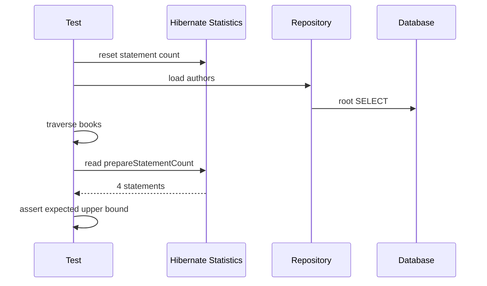

Query-count assertion превращает N+1 из ручной проверки logs в regression test.

# 17. Optimistic-lock test with two contexts

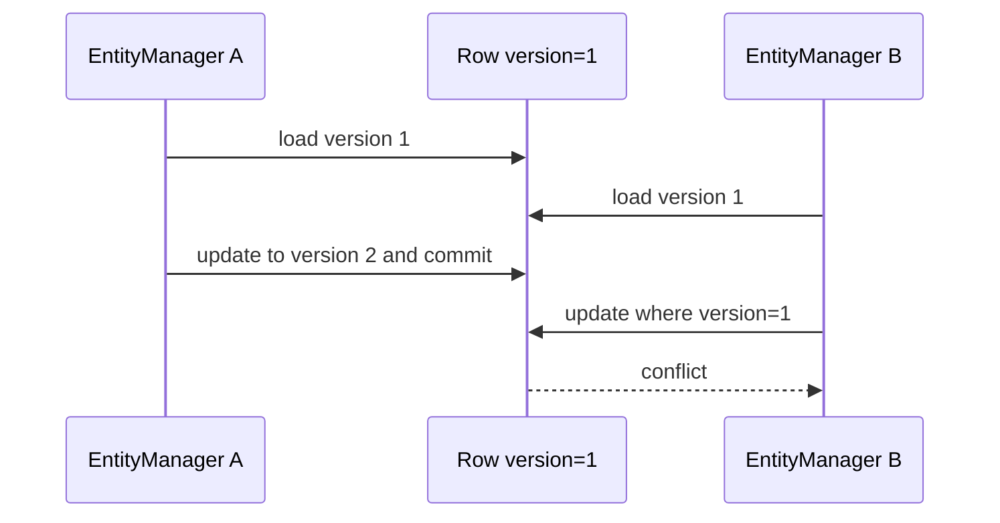

Один EntityManager не создаёт реальную competing transaction model.

# 18. Pessimistic-lock test

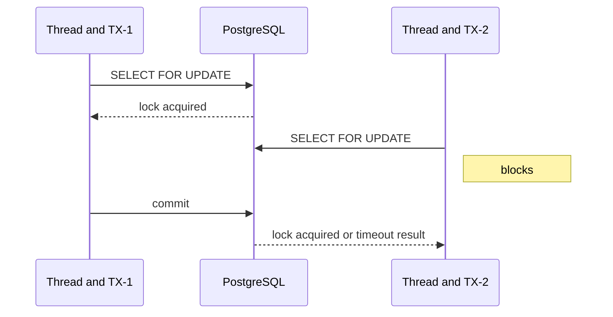

Такой test требует двух threads, двух transactions и real database semantics.

# 19. Migration test

```mermaid
flowchart LR
    Empty["Empty PostgreSQL schema"] --> Migration["Run Flyway or Liquibase"]
    Migration --> Boot["Start application mappings"]
    Boot --> Smoke["Execute repository smoke tests"]
```

`ddl-auto=create-drop` может скрыть broken production migrations.

# 20. Diagnostic decision tree

```mermaid
flowchart TD
    A["Test is green but production fails"] --> B{"Was SQL forced with flush?"}
    B -->|No| B1["Add flush for DB constraint proof"]
    B -->|Yes| C{"Was persistence context cleared?"}
    C -->|No| C1["Reload outside first-level cache"]
    C -->|Yes| D{"Was commit boundary tested?"}
    D -->|No| D1["Use TestTransaction or non-rollback test"]
    D -->|Yes| E{"Correct database engine?"}
    E -->|No| E1["Use PostgreSQL Testcontainers"]
    E -->|Yes| F{"Same transaction topology as production?"}
    F -->|No| F1["Remove test-level transaction or model propagation explicitly"]
    F -->|Yes| G["Inspect concurrency, migrations and context lifecycle"]
```

# 21. Layered suite

```mermaid
flowchart TB
    Unit["Many fast unit tests"] --> Slice["Focused slice tests"]
    Slice --> Full["Service and full-context tests"]
    Full --> PG["PostgreSQL integration tests"]
    PG --> E2E["Few end-to-end tests"]
```

Каждый слой ловит другой класс дефектов. Нельзя заменить все слои только `@SpringBootTest` или только mocks.

# 22. Production case: order persistence

## Risks

- unique constraint appears only on flush;
- service rollback is hidden by test transaction;
- after-commit event never runs;
- H2 accepts query rejected by PostgreSQL;
- N+1 returns after mapping change.

```mermaid
flowchart LR
    Unit["Unit: domain rules"] --> Slice["DataJpaTest: mapping, query, flush and clear"]
    Slice --> Service["SpringBootTest: service proxy and rollback"]
    Service --> Commit["TestTransaction: commit callbacks"]
    Commit --> PG["Testcontainers: PostgreSQL dialect and locking"]
    PG --> Metrics["SQL-count regression"]
```

# 23. Interview explanation

```text
1. Choose the smallest test boundary that proves the risk.
2. @DataJpaTest is a JPA slice, not a full application test.
3. Transactional tests roll back by default and can change service propagation topology.
4. flush proves SQL execution; clear proves database reload; commit proves commit-time behavior.
5. REQUIRES_NEW may survive test rollback.
6. Thread-bound test transactions do not follow preemptive timeout worker threads.
7. H2 proves basic mechanics; PostgreSQL Testcontainers proves production database behavior.
8. Context and container lifecycles must be aligned.
```

# 24. Exercises

1. Write a false-positive constraint test without flush, then fix it.
2. Prove database round-trip with clear and reload.
3. Compare service rollback with and without test-level transaction.
4. Commit through TestTransaction and verify after-commit listener.
5. Show committed `REQUIRES_NEW` data surviving outer test rollback.
6. Run native `ILIKE` only against PostgreSQL container.
7. Add SQL-count assertion for N+1.
8. Reproduce optimistic and pessimistic locking with independent transactions.

## Related materials

- [[Spring TestContext and Test Slices]]
- [[Spring Data JPA Testing with Testcontainers]]
- [[30_CERTIFICATIONS/Spring/2V0-72.22/TEST-B01/TEST-B01 Cards]]
- [[40_PRODUCTION_CASES/Spring/Spring Testing Production Cases]]
- [[50_LABS/Spring/TEST-B01/README]]
