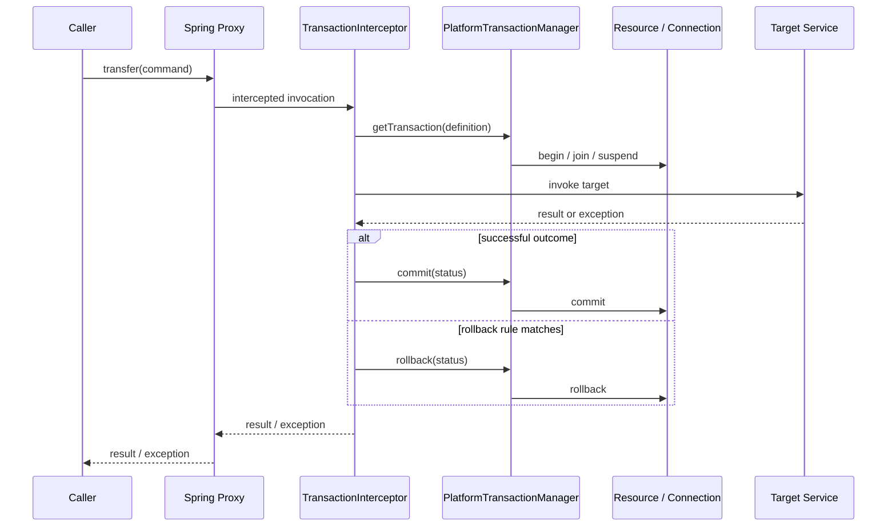
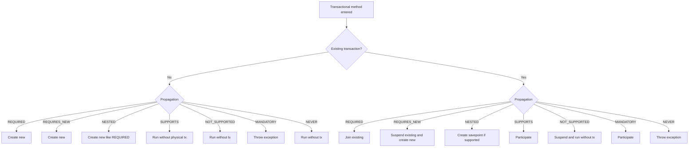

# Spring Transaction Management Deep Dive

> [!summary] За 30 секунд
> `@Transactional` — metadata для transaction interceptor. Внешний вызов входит в Spring proxy, interceptor выбирает `PlatformTransactionManager`, получает или создаёт transaction согласно propagation, вызывает target и затем commit/rollback. Главная сложность — отличать **logical transaction scope** метода от **physical transaction** database connection. `REQUIRED` часто объединяет несколько logical scopes в одну physical transaction; `REQUIRES_NEW` создаёт независимую physical transaction; `NESTED` обычно использует savepoint внутри одной physical transaction. Default rollback выполняется для `RuntimeException` и `Error`, но не для checked exception. Imperative transaction обычно привязана к текущему thread и не переносится в `@Async` автоматически.

---

# 1. Главная ментальная модель



Нужно всегда различать шесть участников:

1. **Caller** — откуда пришёл вызов.
2. **Proxy** — пересёк ли вызов proxy boundary.
3. **TransactionInterceptor** — прочитал transaction metadata.
4. **TransactionManager** — управляет конкретным типом ресурса.
5. **Resource** — JDBC connection, JPA EntityManager или другой transactional resource.
6. **Target method** — business operation.

> [!danger] Аннотация сама по себе не открывает transaction
> Transaction boundary появляется только если invocation проходит через настроенную transaction infrastructure.

---

# 2. Что делает `@Transactional`

```java
@Service
public class TransferService {

    private final AccountRepository accounts;

    public TransferService(AccountRepository accounts) {
        this.accounts = accounts;
    }

    @Transactional
    public void transfer(
            long sourceId,
            long targetId,
            BigDecimal amount
    ) {
        Account source = accounts.getRequired(sourceId);
        Account target = accounts.getRequired(targetId);

        source.withdraw(amount);
        target.deposit(amount);

        accounts.save(source);
        accounts.save(target);
    }
}
```

`@Transactional` описывает policy:

```text
propagation
isolation
readOnly
timeout
rollback rules
transaction manager qualifier
```

Default policy Spring 5.3:

```text
propagation = REQUIRED
isolation   = DEFAULT
readOnly    = false
timeout     = manager default
rollback    = RuntimeException and Error
commit      = checked Exception by default
```

---

# 3. Logical scope против physical transaction

Это центральная тема всего модуля.

## Logical transaction scope

Каждый intercepted transactional method создаёт собственную logical scope.

```java
@Transactional
public void placeOrder() {
    paymentService.reserve();
    stockService.reserve();
}
```

Если оба inner methods также `@Transactional(REQUIRED)`, conceptual scopes выглядят так:

```text
logical scope: OrderService.placeOrder
    logical scope: PaymentService.reserve
    logical scope: StockService.reserve
```

## Physical transaction

Physical transaction — реальная transaction ресурса:

```text
JDBC connection transaction
JPA EntityManager transaction
JTA transaction
```

При `REQUIRED` три logical scopes обычно используют одну physical transaction:

```text
Order logical scope ──────┐
Payment logical scope ────┼── one physical DB transaction
Stock logical scope ──────┘
```

## Почему различие важно

Inner logical scope может установить `rollback-only` для общей physical transaction.

Outer method может поймать exception и попытаться commit, но transaction уже обречена на rollback.

Результат:

```text
UnexpectedRollbackException
```

---

# 4. Declarative transaction pipeline

```text
BeanDefinition
    ↓
transaction advisor registered
    ↓
bean processed by auto-proxy creator
    ↓
proxy published
    ↓
external invocation
    ↓
TransactionInterceptor
    ↓
TransactionAttributeSource reads @Transactional
    ↓
PlatformTransactionManager.getTransaction(...)
    ↓
target invocation
    ↓
commit / rollback
```

## Self-invocation

```java
@Service
public class PaymentService {

    public void processBatch(List<Payment> payments) {
        for (Payment payment : payments) {
            processOne(payment);
        }
    }

    @Transactional(propagation = Propagation.REQUIRES_NEW)
    public void processOne(Payment payment) {
        repository.save(payment);
    }
}
```

Фактический path:

```text
caller
  ↓
proxy.processBatch()
  ↓
target.processBatch()
  ↓
this.processOne()
  ↓
no second proxy crossing
  ↓
REQUIRES_NEW ignored
```

Исправление:

```java
@Service
public class SinglePaymentService {

    @Transactional(propagation = Propagation.REQUIRES_NEW)
    public void processOne(Payment payment) {
        repository.save(payment);
    }
}
```

```java
@Service
public class PaymentBatchService {

    private final SinglePaymentService singlePaymentService;

    public void processBatch(List<Payment> payments) {
        for (Payment payment : payments) {
            singlePaymentService.processOne(payment);
        }
    }
}
```

---

# 5. `PlatformTransactionManager`

Центральный imperative contract:

```java
public interface PlatformTransactionManager {

    TransactionStatus getTransaction(TransactionDefinition definition);

    void commit(TransactionStatus status);

    void rollback(TransactionStatus status);
}
```

Типичные implementations:

| Manager | Resource |
|---|---|
| `DataSourceTransactionManager` | JDBC `DataSource` |
| `JpaTransactionManager` | JPA `EntityManagerFactory` |
| `JtaTransactionManager` | distributed/JTA environment |
| custom manager | application-specific resource |

Transaction manager отвечает за:

- create/join/suspend transaction;
- bind resource к execution context;
- commit/rollback;
- savepoints, если поддерживаются;
- transaction synchronization lifecycle.

---

# 6. Propagation — общий decision tree



## Propagation matrix

| Propagation | Existing tx | No existing tx |
|---|---|---|
| `REQUIRED` | join | create |
| `REQUIRES_NEW` | suspend + create independent | create |
| `NESTED` | savepoint in current physical tx | create |
| `SUPPORTS` | participate | non-transactional execution |
| `MANDATORY` | participate | exception |
| `NOT_SUPPORTED` | suspend | non-transactional execution |
| `NEVER` | exception | non-transactional execution |

---

# 7. `REQUIRED`

Default propagation.

```java
@Transactional
public void createOrder(CreateOrderCommand command) {
    orderRepository.insert(command.order());
    paymentService.reserve(command.payment());
    inventoryService.reserve(command.items());
}
```

Inner services:

```java
@Transactional
public void reserve(Payment payment) {
    paymentRepository.insertReservation(payment);
}
```

```text
createOrder logical scope
    ↓ joins
payment reserve logical scope
    ↓ joins
inventory reserve logical scope
    ↓
one physical transaction
```

## `UnexpectedRollbackException`

```java
@Transactional
public void createOrder(CreateOrderCommand command) {
    orderRepository.insert(command.order());

    try {
        paymentService.reserve(command.payment());
    } catch (PaymentRejectedException error) {
        log.warn("Payment failed, continue as pending", error);
    }

    orderRepository.markPending(command.orderId());
}
```

Inner service:

```java
@Transactional
public void reserve(Payment payment) {
    paymentRepository.insertReservation(payment);
    throw new PaymentRejectedException();
}
```

Sequence:

```text
outer REQUIRED starts physical tx
    ↓
inner REQUIRED joins same physical tx
    ↓
inner RuntimeException
    ↓
transaction marked rollback-only
    ↓
outer catches exception
    ↓
outer returns normally
    ↓
commit requested
    ↓
actual rollback
    ↓
UnexpectedRollbackException
```

## Почему exception появляется в конце

Outer scope не должна получить ложное впечатление, что commit состоялся.

## Исправления

1. Не ловить exception, если вся operation должна rollback.
2. Использовать другой business flow без exception-driven partial success.
3. Применить `REQUIRES_NEW`, если inner operation действительно независима.
4. Применить `NESTED`, если нужна partial rollback через savepoint и manager это поддерживает.
5. Записывать failure после rollback через отдельную transaction.

---

# 8. `REQUIRES_NEW`

```java
@Service
public class AuditService {

    @Transactional(propagation = Propagation.REQUIRES_NEW)
    public void record(AuditRecord record) {
        auditRepository.insert(record);
    }
}
```

Outer flow:

```java
@Transactional
public void transfer(TransferCommand command) {
    accounts.transfer(command);
    auditService.record(AuditRecord.started(command));
    fraudClient.verify(command);
}
```

Sequence:

```text
outer physical transaction TX-1 starts
    ↓
TX-1 suspended
    ↓
inner physical transaction TX-2 starts
    ↓
TX-2 commits
    ↓
TX-1 resumes
    ↓
outer later rolls back
```

Result:

```text
audit row can remain committed
business transfer can roll back
```

## `REQUIRES_NEW` не является savepoint

```text
REQUIRES_NEW = independent physical transaction
NESTED       = same physical transaction + savepoint
```

## Connection pool risk

Outer transaction удерживает connection. Inner `REQUIRES_NEW` требуется ещё одна connection.

```text
50 request threads
  each holds outer connection
  each requests inner connection
  pool size = 50
        ↓
all threads wait forever or timeout
```

Rule of thumb:

```text
pool must account for simultaneous outer + inner resource demand
```

Но простое `threads + 1` не всегда достаточно: нужно учитывать глубину nesting, parallel branches и другие consumers pool.

## Когда применять

- audit record должен жить независимо;
- idempotency claim должен commit до long business step;
- failure journal должен сохраниться после rollback outer flow;
- отдельная short transaction для lock acquisition.

## Когда не применять

- как случайное средство «починить rollback»;
- внутри большого loop без pool analysis;
- когда data invariants требуют atomic commit вместе с outer operation;
- для имитации distributed transaction.

---

# 9. `NESTED`

Обычно использует savepoint в одной physical JDBC transaction.

```java
@Transactional
public void importFile(List<Row> rows) {
    for (Row row : rows) {
        try {
            rowImporter.importOne(row);
        } catch (InvalidRowException error) {
            rejectedRows.add(row);
        }
    }
}
```

```java
@Transactional(propagation = Propagation.NESTED)
public void importOne(Row row) {
    repository.insert(row);
    validator.validate(row);
}
```

Conceptual sequence:

```text
physical TX begins
    ↓
savepoint S1
    ↓
row 1 succeeds
    ↓
savepoint S2
    ↓
row 2 fails
    ↓
rollback to S2
    ↓
physical TX continues
    ↓
commit accepted rows
```

## Ограничения

- manager должен поддерживать savepoints;
- JDBC driver/database должны поддерживать savepoints;
- JPA manager behavior требует отдельной проверки;
- lock effects после rollback to savepoint зависят от database;
- self-invocation всё равно bypasses proxy.

## `NESTED` против `REQUIRES_NEW`

| Question | `NESTED` | `REQUIRES_NEW` |
|---|---|---|
| Physical transactions | one | two |
| Mechanism | savepoint | suspend + new tx |
| Inner commit independent? | no | yes |
| Outer rollback removes inner work? | yes | no |
| Extra connection usually needed? | no | yes |
| Support | manager/driver specific | broadly supported by managers that can suspend |

---

# 10. `SUPPORTS`

```java
@Transactional(propagation = Propagation.SUPPORTS, readOnly = true)
public CustomerDto findCustomer(long id) {
    return repository.findDto(id);
}
```

Behavior:

```text
called inside transaction  → participates
called outside transaction → executes without physical transaction
```

Use when operation can benefit from an existing context but does not require one.

Risk:

```text
method behavior may differ depending on caller
```

Examples:

- JPA lazy loading may work inside existing transaction and fail outside;
- transaction synchronization may be active in one call path and absent in another;
- consistent repeatable reads may exist only for some callers.

For strict business invariants `SUPPORTS` is often too permissive.

---

# 11. `MANDATORY`

```java
@Transactional(propagation = Propagation.MANDATORY)
public void appendLedgerEntry(LedgerEntry entry) {
    ledgerRepository.insert(entry);
}
```

Contract:

```text
existing transaction required
otherwise exception
```

Useful when method must never define atomic boundary itself.

Example architecture:

```text
TransferService controls transaction
    ↓
LedgerWriter requires existing transaction
```

This makes accidental non-transactional use fail fast.

---

# 12. `NOT_SUPPORTED`

```java
@Transactional(propagation = Propagation.NOT_SUPPORTED)
public ExternalReport fetchReport() {
    return remoteClient.fetch();
}
```

Behavior:

```text
existing transaction suspended
method runs without transaction
outer transaction resumes later
```

Possible motivation:

- long HTTP call should not hold DB connection and locks;
- operation cannot participate in transaction;
- large read should not inherit outer transactional context.

Danger:

```text
business operation is no longer atomic with surrounding work
```

Better design often separates remote call before or after database transaction rather than relying only on propagation.

---

# 13. `NEVER`

```java
@Transactional(propagation = Propagation.NEVER)
public void invokeNonTransactionalLegacyApi() {
    legacyClient.call();
}
```

Contract:

```text
transaction exists → exception
no transaction     → execute
```

Useful as architectural assertion when accidental transactional invocation is dangerous.

---

# 14. Isolation — что именно изолируется

Isolation управляет тем, какие изменения concurrent transactions могут видеть друг у друга.

## Классические phenomena

### Dirty read

```text
TX-A writes balance=0, not committed
TX-B reads balance=0
TX-A rolls back
TX-B observed value that never existed durably
```

### Non-repeatable read

```text
TX-A reads balance=100
TX-B commits balance=50
TX-A reads same row again and sees 50
```

### Phantom read

```text
TX-A: SELECT count(*) WHERE status='NEW' → 10
TX-B inserts matching row and commits
TX-A repeats query → 11
```

### Lost update

```text
TX-A reads version 5
TX-B reads version 5
TX-A writes value A
TX-B writes value B
TX-A update is lost
```

Lost update is not solved by isolation labels alone in every database/use case. Optimistic locking or explicit locks may be required.

## Spring isolation enum

| Spring isolation | Intent |
|---|---|
| `DEFAULT` | use database/manager default |
| `READ_UNCOMMITTED` | weakest standard level |
| `READ_COMMITTED` | prevents dirty reads |
| `REPEATABLE_READ` | repeated row reads remain stable according to DB semantics |
| `SERIALIZABLE` | strongest standard isolation, transactions behave as if serialized |

> [!warning] Database semantics win
> Spring requests an isolation level. MVCC, predicate locking, serialization failures and exact anomalies depend on the selected database.

## Isolation applies only when a new transaction starts

```java
@Transactional(isolation = Isolation.SERIALIZABLE)
public void inner() {}
```

Если method с `REQUIRED` joins existing transaction, local isolation declaration обычно не создаёт новый level.

```text
outer READ_COMMITTED
    ↓
inner REQUIRED + SERIALIZABLE
    ↓
inner joins outer physical transaction
    ↓
actual isolation remains outer transaction isolation
```

Можно включить strict validation существующей transaction в manager, чтобы mismatch не игнорировался молча.

---

# 15. Isolation examples из банковского домена

## Balance transfer

Плохой вариант:

```java
@Transactional
public void withdraw(long accountId, BigDecimal amount) {
    BigDecimal balance = jdbc.queryForObject(
            "select balance from account where id = ?",
            BigDecimal.class,
            accountId
    );

    if (balance.compareTo(amount) < 0) {
        throw new InsufficientFundsException();
    }

    jdbc.update(
            "update account set balance = ? where id = ?",
            balance.subtract(amount),
            accountId
    );
}
```

Два concurrent requests могут прочитать один balance.

Варианты защиты:

### Pessimistic lock

```sql
select balance
from account
where id = ?
for update
```

### Atomic conditional update

```sql
update account
set balance = balance - :amount
where id = :id
  and balance >= :amount
```

Проверить affected rows.

### Optimistic locking

```sql
update account
set balance = :newBalance,
    version = version + 1
where id = :id
  and version = :expectedVersion
```

Isolation — лишь часть concurrency design.

---

# 16. Rollback rules

Default:

```text
RuntimeException → rollback
Error            → rollback
checked Exception → commit
```

## Checked exception trap

```java
@Transactional
public void importStatement(Path file) throws IOException {
    repository.markImportStarted(file.toString());
    parser.parse(file); // throws IOException
}
```

По default rule transaction может commit `markImportStarted`.

Исправление:

```java
@Transactional(rollbackFor = IOException.class)
public void importStatement(Path file) throws IOException {
    repository.markImportStarted(file.toString());
    parser.parse(file);
}
```

## `noRollbackFor`

```java
@Transactional(noRollbackFor = NotificationRejectedException.class)
public void completePayment(Payment payment) {
    repository.markCompleted(payment.id());
    notificationGateway.notify(payment);
}
```

Это опасный design, если exception действительно означает нарушение atomic invariant.

## Type rules предпочтительнее pattern rules

```java
rollbackFor = BusinessCheckedException.class
```

лучше, чем широкое имя-pattern, которое может случайно совпасть с другими exception classes.

## Catching exception

```java
@Transactional
public void service() {
    try {
        repository.insert();
        riskyOperation();
    } catch (RuntimeException error) {
        log.warn("ignored", error);
    }
}
```

Transaction interceptor видит normal return. Если underlying resource не пометил transaction rollback-only, commit возможен.

Rules:

1. Не проглатывать exception без осознанной consistency policy.
2. Если catch нужен — решить, следует ли вызвать `setRollbackOnly()`.
3. Лучше выразить recoverable failure как business result, если rollback не нужен.

Programmatic marker:

```java
TransactionAspectSupport
        .currentTransactionStatus()
        .setRollbackOnly();
```

Использовать осторожно: business code связывается со Spring transaction infrastructure.

---

# 17. `readOnly=true`

```java
@Transactional(readOnly = true)
public AccountView account(long id) {
    return repository.findView(id);
}
```

`readOnly` — hint/optimization contract, а не универсальная compile-time защита от writes.

Возможные effects зависят от manager/provider:

- JDBC connection read-only hint;
- JPA/Hibernate flush behavior optimization;
- routing to read replica в custom infrastructure;
- validation by database/driver in some environments.

Не следует утверждать:

```text
readOnly=true всегда гарантированно запрещает INSERT/UPDATE
```

## Read-only mismatch

Inner read-write `REQUIRED` method может join outer read-only transaction. Без strict validation mismatch может быть silently inherited.

---

# 18. Timeout

```java
@Transactional(timeout = 5)
public void recalculatePortfolio() {
    // database work
}
```

Timeout semantics зависят от manager/resource.

Не путать:

```text
transaction timeout
HTTP client timeout
lock timeout
statement timeout
socket timeout
```

Production operation часто требует отдельной настройки всех relevant timeouts.

---

# 19. Multiple transaction managers

Пример приложения:

```text
coreDataSource       → coreTransactionManager
reportingDataSource  → reportingTransactionManager
```

```java
@Transactional(transactionManager = "coreTransactionManager")
public void updateAccount(Account account) {
    coreRepository.save(account);
}
```

```java
@Transactional(transactionManager = "reportingTransactionManager")
public void rebuildReport(Report report) {
    reportingRepository.save(report);
}
```

## Два manager не создают автоматическую atomicity

```java
@Transactional("coreTransactionManager")
public void operation() {
    coreRepository.save();
    reportingRepository.save();
}
```

Если reporting repository использует другой manager/resource, single annotation не превращает две local transactions в distributed atomic transaction.

Варианты:

- JTA/XA, если оправдано;
- Saga;
- outbox/inbox;
- eventual consistency;
- redesign ownership boundaries.

---

# 20. Programmatic transactions

## `TransactionTemplate`

```java
@Service
public class SettlementService {

    private final TransactionTemplate transactionTemplate;
    private final SettlementRepository repository;

    public SettlementResult settle(SettlementCommand command) {
        ValidationResult validation = validateOutsideTransaction(command);

        return transactionTemplate.execute(status -> {
            Settlement settlement = repository.create(command, validation);

            if (settlement.requiresRollback()) {
                status.setRollbackOnly();
            }

            return SettlementResult.from(settlement);
        });
    }
}
```

Когда полезен:

- transaction должна покрывать только небольшой code block;
- нужно несколько последовательных transactions в одном method;
- boundary зависит от loop/branch;
- нужен explicit `setRollbackOnly()`;
- proxy self-invocation неудобна.

## Небезопасно держать remote I/O внутри transaction

Плохо:

```java
transactionTemplate.execute(status -> {
    repository.lockAccount(id);
    FraudResult result = fraudClient.call(id); // 4 seconds
    repository.update(result);
    return null;
});
```

Лучше:

```text
read/prepare data
    ↓
remote call outside DB transaction
    ↓
short validation-and-write transaction
```

Но между remote call и write состояние может измениться, поэтому нужны version check, idempotency или state machine.

---

# 21. Transaction synchronization callbacks

Transaction lifecycle имеет phases:

```text
transaction active
    ↓
beforeCommit
    ↓
beforeCompletion
    ↓
commit or rollback
    ↓
afterCommit (commit only)
    ↓
afterCompletion(status)
```

Programmatic registration:

```java
TransactionSynchronizationManager.registerSynchronization(
        new TransactionSynchronization() {
            @Override
            public void afterCommit() {
                cacheInvalidator.evict(accountId);
            }
        }
);
```

## Важная граница

`afterCommit()` означает, что DB commit уже состоялся. Если callback упал:

```text
database commit не отменяется
```

Поэтому after-commit callback не даёт durable guarantee внешней доставки.

## Проверка активности

```java
if (TransactionSynchronizationManager.isSynchronizationActive()) {
    // register callback
} else {
    // explicit fallback policy
}
```

---

# 22. `@TransactionalEventListener`

```java
public record PaymentCompletedEvent(long paymentId) {}
```

Publisher:

```java
@Transactional
public void complete(long paymentId) {
    repository.markCompleted(paymentId);
    events.publishEvent(new PaymentCompletedEvent(paymentId));
}
```

Listener:

```java
@TransactionalEventListener(phase = TransactionPhase.AFTER_COMMIT)
public void onPaymentCompleted(PaymentCompletedEvent event) {
    cache.evict(event.paymentId());
}
```

Phases:

| Phase | Meaning |
|---|---|
| `BEFORE_COMMIT` | before commit attempt |
| `AFTER_COMMIT` | after successful commit |
| `AFTER_ROLLBACK` | after rollback |
| `AFTER_COMPLETION` | after either outcome |

## `fallbackExecution`

Без active transaction listener обычно не выполняется.

```java
@TransactionalEventListener(fallbackExecution = true)
```

разрешает fallback execution, но меняет semantic contract: listener может быть вызван и без transaction.

## Critical warning

`AFTER_COMMIT` listener не является durable messaging.

Failure sequence:

```text
DB commit succeeds
    ↓
process crashes before listener sends Kafka message
    ↓
business data committed
message absent
```

Для durable publication нужен outbox или другой надёжный protocol.

---

# 23. Database и cache ordering

## Ошибка: cache update до DB commit

```java
@Transactional
@CachePut(cacheNames = "account", key = "#result.id")
public AccountDto update(UpdateAccountCommand command) {
    Account saved = repository.update(command);
    return mapper.toDto(saved);
}
```

Advisor ordering и cache-manager transaction awareness определяют момент cache put.

Опасная sequence:

```text
DB update executed but not committed
    ↓
cache receives new value
    ↓
DB commit fails
    ↓
cache contains value that never committed
```

Варианты:

1. Transaction-aware cache operation deferred until completion.
2. Explicit after-commit eviction.
3. Evict instead of put, then reload from source of truth.
4. Versioned cache values.
5. Outbox invalidation event for distributed L1 caches.

## Evict after commit

```java
@Transactional
public AccountDto update(UpdateAccountCommand command) {
    Account saved = repository.update(command);

    domainEvents.publishEvent(
            new AccountChangedEvent(saved.id())
    );

    return mapper.toDto(saved);
}
```

```java
@TransactionalEventListener(phase = TransactionPhase.AFTER_COMMIT)
public void invalidate(AccountChangedEvent event) {
    cache.evict(event.accountId());
}
```

Это защищает от eviction до rollback, но не гарантирует delivery при process crash.

---

# 24. Thread boundary и `@Async`

Imperative Spring transaction обычно thread-bound.

```java
@Transactional
public void createOrder(Order order) {
    repository.save(order);
    notificationService.sendAsync(order.id());
}
```

```java
@Async
public void sendAsync(long orderId) {
    // different thread
}
```

Async method не продолжает caller transaction автоматически.

```text
request thread → TX-1
worker thread  → no TX-1
```

Если async method требует transaction:

```java
@Async
@Transactional
public void sendAsync(long orderId) {
    // new transaction on worker thread
}
```

Это отдельная transaction.

## Lazy JPA entity trap

```java
@Async
public void process(Order order) {
    order.getItems().size();
}
```

Caller transaction уже завершена; lazy collection может быть detached.

Передавать лучше:

```text
immutable command / IDs / DTO
```

а worker сам загружает нужные данные в своей transaction.

---

# 25. Remote calls внутри transaction

```java
@Transactional
public void approveLoan(long loanId) {
    Loan loan = repository.lock(loanId);
    Score score = scoringClient.calculate(loan.customerId());
    loan.approve(score);
}
```

Проблемы:

- DB connection удерживается во время network wait;
- locks живут дольше;
- timeout remote service превращается в transaction timeout;
- retry remote call может повторить side effect;
- connection pool насыщается.

Более устойчивый state-machine design:

```text
TX-1: mark SCORING_REQUESTED + outbox event
    ↓
external scoring
    ↓
TX-2: validate current version + apply result
```

---

# 26. Transactional Outbox — preview

Dual-write problem:

```java
@Transactional
public void createOrder(Order order) {
    orderRepository.save(order);
    kafkaTemplate.send("order-created", order.id());
}
```

Возможные failures:

```text
DB commit succeeds, Kafka send fails
Kafka send succeeds, DB commit fails
process crashes between operations
```

Outbox model:

```text
one DB transaction
    ├── business row
    └── outbox row

separate relay
    ↓
publish message
    ↓
mark outbox delivered
```

Подробнее: [[Transactional Outbox and Commit Boundaries]].

---

# 27. Transaction testing

## Test-managed transaction trap

```java
@Transactional
@Test
void createsAccount() {
    service.createAccount();
}
```

Test framework может rollback test transaction после method. Это полезно для isolation, но может скрыть production behavior:

- `REQUIRES_NEW` может commit независимо;
- after-commit listener может не сработать до конца test;
- false positive, если test никогда не flushes constraints;
- preemptive timeout может выполнить code в другом thread.

## Проверять commit-sensitive behavior явно

Использовать:

- `TransactionTemplate`;
- explicit commit in integration test;
- separate test context;
- `TestTransaction` utilities;
- real unique constraint/locking scenario;
- concurrent test с controlled latches.

## Не тестировать transaction только по аннотации

Проверять наблюдаемое поведение:

```text
which rows committed?
which rows rolled back?
how many physical transactions started?
which thread executed?
was afterCommit invoked?
```

---

# 28. Observability и диагностика

## Runtime proxy

```java
AopUtils.isAopProxy(service);
AopUtils.isJdkDynamicProxy(service);
AopUtils.isCglibProxy(service);
AopUtils.getTargetClass(service);
```

## Advisor chain

```java
if (service instanceof Advised) {
    Advisor[] advisors = ((Advised) service).getAdvisors();
}
```

## Transaction state

```java
TransactionSynchronizationManager.isActualTransactionActive();
TransactionSynchronizationManager.getCurrentTransactionName();
TransactionSynchronizationManager.isCurrentTransactionReadOnly();
TransactionSynchronizationManager.getCurrentTransactionIsolationLevel();
```

Использовать для diagnostics, а не как повсеместный business API.

## Logging

Полезные категории:

```text
org.springframework.transaction
org.springframework.jdbc.datasource.DataSourceTransactionManager
org.springframework.orm.jpa.JpaTransactionManager
org.hibernate.SQL
org.hibernate.engine.transaction
```

## Metrics

- transaction count;
- commit count;
- rollback count;
- transaction duration;
- active connection count;
- pool pending threads;
- deadlocks;
- lock wait time;
- `UnexpectedRollbackException` count;
- outbox backlog;
- after-commit callback failures.

---

# 29. Production decision table

| Need | Preferred starting point |
|---|---|
| Atomic service operation | `REQUIRED` |
| Independent audit/failure record | `REQUIRES_NEW` after pool analysis |
| Partial rollback in one JDBC transaction | `NESTED` if savepoints supported |
| Method must be called inside tx | `MANDATORY` |
| Optional participation | `SUPPORTS` |
| Explicitly suspend tx | `NOT_SUPPORTED` |
| Forbid transactional caller | `NEVER` |
| Small explicit code block | `TransactionTemplate` |
| Action after successful commit | synchronization / transactional event |
| Durable DB + message publication | Transactional Outbox |
| Cross-resource atomicity | JTA/XA or redesign, not multiple local managers by assumption |

---

# 30. Fast troubleshooting sequence

```text
1. Is the object Spring-managed?
2. Is the runtime reference a proxy?
3. Does caller cross the proxy?
4. Which method carries transaction metadata?
5. Which transaction manager was selected?
6. Is there an existing transaction?
7. Which propagation branch applies?
8. How many logical scopes exist?
9. How many physical transactions exist?
10. Which rollback rule matched?
11. Was rollback-only set?
12. Is execution on the same thread?
13. Does database support requested isolation/savepoint?
14. What happened at commit time?
15. Are cache/event/message actions before or after commit?
```

---

# 31. Senior interview answer

> Spring declarative transactions are usually implemented through AOP interception. An external call crosses a proxy, the transaction interceptor resolves `@Transactional` metadata, selects a `PlatformTransactionManager`, and calls `getTransaction()` with propagation, isolation, timeout and read-only settings. The manager may create, join, suspend or reject a transaction. The most important distinction is between logical method scopes and physical resource transactions: multiple `REQUIRED` scopes can share one physical transaction and an inner rollback-only marker can cause `UnexpectedRollbackException`; `REQUIRES_NEW` creates an independent physical transaction and may consume another connection; `NESTED` normally uses savepoints. Commit or rollback is then chosen from the method outcome and rollback rules. Imperative transactions are normally thread-bound, so self-invocation and async execution are common boundary failures. For DB plus messaging I would avoid dual writes and use an outbox or another explicit consistency protocol.

---

# 32. Exam traps

1. `@Transactional` annotation does not guarantee proxy crossing.
2. `REQUIRED` does not always create a new physical transaction.
3. `REQUIRES_NEW` is not a savepoint.
4. `NESTED` is not an independently committed transaction.
5. Caught exception can still leave a transaction rollback-only.
6. Checked exception does not roll back by default.
7. `readOnly=true` is not a universal write prohibition.
8. Inner isolation declaration may be ignored when joining existing transaction.
9. `@Async` does not inherit imperative caller transaction.
10. Two local transaction managers are not automatically atomic.
11. `AFTER_COMMIT` listener is not durable messaging.
12. Cache transaction-awareness is not XA.
13. Test rollback can hide commit-time behavior.
14. Self-invocation is not fixed by changing JDK proxy to CGLIB.
15. `REQUIRES_NEW` can exhaust connection pool.

---

# 33. Memory hooks

```text
REQUIRED     → join or create
REQUIRES_NEW → suspend and create independent
NESTED       → savepoint
SUPPORTS     → join if present
MANDATORY    → must exist
NOT_SUPPORTED→ suspend and run without
NEVER        → must not exist
```

```text
Logical scope asks: what does this method believe?
Physical tx asks: what does the database actually commit?
```

```text
Caught does not mean committed.
New does not mean nested.
Nested does not mean independent.
After commit does not mean durable delivery.
```

---

# Related materials

- [[30_CERTIFICATIONS/Spring/2V0-72.22/TX-B01/TX-B01 Cards]]
- [[40_PRODUCTION_CASES/Spring/Transaction Management Production Cases]]
- [[50_LABS/Spring/TX-B01/README]]
- [[01_MAPS/Spring Transaction Management Map.canvas]]
- [[98_SOURCES/Spring Transaction Management Sources]]
- [[Transactional Outbox and Commit Boundaries]]
