# Spring Transaction Management Visual Deep Dive

> [!summary]
> Главная ошибка при изучении Spring transactions — смешение **method scope**, **logical transaction scope**, **physical database transaction**, **connection** и **commit boundary**. Эта заметка разделяет их визуально.

# 1. Runtime pipeline

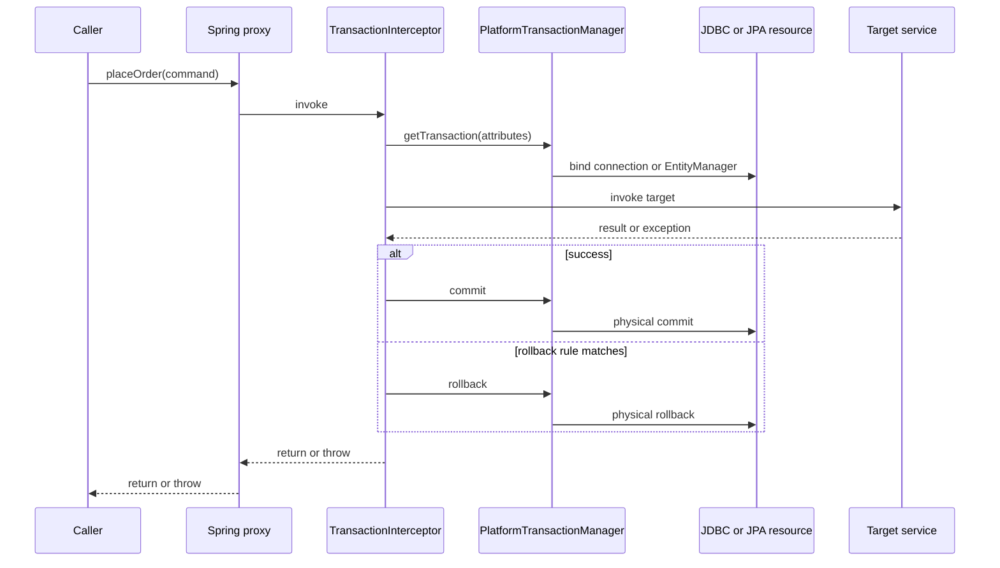

`@Transactional` metadata начинает работать только при вызове через transaction proxy.

# 2. Logical scope и physical transaction

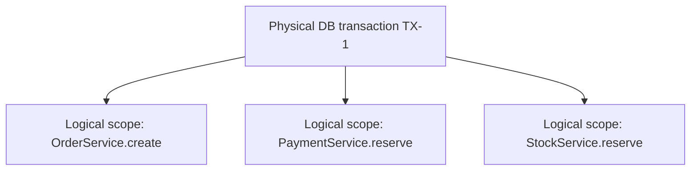

Три annotated methods могут участвовать в одной physical transaction.

```text
logical scope   → правила конкретного intercepted method
physical TX     → реальный commit/rollback database resource
```

# 3. `REQUIRED`: присоединение к существующей transaction

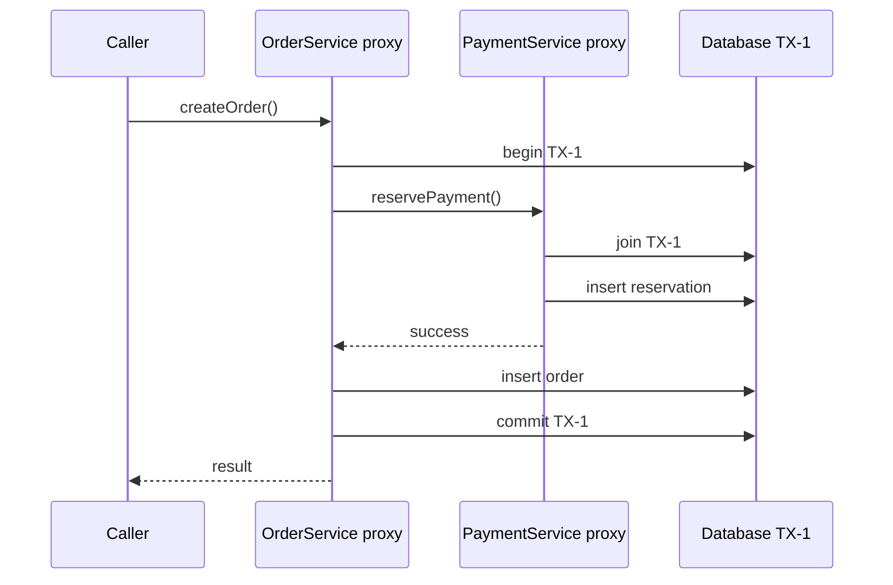

`REQUIRED` не означает «всегда создать новую transaction». Оно означает «использовать существующую либо создать, если её нет».

# 4. `UnexpectedRollbackException`

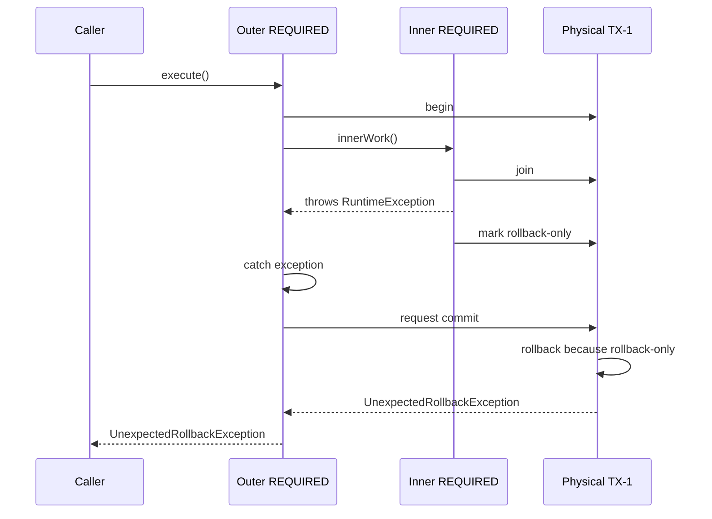

## Почему catch не спасает

Outer method поймал Java exception, но physical transaction уже помечена rollback-only внутренним logical scope.

# 5. `REQUIRES_NEW`

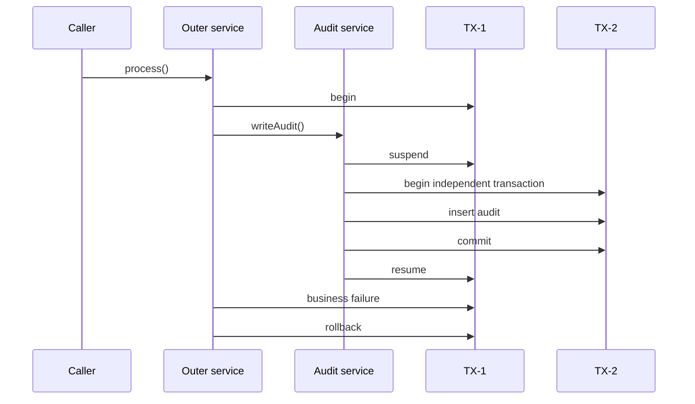

Audit row может остаться committed, хотя outer business transaction откатилась.

# 6. Connection-pool pressure при `REQUIRES_NEW`

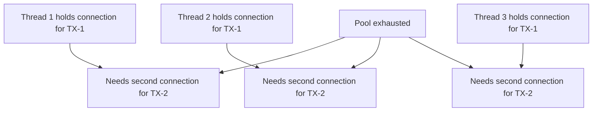

Если каждый request удерживает outer connection и ждёт ещё одну, pool должен выдержать nested demand. Иначе возможен взаимный starvation.

# 7. `NESTED`: savepoint, а не independent transaction

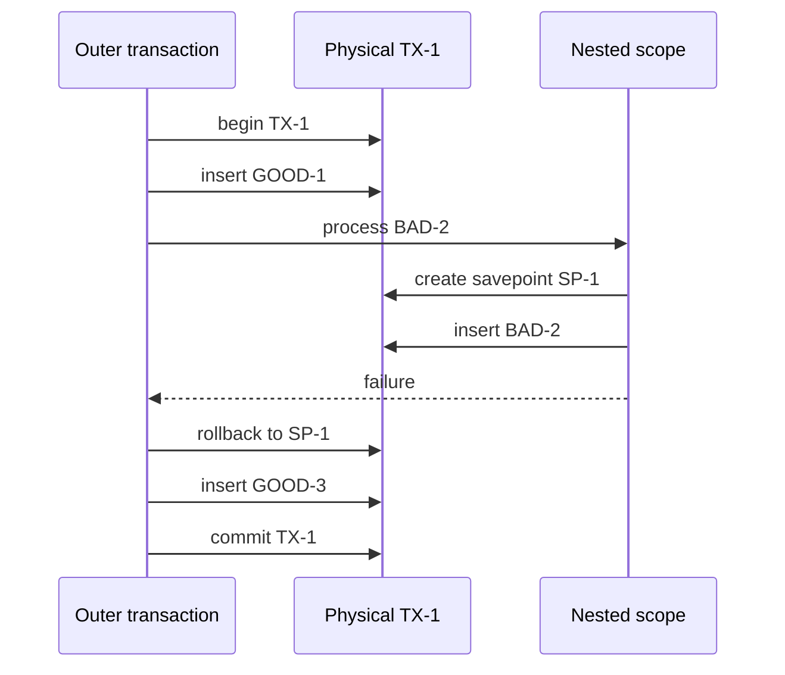

```text
REQUIRES_NEW → independent physical transaction
NESTED       → savepoint inside one physical transaction
```

Поддержка зависит от transaction manager и resource capabilities.

# 8. Propagation decision model

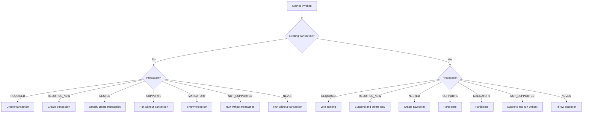

# 9. Rollback rules

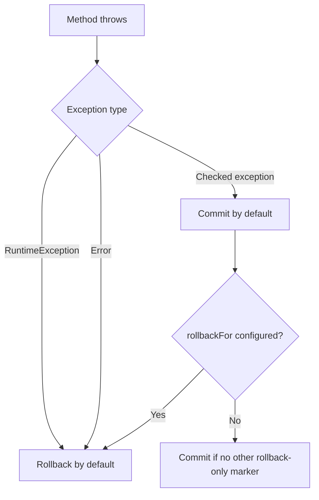

## Checked exception trap

```java
@Transactional(rollbackFor = IOException.class)
public void importFile(Path file) throws IOException {
    repository.markStarted(file);
    parser.parse(file);
}
```

Без `rollbackFor`, `IOException` по умолчанию не требует rollback.

# 10. Isolation и competing transactions

## Lost update without protection

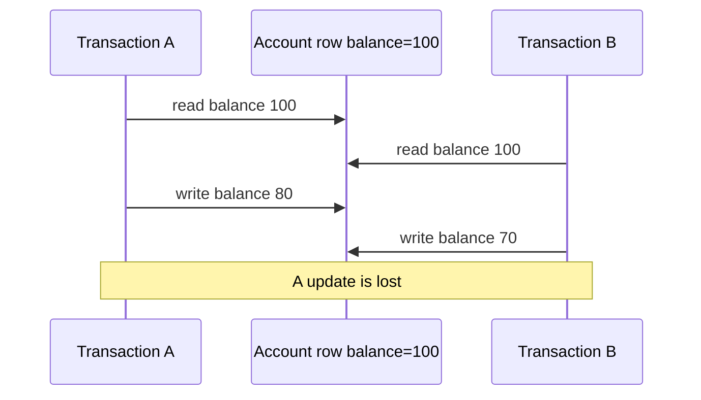

## Optimistic version check

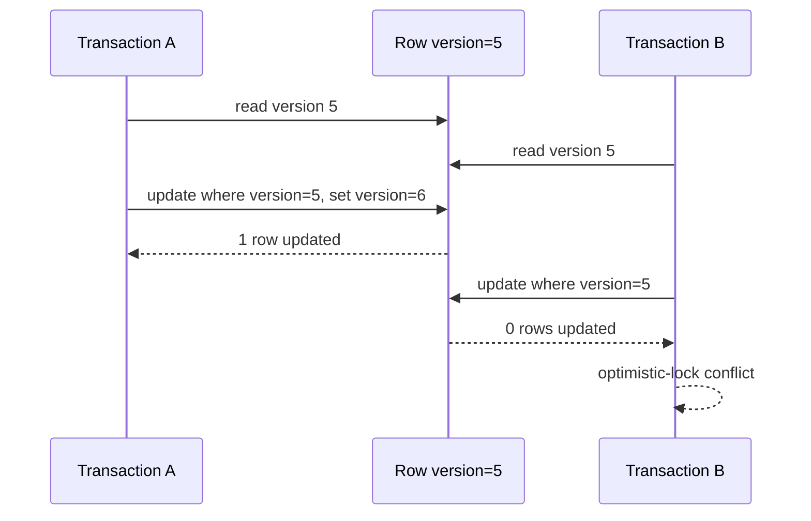

Isolation level и locking strategy решают разные классы anomalies. Высокая isolation не заменяет осознанную lost-update protection во всех сценариях.

# 11. `readOnly=true`

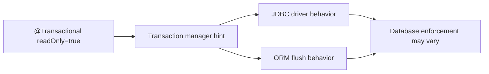

`readOnly=true` не является универсальным Java-level запретом на `INSERT` или `UPDATE`.

# 12. TransactionSynchronization lifecycle

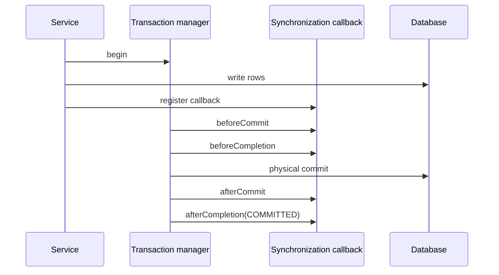

`afterCommit` выполняется после успешного commit, но failure во внешней системе после этого уже не может откатить database transaction.

# 13. Cache invalidation after commit

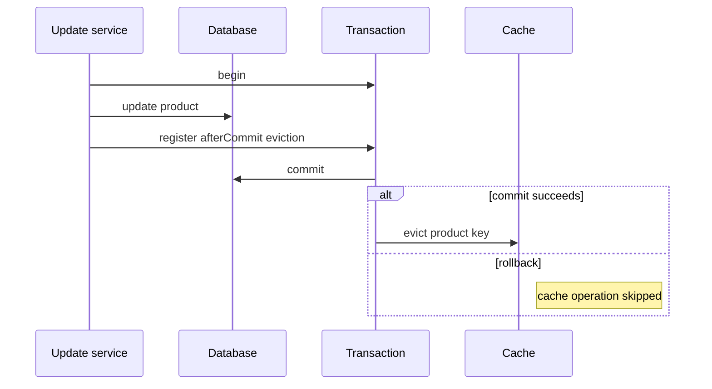

Это уменьшает риск «cache содержит state, которого нет в DB», но не даёт atomic guarantee между DB и external cache.

# 14. Async/thread boundary

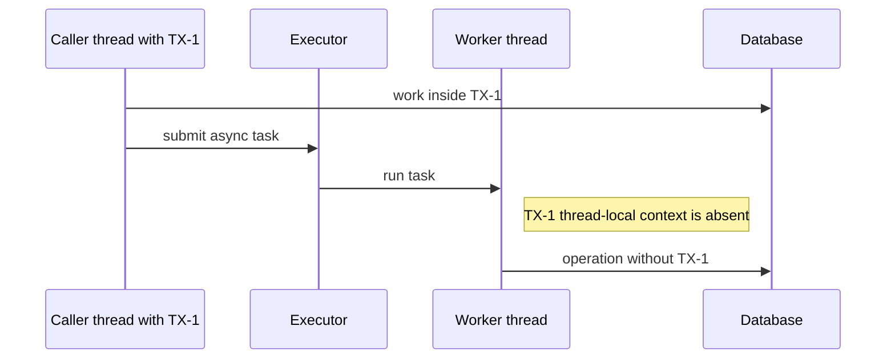

Async method должна открыть собственную transaction, если её работа должна быть transactional.

# 15. Multiple datasources и dual write

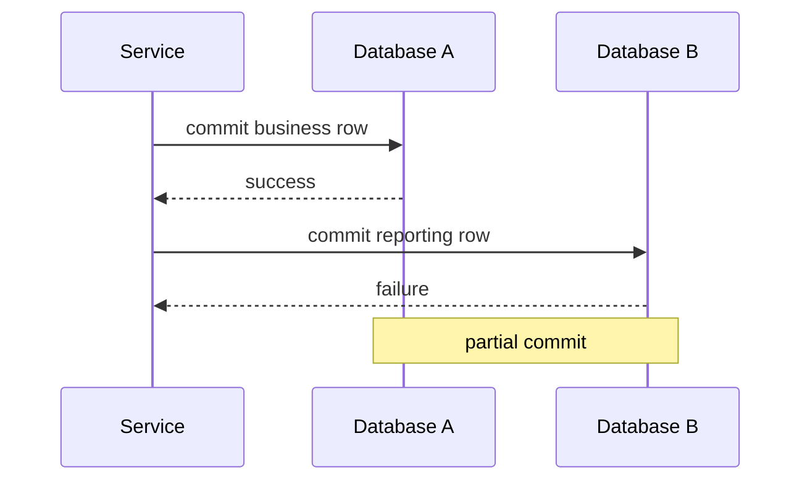

Один local `PlatformTransactionManager` не превращает две независимые databases в одну atomic transaction.

# 16. Transactional Outbox

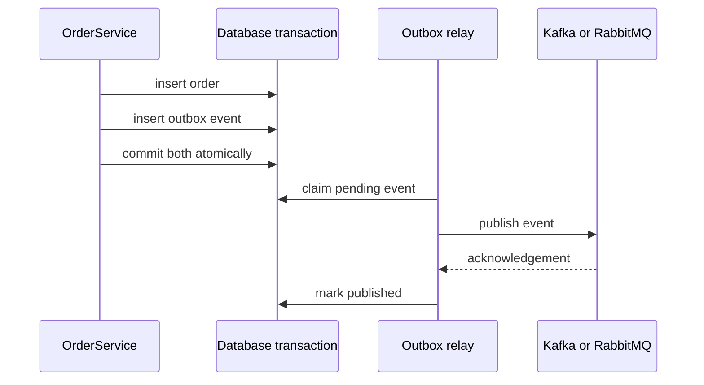

Outbox закрывает atomicity gap между business state и durable publication intent, но delivery обычно остаётся at-least-once.

# 17. Remote call inside transaction

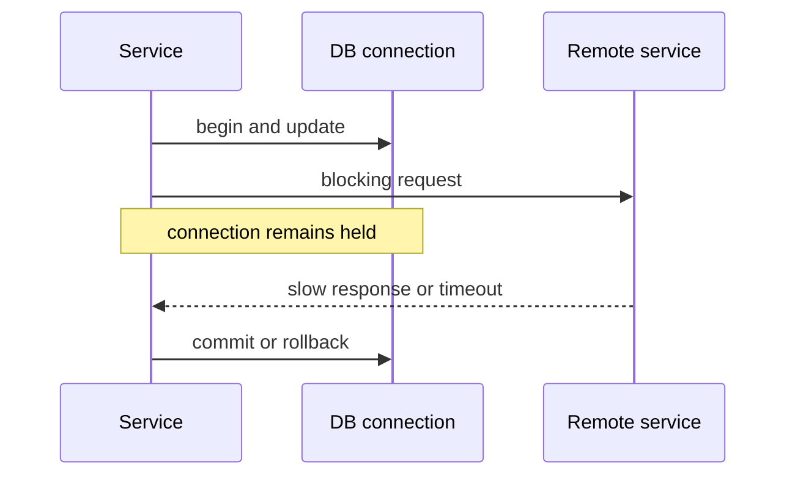

Долгий remote call увеличивает transaction duration, lock time и pool occupancy.

# 18. Diagnostic decision tree

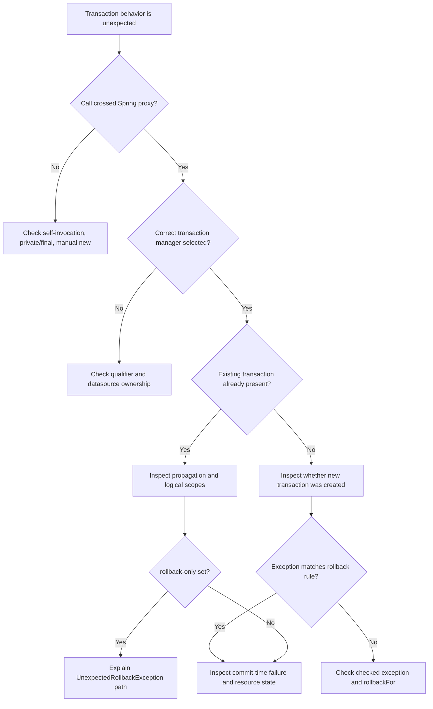

# 19. Production case: order, audit and event

## Requirement

- order и outbox event должны быть atomic;
- audit должен пережить rollback основной операции;
- notification отправляется asynchronously;
- cache очищается только после commit.

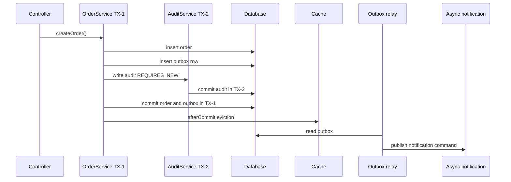

## Failure questions

- Что останется, если TX-1 откатится после committed audit?
- Что произойдёт, если relay опубликовал event, но не отметил row?
- Может ли consumer обработать duplicate?
- Кто инвалидирует local L1 caches?

# 20. Interview explanation

```text
1. @Transactional работает через proxy и TransactionInterceptor.
2. Logical scopes могут делить одну physical transaction.
3. REQUIRED присоединяется, REQUIRES_NEW создаёт independent transaction, NESTED использует savepoint.
4. rollback-only объясняет UnexpectedRollbackException.
5. Checked exceptions не откатывают transaction по умолчанию.
6. Async thread не наследует caller transaction.
7. Один local manager не обеспечивает atomicity нескольких resources.
8. Synchronization callbacks и outbox решают разные commit-boundary задачи.
```

# 21. Exercises

1. Воспроизвести `UnexpectedRollbackException` и нарисовать logical scopes.
2. Измерить pool usage при nested `REQUIRES_NEW`.
3. Проверить `NESTED` на JDBC manager и savepoints.
4. Сравнить checked exception с `rollbackFor` и без него.
5. Доказать отсутствие caller transaction в worker thread.
6. Реализовать after-commit cache eviction.
7. Реализовать outbox relay с duplicate-safe consumer.

## Related materials

- [[Spring Transaction Management Deep Dive]]
- [[Transactional Outbox and Commit Boundaries]]
- [[30_CERTIFICATIONS/Spring/2V0-72.22/TX-B01/TX-B01 Cards]]
- [[40_PRODUCTION_CASES/Spring/Transaction Management Production Cases]]
- [[50_LABS/Spring/TX-B01/README]]
