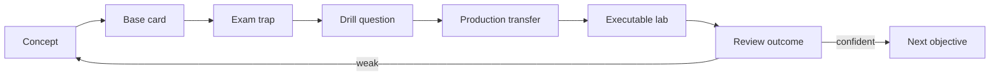

# Certification MOC

## Общая модель

Каноническая теория хранится в `10_CONCEPTS`. Сертификационные карточки используют её для active recall, discrimination, mechanism explanation и production transfer.



## Review entry point

- [[00_HOME/Review Dashboard]]

## Маршрут Java certification

Материал организуется по official exam objectives, но каждая objective ссылается на канонические заметки из `10_CONCEPTS`.

### Java concurrency foundation

- [[10_CONCEPTS/Java/Concurrency/Java Memory Model]]
- [[10_CONCEPTS/Java/Concurrency/Happens-Before]]
- [[10_CONCEPTS/Java/Concurrency/volatile]]
- [[10_CONCEPTS/Java/Concurrency/synchronized]]
- [[10_CONCEPTS/Java/Concurrency/ExecutorService]]
- [[10_CONCEPTS/Java/Concurrency/CompletableFuture]]
- [[10_CONCEPTS/Java/Concurrency/Virtual Threads]]
- [[10_CONCEPTS/Java/Concurrency/Atomic CAS and Counters]]
- [[10_CONCEPTS/Java/Concurrency/Deadlock Livelock and Lock Ordering]]
- [[10_CONCEPTS/Java/Concurrency/Concurrent Collections and Backpressure]]

## Маршрут Spring certification

- [[30_CERTIFICATIONS/Spring/2V0-72.22/Spring Certification Card System|Card System]]
- [[30_CERTIFICATIONS/Spring/2V0-72.22/Spring Core Card Roadmap|CORE-B01–CORE-B06 Roadmap]]

### Published Spring Core batches

| Batch | Cards | Concept | Status |
|---|---:|---|---|
| [[30_CERTIFICATIONS/Spring/2V0-72.22/CORE-B01/CORE-B01 Cards|CORE-B01]] | 20 | [[10_CONCEPTS/Spring/Core/Spring Core Foundations]] | published |
| [[30_CERTIFICATIONS/Spring/2V0-72.22/CORE-B02/CORE-B02 Cards|CORE-B02]] | 24 | [[10_CONCEPTS/Spring/Core/Dependency Resolution and Optional Injection]] | published |
| [[30_CERTIFICATIONS/Spring/2V0-72.22/CORE-B03/CORE-B03 Cards|CORE-B03]] | 24 | [[10_CONCEPTS/Spring/Core/Bean Lifecycle from Definition to Destruction]] | published |
| [[30_CERTIFICATIONS/Spring/2V0-72.22/CORE-B04/CORE-B04 Cards|CORE-B04]] | 24 | [[10_CONCEPTS/Spring/Core/Container Extension Points]] | published |
| [[30_CERTIFICATIONS/Spring/2V0-72.22/CORE-B05/CORE-B05 Cards|CORE-B05]] | 24 | [[10_CONCEPTS/Spring/Core/Configuration Profiles and Externalized Properties]] | published |

Total published Spring Core cards:

```text
116
```

### Supporting practice

- [[01_MAPS/Spring Core Foundation Map.canvas]]
- [[01_MAPS/Spring Dependency Resolution Map.canvas]]
- [[01_MAPS/Spring Bean Lifecycle Map.canvas]]
- [[01_MAPS/Spring Container Extension Points Map.canvas]]
- [[01_MAPS/Spring Configuration and Profiles Map.canvas]]
- [[40_PRODUCTION_CASES/Spring/Dependency Resolution Production Cases]]
- [[40_PRODUCTION_CASES/Spring/Bean Lifecycle Production Cases]]
- [[40_PRODUCTION_CASES/Spring/Container Extension Point Production Cases]]
- [[40_PRODUCTION_CASES/Spring/Configuration and Profiles Production Cases]]
- [[50_LABS/Spring/Core-B02/README]]
- [[50_LABS/Spring/Core-B03/README]]
- [[50_LABS/Spring/Core-B04/README]]
- [[50_LABS/Spring/Core-B05/README]]

## Card format

1. `Question` на английском;
2. `Russian Translation`;
3. `Answer`;
4. `Explanation`;
5. `Exam Trap`;
6. `Mini Example` для сложной темы;
7. `Memory Hook` для легко путаемой темы;
8. production transfer для mechanism-heavy темы.

Целевая модель:

```text
750 base cards + 150 exam drill questions = 900 items
```

Карточки производятся партиями по 20–30.

## Процесс тестирования

1. Ответить, не открывая explanation.
2. Зафиксировать, был ли ответ уверенным или угаданным.
3. Связать вопрос с канонической концепцией.
4. Разобрать неправильные варианты.
5. Применить правило к новому code или production scenario.
6. Запустить lab для mechanism-heavy batch.
7. Повышать confidence только после последующего успешного повторения.

## Outcome taxonomy

- `correct-confident`;
- `correct-guessed`;
- `wrong-concept`;
- `wrong-attention`;
- `wrong-confusion`.

## Next certification batch

`CORE-B06 — Advanced Core`:

- scopes and scoped proxies;
- `FactoryBean`;
- lazy initialization;
- circular dependencies and early references;
- parent/child contexts;
- resource loading and message sources.
